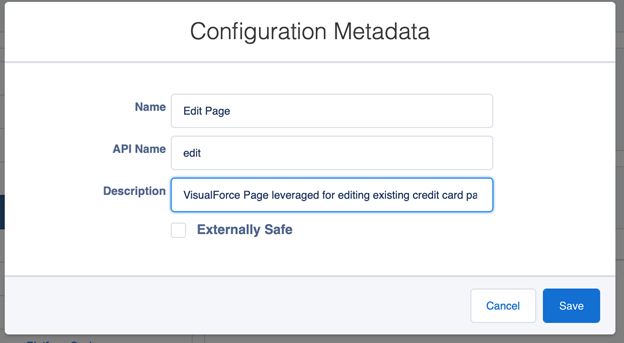
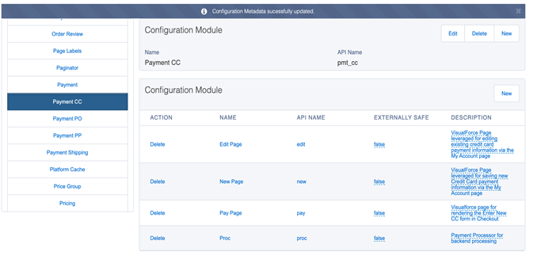
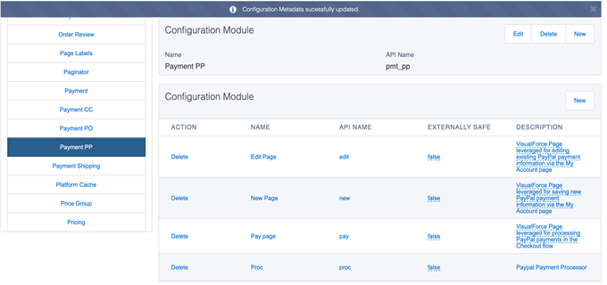

# Step 11: Configure CC Admin settings

You need to override several settings to enable the custom payment methods and tax calculations.


Download the **DR-CC-Config-Setting.xlsx** file for this task. It contains the information you need to perform this task.



DR-CC-Config-Settings.xlsx


## Step 11a: Create Configuration Modules for payment types 

Create a Configuration Module for each payment type. You can find the payment type settings on the Config Modules tab in the DR CC Config Settings spreadsheet. Note that you perform this step at the Global Settings level. The changes you make here apply to all of your storefronts.

To create Configuration Modules for credit cards and PayPal:

1. Select the **CC Admin tab**.\
   
2. Select **Configuration Modules**, as shown below. \
   
3. &#x20;Create a module for Credit Cards. \
   a. Click **New** in the **Configuration Module** pane. The Configuration Module dialog appears. \
   b. Type`Payment CC` in the **Name** field and `pmt_cc` in the **API Name** field. 
4. &#x20;Create a module for PayPal. \
   a. Click **New** in the **Configuration Module** pane. \
   b. Type `Payment PP` in the **Name** field and `pmt_pp` in the **API Name** field. \
    \
   The new payment modules will appear under Configuration Modules.&#x20;

## Step 11b: Create configuration metadata for the payment modules

Configure the following custom Digital River Salesforce B2B Commerce App pages in CC Admin for them to show up in Storefront: Edit Page, New Page, Pay Page, and Proc. Note that you perform this step at the Global Settings level. The changes you make here apply to all of your storefronts.

The following table lists the required settings for each field. You can also find these settings on the Configuration Metadata tab in the **DR CC Config Settings** spreadsheet.

| Module     | Name      | API Name | Description                                                                                             |
| ---------- | --------- | -------- | ------------------------------------------------------------------------------------------------------- |
| Payment CC | Edit Page | edit     | VisualForce Page leveraged for editing existing Credit Card payment information via the My Account page |
| Payment CC | New Page  | new      | VisualForce Page leveraged for saving new Credit Card payment information via the My Account page       |
| Payment CC | Pay Page  | pay      | VisualForce page for rendering the Enter New CC form in Checkout                                        |
| Payment CC | Proc      | proc     | Payment Processor for backend processing                                                                |
| Payment PP | Edit Page | edit     | VisualForce Page leveraged for editing existing PayPal payment information via the My Account page      |
| Payment PP | New Page  | new      | VisualForce Page leveraged for saving new PayPal payment information via the My Account page            |
| Payment PP | Pay Page  | pay      | VisualForce page leveraged for processing PayPal payments in the Checkout flow                          |
| Payment PP | Proc      | proc     | PayPal Payment Processor                                                                                |

In the case of Drop-in, we configure only the Payment DR module, which should pull in all payment types configured by Digital River.

To create configuration settings for the Payment CC and Payment PP configuration modules:

1. Under **Configuration Modules**, click the module name (for example, Payment CC).
2. Click **New** (highlighted in the image below) to create the **Edit Page** configuration metadata for the configuration module. \
   
3. Use the information associated with the module in the table above to complete the Edit Page configuration metadata. \
    \
   **Note**: Don't select the **Externally Safe** check box.
4. Repeat steps 2 and 3 to create configuration metadata for New Page, Pay Page, and Proc.
5. Repeat steps 1 through 4 to create configuration metadata for Payment CC.

After adding the configuration metadata to both of the Payment Modules, the Configuration Module for both modules should look like:

## Step 11c: Create a store's configuration settings 

You need to create custom Salesforce B2B Commerce App Pages in CC Admin for them to show up in Storefront. Note that you perform this step at the storefront level. The changes you make here apply to a specific storefront. If you have more than one storefront, you should repeat this step for each storefront.

You can find these settings on the Configuration Settings tab in the **DR CC Config Settings** spreadsheet.

To create or update a store's configuration settings:

1. From **CC Admin**, click **Global Settings** in the upper-right corner and select your storefront (for example, **DefaultStore**). \
    \
   **Note**: After selecting the storefront, the select box will still display Global Settings. However, the left navigation pane will display <_storefront name_> SETTINGS and the options associated with the store.
2. Click **Configuration Settings** under **<**_**storefront name**_**> SETTINGS**.\
   &#x20;
3. Select the module name (for example, Body Includes Begin from the first row in the table above) from the **Module** dropdown list in the right pane. \
   
4. To create a new page setting for the module, click **New**. The New Page Setting dialog appears.\
   &#x20;
5.  Complete the fields using the information from the first row in the table above.

    a. Select the module name from the **Module** dropdown list. \
    b. Select the configuration value from the **Configuration** dropdown list. \
    c. Type the page value in the **Page** field and select the corresponding value. Once you select it, the field shows a corresponding internal value. For example, if you type Order Confirmation and select **Order Confirmation** from the dropdown list, the field shows **OrdCnfm**. \
    d. Type the value in the **Value** field. \
    e. Click **Create**. When you click Create, the new module appears in the Configure Settings list and displays **Delete** in the ACTION column, and the name of the storefront appears in the **STOREFRONT** column.
6. Repeat steps 3 through 5 for each additional row in the table above.
7. Repeat steps 1 through 6 for each additional storefront.
