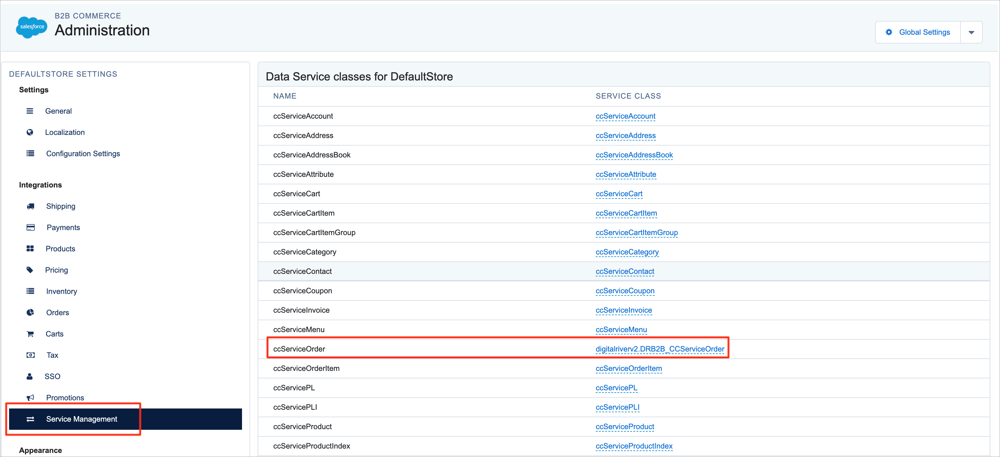
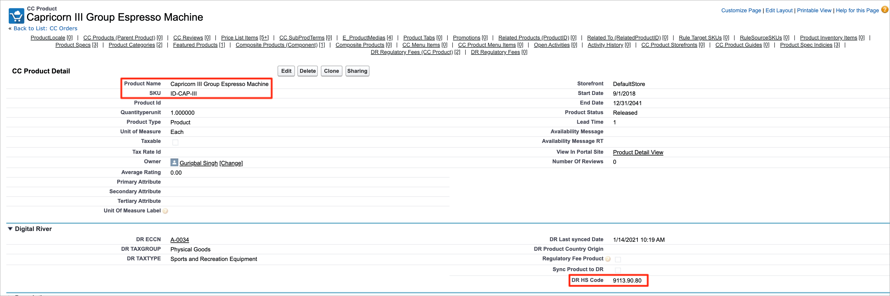
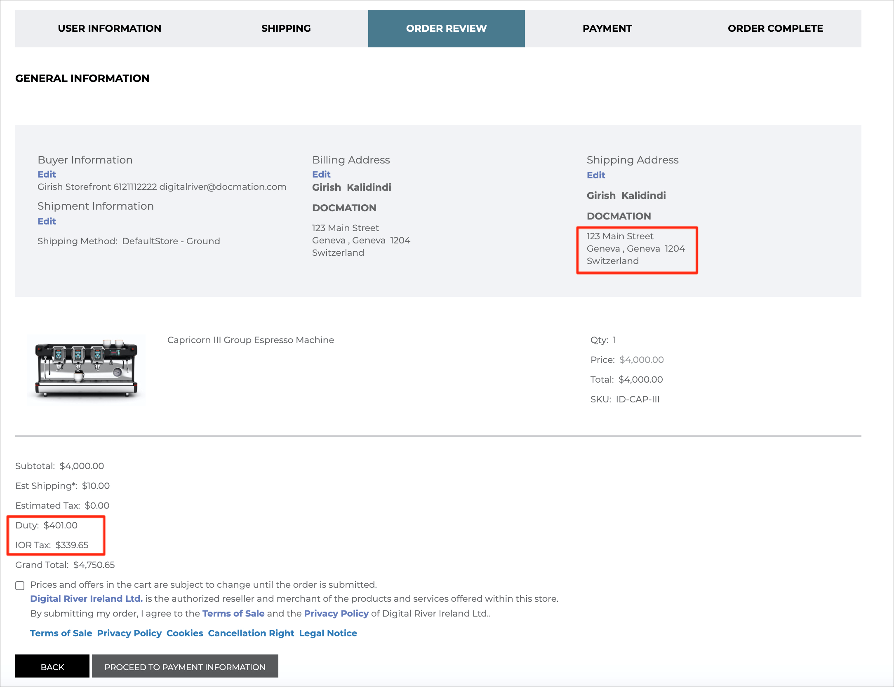
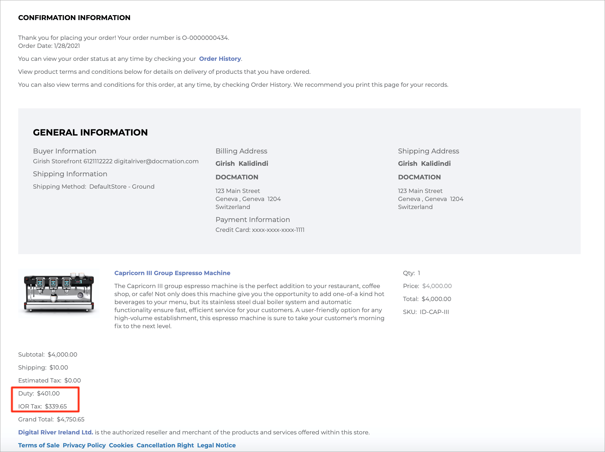
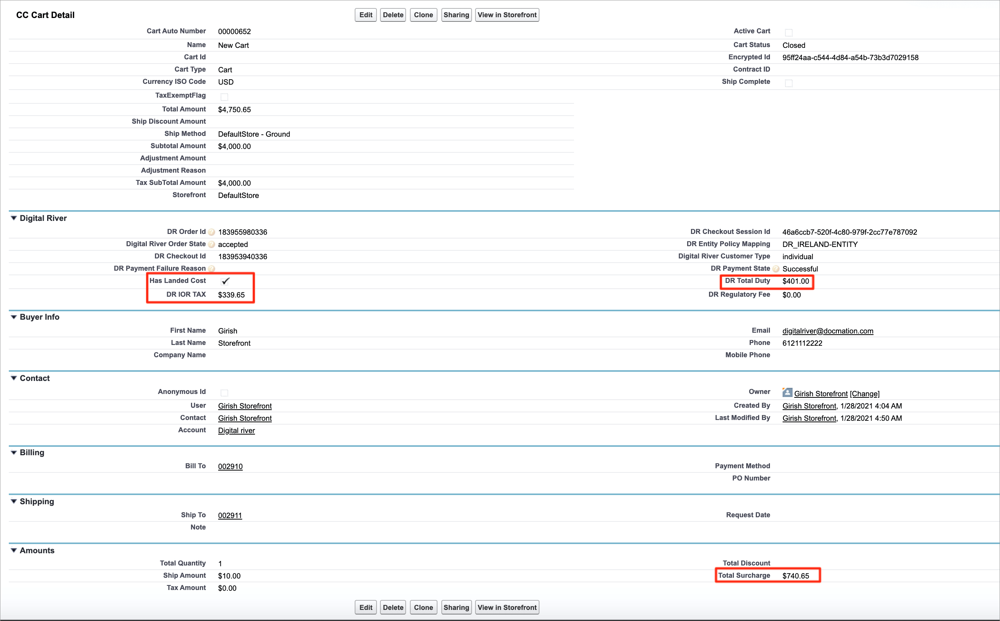
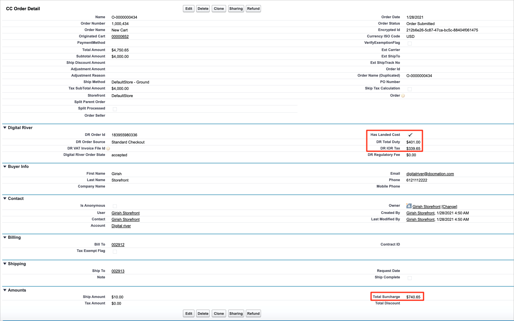

# Step 11: Configure landed cost

[Landed cost](https://docs.digitalriver.com/digital-river-api/checkouts-and-orders/landed-costs) represents the total amount your customer must pay to purchase a product from one country and have it shipped to another country. It usually refers to the cost of international shipping, plus relevant taxes, duties, and fees. The Digital River landed cost feature helps customers by presenting the full cost of international orders during the time of checkout, thereby minimizing both customs delays and unanticipated expenses at the time of delivery.

Once configured, landed cost is calculated on orders where physical products are shipped across international borders to an approved country. The exception is the European Union, where shipments between countries are exempt from duties. Please talk to your Digital River Business Development Manager if you need the landed cost feature to be enabled.

## Prerequisites for landed cost to show up in the order

* Digital River has enabled landed cost on the client account.
* Digital River has enabled the applicable trading pattern (ship to and ship from countries) used in the transaction.
* You, the client, have added Harmonized System (HS) Codes for all the SKUs used in the transaction.

## Configure CC Admin to show landed cost on the Order Confirmation page

To configure CC Admin to show landed cost on the Order Confirmation page:

1. Go to **CC Admin**.
2. Select **Storefront** from the **Global Settings** dropdown list.
3. Click `Service Management` under **Integrations**. Update the Service Class as **digitalriverv2.DRB2B\_CCServiceOrder** for the Data Service **ccServiceOrder**.\
   &#x20;&#x20;

## Set up the product for landed cost

The following steps explain how you can set up a product for landed cost.

1. Go to CC Products and select a Physical Product.
2. Add HS Code to the custom field “DR HS Code” for the selected CC Product as shown below:\
   &#x20;&#x20;
3. Click `Save`. Once the record is saved, the **Sync Product to DR** flag will be set to true on the CC product.
4. When the Product Sync job runs next time, it will send the HS Code information on this product to Digital River so that landed cost will be calculated whenever this product is added to the cart and the applicable shipping trading patterns are used in the transaction.
5. Below is an example of landed cost displayed on the Order Review and Order Confirmation page when the product is added to the cart. Landed cost (duty and IOR tax) will be displayed on the Order Review and Order Confirmation page only when the cart/order has landed cost associated with it. The field “Has Landed Cost” on CC Cart and CC Order can be used to check if a particular cart/order has landed cost.\
    \
   &#x20;
6. Total duties and IOR (Importer Of Record) tax, which are part of landed cost, are stamped on both CC Cart and CC Order as shown below. You can also see that the field “Has Landed Cost” is set to true as this order has landed costs.&#x20;


**Note:** Total Surcharge value on cart and order is the sum of regulatory fees and landed cost (total duties and IOR tax).

