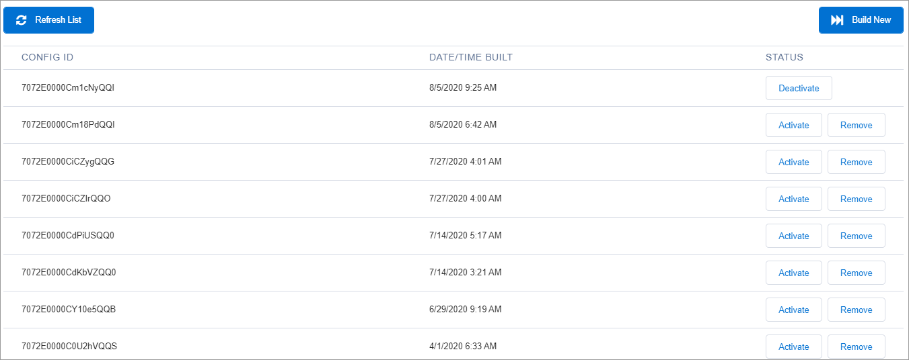

# Step 12: Refresh the configuration cache

CC Admin configurations are cached. Refresh the configuration cache to ensure you can see the latest configuration changes made to the Storefront.

1. Click **Global Settings** to return to the Global Settings page. \
   
2. Click **Configuration Cache Management** under **GLOBAL SETTINGS**. \
   
3. Click **Build New**.
4. Click **Refresh List**. You may have to click Refresh link several times before the build completes. When complete, a new configuration identifier appears under the **CONFIG ID** column.\
   &#x20;
5. Click **Activate** under the **Status** column for the new configuration identifier and deactivate any previous configurations.
6. Locate the previous cache and click **Deactivate**.
7. To verify your changes, clear the browser cache and test the storefront page. The page should display the Digital River Terms and Conditions, as well as the new payment methods.
