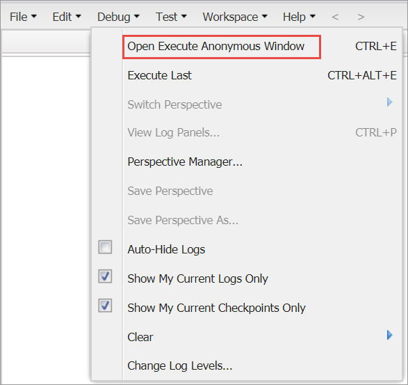

# Step 13: Schedule backend jobs

For the App to continuously synchronize data between Salesforce and Digital River, you need to schedule several backend jobs. To schedule the backend jobs:

1. Click **Setup**  and select **Developer Console** from the dropdown list. The Developer Console opens.\
   &#x20;.png>)
2. Click **Debug** and select **Open Execute Anonymous Window**. The Enter Apex Code dialog appears.\
   &#x20;
3. Copy the script from the first row of the table under [Backend job scripts](step-13-schedule-backend-jobs.md#backend-job-scripts), paste it in the Enter Apex Code dialog, and click **Execute**. Repeat this step for each additional script in the table.

## Backend job scripts 

The following table lists the jobs that you need to schedule and the apex code that you can run to set up the jobs. You can also find these settings on the Schedule Jobs tab in the DR CC Config Settings spreadsheet.

| Job Name                                  | Script for Scheduled Job                                                                                                                                                                                                                                                                                                                                                                                                 | Comments                                                                                                                      |
| ----------------------------------------- | ------------------------------------------------------------------------------------------------------------------------------------------------------------------------------------------------------------------------------------------------------------------------------------------------------------------------------------------------------------------------------------------------------------------------ | ----------------------------------------------------------------------------------------------------------------------------- |
| Order Level Electronic Fulfillment Job    | 
<code>// EFN To run every 5 minute</code>  <code>for(Integer i=0; i&#x3C;60; i=i+5){</code>     <code>String cronTrigger = '0 ' + i + ' * ?';</code>     <code>String jobID = System.schedule('Job Send EFN every 5 minutes' + i, cronTrigger, new digitalriverb2b.DRB2B_ScheduleOrderLevelEFN());</code>     <code>System.debug('Scheduled Job ID: ' + jobID);</code>  <code>}</code>
             |                                                                                                                               |
| Line Item Electronic Fulfillment Job      | 
<code>// Line Item EFN every 5 minutes</code>  <code>for(Integer i=0; i&#x3C;60; i=i+5){</code>     <code>String cronTrigger = '0 ' + i + ' * ?';</code>     <code>String jobID = System.schedule('Job Send Line Item EFN every 5 minutes' + i, cronTrigger, new digitalriverb2b.DRB2B_ScheduleLineItemEFN());</code>     <code>System.debug('Scheduled Job ID: ' + jobID);</code>  <code>}</code>
 |                                                                                                                               |
| CC Subscription Processor Job             | 
<code>// Schedule CC Subscription Processor Job</code>  <code>System.schedule('CC Subscription Procesor Job Hourly', '0 0 * ?', new digitalriverb2b.DRB2B_ScheduledSubscriptionProcess());</code>
                                                                                                                                                                                                              | Only enable this script if you need to support subscriptions. Consult with the Digital River team before scheduling this Job. |
| DR Installment Subscription Processor Job | 
<code>//Schedule Installment Subscription Processor Job every hour</code>  <code>System.schedule('DR Installment Subscription Processor Job Hourly', '0 0 * ?', new digitalriverb2b.DRB2B_InstallmentSubscriptionProcessor());</code>
                                                                                                                                                                          | Only enable this script if you need to support subscriptions. Consult with the Digital River team before scheduling this Job. |
