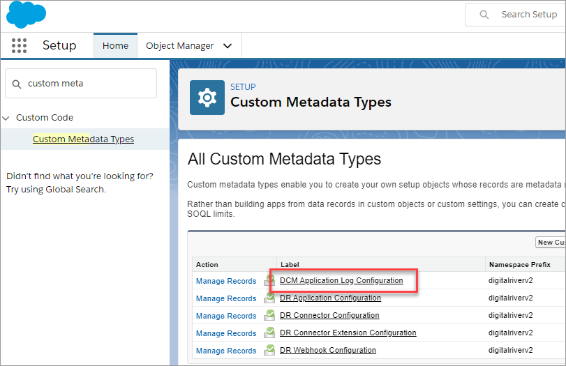

# Step 14: Configure the Salesforce B2B Commerce app logs

All the Salesforce B2B Commerce app application logs are logged to a custom object called **DCM Application Logs “digitalriverv2\_\_DCM\_Application\_Log\_\_c**”. The default logging level is always set to **DEBUG**. It is recommended to switch it to **ERROR** for production, that is, to only log errors.

To configure the default logging level for the app:

1. From the Setup menu, open Custom Metadata Types, then click to open the DCM Application Log Configuration type.\
   
2. Click **Manage DCM Application Log Configurations**. \
   
3. Click the **Default App Log Config**. \
   
4. Configure the default logging level for the app logging in the **Logging Level** field.\
    \
   **Note:** There is another **Log Level** field that is deprecated and should no longer be used.
5. Add all the users, including the storefront user, to the DRB2B Permission Set so they can log to the DCM Application Log object. The DCM Application Log Cleanup job uses the **Delete Logs Older Than** field to clean up old logs.
