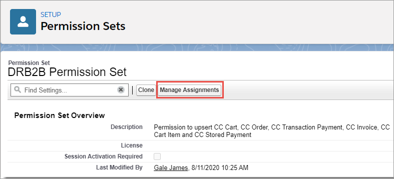

# Step 14: Manage permission sets

Assign the following Digital River permission sets to yourself or applicable users:

* **DRB2B Connect App Permission Set**–This permission set is required for fulfillment. Assign the [Fulfillment Integration User](step-8-set-up-digital-river-fulfillments.md#step-7b-create-a-profile) to this permission set.
* **DRB2B Permission Set**–Allows you to upsert CC Cart, CC Order, CC Transaction Payment, CC Invoice, CC Cart Item, and CCStoredPayment. Assign all storefront users who will place an order and Service Representatives who need to initiate refunds to this permission set.
* **DR2B Refund Permission Set**–Allows you to make a Refund flow. Assign users who will initiate refunds (such as Service Representatives) to the DRB2B Refund Permission Set.

To assign users to a permission set:

1. Type `permission sets` in the **Quick Find** field and press **Enter**. \
   
2. Click **Permission Sets**. The Permission Sets page appears. \
   
3. Under the **Permission Set Label** column, click the permission set you want to update This example configures the **DRB2B Permission Set**. \
   
4. From the Permission Set page, click **Manage Assignments**. 
5. Click **Add Assignments**. \
   
6. Select one or more users who you want to assign to this permission set and click **Assign**.\
   &#x20;.png>) \
   The assigned users now appear in the modified permission set.
