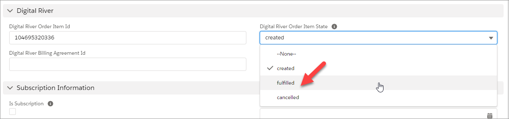
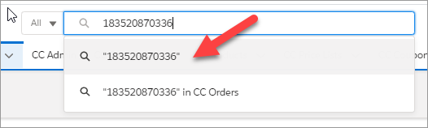
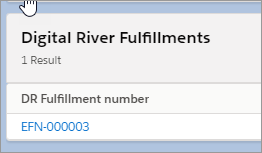
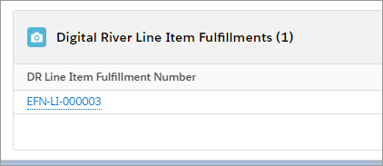
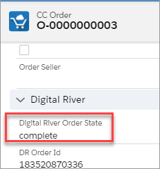

# Step 15: Test the Digital River Salesforce B2B Commerce app integration

## Prerequisites

This step assumes you have completed all installation steps thus far. Commonly missed steps include adding users to the correct [permission sets](step-11-manage-permission-sets.md) and [configuring tax codes and ECCNs for products](step-6-import-eccn-codes-tax-groups-and-tax-types.md#step-5d-assign-tax-and-eccns-to-products).

## Procedure

1. Log in to the storefront as a registered user.
2. Add one or more products to your cart.
3. Go to the shopping cart and click `Checkout`.
4. Enter pertinent information on the User Information and Shipping pages.
5. The Order Review page is the first place where the Digital River integration is visible.
   * Taxes, fees, and duties are displayed as applicable.
   * The Digital River Terms and Conditions are displayed.
   * For US tax-exempt purchases, the opportunity to manage tax certificates is presented to the user.
   * The user is able to apply a global tax identifier, if applicable.
6. Payment Page. The user has the option to pay using either:
   * A stored payment method.
   * A new payment method. Payment methods available will depend on the configuration of your Digital River account. In a test environment, you may use the applicable [testing payment methods](https://docs.digitalriver.com/digital-river-api/payment-integrations-1/testing-scenarios).
7. Order Complete Page.
   * Taxes, fees, and duties are displayed as applicable.
   * The Digital River Terms and Conditions are displayed.
8. Log in to Salesforce as an administrator or user that has the DRB2B Fulfillment permission set. Locate the order in CC Orders by order number.
   * Copy the DR Order Id. This will be used in a later step.  \
     .png>)&#x20;
9. Open each CC Order Item, go to the Digital River Order Item State field, and change the state from 'created' to ‘fulfilled’.\
   &#x20;&#x20;
   * Take the DR Order Id that was saved and use this to search All objects.\
     &#x20; \
     You should see a Digital River Fulfillment object. Open this result.\
     &#x20;&#x20;
10. In the Digital River Fulfillment record, go to the Related tab. There should be a Digital River Line Item Fulfillment record for each CC Order Item that was changed to fulfilled previously.\
    &#x20;&#x20;
    * Open the Digital River Line Item Fulfillment object and go to the Details tab.\
      For more information about the fulfillment process, see the [Fulfillment flow](step-8-set-up-digital-river-fulfillments.md).
    * Upon initial creation the EFN OrderItem Status will be “Open” and the Message will read “Need to Send EFN to DR for Order Item Status: fulfilled.” The fulfillment job runs on a [schedule](step-12-schedule-backend-jobs.md) (every 5 minutes by default). Once this job runs, the EFN OrderItem Status and the Message is updated. If successful, the EFN OrderItem Status should be “Completed” and the Message should read “Fulfillment Sent to DR.”\
      For more information about the fulfillment process see the [Fulfillment flow](step-8-set-up-digital-river-fulfillments.md).
11. After confirming that the fulfillment job successfully ran (this can be viewed from Setup, then Scheduled Jobs), and the Digital River Line Item Fulfillment objects were updated as expected for all line items, navigate back to the CC Order object. The Digital River Order State should now be “complete”.\
    &#x20;

    You have now successfully completed testing the basic end-to-end checkout, order creation, and fulfillment process.
