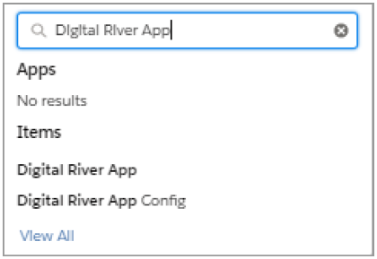

# Step 2: Configure the Salesforce B2B Commerce App

The following steps show you how to configure the Salesforce B2B Commerce App.

Refer to the `DR-B2B-ConfigurationsTemplate.xlsx` file provided by your Digital River Business Development Manager for this task. This spreadsheet contains information such as API keys and other details that are unique to your site.

The following image shows a sample of the template.

## Step 2a: Update the General Config settings 

The General Config tab provides information that is used by the App to establish secure connections between the Salesforce B2B Commerce platform and Digital River. This tab also includes general information about the Digital River site and catalogs linked to the storefront.

The managed package installs the named credentials that the Salesforce B2B Commerce App uses to communicate with the Digital River web services. You can update the named credentials with the details provided in the spreadsheet, or create your own named credentials and use them in the configuration tabs.

To update the General Config settings:

1. Click **App Launcher**  .
2. Type `Digital River App` in the **Search apps and items** field.\
   &#x20;
3. Click **Digital River App**.
4.  Complete the following general configuration fields using the information associated with the **General Config** tab from the `DR-B2B-ConfigurationsTemplate.xlsx` file.

    * Encryption Algorithm
    * Encryption Key
    * API Key
    * PayPal Production Key
    * Refund Auth Username
    * Refund Auth Password
    * Default Locale
    * Default Currency
    * Company ID
    * CatalogId
    * Order Discount Offer ID
    * Shipping Offer ID
    * Product Sync Company ID
    * Pricelist ID
    * Display Proceed to Payment Button
    * Display Place Order Buton
    * Send IP Address to DR (Digital River)

    ​
5. Optional. Update the username and password for the full access token and the refund token.\
   **Note**: Check with Digital River before you change a URL in a Named Credential.
   * Full Access Token Named Credential
   * Refunds Token Named Credential
   * Refunds Named Credential
   * DR EFN URL Named Credential
   * DR URL Named Credential
6. Click **Save**.
7. Click **Test DR Connection** to verify whether you can successfully connect with the configured Digital River site. If there are errors, check your settings and try again.

## **Step 2b: Update the Taxation Config settings** 

The Tax Certificate Upload Lag Time field allows you to set the lag time when uploading US Tax-Exempt Management System (TEMS) certificates. A tax exemption certificate is a form an organization or individual presents to the seller when making a tax-exempt purchase.


As of version 1.40, we only support the Tax Certificate Upload Lag Time and Log SF-DR Request Response fields on the Taxation Config tab. We no longer use the CC-DR Product Mapping Field.


Business entities with valid tax certificates may qualify for a tax exemption on their order. The first time a customer attempts to use a tax certificate for an order, Digital River ensures the tax certificate is valid. Tax Certificate Upload Lag Time ensures the tax certificate was uploaded.

To update the Taxation Config settings:

1. Click the **Taxation Config** tab.
2. Type `300` in the **Tax Certificate Upload Lag Time** field.
3. Click **Test DR Connection** to verify whether you can successfully connect with the configured Digital River site.
4. If the connection to Digital River is successful, click **Save**. If there are errors, check your settings and try again.

The App also supports tax exemptions for shoppers in other countries where applicable. Work with your system integrator to ensure the VAT ID field is captured in the checkout flow.

## Step 2c: Update the Payment Config settings 

Use the Payment Config tab to enter the payment details from the Digital River API. You can switch between test and live payment modes by updating the configuration settings in the Payment Config tab. Use [test cards](https://docs.digitalriver.com/commerce-api/payment-integrations-1/testing-scenarios) to test your payment methods when you are in test mode.

To update the Payment Config settings:

1. Click the **Payment Config** tab.
2. Complete the Payment Config fields using the information associated with the Payment Config tab from the `DR-B2B-ConfigurationsTemplate.xlsx` file.\
   &#x20;
3. Click **Test DR Connection** to verify whether you can successfully connect with the configured Digital River site.
4. If the connection to Digital River is successful, click **Save**. If there are errors, check your settings and try again.
