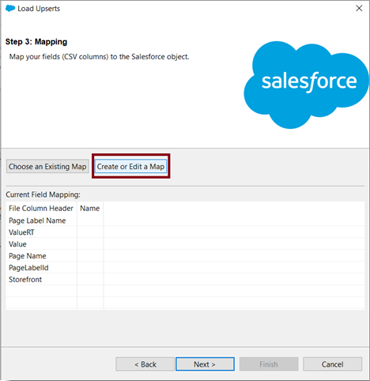
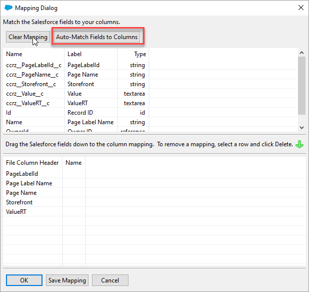
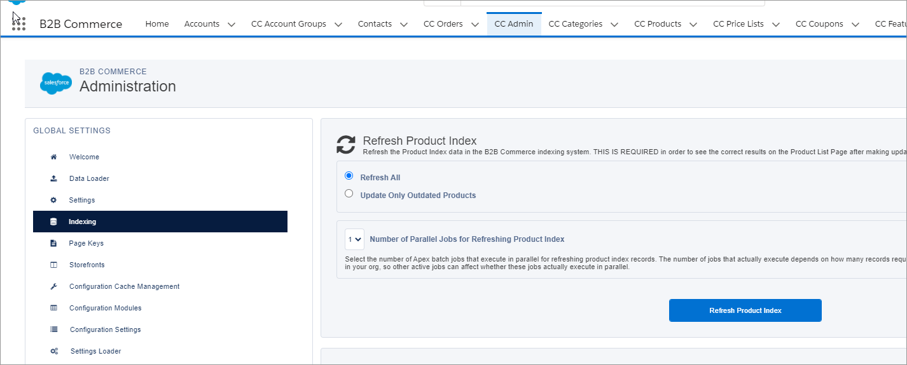

# Step 2: Create page labels

You can use CC Page labels to add useful Salesforce B2B Commerce App information such as help text or error messages.


Download the **DR\_OrderAPI\_PageLabel-v2\_1\_1.csv** file for this task. It contains the page label information you need to import.&#x20;




## Step 2a: Install the Data Loader on your local system 

You will use the Data Loader to upload the page labels. To install the Data Loader:

1. Click **Setup**  (1).png>) and select **Setup** from the dropdown list.
2. Type `dataloader` in the **Quick Find** field and press **Enter**. \
   
3. Click **Data Loader**. The Data Loader page appears.&#x20;
4. Click the appropriate link to download and install the Data Loader for your system.
5. Click the appropriate Installation Instructions link and follow the instructions to install the Data Loader.

## Step 2b: Upload the CC page labels for the Salesforce B2B Commerce App 


Install the [Data Loader](step-2-create-page-labels.md#step-8a-install-the-data-loader-on-your-local-system) before you upload the page labels.


1. Go to the location where you installed the Data Loader on your local system and double-click **dataloader.bat**. \
   
2. &#x20;From the Data Loader app, click **Upsert**. \
   
3. Select **Password Authentication**.
4. Enter your user credentials for your Salesforce Org, where you need to upload the page labels and click **Log in**. \
   
5. Choose the **CC Page Label (ccrz\_\_E\_PageLabel\_\_c)** object from the list. 
6. Click **Browse**, locate the **DR\_OrderAPI\_PageLabel.csv** file on your system, and then click **Next**.
7. Select **ccrz\_\_PageLabelId\_\_c** as the external ID field from the dropdown list and click **Next**. \
   
8. Click **Create Or Edit a Map** to map your fields (CSV columns) to the Salesforce object and click **Next**.\
   
9. Use the option to **Auto match fields with column** as shown in the following image and click OK:: \
   
10. Click **Browse**, locate the directory where you want to save success and error files, and then click **Finish**. \
     \
    The Data Loader app upserts your records. \
    
11. Click **View Errors** and check for failures. If there are any failures, correct the problem and try again.
12. Click **OK**.
13. Click **App Launcher** .png>) .
14. Open the **CC Admin** tab, and then click **Indexing**. \
    
15. Click **Refresh Page Label Cache**. \
     \
    You've completed the upsert process for the Digital River B2B CC page labels from the page labels CSV file.&#x20;
