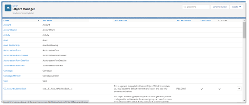

# Step 3: Add custom Salesforce B2B Commerce App fields to page layouts

## Step 3a: Configure page layouts 

To configure objects:

1. Click **Setup**  and select **Setup** from the dropdown list.
2. Type `object manager` in the **Quick Find** field and press **Enter**.\
   
3. Click **Object Manager**. \
   
4. Scroll down and click the **CC Cart** link.
5. Click **Page Layouts**.\
   
6. Click **CC Cart Layout**.\
   
7. Click the **Fields** tab in the **CC Cart Layout**. This tab lists the information provided in [Custom fields](step-3-add-custom-salesforce-b2b-commerce-app-fields-to-page-layouts.md#custom-fields) and [Digital River fields](step-3-add-custom-salesforce-b2b-commerce-app-fields-to-page-layouts.md#digital-river-fields).\
   
8. Drag the custom field you want to appear in the CC Cart Layout from the Fields list to the **CC Cart Detail** and arrange them in the order you want them to appear. Repeat this step for each field you want to appear in the CC Cart Layout. \
   
9. Repeat steps 4–8 for the following custom fields using the information provided in [Custom fields](step-3-add-custom-salesforce-b2b-commerce-app-fields-to-page-layouts.md#custom-fields) and [Digital River fields](step-3-add-custom-salesforce-b2b-commerce-app-fields-to-page-layouts.md#digital-river-fields) for **CC Cart Item,** **CC Order**, **CC Order Item**, **CC Product**, and **Account**.

### Custom fields 

Add these custom fields to the corresponding page layouts.

| Object        | Field / Button                                                                                                                               |
| ------------- | -------------------------------------------------------------------------------------------------------------------------------------------- |
| CC Cart       | DR Cart Id                                                                                                                                   |
| CC Cart       | DR Entity Policy Mapping                                                                                                                     |
| CC Cart       | DR Payment State                                                                                                                             |
| CC Cart       | DR Payment Failure Reason                                                                                                                    |
| CC Cart       | DR Tax Exemption Applied                                                                                                                     |
| CC Cart       | DR Order State                                                                                                                               |
| CC Cart Item  | DR Cart Item Id                                                                                                                              |
| CC Order      | DR Order Id                                                                                                                                  |
| CC Order      | Refund Payment (Button)                                                                                                                      |
| CC Order Item | DR Order Item Id                                                                                                                             |
| CC Product    | DR ECCN                                                                                                                                      |
| CC Product    | Add Custom Lightning Component “DRB2B\_UpdateCCProductECCNLookup” to CC Product Lightning page and this can be used for searching ECCN Codes |
| CC Product    | DR TaxGroup                                                                                                                                  |
| CC Product    | DR TaxType                                                                                                                                   |
| CC Product    | DR Last Synced Date                                                                                                                          |
| CC Product    | Is Product Sync Required                                                                                                                     |
| Account       | TaxExemptId                                                                                                                                  |
| Account       | DR Tax Certificate Last Upload Date                                                                                                          |

### Digital River fields 

Add these Digital River fields to the corresponding page layouts.

| Object                    | Field / Button            |
| ------------------------- | ------------------------- |
| DR Cart ID                | DR Cart ID                |
| DR Entity Policy Mapping  | DR Entity Policy Mapping  |
| DR Payment State          | DR Payment State          |
| DR Payment Failure Reason | DR Payment Failure Reason |
| DR Tax Exemption Applied  | DR Tax Exemption Applied  |
| DR Order State            | DR Order State            |

## Step 3b: Configure picklist value sets 

To configure picklist value sets:

1. From the **Object Manager** tab, locate the **CC Order** object under the **LABEL** column and click the link.\
   &#x20;
2. Click the **Fields & Relationships** tab, locate **Order Status** under the **FIELD LABEL** column and click the link. \
   
3. From the Order Status (Managed) page, scroll down to the **Values** section.\
   &#x20;
4. Click **Picklist Value Sets**. \
   
5. Click **New**, type `Pending Payment` in the field, and click **Save**.  \
   The Pending Payment now appears under Validation Rules on the Order Status (CloudCraze Order Status field: ccrz\_\_OrderStatus\_\_c). \
   
6. Repeat steps 2–8 for each additional object in the [Picklist values](step-3-add-custom-salesforce-b2b-commerce-app-fields-to-page-layouts.md#picklist-values) table.

### Picklist values 

Refer to the following table when configuring picklist value sets:

| Object                             | Picklist              | Picklist Value  |
| ---------------------------------- | --------------------- | --------------- |
| CC Order                           | Order Status          | Pending Payment |
| Digital River Fulfillment          | EFN Status            | Problem         |
| Digital River LineItem Fulfillment | EFN Order Item Status | Problem         |
| DR Subscription Process Data       | Subscription Context  | Renewal         |

## Step 3c: Configure picklist error types

Add the [picklist error types](step-3-add-custom-salesforce-b2b-commerce-app-fields-to-page-layouts.md#picklist-error-types) (if they are not already present) to the Error Type custom field (API Name: digitalriverb2b\_\_Error\_Type\_\_c).

To configure the picklist error types:

1. From the **Object Manager** tab, locate the **Digital River Error Log** object under the **LABEL** column and click the link. \
   ​
2. Click the **Fields and Relationships** tab, locate **Error Type** under the **FIELD LABEL** column and click the link. \
   
3. Scroll down to **Values** in the **Digital River Error Log**. \
   
4. Review the existing values against the picklist error types.
5. If there are any missing values, click **New**, type the value in the field, and click **Save**. Repeat this step for each missing value.

### Picklist error types 

Add the following error types, if they are not already present to the Error Type custom field.

| Values                    | API Name                  |
| ------------------------- | ------------------------- |
| Tax Calculation           | Tax Calculation           |
| Payment CC                | Payment CC                |
| Payment PO                | Payment PO                |
| Payment Paypal            | Payment Paypal            |
| Fulfillment               | Fulfillment               |
| Insufficient Access       | Insufficient Access       |
| Trigger                   | Trigger                   |
| Payment                   | Payment                   |
| Subscription              | Subscription              |
| Subscription Payment      | Subscription Payment      |
| Checkout Payment          | Checkout Payment          |
| Invoice Payment           | Invoice Payment           |
| User Registration         | User Registration         |
| Assign Permission Set     | Assign Permission Set     |
| Refunds                   | Refunds                   |
| Shopper                   | Shopper                   |
| Product Sync              | Product Sync              |
| Wallet                    | Wallet                    |
| VAT Validation            | VAT Validation            |
| Payment PP                | Payment PP                |
| Access Token              | Access Token              |
| Connecter Config Metadata | Connecter Config Metadata |
| Tax Exemption             | Tax Exemption             |
| Debug                     | Debug                     |
