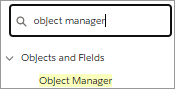
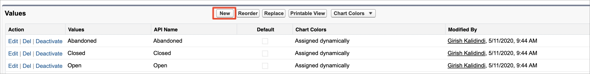
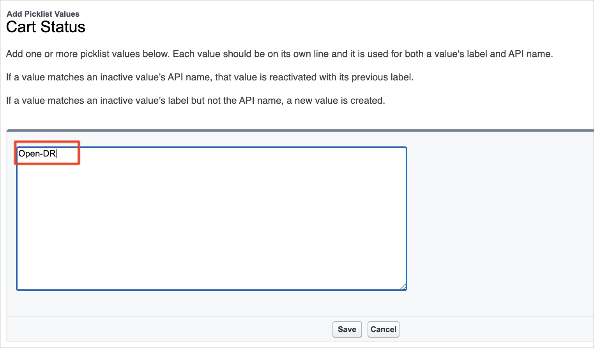
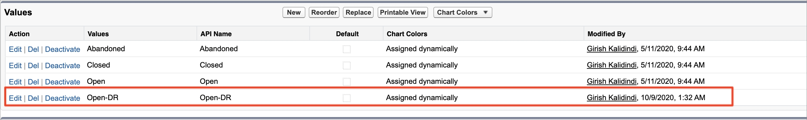

# Step 4: Add custom Salesforce B2B Commerce App fields to page layouts

## Step 4a: Configure page layouts

To configure page layouts:

1. Click **Setup** .png>) **** and select **Setup** from the dropdown list.\
   &#x20;&#x20;
2. Type `object manager` in the **Quick Find** field and press **Enter**. &#x20;
3. Click **Object Manager**.   \
   .png>)
4. Type `CC Cart` in the **Quick Find** search box and click the **CC Cart** link. &#x20;
5. Click **Page Layouts**. \
   
6. Click **CC Cart Layout**.\
   &#x20; &#x20;
7. Click the **Fields** tab in the **CC Cart Layout**. This tab lists the information provided in [Custom fields](step-4-add-custom-salesforce-b2b-commerce-app-fields-to-page-layouts.md#custom-fields).\
   &#x20;&#x20;
8. Create a section for Digital River fields. Drag the custom field you want to appear in the CC Cart Layout from the Fields list to the **CC Cart Detail** and arrange them in the order you want them to appear. Repeat this step for each field you want to appear in the CC Cart Layout.\
   &#x20;&#x20;
9. Click **Save**.
10. Repeat steps 4–9 for the following custom fields using the information provided in the  [Custom fields](step-4-add-custom-salesforce-b2b-commerce-app-fields-to-page-layouts.md#custom-fields) section below for **CC Cart Item,** **CC Order**, **CC Order Item**, **CC Product**, and **Account**.

### Custom fields

Add these custom fields to the corresponding page layouts.

| Object        | Field / Button                                                                                                                               | Description                                                                                                                                                                                                                           |
| ------------- | -------------------------------------------------------------------------------------------------------------------------------------------- | ------------------------------------------------------------------------------------------------------------------------------------------------------------------------------------------------------------------------------------- |
| CC Cart       | Digital River Order State                                                                                                                    | The state of the Digital River order. This is a picklist field.                                                                                                                                                                       |
| CC Cart       | DR Entity Policy Mapping                                                                                                                     | The Digital River business entity.                                                                                                                                                                                                    |
| CC Cart       | DR Checkout ID                                                                                                                               | The Digital River checkout identifier.                                                                                                                                                                                                |
| CC Cart       | DR Checkout Session ID                                                                                                                       | The Digital River checkout session identifier.                                                                                                                                                                                        |
| CC Cart       | DR Order ID                                                                                                                                  | The Digital River order identifier.                                                                                                                                                                                                   |
| CC Cart       | DR Payment State                                                                                                                             | The state of the Digital River payment. Valid values are `Successful` and `Declined`.                                                                                                                                                 |
| CC Cart       | DR Payment Failure Reason                                                                                                                    | The reason for Digital River payment failure.                                                                                                                                                                                         |
| CC Cart       | DR Tax Exemption Applied                                                                                                                     | Reserved for future use                                                                                                                                                                                                               |
| CC Cart Item  | Digital River Order Item ID                                                                                                                  | The Digital River order item identifier                                                                                                                                                                                               |
| CC Cart Item  | Digital River Order Item State                                                                                                               | The state of the Digital River order item. This is a picklist field.                                                                                                                                                                  |
| CC Order      | Digital River Order State                                                                                                                    | The state of the Digital River order.                                                                                                                                                                                                 |
| CC Order      | DR Order ID                                                                                                                                  | The Digital River order identifier.                                                                                                                                                                                                   |
| CC Order      | Refunds Payment (button)                                                                                                                     | The button used to handle Digital River refunds.                                                                                                                                                                                      |
| CC Order Item | Digital River Order Item Id                                                                                                                  | The Digital River order item identifier.                                                                                                                                                                                              |
| CC Order Item | Digital River Order Item State                                                                                                               | The state of the Digital River order item.                                                                                                                                                                                            |
| CC Product    | DR ECCN                                                                                                                                      | The ECCN code assigned to the product.                                                                                                                                                                                                |
| CC Product    | DR Product Country Origin                                                                                                                    | The product's Country of Origin. Country of Origin is a two-letter [Alpha-2 country code](https://www.iban.com/country-codes) as described in the [ISO 3166](https://www.iso.org/iso-3166-country-codes.html) international standard. |
| CC Product    | DR last Sync Date                                                                                                                            | The date when Product was last synced to Digital River.                                                                                                                                                                               |
| CC Product    | DR TaxGroup                                                                                                                                  | The product's tax group.                                                                                                                                                                                                              |
| CC Product    | DR TaxType                                                                                                                                   | The product’s tax type.                                                                                                                                                                                                               |
| CC Product    | Sync Product to DR                                                                                                                           | This flag indicates if this product needs to be synced to Digital River                                                                                                                                                               |
| CC Product    | Regulatory Fee Product                                                                                                                       | When true, indicates the product is associated with a regulatory fee such as WEEE, battery, and so on. When false, indicates that the product is a regular CC Product.                                                                |
| CC Product    | Add Custom Lightning Component “DRB2B\_UpdateCCProductECCNLookup” to CC Product Lightning page and this can be used for searching ECCN Codes | Add Custom Lightning Component “DRB2B\_UpdateCCProductECCNLookup” to the CC Product Lightning page so you can use it to search ECCN Codes.                                                                                            |

## Step 4b: Configure picklist values

To add a new picklist value for the field **Cart Status** on the **CC Cart** object:

1. Select the **CC Cart** object from the **Object Manager** tab.
2. Click the **Fields and Relationships** tab, locate **Cart Status** under the **FIELD LABEL** column, and click the link.
3. Scroll down to the **Values** section.
4. Add a new picklist value by clicking **New** and type `Open-DR` in the field, then click **Save**.\
   &#x20;  \
   &#x20;   &#x20;
5. The **Open-DR** now appears in the list of picklist values for the field **Cart Status**.

