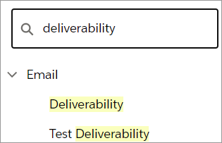
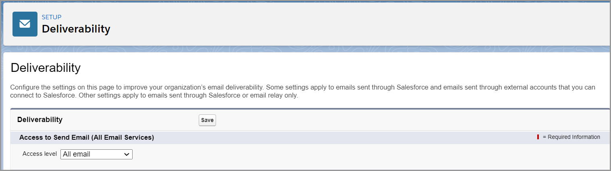

# Step 4: Enable email deliverability

Enable email deliverability so your organization can receive an email whenever someone successfully or unsuccessfully updates the configuration for the Salesforce B2B Commerce App.

To enable email deliverability:

1. Click **Setup**  and select **Setup** from the dropdown list.
2. Type `deliverability` in the **Quick Find** field and press **Enter**.\
   &#x20;​
3. Click **Deliverability**.
4. Select **All email** from the **Access level** dropdown list and click **Save**.

