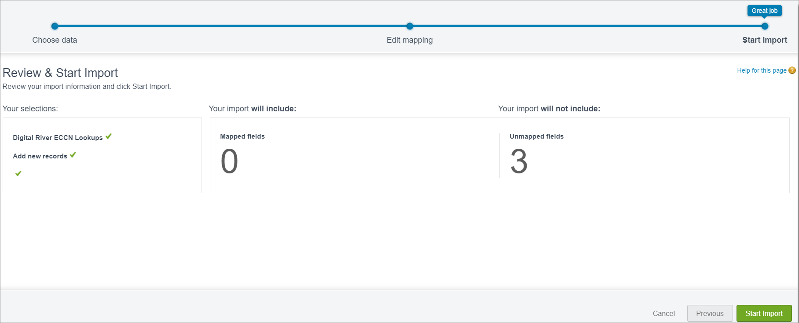
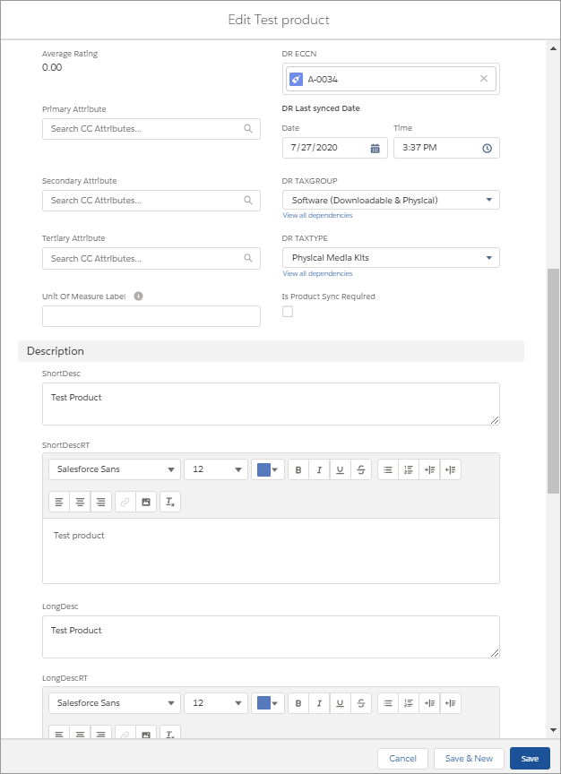

# Step 5: Import ECCN codes, tax groups, and tax types


You need to upload the ECCN codes, tax groups, and tax types and assign them to product families in Salesforce before you update the [Product Sync](step-6.-update-the-product-sync-settings.md).


Note that the ECCN codes, tax groups, and tax types provided in these files do not represent a complete list. However, it's enough to get you started.


Download the **Approved-ECCN-Codes.csv** and **TaxGroup\_TaxTypes.csv** and save them to your computer.



Approved-ECCN-Codes.csv



TaxGroup\_TaxTypes.csv


The UploadECCN\_Script and UploadTaxGroup\_Script contain dummy values. You can use the test values or populate them with real values for testing purposes. These files are not used in production. You can use these scripts to test a specific scenario where you need to figure out the tax group, tax type, and ECCN code for a specific product.


Download the following ZIP files, extract the UploadECCN\_Script and UploadTaxGroup\_Script files, and save them to your computer.



UploadECCN\_Script.zip



UploadTaxgroup\_Script.zip


## Step 5a: Import ECCN codes 

To import the ECCN codes:

1. Click **Setup**  and select **Setup** from the dropdown list.
2. Type `data import wizard` in the **Quick Find** field and press **Enter**. \
   ​
3. Click **Data Import Wizard**.
4. Scroll down and click **Launch Wizard!** The Launch Wizard appears. \
   
5. Click the **Custom objects** tab.
6. Scroll down and click **Digital River ECCN Lookups**.
7. Scroll up and click **Add new records**.
8. Locate the `Approved-ECCN-Codes.csv` and drag it to **Drag CSV file here to upload** and drop it.\
   &#x20;
9. Click **Next**. The file has been auto-mapped to existing Salesforce fields.\
   &#x20;
10. Click Map associated with the **"Classification Code"**, select **DR Classification Code**, and then click **Map**. \
    
11. Click Map associated with the **Description**, select **DR Description**, and then click **Map**.
12. Click Map associated with the **Notes**, select **DR Notes**, and then click **Map**.
13. Click **Next**. \
    
14. Review your import information and click **Start Import**. The import should start successfully.\
    &#x20;
15. Click **OK**. When the import completes, you will receive an email.

## Step 5b: Import tax groups and tax types 

To import tax groups and tax types:

1. Click **Data Import Wizard**.
2. Click **Launch Wizard!** The Launch Wizard appears. \
   
3. Click the **Custom objects** tab.
4. Scroll down and click **Digital River Tax code Lookups**.
5. Scroll up and click **Add new records**.
6. Locate the **TaxGroup\_TaxTypes.csv** and drag it to **Drag CSV file here to upload** and drop it.\
   &#x20;
7. Click **Next**. The file has been auto-mapped to existing Salesforce fields.\
   &#x20;
8. Click Map associated with the **TAXGROUP**, select **DR TAXGROUP,** and then click **Map**.\
   
9. Click Map associated with the **TAXTYPE**, select **DR TAXTYPE**, and then click **Map**.
10. Click Map associated with the **SABRIXCODE**, select **DR SABRIXCODE**, and then click **Map**.
11. Click Map associated with the **UNSPSC**, select **DR UNSPSC**, and then click **Map**.
12. Click **Next**. \
    
13. Review your import information and click **Start Import**. The import should start successfully.\
    &#x20;
14. Click **OK**. When the import completes, you will receive an email.

## Step 5c: Import the ECCN and tax group scripts 

This step is only required for development purposes. The UploadECCN\_Script and UploadTaxGroup\_Script contain dummy values. You can use the test values or populate them with real values.


You need the UploadECCN\_Script and UploadTaxGroup\_Script files for this task.


To import the ECCN and Tax group scripts:

1. From Salesforce B2B, click **Setup**  and select **Developer Console**. The Developer Console opens.\
   &#x20;
2. &#x20;Click **Debug** and select **Open Execute Anonymous Window**. The Enter Apex Code dialog appears.\
   &#x20;.png>)
3. Locate and open the **UploadECCN\_Script**.
4. Copy the contents of the **UploadECCN\_Script**, paste it in the **Enter Apex Code** dialog, and click **Execute**. You should see a Success status in the **Logs** tab. \
   
5. Locate and open the **UploadTaxGroup\_Script**.
6. Copy the contents of the **UploadTaxGroup\_Script**, paste it in the **Enter Apex Code** dialog, and click **Execute**. You should see a Success status in the **Logs** tab.

## Step 5**d**: Assign tax and ECCNs to products 

Assign the tax group, tax type, and ECCNs to products in Salesforce B2B.


Complete this task before you [update the product sync settings](https://app.gitbook.com/@digital-river/s/salesforce-b2b-draft/\~/drafts/-MO2tAR6nK2gP6e4wNN0/integrating-the-digital-river-salesforce-b2b-commerce-app/step-6.-update-the-product-sync-settings) with Digital River.


1. Click **App Launcher**  .
2. Type `CC Products` in the **Search apps and items** field.
3. Click **CC Products**.
4. Under the **Product Name** column, click the link for the product you want to update or click **New** to create a new product. \
   
5. Click **Edit**.
6. Scroll down to **DR ECCN** and provide a valid ECCN value in the **DR ECCN** field. \
   
7. Select the appropriate tax group from the **DR TAXGROUP** dropdown list.
8. Select the appropriate tax type from the **DR TAXTYPE** dropdown list.
9. Click **Save**.
10. Repeat steps 4 through 9 for each additional product.
