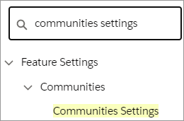
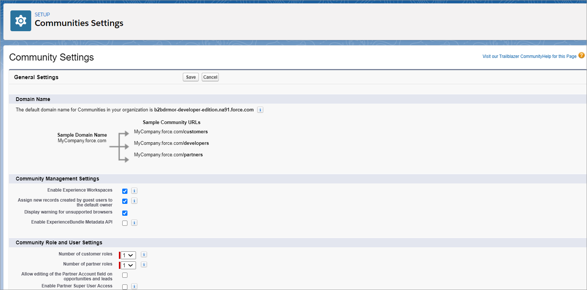
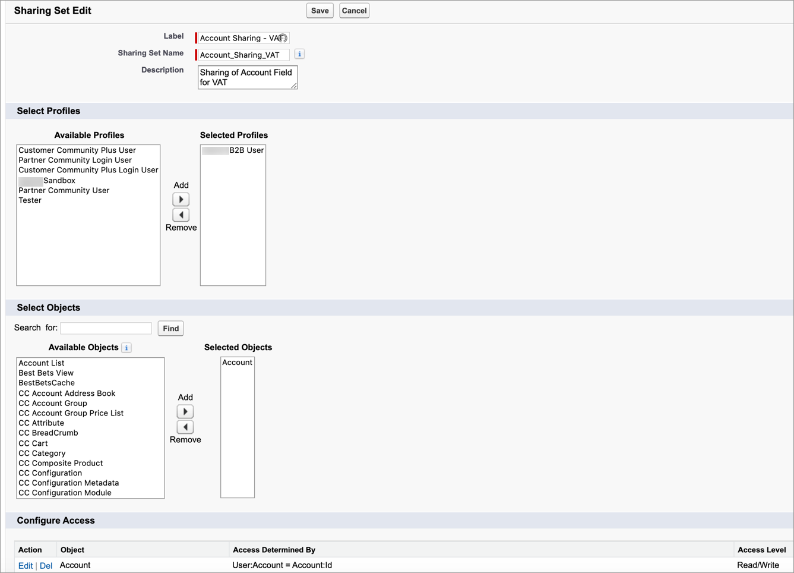
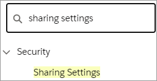

# Step 7: Create a new sharing set

Create a new sharing set in Community Settings to grant update access to the custom `taxExemptId` field in the Account object and update the sharing settings.

## Step 7a: Create a new sharing set 

To create a new sharing set:

1. Click **Setup**  and select **Setup** from the dropdown list.
2. Type `communities settings` in the **Quick Find** field and press **Enter**. 
3. Click **Communities Settings**. \
   
4. Scroll down to **Sharing Sets** and click **New**. The New Sharing Set page appears.
5. Type `Account Sharing – VAT` in the **Label** field.
6. Type `Account_Sharing_VAT` in the **Sharing Name** field.
7. Type `Sharing of Account Field for VAT` in the **Description** field.
8. From **Available Profiles**, select your Storefront Community profiles used by the Salesforce Admin users and click **Add** to move it to **Selected Profiles**.
9. From **Available Objects**, select **Account** and click **Add** to move it to **Selected Objects**.
10. Click the **Set Up** link under **Configure Access**. The Access Mapping for Account dialog appears.
11. Select **Account** from the **User** dropdown list.
12. Select **Id** from the **Target Account** dropdown list.
13. Select **Read/Write** from the **Access level** dropdown list. \
    
14. Click **Update**. The New Sharing Set page displays should look like: \
    
15. Click **Save**.

## Step 7b. Update the sharing settings for your organization 

To update the sharing settings for your organization:

1. Click **Setup**  and select **Setup** from the dropdown list.
2. Type `sharing settings` in the **Quick Find** field and press **Enter**. \
   
3. Click **Sharing Settings**. The Sharing Setting page appears.
4. Select **CC Order** from the **Manage Settings for** dropdown list.
5. Click **Edit**. The Organization-Wide Sharing Defaults Edit page appears.
6. Scroll down to **CC Invoice** and select **Public Read/Write** from the **Default Internal Access** dropdown list. \
   
7. Scroll down to **CC Order** and select **Public Read/Write** from the **Default Internal Access** dropdown list. \
    \
   Scroll down to **CC Transaction** and select **Public Read Only** from the **Default Internal Access** dropdown list. \
   
8. Scroll down and click **Save**.
