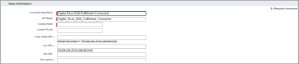

# Step 8: Set up Digital River fulfillments

## Enabling Digital River fulfillments

When you set up Digital River fulfillments, you will need to [create a profile](step-8-set-up-digital-river-fulfillments.md#step-7c-create-a-profile-and-fulfillment-integration-user) for a Fulfillment Integration User and [send the OAuth information for that user to Digital River](step-9-set-up-webhooks.md) to enable fulfillment.&#x20;


Digital River must set up the Salesforce B2B Commerce App for Salesforce B2B Commerce under Manage Connected Apps before you can [set up OAuth](step-8-set-up-digital-river-fulfillments.md#step-7a-create-a-connected-app) for Digital River fulfillments.


See the [Appendix](../appendix/) for more information about:

* [Fulfillment flow](https://app.gitbook.com/@digital-river/s/salesforce-b2b/\~/drafts/-MRazfhnbBY5nfyqbUlx/v/2.0/appendix/fulfillment-and-cancellation-flow#fulfillment-flow)
* [Cancellation flow](https://app.gitbook.com/@digital-river/s/salesforce-b2b/\~/drafts/-MRazfhnbBY5nfyqbUlx/v/2.0/appendix/fulfillment-and-cancellation-flow#cancellation-flow-between-salesforce-and-digital-river)
* [Order-level cancellation flow](https://app.gitbook.com/@digital-river/s/salesforce-b2b/\~/drafts/-MRazfhnbBY5nfyqbUlx/v/2.0/appendix/fulfillment-and-cancellation-flow#order-level-cancellation-flow)
* [Line-item cancellation flow](https://app.gitbook.com/@digital-river/s/salesforce-b2b/\~/drafts/-MRazfhnbBY5nfyqbUlx/v/2.0/appendix/fulfillment-and-cancellation-flow#line-item-level-cancellation-flow)

## Step 8a: Create a connected app 

To create a connected app for Digital River fulfillments, complete the following steps:

1. Sign in to Salesforce Org.
2. Click **Setup**  (4).png>) and select **Setup** from the dropdown list.
3. Type `app manager` in the **Quick Find** field and press **Enter**. \
   .png>)
4. Click **App Manager** in the search results.
5. Click **New Connected App**.
6. Under **Basic Information**, type `DigitalRiver B2B Fulfillment Connector` in the **Connected App Name** field. \
   
7. Provide your **API name** and your email address.
8. Select **Enable OAuth Settings**.
9. Under **API (Enable OAuth Settings)**, type `https://` in the **Callback URL** field. 
10. Add **Access and manage your data (api)** to **Selected OAuth Scopes**. 
11. Select the **Require Secret for Web Server Flow** check box.
12. Click **Save**. Allow 2-10 minutes for your changes to take effect on the server before using the connected app. \
    
13. Capture the **Client Id** and **Client Secret** information. They will be used while setting up webhooks for Fulfillment.

## Step 8b: Update Sharing Settings in Client Org 

To update the Sharing Settings for the fulfillment flow, complete the following steps:

1. From **Setup**, enter `Sharing Settings` in the **Quick Find** field, and then select **Sharing Settings**.
2. Select **CC Order** from the **Manage sharing settings for** dropdown list.
3. Update the **Default Internal Access** to **Public Read/Write**. \
   
4. Repeat steps 2-3 for the **CC Invoice** object. \
   
5. For the **CC Transaction Payment** object, you must select **Public Read Only** from the **Default Internal Access** dropdown list.&#x20;

## Step 8c: Create a profile and Fulfillment Integration User 

To create a profile and assign it to a Fulfillment Integration User, complete the following steps:

### Create a new profile

1. Click **Setup**  (5).png>) and select **Setup** from the dropdown list.
2. Under **Administration**, expand **Users**, and click **Profiles**. \
   
3. From the Profiles page, click **New** to create a new profile. 
4. Select **Standard User** from the **Existing Profile** dropdown list. 
5. Type `DRB2B Connector API User` in the **Profile Name** field. You're essentially cloning the Standard User profile to this new profile.
6. Click **Save**.

### Set the password policy for this profile to never expire

1. Under **Administration**, expand **Users**, and click **Profiles**.
2. Click the **DRB2B Connector API User** link under the **Name** column on the Profiles page.
3. Under **System** on the Profiles page, click the **Password Policies** link. 
4. Click **Edit**.
5. Select **Never expires** from the **User passwords expire in** dropdown list. 
6. Click **Save**.

### Create a Fulfillment Integration User and assign the user to this profile.

1. Under **Administration**, expand **Users**, and click **Profiles**.
2. Click the **DRB2B Connector API User** link under the **Name** column on the Profiles page.
3. Click **Assigned Users**.
4. Click **New User**.
5. Assign a Fulfillment Integration User to this profile, complete the required fields, and click **Save**.

## Step 8d: Assign the Fulfillment Integration User to Digital River Salesforce B2B Commerce Fulfillment Permission Set 

To add the new user to the Digital River Salesforce B2B Commerce App permission set:

1. From Setup, enter `permission sets` in the **Quick Find** field and press **Enter**.
2. Click **Permission Sets**. The Permission Sets page appears.
3. Select the permission set **DRB2B Fulfillment Permission Set**.
4. Click **Manage Assignments**. \
   
5. Click **Add Assignments** and add the **Fulfillment Integration** user **Digital River** created in [Step 8c Create a profile and Fulfillment Integration User](step-8-set-up-digital-river-fulfillments.md#step-7c-create-a-profile-and-fulfillment-integration-user) to the permission set.&#x20;

