# Step 8: Set up Digital River fulfillments

## Fulfillment process 

The following sequence diagrams show the interaction between Shopper, Salesforce B2B Commerce, the Digital River Salesforce B2B Commerce App, and Global Commerce.

### Checkout 

Salesforce kicks off the fulfillment process after it creates a [CC Order](step-8-set-up-digital-river-fulfillments.md#fulfillment). The following sequence diagram outlines the flow before fulfillment.

When the shopper reaches the payment methods page, Salesforce B2B Commerce creates a CC cart and sends an update order event to the Salesforce B2B Commerce App. The App uses Global Commerce (Commerce API) to create the shopper, get a full access token, update the shopper, and get the cart details. The App updates Salesforce with the tax details and the [selling entity](./#4-selling-entities) assigned to the order.

### Fulfillment 

The following sequence diagram outlines the flow during fulfillment.

When a cart is successfully submitted, Salesforce renders an Order Confirmation page and creates a CC Order. The CC Order triggers the fulfillment steps.

ERP/Fulfillment receives the order. When they fulfill the order, they update the Order Item Status to Shipped. Salesforce updates the order status to Complete and sends it to the App. The Salesforce B2B Commerce App sends a WebService EFN to Global Commerce. Global Commerce updates the status to Complete, updates funds to Settled, and Sends a WebService OCN. The App sends a response code when it receives the OCN.

The sequence diagram above outlines the flow of API fulfillment messages, URLs, and content during fulfillment.

Global Commerce sends a Digital River Order Fulfillment Information (OFI) notification to the App. The App creates a Digital River Fulfillment object with an order identifier and other order information to the shopper and then sends an OFI response code to Global Commerce.

Salesforce updates the order's Line Item status to Shipped. The App sends an Electronic Fulfillment Notification (EFN) for each line item, and Global Commerce sends a response. Once the App sends an EFN status for all line items, Global Commerce moves the order to the Completed state and captures the funds. Global Commerce then sends an Order Complete Notification (OCN) for the order to the App. The App updates the invoice as Paid and creates a new transaction for the capture to the shopper and then sends an OCN response code to Global Commerce.

## Step 8a: Create a connected app 

To create a connected app for Digital River Fulfillments, complete the following steps:

1. Sign in to Salesforce B2B Commerce.
2. Click **Setup**  and select **Setup** from the dropdown list.
3. Type `app manager` in the **Quick Find** field and press **Enter**.
4. Click **App Manager** in the search results. \
   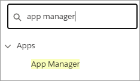
5. Click **New Connected App**.
6. Under **Basic Information**, type `DigitalRiver B2B Fulfillment Connector` in the **Connected App Name** field. \
   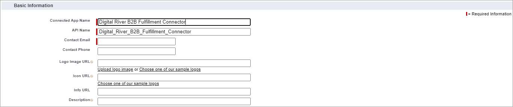
7. Provide your API name and your email address.
8. Select **Enable OAuth Settings**.
9. Under **API (Enable OAuth Settings)**, type `https://` in the Callback URL field. \
   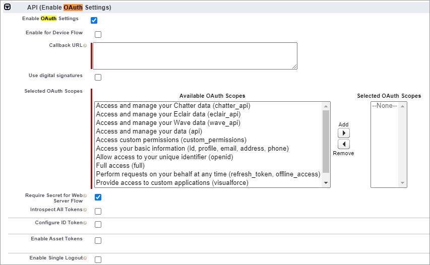
10. Add **Access and manage your data (api)** to **Selected OAuth Scopes**. \
    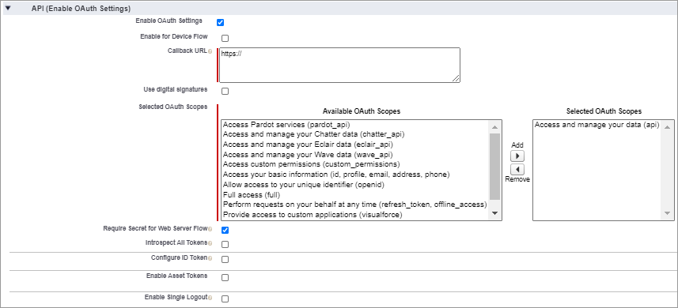
11. Select the **Require Secret for Web Server Flow** check box.
12. Click **Save**. Allow 2-10 minutes for your changes to take effect on the server before using the connected app.

## Step 8b: Create a profile 

To create a profile and assign it to a Fulfillment Integration User, complete the following steps:

1.  Create a new profile:

    a. Click **Setup**  and select **Setup** from the dropdown list. \
    b. Under **Administration**, expand **Users**, and click **Profiles**. \
    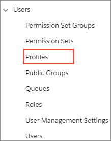 \
    c. From the Profiles page, click **New** to create a new profile. \
    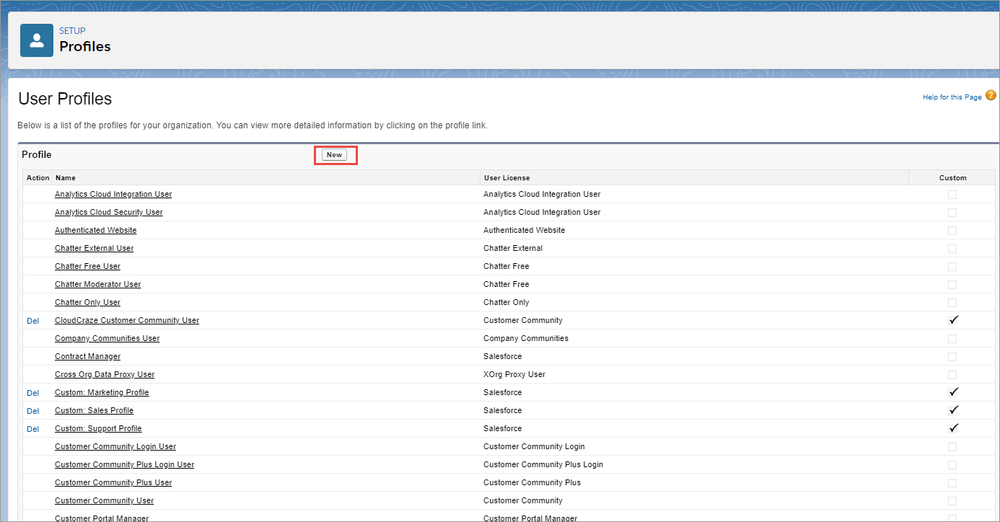\
    &#x20;d. Select **Standard User** from the **Existing Profile** dropdown list. \
    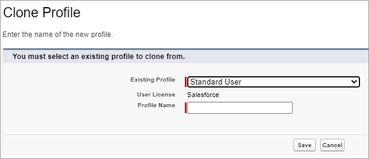 \
    e. Type `DRB2B Connector API User Profile` in the **Profile Name** field. You're essentially cloning the Standard User profile to this new profile. \
    f. Click **Save**.
2. Set the password policy for this profile to never expire: \
   a. Under **Administration**, expand **Users**, and click **Profiles**. \
   b. Click the **DRB2B Connector API User Profile** link under the **Name** column on the Profiles page. \
   &#x20;.png>) \
   c. Under **System** on the Profiles page, click the **Password Policies** link.\
   &#x20;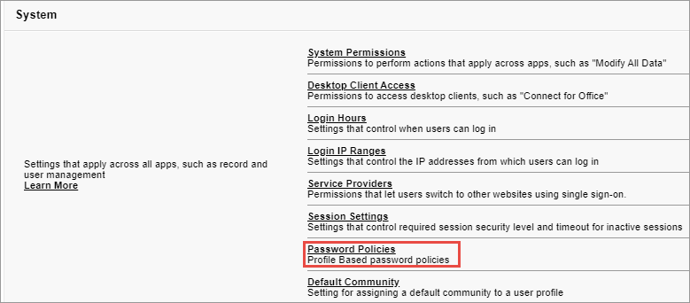 \
   d. Click **Edit**. \
   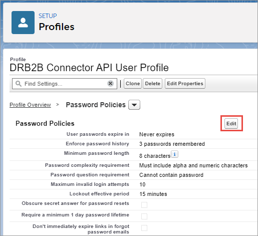 \
   e. Select **Never expires** from the **User passwords expire in** dropdown list.\
   &#x20;.png>) \
   f. Click **Save**.
3. Create a Fulfillment Integration User and assign the user to this profile. \
   a. Under **Administration**, expand **Users**, and click **Profiles**. \
   b. Click the **DRB2B Connector API User Profile** link under the **Name** column on the Profiles page. \
   c. Click **Assigned Users**. \
   &#x20;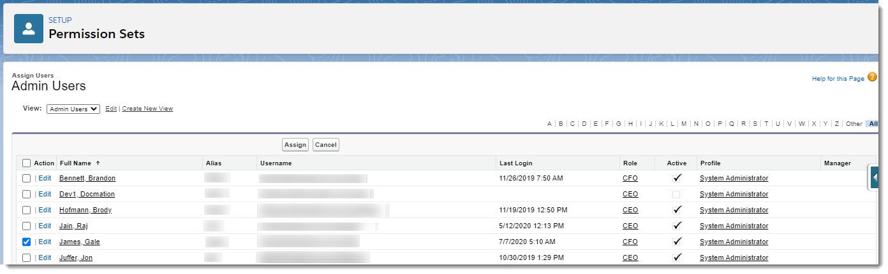 \
   d. Click **New User**. \
   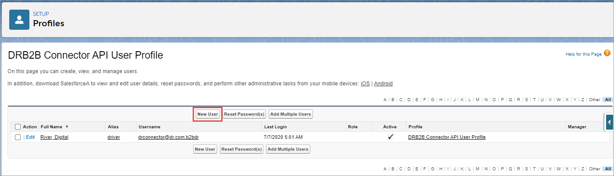 \
   e. Assign a Fulfillment Integration User to this profile, complete the required fields, and click **Save**.\
   &#x20; 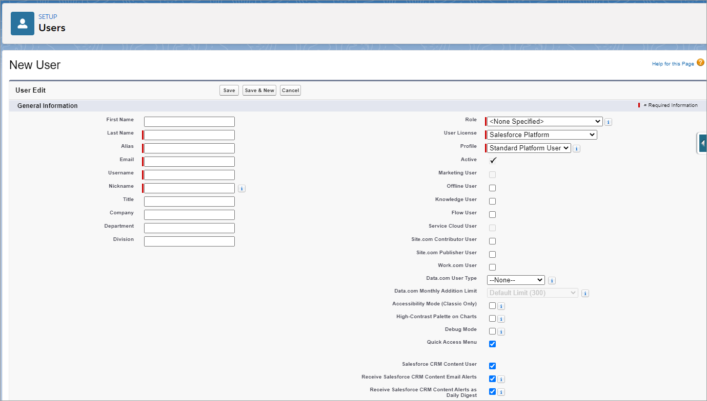 \
   **Note**: You will need the username and password for the Fulfillment Integration User in [Step 8d: Send OAuth information to Digital River](step-8-set-up-digital-river-fulfillments.md#step-8d-send-oauth-information-to-digital-river).

## Step 8c: Assign the Fulfillment Integration User to the Digital River Salesforce B2B Commerce App Permission Set 

To add the new user to the Digital River Salesforce B2B Commerce App Permission Set:

1. Type `permission sets` in the **Quick Find** field and press **Enter**. \
   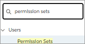
2. Click **Permission Sets**. The Permission Sets page appears.
3. From the Permission Sets page, click the **DRB2B Connect App Permission Set** link.\
   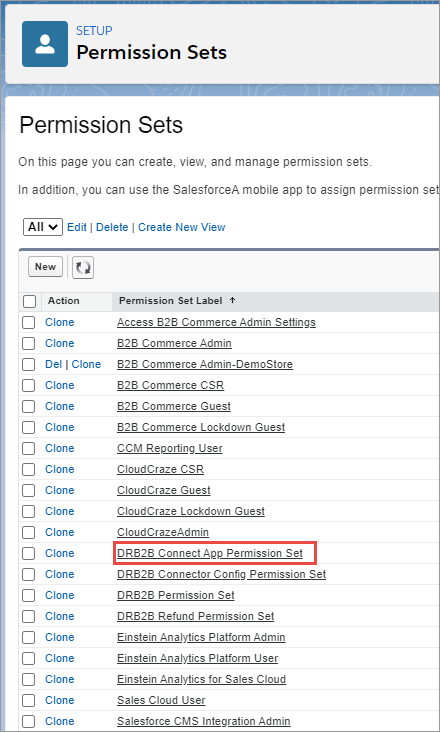
4. Click **Manage Assignments**. \
   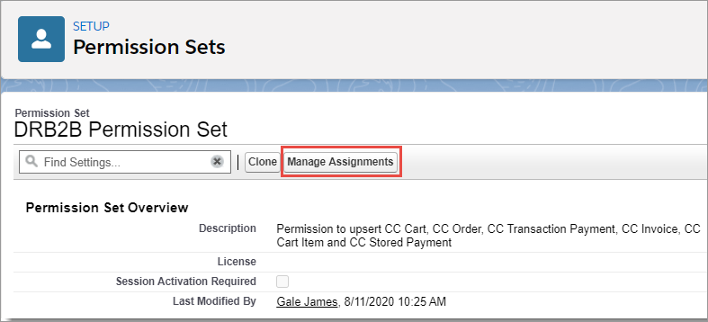
5. Click **Add Assignments**. \
   
6. Select one or more users who you want to assign to this permission set and click **Assign**.\
   &#x20;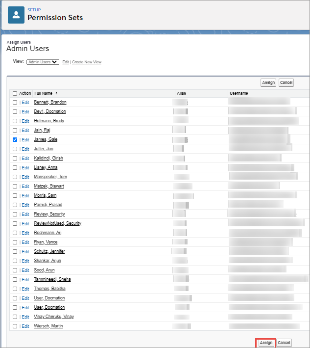 \
   The assigned users now appear in the DRB2B Connect App Permission Set.

## Step 8d: Send OAuth information to Digital River 

Your Digital River Project Manager needs your OAuth information to set up your OAuth Fulfillment flow. To collect and send the required information, complete the following steps:

1. Click **Setup**  and select **Setup** from the dropdown list.
2. Type `app manager` in the **Quick Find** field and press **Enter**.\
   &#x20;&#x20;
3. Click **App Manager** in the **Quick Find** field. ​
4. Locate the **Digital River B2B Fulfillment App** row, click **Show more actions** , and select **View** from the dropdown list. The Digital River B2B Fulfillment App page appears.\
   &#x20;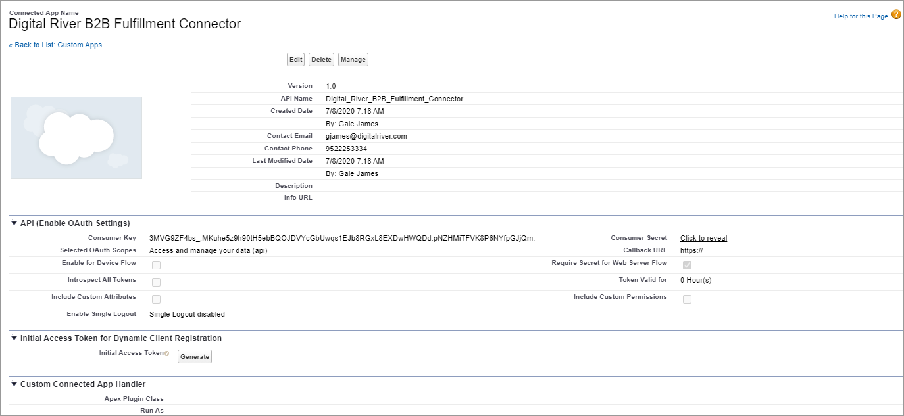
5. Collect the following information from this page:
   * **Consumer Key**–This is your Digital River client ID.
   * **Consumer Secret**–This is your Digital River client secret.
6. Type `My Domain` in the **Quick Find** field and press **Enter**. \
   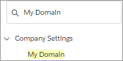
7. Click **My Domain**. The My Domain page appears.
8. Collect your Salesforce domain name from **Your domain name is**. \
   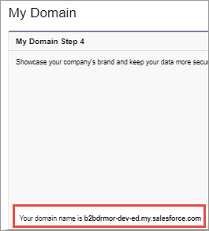
9.  Send the following information to your Digital River Project Manager:

    * Your salesforce domain name, for example:\
      `https://<custom>.my.salesforce.com` \
      Where <`custom`> is the custom portion of your domain name where you will send the OFI or OCN notification.
    * Your Digital River client ID
    * Your Digital River client secret
    * Your `grant_type` is `password`
    * Your password. Your password is a combination of the Salesforce user name for your Fulfillment Integration User followed by their security token using the following format: <_password>\<securitytoken>_\
      __Note that there is no space between the password and the security token.

    Digital River will set up the Digital River B2B Commerce Fulfillment App under Manage Connected Apps.

## Resources 

Digital River uses the following resources for fulfillments:

* **​**[**Order-level Electronic Fulfillment Information (OFI) Notification**](step-8-set-up-digital-river-fulfillments.md#ofi-notification)–You need to wait for the OFI message from Digital River before you fulfill an order.\
  `<instance_url>/services/apexrest/digitalriverb2b/DROFINotification/`
* **Order Completion Notification (OCN)**–Digital River triggers an OCN once Digital River has received an EFN with a `Shipped` or `Cancel` status for every line item in the order. This message tells Salesforce that Digital River has settled the order.

### OFI Notification 

When Salesforce receives a successful response, it will create the Digital River Fulfillment object. The object includes the CC Order ID, DR Order ID, Status, and so on. This object is important for ElectronicFulfillment Notification.

If you look at the CC Order Item Detail, you will see the **Order Item Status**:

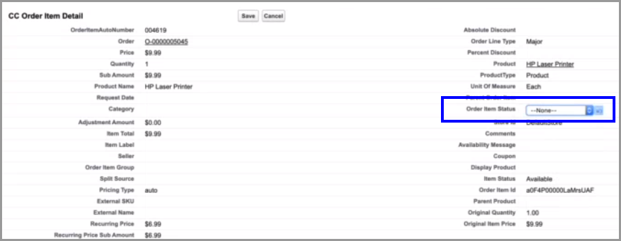

When you set the **Order Item Status** to **Shipped**, it creates a new DR (Digital River) Line Item Fulfillment Detail object.

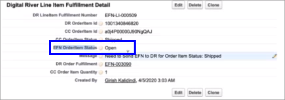

A scheduler job that looks for **Open** or **Pending** statuses in the **EFN Order Item Status** field for this object runs every five minutes.

These line items are then sent in the EFN job to Digital River with a status of `Shipped`. When Digital River receives the `Shipped` status, we will capture the funds (submit the request for payment for the payment method).

The following statuses drive the Digital River payment processing:

| Order Status              | Expected Next Step             |
| ------------------------- | ------------------------------ |
| Shipped / Partial Shipped | Payment auth will settle       |
| Cancelled                 | Payment auth will reverse/void |

## Set up OAuth programmatically 


Digital River has to set up the Digital River Salesforce B2B Commerce App under Manage Connected Apps before you can perform this step.


Read this section if you want to set up OAuth programmatically for fulfillment.

### Get an access token 

To initiate a session and get an access token, send a Token call to one of the following environments:

* **Test environment URL**: [https://test.salesforce.com/services/oauth2/token](https://test.salesforce.com/services/oauth2/token)
* **Production environment URL**: [https://login.salesforce.com/services/oauth2/token](https://login.salesforce.com/services/oauth2/token)

#### Setting token parameters 

When you request a token, you'll need to provide the required parameters listed in the following table.

| Parameter      | Required/Optional | Description                                                                                                                                                                                                                                                                                                                                                                                                                                                                                                                                                                                                                                                                                        |
| -------------- | ----------------- | -------------------------------------------------------------------------------------------------------------------------------------------------------------------------------------------------------------------------------------------------------------------------------------------------------------------------------------------------------------------------------------------------------------------------------------------------------------------------------------------------------------------------------------------------------------------------------------------------------------------------------------------------------------------------------------------------- |
| grant\_type    | Required          | The enumerator is `password`.                                                                                                                                                                                                                                                                                                                                                                                                                                                                                                                                                                                                                                                                      |
| client\_id     | Required          | The Salesforce consumer key for the connected App.                                                                                                                                                                                                                                                                                                                                                                                                                                                                                                                                                                                                                                                 |
| client\_secret | Required          | The Salesforce consumer secret for the connected App.                                                                                                                                                                                                                                                                                                                                                                                                                                                                                                                                                                                                                                              |
| username       | Required          | The Fulfillment Integration User's Salesforce email address.                                                                                                                                                                                                                                                                                                                                                                                                                                                                                                                                                                                                                                       |
| password       | Required          | 
The password format is a combination of the Fulfillment Integration User's Salesforce password and security token, for example: <em>&#x3C;Fulfillment Integration User's password>&#x3C;Fulfillment Integration User's security token></em>

Note that there is no space between the password and the security token.

To access or reset the security token:
<ol><li>Click <strong>View Profile</strong>   and then click <strong>Settings</strong>.</li><li>Click <strong>Reset My Security Token</strong>.</li><li>Click <strong>Reset Security Token</strong>. You will receive an email with your security token.</li></ol> |

#### Example Get Access Token request and response 

1. Expand the collection that contains your fulfillment APIs and open the **Get Access Token** request.
2. In the body of the request, provide the values for the [required Token parameters](step-8-set-up-digital-river-fulfillments.md#setting-token-parameters), and click **Send**.

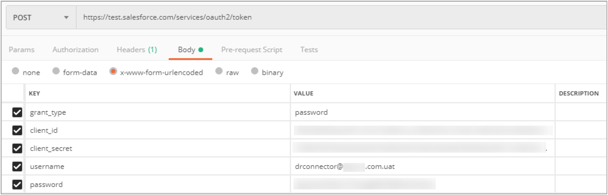

A successful response returns the token information:

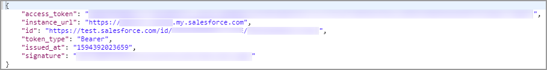

The `access_token` is the Bearer code. The fulfiller uses this Bearer code when sending subsequent fulfillment API calls.

### Send order-level Electronic Fulfillment Information (OFI) 

You must wait for the OFI message from Digital River before you fulfill an order.

To send a POST OFI, use the following URL format:

`/services/apexrest/digitalriverb2b/DROFINotification/`

Example:

`https://acme.my.salesforce.com/services/apexrest/digitalriverb2b/DROFINotification/`

#### Setting DROFINotification parameters 

| Parameter     | Required/Optional | Value                    | Description                                                                                                                                                                                                                                               |
| ------------- | ----------------- | ------------------------ | --------------------------------------------------------------------------------------------------------------------------------------------------------------------------------------------------------------------------------------------------------- |
| Authorization | Required          | Bearer <_access\_token_> | 
Use the <code>access_token</code> value  from your <a href="step-8-set-up-digital-river-fulfillments.md#get-an-access-token">token request</a> for your &#x3C;<em>token</em>>

This is a dynamic value. It changes each time you get a token.
 |
| Content\_Type | Required          | application/JSON         | This is a static value.                                                                                                                                                                                                                                   |
| Accept        | Required          | application/JSON         | This is a static value.                                                                                                                                                                                                                                   |

#### Example POST DROFINotification request and response 

1. Expand the collection that contains your fulfillment APIs and open the **POST DROFINotification** request.
2. Ensure the POST URL includes the `instance_url` from the [Get Access Token response](step-8-set-up-digital-river-fulfillments.md#example-get-access-token-request-and-response). and include the following suffix: `/services/apexrest/digitalriverb2b/DROFINotification/` For example:`https://tbdclient--docqa.my.salesforce.com/services/apexrest/digitalriverb2b/DROFINotification/`
3. Click **Headers**, replace the Bearer code with the `access_token` from [Get an access token](step-8-set-up-digital-river-fulfillments.md#get-an-access-token), and provide the values for the remaining [required DROFINotification parameters](step-8-set-up-digital-river-fulfillments.md#setting-drofinotification-parameters).\
   .png>)
4. Click [**Body**](step-8-set-up-digital-river-fulfillments.md#body), replace the value for `requisitionID` with the DR Order ID value from the CC Order:\
   .png>) \
   Note that you only need to modify the `requisitionID`. Do not modify the remaining request body content.
5. Click **Send**.

### Send Order Completion Notification (OCN) 


[Create a new access token](step-8-set-up-digital-river-fulfillments.md#get-an-access-token) before sending the OCN.


Digital River triggers an OCN once Digital River has received an EFN with a `Shipped` or `Cancel` status for every line item in the order. This message tells Salesforce that Digital River has settled the order.

To send the OCN, use the following URL format:

`<`_`Instance_url`_`>/services/apexrest/digitalriverb2b/DROrderCompleteNotification/`

Example:

`https:// acme.my.salesforce.com/services/apexrest/digitalriverb2b/DROrderCompleteNotification/`

#### Setting DROrderCompleteNotification parameters 

| Parameter     | Required/Optional | Value                    | Description                                                                                                                                                                                                                                               |
| ------------- | ----------------- | ------------------------ | --------------------------------------------------------------------------------------------------------------------------------------------------------------------------------------------------------------------------------------------------------- |
| Authorization | Required          | Bearer <_access\_token_> | 
Use the <code>access_token</code> value  from your <a href="step-8-set-up-digital-river-fulfillments.md#get-an-access-token">token request</a> for your &#x3C;<em>token</em>>

This is a dynamic value. It changes each time you get a token.
 |
| Content\_Type | Required          | application/json         | This is a static value.                                                                                                                                                                                                                                   |
| Accept        | Required          | application/json         | This is a static value.                                                                                                                                                                                                                                   |

#### Example POST DROrderCompleteNotification request and response 

1. Expand the collection that contains your fulfillment APIs and open the **POST** DROrderCompleteNotification request.
2. Ensure the POST URL includes the `instance_url` from the [Get Access Token response](step-8-set-up-digital-river-fulfillments.md#example-get-access-token-request-and-response) and include the following suffix: `/services/apexrest/digitalriverb2b/DROrderCompleteNotification/` For example: `https://tbdclient--docqa.my.salesforce.com/services/apexrest/digitalriverb2b/DROFINotification/`
3. Click **Headers**, replace the Bearer code with the `access_token` from [Get an access token](step-8-set-up-digital-river-fulfillments.md#get-an-access-token), and provide the values for the remaining [required DROrderCompleteNotification parameters](step-8-set-up-digital-river-fulfillments.md#setting-drordercompletenotification-parameters).\
   &#x20;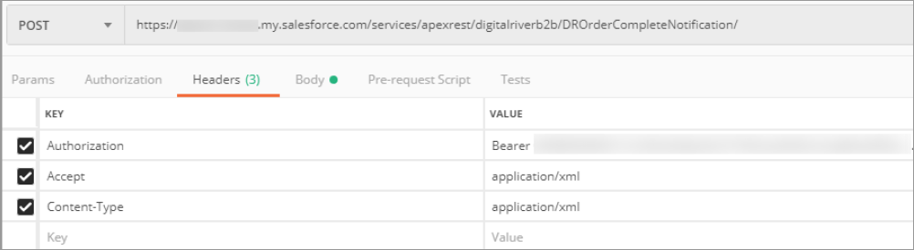
4. Click [**Body**](step-8-set-up-digital-river-fulfillments.md#body), replace the value for `orderID` with the DR Order ID value from the CC Order:\
   &#x20;.png>) \
   Note that you only need to modify the `orderId`. Do not modify the remaining request body content.
5. Click **Send**.
