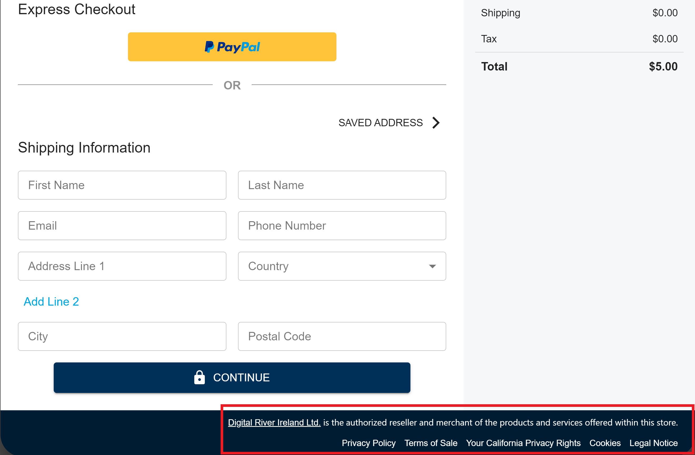

# Building checkouts

Your site's checkout experience should contain pages for customers to provide their shipping address, billing address, and payment information. Your site should also have an order review and submission page. Once customers place the order, we recommend you direct them to an order confirmation page.

On this page, you’ll find information on how to:

* [Sequence the checkout process](./#sequencing-the-checkout-process)
* [Define checkouts](./#defining-a-checkout)
* [Submit create and update checkout requests](./#creating-and-updating-the-checkout)
* [Use checkouts](./#using-the-checkout-response)

## Sequencing the checkout process

During the initial stages of an ecommerce transaction, customers land on your storefront, review products, build a cart, confirm the cart's details, and initiate checkout. Digital River is typically not involved during these early pre-checkout interactions.

As a result, this section doesn't provide guidance on how to structure these early transaction stages. Instead, it focuses on how to initiate the checkout process. And then, for shopping carts that contain [physical products](../../../product-management/creating-and-updating-skus.md#how-products-are-specified-as-physical-or-digital), it explains how to sequence the create and update [checkout](https://www.digitalriver.com/docs/digital-river-api-reference/#tag/Checkouts) requests, along with the create and authenticate [source](https://www.digitalriver.com/docs/digital-river-api-reference/#tag/Sources) requests that you send to Digital River.

### Initiating the checkout process

Once customers start adding items to their cart, we recommend you activate a proceed to checkout button. We recommend a similar button on your review cart page. Each button’s click event handler should direct customers to your initial checkout page.

### Sending the create checkout request

Once customers click the proceed to checkout button, we recommend that you use your checkout pages to obtain their shipping and billing address. Once customers enter new address information or confirm saved information, retrieve and save that data.

You can then use this saved address data, along with product data in the customer's cart to define [`items[]`](describing-the-items/), [`shipTo`](providing-address-information.md#ship-to-address) and [`billTo`](providing-address-information.md#bill-to-address) and then submit the [create checkout request](./#sequencing-the-checkout-process).

Since you can’t [update a checkout](https://www.digitalriver.com/docs/digital-river-api-reference/#operation/updateCheckouts) with additional `items[]` or modify the `quantity` of existing `items[]`, this sequence reduces the probability that customers will add products to their cart after you submit the create checkout request.

It also provides Digital River the data we need to generate a [tax estimate](tax-calculations.md#tax-estimation-and-computation-workflow) that you can display to the customer.


For more information, refer to [sequencing address information in checkouts](providing-address-information.md#sequencing-address-information-in-checkout-workflows) on the [Providing address information](providing-address-information.md) page.


### Displaying compliance disclosures

On all of your checkout pages, typically in the footer, you’re required to display disclosures. You can use the [compliance element](../../../developer-resources/reference/elements/compliance-elements.md) to do this.&#x20;



Each time you access the [checkout](https://www.digitalriver.com/docs/digital-river-api-reference/#tag/Checkouts), determine whether `sellingEntity.id`, `language`, and `shipTo.address.country` or `billTo.address.country` exist, and, if they do, use them to define `compliance.entity`, `compliance.language`, and `compliance.country`, respectively, in [the element's configuration object](../../../developer-resources/reference/elements/compliance-elements.md#compliance-element-configuration-object) and then pass that data to the [create](../../../developer-resources/reference/elements/compliance-elements.md#creating-a-compliance-element) or [update](../../../developer-resources/reference/elements/compliance-elements.md#compliance.update) method.

This ensures that customers are shown localized disclosures relevant to both their shopping country and to the transaction's designated [selling entity](selling-entities.md).

### Handling guest and registered customers

If your integration only allows [registered checkouts](using-the-checkout-identifier.md#registered-checkouts-or-invoices), at some point during the checkout process you'll need to prompt customers to sign in or create an account. When customers create an account, use the [Customers API](./#sequencing-checkout-requests) to [create a record for them](https://www.digitalriver.com/docs/digital-river-api-reference/#operation/createCustomers) in Digital River’s system.

In registered checkouts, you can use the same API to [get a customer](https://www.digitalriver.com/docs/digital-river-api-reference/#operation/retrieveCustomers) and retrieve previously saved `shipping` information. To expedite the checkout process, you may decide to present this saved shipping address to the customer as an available option.

If you decide to allow [guest checkouts](using-the-checkout-identifier.md#guest-checkouts-or-invoices), make sure you collect and send us the customer's email address. For more information, refer to [address requirements](providing-address-information.md#address-requirements-and-validations) on the [Providing address information](providing-address-information.md) page.

### Handling shipping quotes

If the shopping cart contains [physical products](../../../product-management/creating-and-updating-skus.md#how-products-are-specified-as-physical-or-digital), once you have the customer's ship to information, you’ll typically make a shipping quote request to your logistics partner. In most cases, your partner replies with an array of quotes, each containing an eligible shipping method, the shipping method's cost, and one or more ship from addresses.

For [Digital River coordinated fulfillments](../../../order-management/fulfillments.md#digital-river-coordinated-fulfillments), refer to the [Using shipping quotes](../handling-digital-river-coordinated-fulfillments/using-shipping-quotes.md) page.

You should present these quotes to customers and, once they make a selection, send an [update checkout request](https://www.digitalriver.com/docs/digital-river-api-reference/#operation/updateCheckouts) that contains [`shippingChoice`](shipping-choice.md) and [`shipFrom`](providing-address-information.md#ship-from-address). We can then use this information to generate a more precise [tax calculation](tax-calculations.md#tax-estimation-and-computation-workflow).


A checkout's `shipFrom` can be set at either the [checkout-level](providing-address-information.md#specifying-ship-from-at-the-checkout-level) or the [line item-level](providing-address-information.md#specifying-ship-from-at-the-item-level).


### Collecting payment

At this stage of the checkout process, you'll need to collect payment information from the customer and use it to either [create](../../../payments/payment-sources/using-the-source-identifier.md#creating-payment-sources) or [authenticate](../../../payments/payment-sources/using-the-source-identifier.md#authenticating-sources) a [source](https://www.digitalriver.com/docs/digital-river-api-reference/#tag/Sources).

Before you can do that, however, the payment methods presented to the customer must be applicable to the transaction. With [Drop-in payments](../../../payments/payment-integrations-1/drop-in/), you accomplish this by [building a configuration object](../../../payments/payment-integrations-1/drop-in/drop-in-integration-guide.md#step-5-configure-hydrate) and passing it to the [`createDropIn()`](../../../payments/payment-integrations-1/drop-in/drop-in-integration-guide.md#step-6-allow-the-shopper-to-interact-with-hydrate) method. If you use [DigitalRiver.js with elements](../../../payments/payment-integrations-1/digitalriver.js/quick-start.md), you'll need to configure and invoke [`retrieveAvailablePaymentMethods()`](../../../payments/payment-integrations-1/digitalriver.js/reference/digitalriver-object.md#retrieving-available-payment-methods).

In [registered checkouts](using-the-checkout-identifier.md#registered-checkouts-or-invoices), you can use this same method to filter the customer's saved sources by transaction applicability before presenting them to the customer. If the customer selects a saved source from this filtered list, you'll need to use [`authenticateSource()`](../../../payments/payment-integrations-1/digitalriver.js/reference/digitalriver-object.md#authenticating-sources). This method first determines whether strong customer authentication ([SCA](../../../payments/psd2-and-sca/)) is required and then, if it is, opens a modal window that takes customers through the authentication process.

In both [guest](using-the-checkout-identifier.md#guest-checkouts-or-invoices) and [registered](using-the-checkout-identifier.md#registered-checkouts-or-invoices) checkouts, if customer's decide to provide new payment information, both of our [primary source creation methods](../../../payments/payment-sources/using-the-source-identifier.md#creating-payment-sources) require a [payment session](./#payment-session) identifier. You can [retrieve this session identifier from the checkout](./#payment-session).

Both methods also require the customer’s billing address. Unless the customer indicates otherwise, you can use the address you collected earlier in the checkout process.

### Applying payment

Once the payment source is successfully created or authenticated, you'll need to apply it to the checkout.

If customers requested that a newly created source be saved to their account, wait until the source is [`chargeable`](../../../payments/payment-sources/#source-state), verify that it both `supportsStorage` and is [`readyForStorage`](../../../payments/payment-integrations-1/drop-in/drop-in-integration-guide.md#onsuccess), and then [save the source to the customer](../../../payments/payment-sources/using-the-source-identifier.md#attaching-sources-to-customers) before [attaching the source to the checkout](../../../payments/payment-sources/using-the-source-identifier.md#attaching-sources-to-checkouts).

If the source is not scheduled for storage, once it's `chargeable` or [`pending_funds`](../../../payments/payment-sources/#source-state), you can [attach the source to the checkout](../../../payments/payment-sources/using-the-source-identifier.md#attaching-sources-to-checkouts).

For more information on payments, refer to:

* The [Drop-in payments integration ](../../../payments/payment-integrations-1/drop-in/drop-in-integration-guide.md)guide
* The [DigitalRiver.js quick start ](../../../payments/payment-integrations-1/digitalriver.js/quick-start.md)guide
* The [Building your payment workflows](../building-you-workflows/) page
* The [Managing sources](../../../payments/payment-sources/using-the-source-identifier.md) page

### Submitting the order

After you [verify that the checkout’s payment session state is valid](./#payment-session), activate a place order button on your order review page. As part of handling this button’s click event, [convert the checkout to an order](../../../order-management/creating-and-updating-an-order.md#creating-an-order-with-the-checkout-identifier).

For more information, refer to the [Processing orders](../../../order-management/creating-and-updating-an-order.md) page.

## Defining a checkout

The following lists some of the key parameters to use when defining checkouts. The table also indicates whether these parameters are available in [`POST/checkouts`](https://www.digitalriver.com/docs/digital-river-api-reference/#operation/createCheckouts) and [`POST/checkouts/{id}`](https://www.digitalriver.com/docs/digital-river-api-reference/#operation/updateCheckouts), and provides links to additional information on how to use these features. For comprehensive specifications, refer to the [Checkouts API](https://www.digitalriver.com/docs/digital-river-api-reference/#tag/Checkouts) reference docs.

| Parameter          | Request type availability | Documentation                                                                                                                                                                                                                                   |
| ------------------ | ------------------------- | ----------------------------------------------------------------------------------------------------------------------------------------------------------------------------------------------------------------------------------------------- |
| `customerId`       | Both                      | [Processing guest and registered checkouts](using-the-checkout-identifier.md)                                                                                                                                                                   |
| `sourceId`         | Both                      | [Managing sources](../../../payments/payment-sources/using-the-source-identifier.md)                                                                                                                                                            |
| `currency`         | Both                      | [Selecting a currency](selecting-a-currency.md)                                                                                                                                                                                                 |
| `creditAmount`\*   | Both                      | [Applying a store credit](applying-a-store-credit.md)                                                                                                                                                                                           |
| `email`            | Both                      | [Required email address information](providing-address-information.md#email-address-requirements)                                                                                                                                               |
| `locale`           | Both                      | [Designating a locale](designating-a-locale.md)                                                                                                                                                                                                 |
| `browserIp`        | Both                      | [Providing the IP address](broken-reference)                                                                                                                                                                                                    |
| `shipFrom`         | Both                      | [Specifying ship from at the checkout-level](providing-address-information.md#specifying-ship-from-at-the-checkout-level) and [Specifying ship from at the item-level](providing-address-information.md#specifying-ship-from-at-the-item-level) |
| `shipTo`           | Both                      | [Ship to address](providing-address-information.md#ship-to-address)                                                                                                                                                                             |
| `billTo`           | Both                      | [Bill to address](providing-address-information.md#bill-to-address)                                                                                                                                                                             |
| `shippingChoice`   | Both                      | [Specifying a shipping choice](shipping-choice.md)                                                                                                                                                                                              |
| `discount`         | Create                    | [Checkout level discount](applying-a-discount.md#checkout-level-or-invoice-level-discount)                                                                                                                                                      |
| `items`☨           | Both                      | [Describing items](describing-the-items/)                                                                                                                                                                                                       |
| `shippingDiscount` | Create                    | [Shipping discount](applying-a-discount.md#shipping-discount)                                                                                                                                                                                   |
| `taxInclusive`     | Create                    | [Configuring taxes](configuring-taxes.md)                                                                                                                                                                                                       |
| `chargeType`       | Both                      | [Initiating a charge](initiating-a-charge.md)                                                                                                                                                                                                   |
| `taxIdentifiers`   | Both                      | [Tax identifiers](tax-identifiers.md)                                                                                                                                                                                                           |
| `customerType`     | Create                    | [Setting the customer type](setting-the-customer-type.md)                                                                                                                                                                                       |
| `purchaseLocation` | Both                      | [Setting the purchase location](setting-the-purchase-location.md)                                                                                                                                                                               |
| `upstreamId`       | Both                      | [Providing the upstream identifier](broken-reference)                                                                                                                                                                                           |

\*The `creditAmount`parameter is only available in versions `2020-09-30`, `2020-12-17`, and `2021-02-23`

☨ In a `POST/checkouts/{id}` request, you're [restricted to modifying certain line item attributes](describing-the-items/#updating-items).

## Creating and updating the checkout

To create a checkout, submit a [`POST/checkouts`](https://www.digitalriver.com/docs/digital-river-api-reference/#operation/createCheckouts) request. Once you've created the object, and you want to update it, retrieve its [unique identifier](./#checkout-identifier), and then pass it as a path parameter in a [`POST/checkouts/{id}`](https://www.digitalriver.com/docs/digital-river-api-reference/#operation/updateCheckouts).

The following `POST/checkouts` creates a [registered checkout](using-the-checkout-identifier.md#registered-checkouts-or-invoices) that contains [physical products](../../../product-management/creating-and-updating-skus.md#how-products-are-specified-as-physical-or-digital) and meets all of our [address requirements](providing-address-information.md#address-requirements-and-validations).



```
curl --location --request POST 'https://api.digitalriver.com/checkouts' \
--header 'Content-Type: application/json' \
--header 'Authorization: Bearer <API_key>' \
...
--data-raw '{
    "currency": "USD",
    "customerId": 529861350336,
    "taxInclusive": false,
    "email": "anyemail@digitalriver.com",
    "shipTo": {
        "address": {
            "line1": "10380 Bren Road W",
            "city": "Minnetonka",
            "postalCode": "55343",
            "state": "MN",
            "country": "US"
        },
        "name": "John Doe"
    },
    "shipFrom": {
        "address": {
            "country": "US"
        }
    },
    "shippingChoice": {
        "amount": 5,
        "description": "standard",
        "serviceLevel": "SG"
    },
    "items": [
        {
            "skuId": "6b04ac06-0858-456c-90aa-235772dea9e2",
            "quantity": 2,
            "price": 10
        }
    ]
}'
```



## Using the checkout <a href="#using-the-checkout-response" id="using-the-checkout-response"></a>

Each time you submit a `POST/checkouts` or `POST/checkouts/{id}`, use the data contained in the response to update the data in the upstream commerce platform. This ensures that the values in your system stay in sync with those in ours.

At both the checkout and line item level, the response contains [price](describing-the-items/price-of-an-item.md), tax, [landed cost](landed-costs.md), and [fees](../../../product-management/regulatory-fees/) information. During the checkout process, display this information to customers in your UI.



```javascript
{
    ...
    "totalAmount": 48.4,
    "subtotal": 45.0,
    "totalFees": 0.0,
    "totalTax": 3.4,
    "totalImporterTax": 0.0,
    "totalDuty": 0.0,
    "totalDiscount": 0.0,
    "totalShipping": 5.0,
    "items": [
        {
            "id": "4e0afb3e-39d1-4b94-a775-cdce3f521fa1",
            "skuId": "0ce492d2-e616-47ac-ad63-6df027577c12",
            "amount": 20.0,
            "quantity": 2,
            "tax": {
                "rate": 0.07525,
                "amount": 1.51
            },
            "importerTax": {
                "amount": 0.0
            },
            "duties": {
                "amount": 0.0
            },
            "fees": {
                "amount": 0.0,
                "taxAmount": 0.0
            }
        },
        ...
}
```



Make sure you save the checkout's [unique identifier](./#checkout-identifier) and [unique line item identifiers](./#item-information) because they're required when submitting downstream requests. Additionally, the checkout contains [payment session details](./#payment-session) that you use to create payment sources and determine when to submit an order request.

### Checkout identifier

Every checkout contains a unique identifier. You can use this identifier to [update](https://www.digitalriver.com/docs/digital-river-api-reference/#operation/updateCheckouts), [retrieve](https://www.digitalriver.com/docs/digital-river-api-reference/#operation/retrieveCheckouts), [search for](https://www.digitalriver.com/docs/digital-river-api-reference/#operation/listCheckouts), and [delete](https://www.digitalriver.com/docs/digital-river-api-reference/#operation/deleteCheckouts) the checkout. You can also use the identifier to [attach a source to the checkout](../../../payments/payment-sources/using-the-source-identifier.md#attaching-sources-to-checkouts) and then, if the customer wants to apply a different payment method, [detach the payment source](../../../payments/payment-sources/using-the-source-identifier.md#detaching-sources-from-checkouts).

When you're ready to [convert the checkout to an order](../../../order-management/creating-and-updating-an-order.md#creating-an-order-with-the-checkout-identifier), pass this identifier in the body of a [`POST/orders`](https://www.digitalriver.com/docs/digital-river-api-reference/#operation/createOrders).



```javascript
{
    "id": "f2cd50e5-355d-42d3-8bb7-0c14d8b777e4",
    ...
}
```



### Item information

Once you create a [checkout](https://www.digitalriver.com/docs/digital-river-api-reference/#tag/Checkouts), Digital River assigns each of its `items[]` an `id`. During the checkout process, if you want to [modify items](describing-the-items/#updating-items) you must send these identifiers in [`POST/checkouts/{id}`](https://www.digitalriver.com/docs/digital-river-api-reference/#operation/updateCheckouts) requests.

Depending on how you [send product data in checkouts](describing-the-items/#sending-product-data), each `items[]` also contains either the [`skuId`](../../../product-management/skus.md#product-details) or the [`productDetails`](../../../product-management/skus.md#product-details) object you sent in the [`POST/checkouts`](https://www.digitalriver.com/docs/digital-river-api-reference/#tag/Checkouts) request.


The `id` of an `items[]` in a [checkout](https://www.digitalriver.com/docs/digital-river-api-reference/#tag/Checkouts) is not the same as the `id` of the corresponding [`items[]`](../../../order-management/creating-and-updating-an-order.md#line-items) in the associated [order](https://www.digitalriver.com/docs/digital-river-api-reference/#tag/Orders).




```javascript
{
    "id": "ec03be84-d684-48a1-b4f4-4dbc05313c93",
    ...
    "items": [
        {
            "id": "50e69e0a-8e36-4ef9-84a0-45eea7535247",
            "skuId": "3a4ad0c5-1640-471e-a6b7-232454474659",
            "amount": 20.0,
            "quantity": 2,
            ...
        }
    ],
    ...
}
```



```javascript
{
    "id": "227256090336",
    ...
    "items": [
        {
            "id": "153193900336",
            "skuId": "3a4ad0c5-1640-471e-a6b7-232454474659",
            "amount": 20.0,
            "quantity": 2,
            ...
        }
    ],
    ...
    "checkoutId": "ec03be84-d684-48a1-b4f4-4dbc05313c93"
}
```



### Payment session

[Checkouts](https://www.digitalriver.com/docs/digital-river-api-reference/#tag/Checkouts) contain a unique [payment session identifier](./#payment-session-identifier) and other [payment session information](./#payment-session-information).

#### Payment session identifier

You can use the checkout's [payment session](payment-sessions.md) identifier to [create payment sources](../../../payments/payment-sources/using-the-source-identifier.md#creating-payment-sources), [authenticate saved payment sources](../../../payments/payment-integrations-1/digitalriver.js/reference/digitalriver-object.md#authenticating-sources), [retrieve available payment methods](../../../payments/payment-integrations-1/digitalriver.js/reference/digitalriver-object.md#retrieving-available-payment-methods), and [validate tax identifiers](tax-identifiers.md#validating-tax-identifiers).


In versions `2021-02-23` and lower, you find this identifier in the `paymentSessionId` attribute. In versions `2021-03-23` and higher, it's contained in `payment.session.id`.


#### Payment session information

The [checkout's](https://www.digitalriver.com/docs/digital-river-api-reference/#tag/Checkouts) `payment.session` contains an `amountContributed`, `amountRemainingToBeContributed`, and a `state`. You can use these values to [determine when to create an order](payment-sessions.md#how-to-determine-when-to-create-an-order).


This data is only returned in versions `2021-03-23` and higher.




```javascript
{
    "id": "f2cd50e5-355d-42d3-8bb7-0c14d8b777e4",
    "createdTime": "2021-03-23T17:34:17Z",
    "customerId": "530359580336",
    "currency": "USD",
    "email": "anyemail@digitalriver.com",
    "shipTo": {
        "address": {
            "line1": "10380 Bren Road W",
            "city": "Minnetonka",
            "postalCode": "55343",
            "state": "MN",
            "country": "US"
        },
        "name": "John Doe"
    },
    "shipFrom": {
        "address": {
            "country": "US"
        }
    },
    "totalAmount": 26.89,
    "subtotal": 25.0,
    "totalFees": 0.0,
    "totalTax": 1.89,
    "totalImporterTax": 0.0,
    "totalDuty": 0.0,
    "totalDiscount": 0.0,
    "totalShipping": 5.0,
    "items": [
        {
            "id": "c9f8d629-e01d-4c89-8c0a-0a0715a07d52",
            "skuId": "6b04ac06-0858-456c-90aa-235772dea9e2",
            "amount": 20.0,
            "quantity": 2,
            "tax": {
                "rate": 0.07525,
                "amount": 1.51
            },
            "importerTax": {
                "amount": 0.0
            },
            "duties": {
                "amount": 0.0
            },
            "subscriptionInfo": {
                "terms": "These are the terms",
                "autoRenewal": false,
                "freeTrial": false
            },
            "fees": {
                "amount": 0.0,
                "taxAmount": 0.0
            }
        }
    ],
    "shippingChoice": {
        "amount": 5.0,
        "description": "standard",
        "serviceLevel": "SG",
        "taxAmount": 0.38
    },
    "updatedTime": "2021-03-23T17:34:17Z",
    "locale": "en_US",
    "customerType": "individual",
    "sellingEntity": {
        "id": "C5_INC-ENTITY",
        "name": "DR globalTech Inc."
    },
    "liveMode": false,
    "payment": {
        "sources": [
            {
                "id": "bea8171b-d2bc-44e4-8d7f-1700e65b09ab",
                "type": "creditCard",
                "amount": 16.89,
                "owner": {
                    "firstName": "William",
                    "lastName": "Brown",
                    "email": "null@digitalriver.com",
                    "address": {
                        "line1": "10380 Bren Rd W",
                        "city": "Minnetonka",
                        "postalCode": "55343",
                        "state": "MN",
                        "country": "US"
                    }
                },
                "creditCard": {
                    "brand": "Visa",
                    "expirationMonth": 7,
                    "expirationYear": 2027,
                    "lastFourDigits": "1111"
                }
            },
            {
                "id": "38818373-7db9-41d9-8895-5667fea13a0b",
                "type": "customerCredit",
                "amount": 10.0,
                "customerCredit": {}
            }
        ],
        "session": {
            "id": "89bd1d59-1ba0-439f-af96-29230421725c",
            "amountContributed": 26.89,
            "amountRemainingToBeContributed": 0.0,
            "state": "requires_confirmation",
            "clientSecret": "89bd1d59-1ba0-439f-af96-29230421725c_5ca86d31-3b21-4d50-b730-9f992b260226"
        }
    }
}
```


