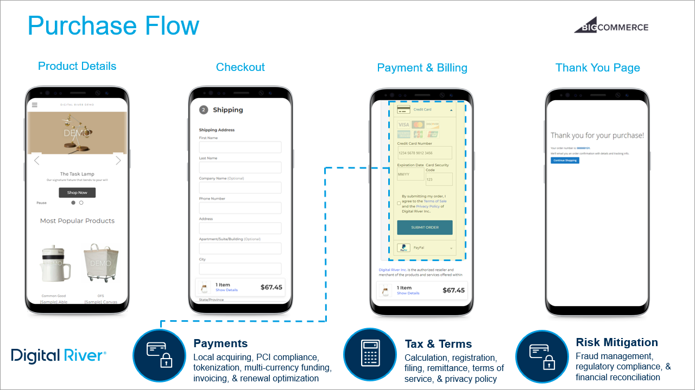

# General workflow

Digital River integrates with the BigCommerce app with a seamless front-end purchasing experience. This includes product details, merchandising, checkout, and payment information, while Digital River handles back-end functions, including behind-the-scenes tax compliance, payment processing, and risk mitigation.&#x20;

The Digital River **** app provides a host of benefits:

* Seamless connectivity with Digital River's Global Seller Services solution
* Easy to install and configure
* No micromanagement of the front-end shopper experience
* Alleviates the burden of tax and fraud risk
* Unites best-in-class front-end and back-end solutions
