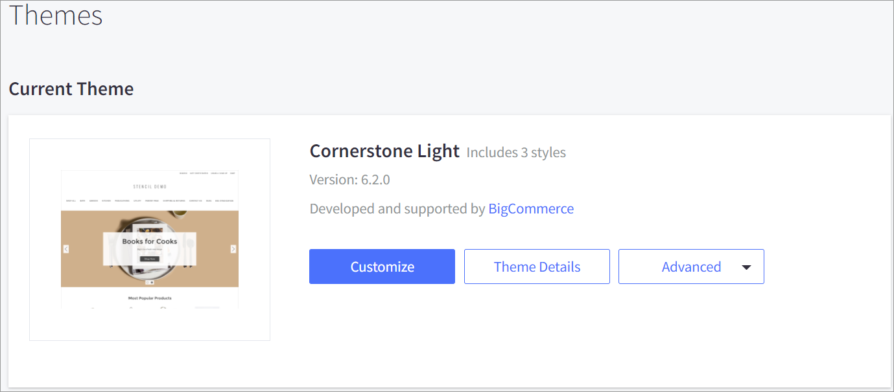
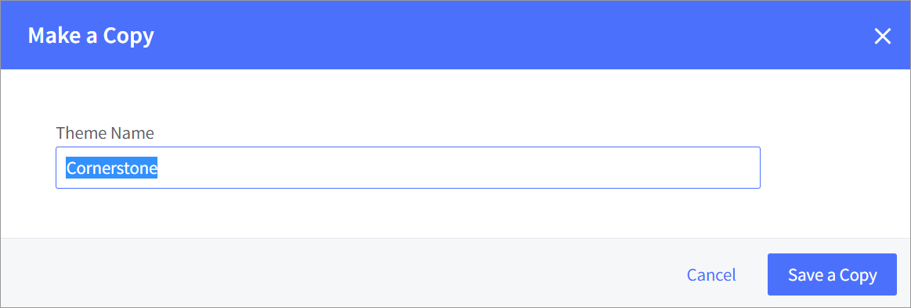
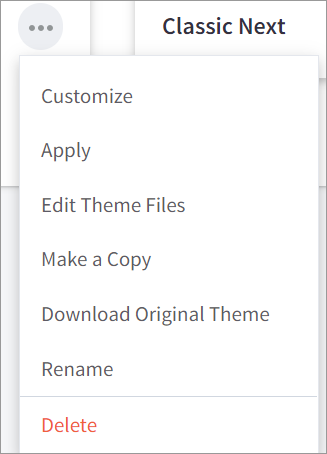
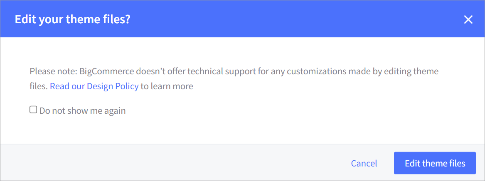
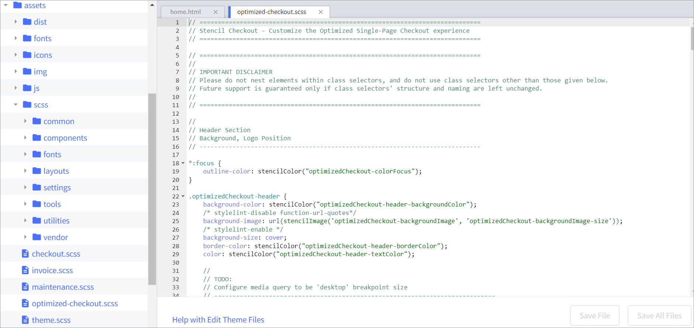
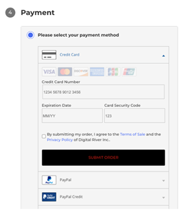

# Look and feel

Using the [Cornerstone theme](https://support.bigcommerce.com/s/article/Cornerstone-Theme-Manual?language=en\_US), you can style the look and feel of the elements within the [Drop-in](https://docs.digitalriver.com/digital-river-api/payment-integrations-1/drop-in) component using [Page Builder](https://support.bigcommerce.com/s/article/Page-Builder?language=en\_US).

&#x20;You can change the following body text and link attributes:

* Body text font family
* Link font family
* Link color
* Link hover color

Form Checklist&#x20;

* Form Background&#x20;
* Form header text color&#x20;
* Form border color

## &#x20;Styling the Pay button&#x20;

To style the Pay button within the Digital River drop-in component:

1. Click **Store Setup** in the app menu on the left and then click **Themes**.
2. Under **Current Theme**, click **Advanced**. and select **Make a Copy** from the dropdown list.\
   
3. Enter a name for the theme in the **Theme Name** field and click **Save a Copy**. \
   \

4. Under **Themes**, click more options on the theme you just created and select **Edit Theme Files**.\
   
5. Click the **Do not show me again** check box and click **Edit theme files**. 
6. From the **Stencil File Editor** tab on your browser, click **assets**, click **scss**, and then click **optimized-checkout.scss**.\
   &#x20;
7. Copy the following text and paste it at the bottom of the optimized-checkout.scss file.\
   \
   `.DR-pay-button{`\
   &#x20;   `background-color: BLACK !important;`\
   `}`\
   `.DR-button-text{`\
   &#x20;   `color: RED !important;`\
   `}`\
   ``**Important**: You must add the `!important` rule to the CSS line.
8. Click **Save File**. The results will look like this:

