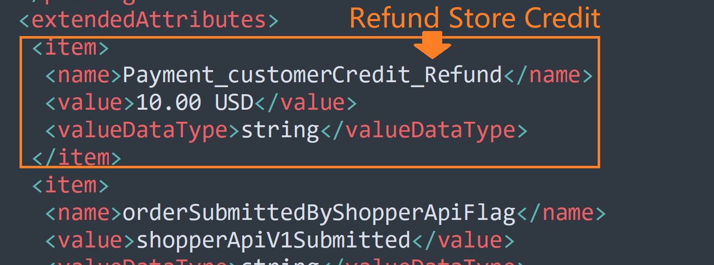

# Applying store credit

Providing and highlighting a loyalty reward builds customer loyalty and increases profitability. This topic explains how to leverage the power of the store credit program to reward and retain loyal shoppers by leveraging the Commerce API.

To support store credit, Commerce API requires [more than one source](../../../payments/sources/using-the-source-identifier.md#primary-versus-secondary-sources) in a cart. You need to [create a source for the payment](../../../payments/sources/using-the-source-identifier.md#creating-primary-sources) the shopper is currently using and [create another source for the store credit](../../../payments/sources/using-the-source-identifier.md#creating-secondary-sources). Once you created both sources, you can [attach them to the cart](../../../payments/sources/using-the-source-identifier.md#attaching-multiple-payment-sources-to-the-cart) for the charge.

## Store credit flow

1. [Create a cart](../../cart/creating-or-updating-a-cart/#creating-a-cart).
2. Create a [store credit source](../../../payments/sources/using-the-source-identifier.md#creating-secondary-sources).
3. [Attach the secondary source to the cart](../../../payments/sources/using-the-source-identifier.md#attaching-multiple-payment-sources-to-the-cart) (for example, the store credit source).
4. Attach the primary source to the cart (for example, the credit card source).\
   **Note**: If the secondary source can cover the entire order amount, you can skip this step. &#x20;
5. [Submit the cart](../../cart/submitting-a-cart/).
6. If you [configured notifications](../../subscriptions/managing-subscriptions/receiving-payment-details-update-notifications.md), the shopper receives an order confirmation notification.  See [Post-order notifications](applying-store-credit.md#post-order-notification) for more information.

## Cancel an order that used store credit

1. You can use [Global Commerce](https://gc.digitalriver.com/gc/ent/timeout.do) to cancel an order or line item if it has not been shipped or fulfilled.
2. If you [configured notifications](../../subscriptions/managing-subscriptions/receiving-payment-details-update-notifications.md), the shopper receives a cancellation notification. See [Line item cancel completed](applying-store-credit.md#line-item-cancel-completed-event-notification) for more information.

## Refund an order with store credit

1. You cannot [cancel an order or line item](../../fulfillment-1/physical-fulfillment/#cancel-fulfillment-order-request) if it has been shipped or fulfilled. You need to return or refund the order or line item using [Global Commerce](https://gc.digitalriver.com/gc/ent/timeout.do), the [Refunds API](https://www.digitalriver.com/docs/commerce-api-reference/#tag/Refunds), or [Returns API](https://www.digitalriver.com/docs/commerce-api-reference/#tag/Returns).
2. The shopper [requests a refund](../../returns-and-refunds-1/refunds/creating-a-satisfaction-refund.md). If you [configured notifications](../../subscriptions/managing-subscriptions/receiving-payment-details-update-notifications.md), the shopper receives a user refund confirmation.&#x20;
3. Digital River processes the refund request. See [Store credit notification](applying-store-credit.md#store-credit-notifications) for more information.

## Post-order notifications

Post-order notification (PON) polls events and collects data using real-time calls for your company or site. When an event occurs, it triggers a notification and sends the notification to your endpoint. The notifications are one way. Once you receive a notification, you are free to do whatever you want with that notification.

A PON tells you when a shopper uses store credit and how much store credit the shopper used when an event occurs. A PON is triggered when an order is submitted, refunded, or cancelled. The PON generates an XML containing the order data. The store credit amount and payment method amount will appear in the notification's `Order` object under `extendedAttributes`. You can extract the content of an order event to see the amount the shopper paid by store credit and other payment methods.

The following table shows that a PON is sent when: (1) a shopper submits an order, (2) a shopper requests a refund for an order or line item, and (3) a shopper cancels an order or line item.

| Flow sequence | Event description                                                                                            | Post-order notification                                    |
| ------------- | ------------------------------------------------------------------------------------------------------------ | ---------------------------------------------------------- |
| 1             | Shopper submits the order.                                                                                   | Notify the the client system to subtract the store credit. |
| 2             | Shopper requests a refund for the order or a line item. Digital River processes the refund for the customer. | Notify the client system to return the store credit.       |
| 3             | Shopper cancels the order or a line item.                                                                    | Notify the client system to return the store credit.       |

### Order submitted notification

The order submitted notification displays the payment method and store credit under `extendedAttributes`. If you want to receive a notification when an order event occurs, contact your Digital River representative.&#x20;

.png>)

### Line item cancel completed notification

The line item cancel completed notification shows the cancelled store credit under `extendedAttributes`. If you want to receive a notification when the store credit was not consumed so you can reflect it on your system, contact your Digital River representative.&#x20;

### Return credit complete notification

The return notification shows the refunded store credit under `extendedAttributes`. If you want a post-order notification sent to your system to notify you that the store credit was not consumed so you can reflect it on your system, contact your Digital River representative.

