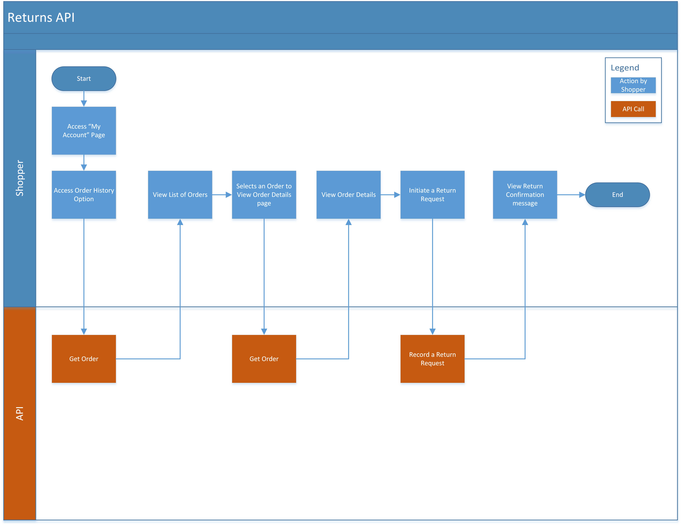

# Return flow

The [Returns ](https://www.digitalriver.com/docs/commerce-api-reference/#tag/Returns)resource allows you to manage returns from your customers.

A return flow begins after the shopper signs in to an API client page. By signing in, the shopper authenticates themselves. When the shopper initiates a self-service return from a client-hosted page, such as a My Account page, the client then requests an authenticated session from Digital River and initiates a return request.

The following diagram shows how returns are processed.

