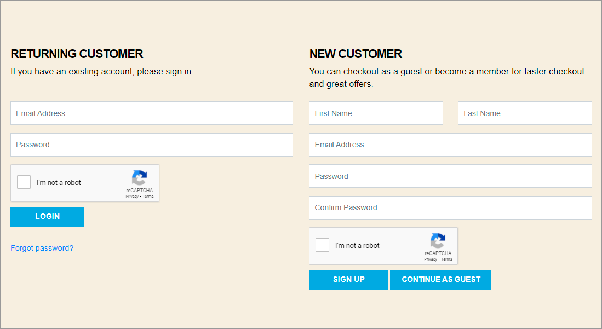
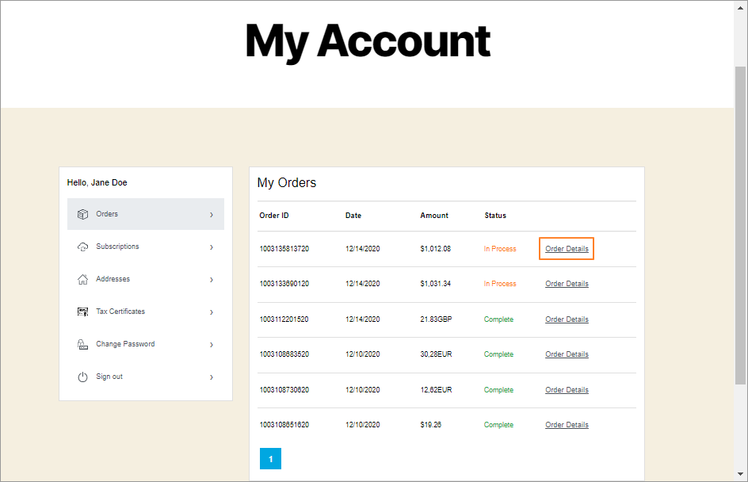
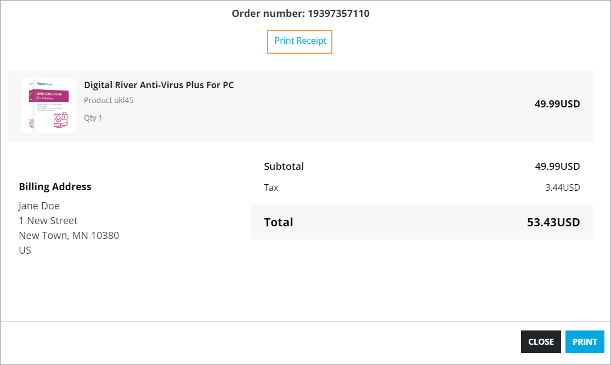
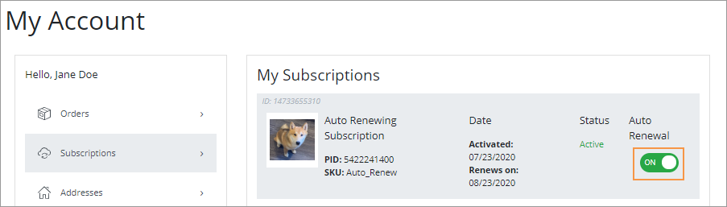
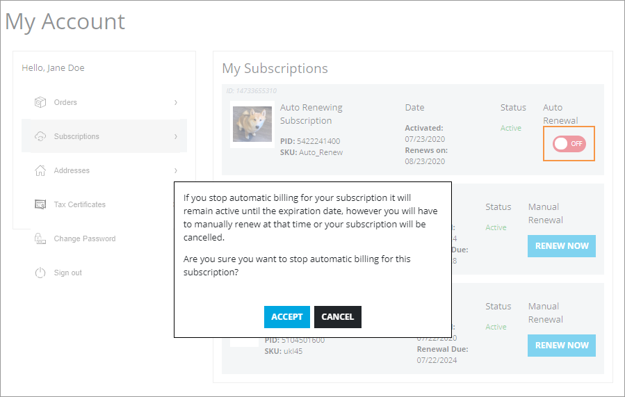
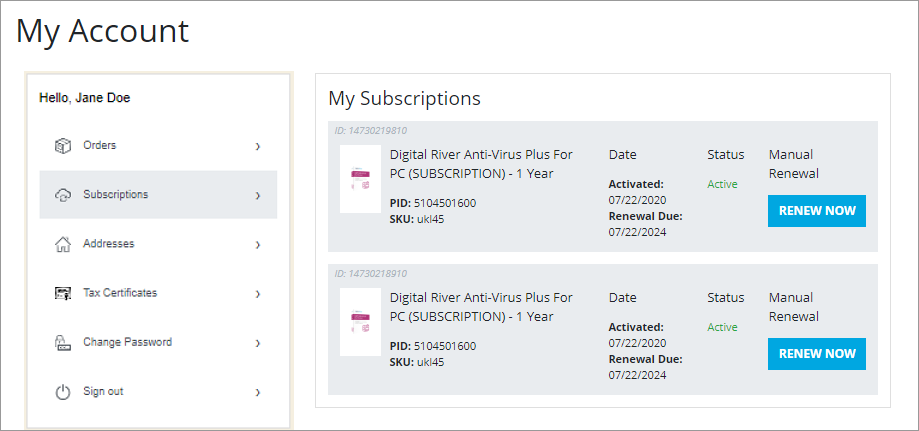
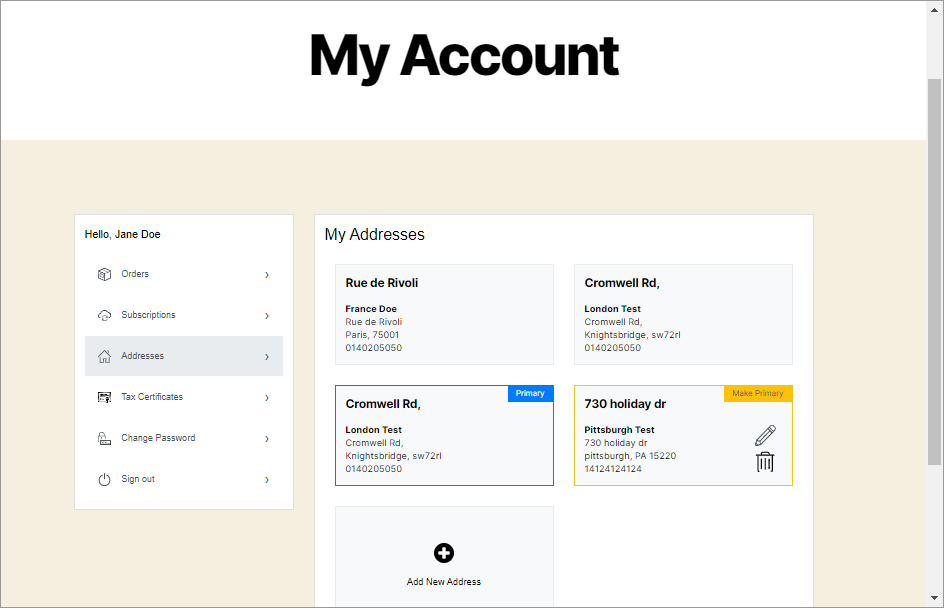
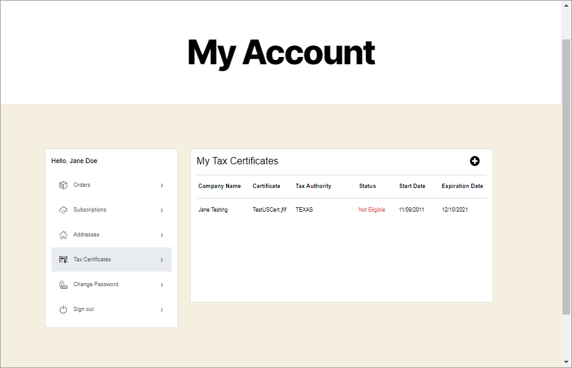
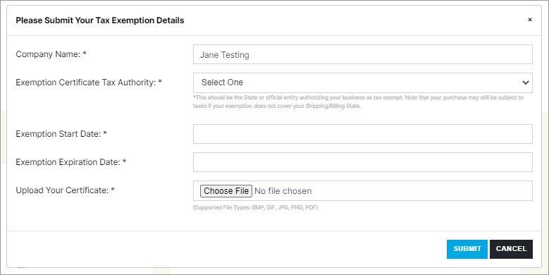
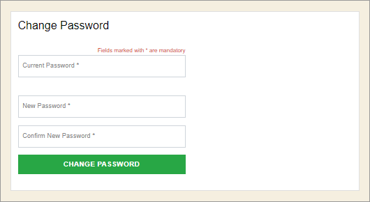

# Operation and maintenance

## Implementation information for WordPress subscription and profile management&#x20;

Your store can be set up for anonymous and/or authenticated shopping. If you use authenticated shopping you can leverage the subscription and profile management features. During checkout, you are prompted to Login (Returning Customer) or Sign Up (New Customer) with a password, now including the added security of using reCaptcha. These options will allow you to access Subscription and Profile Management.&#x20;

## My Account page

On the My Account page, authenticated shoppers can:

* [View orders and print receipts](operation-and-maintenance.md#1-view-orders)
* [Manage subscriptions](operation-and-maintenance.md#2-manage-subscriptions)
* [Manage addresses](operation-and-maintenance.md#3-manage-addresses)
* [Manage tax exemption certificates](operation-and-maintenance.md#4-manage-tax-exemption-certificates)
* [Change password](operation-and-maintenance.md#5-change-password)

&#x20;To access these options, log in and navigate to **My Account**.

### 1. View orders

Authenticated shoppers can view orders placed from the Orders panel. On the My Account page, click the **Orders** menu item to open the My Orders list.

For additional information about an order, click **Order Details** to open Order Details and print a receipt.

### 2. Manage subscriptions

From the Subscriptions panel, authenticated shoppers can view My Subscriptions details, where they can:

* Switch from an auto-renewal subscription to a manual renewal subscription \
  &#x20; \
  &#x20;  &#x20;
* Renew Now for Manual Renewal products\
  &#x20;&#x20;

### 3. Manage addresses &#x20;

From the Addresses panel, authenticated shoppers can:

* Edit an existing address
* Make an existing address primary
* Add a new address
* Delete an address\
  &#x20;&#x20;

### 4. Manage tax exemption certificates

During the WordPress plugin configuration, [Global Tax management](configure-the-wordpress-plugin.md#global-tax-management) settings are set. View your tax exemption certificates on the My Tax Certificates page.&#x20;

Click the Add icon  to add a tax certificate. Complete the fields and click **Submit**.

### 5. Change password

To change your password, click Change Password in the menu to open the Change Password dialog box. Enter the current and new passwords, and click **Change Password**.

## Scheduled Import of Products

Regularly scheduled [product importing and syncing](configure-the-wordpress-plugin.md#step-4a-general-tab) is set on the General tab of the Digital River Settings page. Automatic imports occur twice daily, every 12 hours, from the time initially set. Manual imports are also available.
