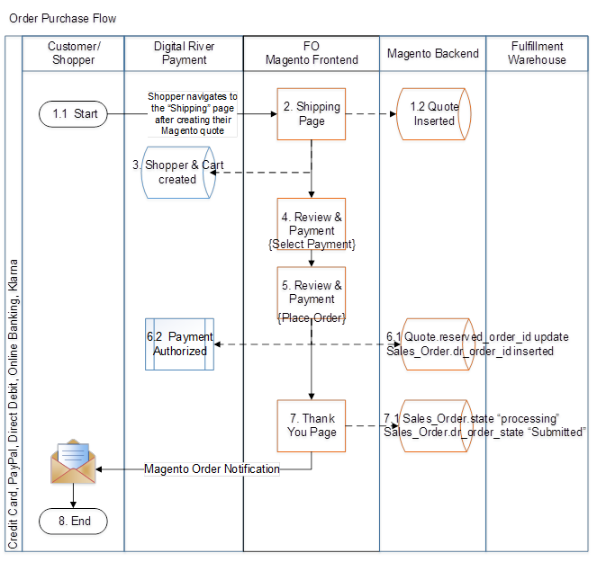
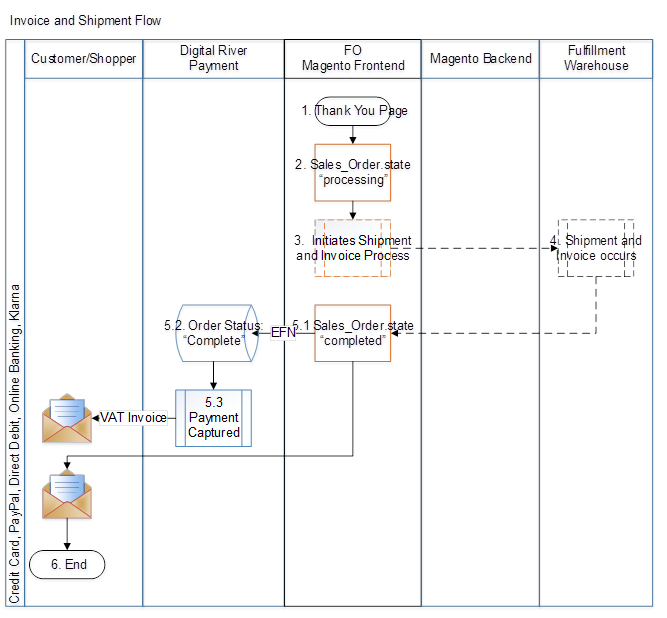
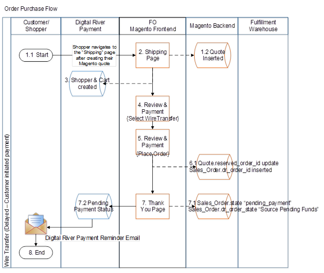
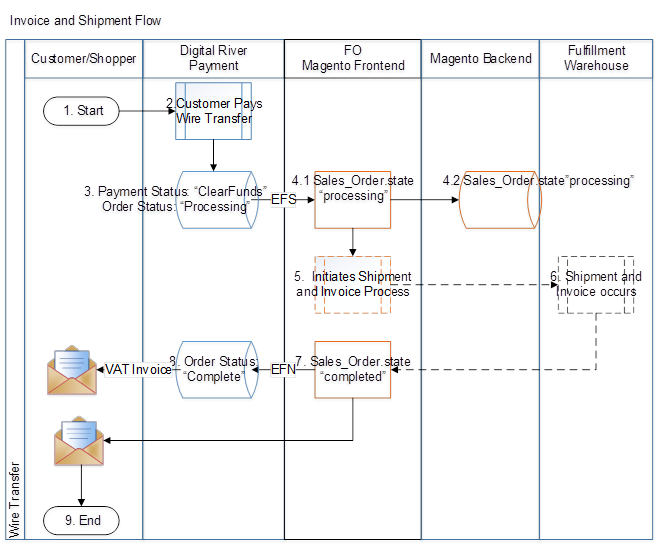

# Payment methods

The following topics describe how the payment methods interact with the Magento Extension:

* [Credit Card, PayPal, Direct Debit, Online Banking, Klarna](payment-methods.md#credit-card-paypal-direct-debit-online-banking-klarna)
* [Order fraud flow](payment-methods.md#order-fraud-flow)
* [Wire Transfer (delayed payments)](payment-methods.md#wire-transfer-delayed-payments)

## Credit Card, PayPal, Direct Debit, Online Banking, Klarna&#x20;

### Order purchase flow exception handling

#### Shopper & cart created:

* **400—** “invalid-request”, the DrPay extension will ensure a proper payload.
* **409—** “resource-already-exists”, the DrPay extension, in the case of guest checkout, will create a new Digital River shopper each time to avoid a conflict. All users created will first be created in the Magento application and then created in the Digital River application. If a user is created in Magento without being created in Digital River it will only create an error if the shopper attempts to use a stored credit card the 2nd time through the order flow. If no saved cart was used Digital River will reattempt to create the user during their next purchase.
* **500—** The shopper will not be able to check out and will encounter a fatal error when attempting to place their order. Shopper-facing error message: **"Unable to Place Order".**

#### Payment authorized:

* **400—** All payment authorization failures will display the message: **“Unable to Place Order“.**
* **409—** “invalid\_token”, if during the checkout the token is invalid for any reason, an error will occur upon trying to place their order: **“Unable to Place Order“**
* **500—** Service unavailable will result in an **“Unable to Place Order”** error message.

## Order fraud flow&#x20;

## Wire Transfer (delayed payments) &#x20;

