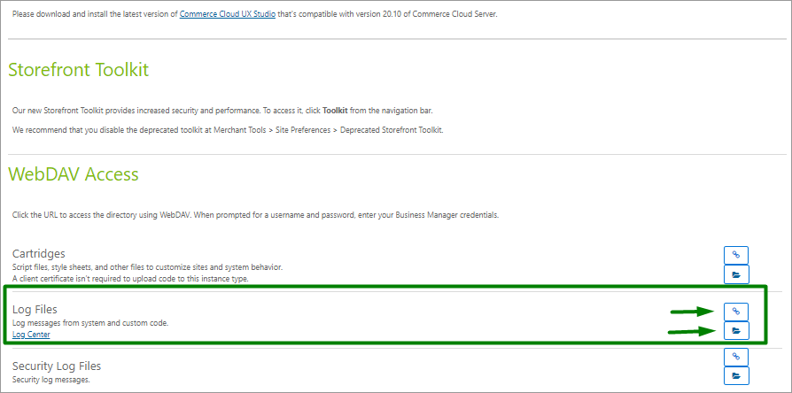

# Operations and maintenance

## Data storage 

Outside of Commerce Cloud, Digital River API stores Customer, Order, and SKU data across three areas:

* CPG (payments that are SOC and PCI-compliant)
* GC (Global Commerce commerce engine which is SOC and PCI-compliant)
* PS (Payments Service which is PCI-compliant).

The location is Elastic Search, Oracle, and Cassandra, and the duration is a maximum of 10 years for Customer Data and Order Data except for the EU “Right to be forgotten” GDPR requirements, which we support.

## Availability 

When the cartridge is enabled, there is a possibility to use the Digital River payment method on the checkout process. The Digital River payment method is available on the storefront based on special settings (restrictions) saved in custom site preferences.

Services should always be available.

If services are not available, orders and payments cannot be processed.

We provide a Business Manager extension cartridge that gives a real-time status on available services by sending a static request and evaluating the response code sent back to SFCC.

See Digital River Service Tester under [Merchant tools](user-guide.md#merchant-tools) for more information.

## Salesforce B2C log files 

Salesforce provides detailed [log information](https://documentation.b2c.commercecloud.salesforce.com/DOC4/index.jsp?topic=%2Fcom.demandware.dochelp%2Fcontent%2Fb2c\_commerce%2Ftopics%2Fsite\_development%2Fb2c\_log\_files\_overview.html\&resultof=%22%4c%6f%67%73%22%20%22%6c%6f%67%22%20) that can help you find error root causes. Among others, you can check out a log file provided by this cartridge with the name custom-DigitalRiver that captures all actions connected with Digital River functionality.

You can access logs through the [Log center](https://documentation.b2c.commercecloud.salesforce.com/DOC4/index.jsp?topic=%2Fcom.demandware.dochelp%2Fcontent%2Fb2c\_commerce%2Ftopics%2Fsite\_development%2Fb2c\_log\_center.html\&resultof=%22%4c%6f%67%22%20%22%6c%6f%67%22%20%22%63%65%6e%74%65%72%22%20) or Business Manager Route Administration; Select **Site Development**, and then select **Development Setup**. Scroll down to the **WebDAV Access** section.

When a customer submits an order, the following required parameters are sent to Digital River:

* `upstreamId`
* `sourceId`


**Note:** The upstreamId for an Order corresponds to the SFCC Order Number. Prior to the creation of a Digital River order, the `upstreamId` will contain the unique ID of the SFCC basket. Providing the Digital River Order ID and/or the SFCC Order Number is useful when troubleshooting issues.


These parameters will appear in the log.

## Failover and recovery process

If there is a service disruption, it impacts the ecommerce experience in the following ways:

1. Payment methods will not render in the cart during checkout.
2. Tax calculations will not return to the cart.
3. Overall, customers will be unable to transact on the ecommerce store that is leveraging Digital River for tax, payments, and risk.

Contact your Digital River representative as soon as possible.

To mitigate the consequences of service disruption, disable the cartridge in custom properties, and set up other payment methods by selecting **Merchant Tools**, selecting **Ordering**, and then select **Payment methods**. Note that all payment instruments saved to customer accounts while the cartridge was disabled will be displayed but won’t be applicable after Digital River recovers. When the cartridge is disabled, Salesforce B2C tools calculate the taxes.
