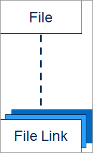

# Files

The [Files resource](https://www.digitalriver.com/docs/digital-river-api-reference/#tag/Files) represents a customer-related document that is hosted on Digital River's servers. You can use the [Files API](https://www.digitalriver.com/docs/digital-river-api-reference/#tag/Files) to upload, retrieve, search for, download, and delete files.

Every [File object](files.md#the-file-object) contains a unique identifier, which you can use to [download a file for internal use](files.md#downloading-a-file-for-internal-use) or [create a publicly-accessible link to a document](files.md#creating-a-publicly-accessible-link).

## Creating a file

To upload a customer's tax documents to our servers, [define a file](files.md#defining-a-file) and then [submit a create file request](files.md#submitting-a-create-file-request).

### Defining a file

When defining a file, you're only required to designate a [file and its purpose](files.md#file-and-purpose). Providing a [name and title](files.md#name-and-title), along with specifying a [link expiration time](files.md#link-expiration), are optional values.

#### File and purpose

In the request, `file` should adhere to the [RFC 2388](https://tools.ietf.org/html/rfc2388) specification, which defines file transfers for the multipart/form-data protocol.

The `purpose` parameter should describe the function of the file.

If you're providing Digital River a customer's tax document, set `purpose` to `tax_document_customer_upload`. For details, refer to [Collecting tax certificates](../../customer-management/setting-tax-related-attributes.md#collecting-tax-certificate-information) on the [Setting up tax exemptions](../../customer-management/setting-tax-related-attributes.md) page.&#x20;


For some [orders](https://www.digitalriver.com/docs/digital-river-api-reference/#tag/Orders), Digital River generates a [file](https://www.digitalriver.com/docs/digital-river-api-reference/#tag/Files) whose `purpose` is  `customer_tax_invoice` and/or `customer_credit_memo`. For details, refer to [Accessing invoices and credit memos](../accessing-invoices-and-credit-memos.md).


#### Name and title

In the request, you have the option of sending a `fileName` that is suitable for saving to a filesystem as well as a user-friendly `title` for the document.

#### Link expiration

If you provide a `linkExpiresTime`, make sure the value adheres to the [date and time format](../../developer-resources/best-practices.md#dates-and-times) used in the Digital River APIs.

### Submitting a create file request

In your [`POST /files`](https://www.digitalriver.com/docs/digital-river-api-reference/#tag/Files/operation/createFiles) requests, set the `Content-Type` header to `multipart/form-data`:



```
curl https://api.digitalriver.com/files \
     -u <API_key>: \
     -d file="@/path/file.jpg" \
     -d purpose="tax_document_customer_upload" \
     -d fileName="file.png" \
     -d title="My 2019 Tax Certificate."
```



A `201 Created` response returns a [File object](files.md#the-file-object):



```javascript
{
  "id": "file_09e2464f-9b4f-482b-ae89-732183c705be",
  "createdTime": "2018-04-25T20:36:00Z",
  "fileName": "file.png",
  "purpose": "tax_document_customer_upload",
  "title": "My 2019 Tax Certificate.",
  "size": 72334,
  "type": "png",
  "url": "https://files.digitalriver.com/files/file_17a0cab7-1ff7-478e-99f9-d4e753dec24d/contents",
  "liveMode": false
}
```



## The File object



```javascript
{
    "id": "62e30acb-1c24-40fc-8a98-db8e3d479c78",
    "createdTime": "2021-05-24T09:10:49Z",
    "fileName": "GCINIE6426071CGB20190000000000284082939532120039586.pdf",
    "links": [
        {
            "id": "7e20a925-32b1-434b-b704-366b19b8afd2",
            "createdTime": "2021-05-24T22:11:54Z",
            "expired": false,
            "expiresTime": "2021-05-26T13:47:13Z",
            "liveMode": false,
            "url": "https://files-test.digitalriver.com/links/7e20a925-32b1-434b-b704-366b19b8afd2"
        }
    ],
    "purpose": "customer_invoice",
    "title": "customer invoice",
    "size": 35776,
    "type": "pdf",
    "url": "https://api.digitalriver.com/files/62e30acb-1c24-40fc-8a98-db8e3d479c78/content",
    "liveMode": false
}
```



### Unique identifier

You can use `id` to [retrieve](https://www.digitalriver.com/docs/digital-river-api-reference/#operation/retrieveFiles), [search for](https://www.digitalriver.com/docs/digital-river-api-reference/#operation/listFiles), and [delete](https://www.digitalriver.com/docs/digital-river-api-reference/#operation/deleteFiles) files. You'll also need it to [create a file link](file-links/creating-a-file-link.md) that can be shared with customers.

### Links

Files may contain an array of publicly-accessible [File Links](file-links/). If no links have been generated, however, then `links[]` does not exist.



### Size and type

A file's `size` is represented in bytes and its `type` signifies a format (e.g. pdf, jpg, or png)

### URL

The `url` allows you to [download a file for internal use](files.md#downloading-a-file-for-internal-use).

## Using a file

Once a file is created, you can [download it for internal use](files.md#downloading-a-file-for-internal-use) or [create a publicly accessible link](files.md#creating-a-publicly-accessible-link).

### Downloading a file for internal use

You can use [`url`](files.md#url) to download a document for internal use. But to [get the file's content](https://www.digitalriver.com/docs/digital-river-api-reference/#tag/Files/operation/downloadFiles), you'll need to provide your [secret (confidential) API key](../../developer-resources/api-structure.md#confidential-keys).&#x20;

A request sent with the wrong key returns a `401 Unauthorized` response status code.



```javascript
{
    "type": "unauthorized",
    "errors": [
        {
            "message": "An authorization error has occurred."
        }
    ]
}
```



As a result, don't share `url` with your customers. If you'd like to provide them access to a document, [create a public link](files.md#creating-a-publicly-accessible-link).

### Creating a publicly accessible link

To share files with customers, [create a file link](file-links/).&#x20;
