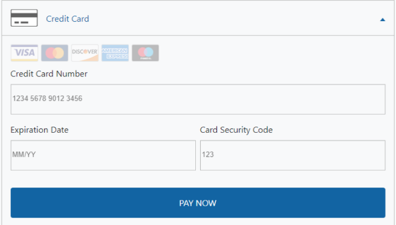

# Building payment workflows

You can create [Strong Customer Authentication (SCA)](https://info.digitalriver.com/rs/348-QUY-258/images/Digital\_River\_Guide\_to\_PSD2\_Compliance\_2020.pdf) compliant workflows for both [purchase transactions](building-your-workflows.md#purchase-flows) and [account management](building-your-workflows.md#account-management-flows).

When building workflows that use [Drop-in Payments](payments-solutions/drop-in/), you'll first need to perform some [common, initial steps](building-your-workflows.md#common-drop-in-steps) before proceeding to the workflow's specific steps.‌ For workflows using [DigitalRiver.js with elements](payments-solutions/digitalriver.js/), you also need to complete some [prerequisites](building-your-workflows.md#elements-prerequisites).

Each purchase and account management workflow has some [key settings and methods](building-your-workflows.md#common-drop-in-steps).&#x20;

Whether you are using [Drop-in Payments](payments-solutions/drop-in/) or [DigitalRiver.js with elements](payments-solutions/digitalriver.js/), any SCA requirements are automatically managed by Digital River. Two-factor authentication is handled by our [authenticate source method](broken-reference). And our card acquirers use the [3-D Secure](https://en.wikipedia.org/wiki/3-D\_Secure) protocol to communicate with issuing banks. This protocol operates "behind-the-scenes" and requires no developer interaction.&#x20;

## Limitations and constraints

Note the following limitations and constraints when building your payments workflow.

* Do not change the currency when there is a secondary source in the cart. Specify the correct currency when creating a [secondary payment source](sources/using-the-source-identifier.md#secondary-payment-sources). After you [apply the secondary source](sources/using-the-source-identifier.md#creating-secondary-sources) to the cart, do not change the currency.\
  \
  If you change the currency when calling `/v1/shoppers`, a [`409 Conflict`](../error-codes.md#409-conflict) response contains specific information about what triggered the failure. In this instance, one of the currencies in the cart is not supported.


```json
{
    "errors": {
        "error": [
            {
                "relation": "https://developers.digitalriver.com/v1/shoppers/ShoppersResource",
                "code": "invalid-request",
                "description": "One or more sources in the cart does not support locale {Locale} and currency {Currency}."
            }
        ]
    }

}
```



```json
{
    "errors": {
        "error": [
            {
                "relation": "https://developers.digitalriver.com/v1/shoppers/ShoppersResource",
                "code": "invalid-request",
                "description": "One or more sources in the cart does not support locale {Locale} and currency {Currency}."
            }
        ]
    }

}
```


* At this time, you cannot use the store credit to purchase a subscription product.
* At this time, you cannot use the store credit to pre-order a product.
* At this time, you cannot use the store credit to purchase a product on backorder.
* At this time, you cannot attach more than one store credit source to an order. Multiple secondary sources are not supported.

## Common Drop-in Payment steps <a href="#common-drop-in-steps" id="common-drop-in-steps"></a>

For any workflow that uses [Drop-in Payments](payments-solutions/drop-in/), whether it's built for [purchases ](building-your-workflows.md#purchase-flows)or [account management](building-your-workflows.md#account-management-flows), you first need to perform the following steps.‌

1. ​[Include DigitalRiver.js on your page](payments-solutions/drop-in/drop-in-integration-guide.md#step-1-include-digitalriver-js-on-your-page).
2. ​[Include the Drop-in Payments CSS file](payments-solutions/drop-in/drop-in-integration-guide.md#step-2-include-the-hydrate-css-file).
3. [​Initialize DigitalRiver.js with your public key](payments-solutions/drop-in/drop-in-integration-guide.md#step-3-initialize-digitalriver-js-with-your-public-key).
4. [​Create a container for Drop-in Payments](payments-solutions/drop-in/drop-in-integration-guide.md#step-4-create-a-drop-in-payments-container).

Once you've completed these initial steps, you can perform those specific to your desired [purchase](building-your-workflows.md#purchase-flows) or [account management](building-your-workflows.md#account-management-flows) scenario.

## Elements prerequisites

When using [DigitalRiver.js with elements](payments-solutions/digitalriver.js/quick-start.md) to build workflows, you need to be using [payment sessions](../cart/payment-sessions.md). So ensure you've [completed the necessary migration](../cart/payment-sessions.md#migrating-to-payment-sessions). We also assume you are familiar with [creating and styling elements](payments-solutions/digitalriver.js/quick-start.md) as well as the [basics of capturing payment details](../general-resources/reference/digitalriver-object.md#digitalriver-createsource-element-sourcedata).

Once you've completed these prerequisites, you can perform the steps specific to your desired [purchase ](building-your-workflows.md#purchase-flows)or [account management](building-your-workflows.md#account-management-flows) scenario.

## Purchase Flows <a href="#purchase-flows" id="purchase-flows"></a>

For almost all [one-off](building-your-workflows.md#one-off), [subscription](building-your-workflows.md#subscription), and [mail-order/telephone-order (MOTO)](../cart/submitting-a-cart/initiating-a-charge.md#mail-order-telephone-order) transactions, Digital River supports [SCA-compliant](psd2-and-sca/) workflows that use either [Drop-in Payments](payments-solutions/drop-in/) or [DigitalRiver.js elements](payments-solutions/digitalriver.js/).‌

### One-off  <a href="#one-off" id="one-off"></a>

‌You can develop workflows that allow customers to [enter](building-your-workflows.md#credit-card-details-entered-by-customer-during-checkout), [save](building-your-workflows.md#credit-card-details-saved-by-customer-during-checkout), and [retrieve ](building-your-workflows.md#customer-selects-saved-credit-card-during-checkout)their payment information while making one-off purchases.&#x20;

#### Customers enter their credit card information <a href="#credit-card-details-entered-by-customer-during-checkout" id="credit-card-details-entered-by-customer-during-checkout"></a>

‌In this flow, customers supply their credit card information during a one-off transaction but don't save it to their account.

| SCA required? | Drop-in Payments supported? | Elements supported? |
| ------------- | --------------------------- | ------------------- |
| Yes           | Yes                         | Yes                 |



**Prerequisites**: Perform the [common Drop-in Payments steps](building-your-workflows.md#common-drop-in-steps).

**Step one**: [Create a cart](../cart/creating-or-updating-a-cart/) with all tax, shipping, duty, and fee amounts in a final state and a [`chargeType` ](../cart/submitting-a-cart/initiating-a-charge.md)that is `customer_initiated`.

**Step two**: Retrieve the cart's [payment session identifier](../cart/payment-sessions.md#enable-payment-sessions), and use it to set the sessionId in the Drop-in Payments' [configuration object](payments-solutions/drop-in/drop-in-integration-guide.md#step-5-configure-hydrate).  In [`options`](payments-solutions/drop-in/drop-in-integration-guide.md#drop-in-options), set `flow` to `checkout` and [`usage`](broken-reference) to `convenience`, and (to prompt Drop-in payments to display the save payment option) [`showSavePaymentAgreement` ](payments-solutions/drop-in/drop-in-integration-guide.md#optional.-allowing-the-customer-to-save-their-payment-details)to `true`.

```javascript
let configuration = {
    sessionId: "d3941a36-6821-4d93-be23-6190226ae5f7",
    options: {
        flow: "checkout",
        usage: "convenience"
    }
    ...
}
```

**Step three**: Use the configuration object to [instantiate Drop-in Payments](payments-solutions/drop-in/drop-in-integration-guide.md#step-6-allow-the-shopper-to-interact-with-hydrate).  &#x20;

```javascript
let dropin = digitalriver.createDropin(configuration);
```

**Step four**: On your cart page, [specify a container to place Drop-in Payments](payments-solutions/drop-in/drop-in-integration-guide.md#step-7-place-drop-in-payments-on-your-cart-or-shopper-page).

Drop-in Payments renders in the specified container.

.png>)

Customers enter their credit card information and click the [configurable ](payments-solutions/drop-in/drop-in-integration-guide.md#customizing-the-text-of-the-drop-in-payments-button)Pay Now **** button**.**&#x20;

If the customers completes the [SCA](psd2-and-sca/), then the [`onSuccess` metho](payments-solutions/drop-in/drop-in-integration-guide.md#onsuccess)d is called and Digital River returns a unique source in a [chargeable state](broken-reference).

```javascript
...
onSuccess: function (data) { doSometingWithTheSource(data) },
...
```

**Step five**: [Attach the source to the cart](sources/#attaching-a-payment-method-to-an-order-or-cart).&#x20;

**Step six**: [Create the order by submitting the cart](../cart/submitting-a-cart/).



**Prerequisites**: Refer to the [Elements prerequisites](building-your-workflows.md#elements-prerequisites) section.

**Step one:** [Create a cart](../cart/creating-or-updating-a-cart/#creating-a-cart) with all tax, shipping, duty, and fee amounts in a final state  and a [`chargeType` ](../cart/submitting-a-cart/initiating-a-charge.md)that is `customer_initiated`.

**Step two:** Retrieve the [payment session identifier](../cart/payment-sessions.md#enable-payment-sessions) from the cart, and use it to configure the [`createSource()`](../general-resources/reference/digitalriver-object.md#createsource-element-sourcedata) method. The configuration object should also set `futureUse` to `false` and [`usage` ](../general-resources/reference/digitalriver-object.md#specifying-a-sources-future-use)to `convenience`.

```javascript
let payload = {
    "sessionId": "ea03bf6f-84ef-4993-b1e7-b7d5ecf71d1f",
    "futureUse": false,
    "usage": "convenience",
    ...
}

digitalriver.createSource(payload).then(function(result) {
    if(result.state === "chargeable") {
        sendToBackEnd(result);
    } else {
        doErrorScenario();
    }
});
```

\
Once the method is called and the shopper provides the required SCA, a unique Source in a [chargeable state](sources/#source-state) is returned.&#x20;

**Step three:** [Attach the source to a cart](sources/using-the-source-identifier.md#attaching-sources-to-a-cart).

**Step four**: [Create the order by submitting the cart](../cart/submitting-a-cart/).



#### Customers save their credit card information <a href="#credit-card-details-saved-by-customer-during-checkout" id="credit-card-details-saved-by-customer-during-checkout"></a>

In this flow, customers enter credit card information and save it to their account during a one-off transaction.&#x20;

| SCA required? | Drop-in Payments supported? | Elements supported? |
| ------------- | --------------------------- | ------------------- |
| Yes           | Yes                         | Yes                 |



**Prerequisites**: Perform the [common Drop-in Payments steps](building-your-workflows.md#common-drop-in-steps).

**Step one**: [Create a cart](../cart/creating-or-updating-a-cart/) with all tax, shipping, duty, and fee amounts in a final state. Set [`chargeType` ](../cart/submitting-a-cart/initiating-a-charge.md)to `customer_initiated` and `autoRenewal` to `true`.

**Step two**: Retrieve the cart's [payment session identifier](../cart/payment-sessions.md#enable-payment-sessions), and use it to set the sessionId in the Drop-in Payments configuration object. In the configuration [`options`](payments-solutions/drop-in/drop-in-integration-guide.md#drop-in-options), set `flow` to `checkout` and [`usage` ](payments-solutions/drop-in/drop-in-integration-guide.md#specifying-a-sources-future-use)to `convenience.` To prompt Drop-in payments to display the save payment option, set `showSavePaymentAgreement` to `true`.

You should also configure the `usage` parameter. Doing so identifies the [future use of the payment source](payments-solutions/drop-in/drop-in-integration-guide.md#specifying-a-sources-future-use).&#x20;

```javascript
let configuration = {
    sessionId: "d3941a36-6821-4d93-be23-6190226ae5f7",
    options: {
        "showSavePaymentAgreement": true,
        "usage": "subscription"
    },
    ...
}

let dropin = digitalriver.createDropIn(configuration);
```

**Step three**: Use the configuration object to [instantiate Drop-in Payments](payments-solutions/drop-in/drop-in-integration-guide.md#step-6-allow-the-shopper-to-interact-with-hydrate).&#x20;

```javascript
let dropin = digitalriver.createDropIn(configuration);
```

**Step four**: On your cart page, [specify a container to place Drop-in Payments](payments-solutions/drop-in/drop-in-integration-guide.md#step-7-place-drop-in-payments-on-your-cart-or-shopper-page).

The modal renders in the specified container.


Customers enter their credit card information, actively accept the save payment agreement, and click the [configurable](payments-solutions/drop-in/drop-in-integration-guide.md#customizing-the-text-of-the-drop-in-payments-button) pay now button.

If the customer completes the SCA steps necessary to make the source chargeable, then the [`onSuccess` metho](payments-solutions/drop-in/drop-in-integration-guide.md#onsuccess)d is called and Digital River returns a unique Source in a [chargeable state](broken-reference).

```javascript
...
onSuccess: function (data) { doSometingWithTheSource(data) },
...
```

**Step five**: Attach the source to the shopper.

**Step six**: Attach the shopper to the cart.

**Step seven**: Create the order by submitting the cart.



**Prerequisites**: Refer to the [Elements prerequisites](building-your-workflows.md#elements-prerequisites) section. Your flow also needs to display the storage terms and provide shoppers with the option of saving their payment information.&#x20;

**Step one:** [Create a cart](../cart/creating-or-updating-a-cart/#creating-a-cart) with all tax, shipping, duty, and fee amounts in a final state.

**Step two:** Retrieve the [payment session identifier](broken-reference) and use it to configure the [`createSource()`](../general-resources/reference/digitalriver-object.md#creating-sources) method. The configuration object should also set `futureUse` to `true` and [`usage` ](../general-resources/reference/digitalriver-object.md#specifying-a-sources-future-use)to `convenience`. Use `mandate.terms` to pass the save payment agreement that the customer accepts.

```javascript
var payload = {
    "type": "creditCard",
    "sessionId": "ea03bf6f-84ef-4993-b1e7-b7d5ecf71d1f",
    "futureUse": true,
    "usage": "convenience",
    ...
    "mandate": {
        "terms": "Yes, please save this account and payment information for future purchases."
    }
}
  
digitalriver.createSource(payload).then(function(result) {
    if (result.error) {
        //handle errors
    } else {
        var source = result.source;
        //send source to back end
        sendToBackend(source);
    }
});
```

Once the method is called and the customer provides the required SCA, a unique Source in a chargeable source is returned.&#x20;

**Step three**: [Attach the source to the customer](sources/using-the-source-identifier.md#attaching-sources-to-customers).

**Step four:** [Attach the source to the cart](sources/using-the-source-identifier.md#attaching-sources-to-a-cart).

**Step five**: [Create the order by submitting the cart](../cart/submitting-a-cart/).



#### Customers retrieve their payment information <a href="#customer-selects-saved-credit-card-during-checkout" id="customer-selects-saved-credit-card-during-checkout"></a>

In this one-off purchase flow, the customers select a credit card that they previously saved to their account. The key step is to call the [authenticate source method](sources/retrieving-sources.md#obtain-a-shoppers-sources).

| SCA required? | Drop-in Payments supported? | Elements supported? |
| ------------- | --------------------------- | ------------------- |
| Yes           | No                          | Yes                 |



[Drop-in Payments](payments-solutions/drop-in/) do not currently support retrieving stored payment methods. In order to handle this flow, use [Elements](payments-solutions/digitalriver.js/).



**Prerequisites**: Refer to the [Elements prerequisites](building-your-workflows.md#elements-prerequisites) section.&#x20;

**Step one:** [Create a cart](../cart/creating-or-updating-a-cart/) with all tax, shipping, duty, and fee amounts in a final state. The [`chargeType` ](../cart/submitting-a-cart/initiating-a-charge.md)should be `customer_initiated`.

**Step two:** [Retrieve the customer's payment sources](sources/retrieving-sources.md#obtain-a-shoppers-sources) and display them to the shopper during the checkout process.

**Step three**: If the shopper selects a saved payment method, you'll need to determine whether SCA is required. To do this, configure and call the [`authenticateSource()`](../general-resources/reference/digitalriver-object.md#authenticating-sources) method.

```javascript
...
digitalriver.authenticateSource({
    "sessionId": "65b1e2c2-632c-4240-8897-195ca22ce108",
    "sourceId": "ee90c07c-5549-4a6b-aa5f-aabe29b1e97a",
    "sourceClientSecret": "ee90c07c-5549-4a6b-aa5f-aabe29b1e97a_51afe818-0e7f-46d7-8257-b209b20f4d8",
    "returnUrl": "https://returnurl.com"
}).then(function(data) {
     
});
...
```

After invoking this method, Digital River automatically handles any required SCA. Once authentication is complete or is determined not to be necessary, the method resolves, allowing the checkout flow to continue.

If authentication is successful, Digital River returns the [Source ](sources/)in a [`chargeable` stat](sources/#source-state)e.

**Step four:**[ **** Attach the source to the cart](sources/using-the-source-identifier.md).

**Step five:** [Create the order by submitting the cart](../cart/submitting-a-cart/).



### Subscription  <a href="#subscription" id="subscription"></a>

You can create [SCA-compliant](psd2-and-sca/) workflows that allow customers to either [save](building-your-workflows.md#customer-enters-credit-card-details-during-subscription-acquisition-checkout) or [retrieve](building-your-workflows.md#customer-saves-credit-card-details-during-subscription-acquisition-checkout) a [recurring payment method](supported-payment-methods.md) during subscription acquisitions. You can also set up workflows for [merchant-initiated autorenewals](building-your-workflows.md#merchant-initiated-auto-renewals).&#x20;

#### Shopper enter and save their payment information during a subscription acquisition <a href="#customer-enters-credit-card-details-during-subscription-acquisition-checkout" id="customer-enters-credit-card-details-during-subscription-acquisition-checkout"></a>

In this flow, customers save payment information to their account and use that payment source to acquire an auto-renewing subscription.

| SCA required? | Drop-in Payments supported? | Elements supported? |
| ------------- | --------------------------- | ------------------- |
| Yes           | Yes                         | Yes                 |



**Prerequisites**: Perform the [common Drop-in Payments steps](building-your-workflows.md#common-drop-in-steps).

**Step one**: [Create a cart](../cart/creating-or-updating-a-cart/#creating-a-cart) with an [authenticated customer](../resources/API-structure.md#authentication) and all tax, shipping, duty, and fee amounts are in a final state. Set [`chargeType`](broken-reference) to [`customer_initiate`](../cart/submitting-a-cart/initiating-a-charge.md) and `autoRenewal` to `true`.

**Step two**: Retrieve the [payment session identifier](../cart/payment-sessions.md#enable-payment-sessions) from the cart, and use it to set the `sessionId` in the [Drop-in Payments configuration object](payments-solutions/drop-in/drop-in-integration-guide.md#step-5-configure-hydrate).&#x20;

In [`options`](payments-solutions/drop-in/drop-in-integration-guide.md#drop-in-options), set `flow` to `checkout` and [`usage` ](payments-solutions/drop-in/drop-in-integration-guide.md#specifying-a-sources-future-use)to `convenience`, and (to prompt Drop-in payments to display the save payment option) [`showTermsOfSaleDisclosure` ](payments-solutions/drop-in/drop-in-integration-guide.md#show-terms-of-sale-disclosure)to `true`.

```javascript
let configuration = {
    sessionId: "d3941a36-6821-4d93-be23-6190226ae5f7",
    options: {
        "flow": "checkout",
        "showTermsOfSaleDisclosure": true,
        "usage": "subscription"
    },    
    ...
}
```

**Step three**: Use the configuration object to [instantiate Drop-in Payments](payments-solutions/drop-in/drop-in-integration-guide.md#step-6-allow-the-shopper-to-interact-with-hydrate).

```javascript
let dropin = digitalriver.createDropIn(configuration);
```

**Step four**: On your cart page, [specify a container to place Drop-in Payments](payments-solutions/drop-in/drop-in-integration-guide.md#step-7-place-drop-in-payments-on-your-cart-or-shopper-page).

Drop-in renders in the specified container.

<figure><figcaption></figcaption></figure>

Shoppers **** must enter their credit card information and click the [configurable](payments-solutions/drop-in/drop-in-integration-guide.md#customizing-the-drop-in-button-text) pay now **** button**.**

If the shopper completes the necessary [SCA](psd2-and-sca/) steps, then the [`onSucess` method](payments-solutions/drop-in/drop-in-integration-guide.md#the-onsuccess-event-returns-the-source) is called and Digital River returns a unique source in a [chargeable state](sources/#source-state) that is [`readyForStorage`](payments-solutions/drop-in/drop-in-integration-guide.md#onsuccess).

```javascript
...
onSuccess: function (data) { doSometingWithTheSource(data) },
...
```

**Step five**: [Attach the source to the shopper](sources/#attaching-a-payment-method-to-a-customer-or-payment-option).&#x20;

**Step six**: [Create the order by submitting the cart](../cart/submitting-a-cart/).



**Prerequisites**: Refer to the [Elements prerequisites](building-your-workflows.md#elements-prerequisites) section. At some point during the flow, you also need to display the subscription's terms and save payment agreement and acquire the customer's active acceptance of them.

**Step one**: [Create a cart](../cart/creating-or-updating-a-cart/#creating-a-cart) with an [authenticated customer](../resources/API-structure.md#authentication) and all tax, shipping, duty, and fee amounts are in a final state. Set [`chargeType`](broken-reference) to [`customer_initiate`](../cart/submitting-a-cart/initiating-a-charge.md) and `autoRenewal` to `true`.

**Step two:** Once the customer selects the option to save the payment method and agrees to the displayed terms, retrieve the [payment session identifier](../cart/payment-sessions.md#enable-payment-sessions), and use it to configure the [`createSource()`](../general-resources/reference/digitalriver-object.md#creating-sources) method. The configuration object should also set `futureUse` to `true` and [`usage` ](payments-solutions/drop-in/drop-in-integration-guide.md#specifying-a-sources-future-use)to `subscription`. Use `mandate.terms` to pass the save payment agreement that the customer accepts.

Once the customer provides the required SCA, a unique Source in a [`chargeable` state](sources/#source-state) is returned.&#x20;


```javascript
var payload = {
    "type": "creditCard",
    "sessionId": "ea03bf6f-84ef-4993-b1e7-b7d5ecf71d1f",
    "futureUse": true,
    "usage": "subscription",
    ...
    "mandate": {
        "terms": "Yes, please save this account and payment information for future purchases."
    }
}
  
digitalriver.createSource(payload).then(function(result) {
    if (result.error) {
        //handle errors
    } else {
        var source = result.source;
        //send source to back end
        sendToBackend(source);
    }
});
```


**Step three:** [Attach the source to the shopper](sources/#attaching-a-source-to-a-payment-option).

**Step four**: [Attach the shopper to the cart.](sources/#attaching-source-to-a-customer)

**Step five:** [Create the order by submitting the cart](../cart/submitting-a-cart/).



#### Shopper retrieves credit card details during subscription acquisition <a href="#customer-saves-credit-card-details-during-subscription-acquisition-checkout" id="customer-saves-credit-card-details-during-subscription-acquisition-checkout"></a>

In this flow, during the checkout process, shoppers select a credit card they previously saved to their account in order to acquire an auto-renewing subscription.

| SCA required? | Drop-in supported? | Elements supported? |
| ------------- | ------------------ | ------------------- |
| Yes           | No                 | Yes                 |

‌The following demonstrates how to build a workflow for this scenario using Elements. When building this workflow, the key step is to call the [`authenticateSource` method](../general-resources/reference/digitalriver-object.md#authenticating-sources).



[Drop-in Payments](building-your-workflows.md#drop-in-payments) does not currently support retrieving stored payment methods. In order to handle this flow, use Digital River with elements.



**Prerequisites**: Refer to the [Elements prerequisites](building-your-workflows.md#elements-prerequisites) section.&#x20;

**Step one**: [Create a cart](../cart/creating-or-updating-a-cart/#creating-a-cart) with an [authenticated customer](../resources/API-structure.md#authentication) and all tax, shipping, duty, and fee amounts are in a final state. Set [`chargeType`](broken-reference) to [`customer_initiate`](../cart/submitting-a-cart/initiating-a-charge.md) and `autoRenewal` to `true`.

**Step two:** [Retrieve the shopper's payment sources](sources/retrieving-sources.md#obtain-a-shoppers-sources) and display them to the shopper during the checkout process.

**Step three**: If the shopper selects a saved payment method, you'll need to determine whether SCA is required. To do this, call the [`authenticateSource` method](../general-resources/reference/digitalriver-object.md#authenticating-sources).&#x20;

```javascript
...
digitalriver.authenticateSource({
    "sessionId": "65b1e2c2-632c-4240-8897-195ca22ce108",
    "sourceId": "ee90c07c-5549-4a6b-aa5f-aabe29b1e97a",
    "sourceClientSecret": "ee90c07c-5549-4a6b-aa5f-aabe29b1e97a_51afe818-0e7f-46d7-8257-b209b20f4d8",
    "returnUrl": "https://returnurl.com"
}).then(function(data) {
     
});
...
```

After invoking this method, Digital River automatically handles any required SCA. Once authentication is complete or is determined not to be necessary, the method resolves, allowing the checkout flow to continue.

Digital River returns a unique [Source ](sources/)in a [chargeable state](sources/#source-state).

**Step four:** [Attach the source to a cart](sources/#attaching-a-payment-method-to-an-order-or-cart).

**Step five:** [Create the order by submitting the cart](../cart/submitting-a-cart/).



#### Merchant-initiated auto renewals <a href="#merchant-initiated-auto-renewals" id="merchant-initiated-auto-renewals"></a>

In this flow, you initiate a subscription auto-renewal for the shopper. Although this flow type does not require SCA, you should ensure you're properly managing subscriptions, setting up auto-renewals, and initiating the charge type during the checkout process.

| SCA required? | Drop-in Payments supported? | Elements supported? |
| ------------- | --------------------------- | ------------------- |
| No            | N/A                         | N/A                 |

### Mail order/telephone order <a href="#mail-order-telephone-order" id="mail-order-telephone-order"></a>

[SCA ](psd2-and-sca/)is not required for transactions where shoppers provide their payment details by regular mail, fax, or telephone. But both Drop-in Payments and Elements support building workflows for [mail order and telephone order](../cart/submitting-a-cart/initiating-a-charge.md#mail-order-telephone-order) (MOTO) transactions.

| SCA required? | Drop-in Payments supported? | Elements supported? |
| ------------- | --------------------------- | ------------------- |
| No            | No                          | Yes                 |



**Prerequisites**: Perform the [common Drop-in payments steps](building-your-workflows.md#common-drop-in-steps).

**Step one**: [Create a cart](../cart/creating-or-updating-a-cart/#creating-a-cart) with a [`chargeType` ](../cart/submitting-a-cart/initiating-a-charge.md)of [`moto` ](../cart/submitting-a-cart/initiating-a-charge.md#merchant-initiated)and all tax, shipping, duty, and fee amounts in a final state. This configures Drop-in payments to display only payment methods that are supported in MOTO transactions.

**Step two**: Retrieve the checkout's payment session identifier, and use it to set `sessionId` in the [Drop-in payments' configuration object](payments-solutions/drop-in/drop-in-integration-guide.md#configuring-payment-methods-within-drop-in-payments). In `options`, set [`flow` ](building-your-workflows.md#purchase-flows)to `checkout` and [`usage` ](payments-solutions/drop-in/drop-in-integration-guide.md#specifying-a-sources-future-use)to `convenience`.

```javascript
let configuration = {
    sessionId: "d3941a36-6821-4d93-be23-6190226ae5f7",
    options: {
        flow: "checkout",
        usage: "convenience"
    }
    ...
}
```

**Step three**: Use the configuration object to instantiate Drop-in payments.

```javascript
let dropin = digitalriver.createDropin(configuration);
```

**Step four**: On the checkout page, [specify a container to place Drop-in payments](payments-solutions/drop-in/drop-in-integration-guide.md#step-7-mount-drop-in-payments-on-your-cart-or-account-management-page).

The modal window renders in the specified container.



The merchant's representative enters the customer's credit card information and clicks the [configurable ](payments-solutions/drop-in/drop-in-integration-guide.md#customizing-the-text-of-the-drop-in-payments-button)pay now button. If the payment is authorized, then the [`onSuccess` method](payments-solutions/drop-in/drop-in-integration-guide.md#onsuccess) is called and Digital River returns a unique source in a [`chargeable` state](sources/#source-state).

```javascript
...
onSuccess: function (data) { doSometingWithTheSource(data) },
...
```

**Step five**: [Attach the source to the cart](sources/#attaching-a-payment-method-to-an-order-or-cart).&#x20;

**Step six**: [Create the order by submitting the cart](../cart/submitting-a-cart/).



**Prerequisites**: Refer to the [Elements prerequisites](building-your-workflows.md#elements-prerequisites) section.&#x20;

**Step one**: [Create a cart](../cart/creating-or-updating-a-cart/#creating-a-cart) with a [charge type](../cart/submitting-a-cart/initiating-a-charge.md) of `moto` and all tax, shipping, duty and fee amounts in a final state.

**Step two:** Retrieve the payment session identifier, and use it to configure the [`createSource()`](../general-resources/reference/digitalriver-object.md#creating-sources) method. The configuration object should also set `futureUse` to `false` and [`usage` ](../general-resources/reference/digitalriver-object.md#specifying-a-sources-future-use)to `convenience`.

Once the method is invoked and payment is authorized, a unique Source is returned in a [`chargeable` state](sources/#source-state).

```javascript
let payload = {
    "sessionId": "ea03bf6f-84ef-4993-b1e7-b7d5ecf71d1f",
    "futureUse": false,
    "usage": "convenience",
    ...
}

digitalriver.createSource(payload).then(function(result) {
    if(result.state === "chargeable") {
        sendToBackEnd(result);
    } else {
        doErrorScenario();
    }
});
```

**Step four:** [Attach the source to a cart](sources/#attaching-a-payment-method-to-an-order-or-cart).

**Step five:** [Create the order by submitting the cart](../cart/submitting-a-cart/).



## Account management flows

You can create flows that allow customers to manage [recurring payment methods](supported-payment-methods.md) through their account portal.&#x20;

In these account management flows, you only need to adhere to [SCA regulations](psd2-and-sca/) when [saving a customer's credit card for future use](building-your-workflows.md#saving-a-credit-card-for-future-use). While storing a card, make sure you identify the future use of the source. This increases the probability that future transactions will be approved.

You're not required to provide SCA when [updating a credit card's expiration date or billing address](building-your-workflows.md#updating-a-credit-cards-billing-address).

### Saving a credit card for future use <a href="#saving-a-credit-card-for-future-use" id="saving-a-credit-card-for-future-use"></a>

In this flow, customers use their account portal to save credit card information for use in future transactions.&#x20;

| SCA required? | Drop-in Payments supported? | Elements supported? |   |
| ------------- | --------------------------- | ------------------- | - |
| Yes           | Yes                         | Yes                 |   |



**Prerequisites**: Perform the [common Drop-in Payments steps](building-your-workflows.md#common-drop-in-steps).

**Step one**: Go to a page in your integration where customers manage their payment methods.

**Step two**: In the [configuration object's `options`](payments-solutions/drop-in/drop-in-integration-guide.md#configuring-payment-methods-within-drop-in-payments), set `flow` to `managePaymentMethods` and specify a value for [`usage`](payments-solutions/drop-in/drop-in-integration-guide.md#specifying-a-sources-future-use) that identifies the likely future use of the payment source.

```javascript
let configuration = {
    options: {
        "flow": "managePaymentMethods",
        "usage": "subscription"
    },
    ...
}
  
let dropin = digitalriverpayments.createDropIn(configuration);
```

**Step three**: Use the configuration object to [instantiate Drop-in Payments](payments-solutions/drop-in/drop-in-integration-guide.md#using-drop-in-payments-within-your-cart-flow).

**Step four**: On the account management page, [specify a container to place Drop-in Payments](payments-solutions/drop-in/drop-in-integration-guide.md#step-7-place-drop-in-payments-on-your-cart-or-shopper-page).

The modal window renders in the specified container.

.png>)

Shoppers **** enter their credit card information, select the save payment agreement option and click the [configurable](payments-solutions/drop-in/drop-in-integration-guide.md#customizing-the-text-of-the-drop-in-payments-button) add payment method button.&#x20;

If the shopper completes the necessary [SCA](psd2-and-sca/) steps, then the [`onSucess` method](payments-solutions/drop-in/drop-in-integration-guide.md#the-onsuccess-event-returns-the-source) is called and Digital River returns a unique source in a [chargeable state](sources/#source-state) that is [`readyForStorage`](payments-solutions/drop-in/drop-in-integration-guide.md#onsuccess).

```javascript
...
onSuccess: function (data) { doSometingWithTheSource(data) },
...
```

**Step six**: Attach the source to the shopper.



**Prerequisites**: Refer to the [Elements prerequisites](building-your-workflows.md#elements-prerequisites) section You also need to display the save payment agreement and acquire the customer's active acceptance.

**Step one**: If a customer selects the option to save a payment method and agrees to the displayed terms, the configuration object should set `futureUse` to `true`, configure [`usage` ](payments-solutions/drop-in/drop-in-integration-guide.md#specifying-a-sources-future-use)to identify the future use of the payment source, and provide the `mandate.terms` that the customer agreed to on your storefront.


```javascript
var payload = {
    "type": "creditCard",
    "futureUse": true,
    "usage": "subscription",
    ...
    "mandate": {
        "terms": "Yes, please save this account and payment information for future purchases."
    }
}
  
digitalriver.createSource(payload).then(function(result) {
    if (result.error) {
        //handle errors
    } else {
        var source = result.source;
        //send source to back end
        sendToBackend(source);
    }
});
```


Once the shopper provides the required SCA, a Source in a [`chargeable` state](sources/#source-state) is returned.

**Step three:** [Attach the source to the shopper](sources/#attaching-a-source-to-a-payment-option).



### Updating a credit card's expiration date or billing address

In this flow, customers use their account portal to update the expiration date or billing address on a saved credit card.

| SCA required? | Drop-in Payments supported? | Elements supported? |
| ------------- | --------------------------- | ------------------- |
| No            | No                          | Yes                 |



[Drop-in Payments](building-your-workflows.md#drop-in-payments) does not support interacting directly with saved payment methods‌



**Prerequisites**: Refer to the [Elements prerequisites](building-your-workflows.md#elements-prerequisites) section.&#x20;

**Step one:** [Retrieve the shopper's payment sources](sources/retrieving-sources.md#obtain-a-shoppers-sources) and display them to the shopper.\
\
The shopper selects the payment method to update.&#x20;

**Step two:** Capture the updated expiration date from the shopper and pass it to the [update source method](../general-resources/reference/digitalriver-object.md#updating-sources).


