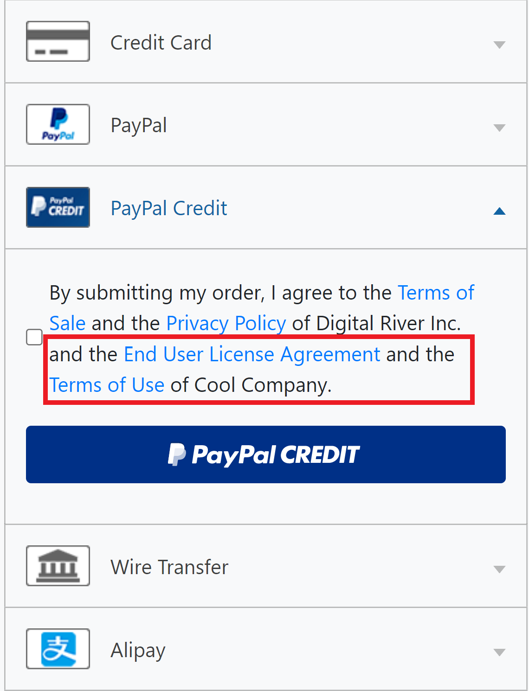
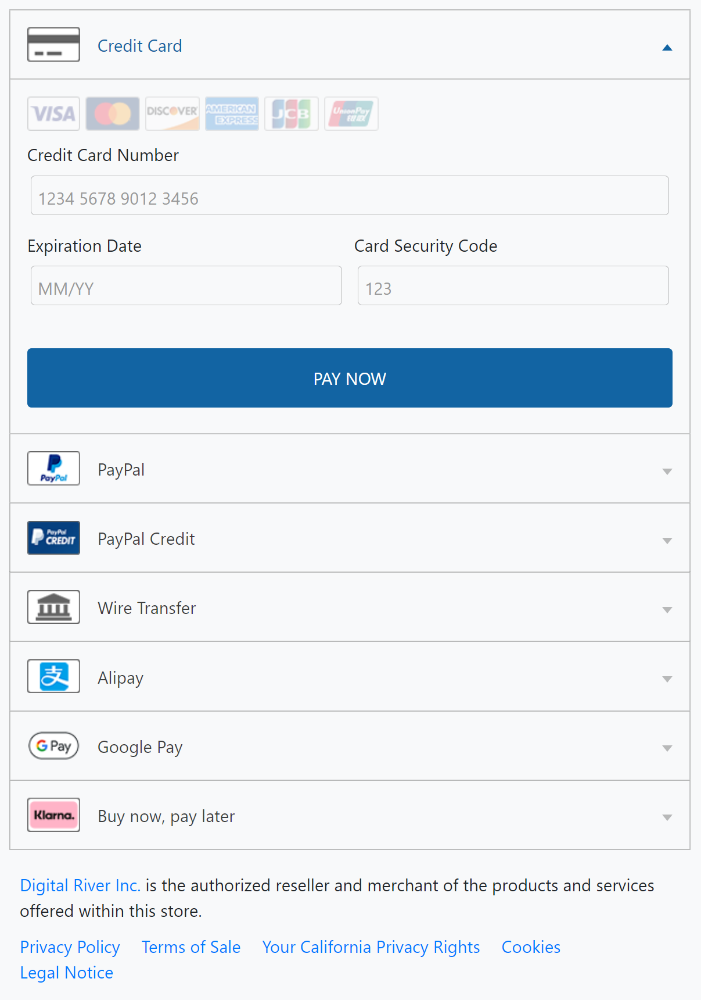

# Drop-in payments integration guide

This page explains how to [get started](drop-in-integration-guide.md#getting-started) integrating [Drop-in payments](./) into both [checkout flows](drop-in-integration-guide.md#using-drop-in-payments-within-a-checkout-flow) and [account management flows](drop-in-integration-guide.md#using-drop-in-to-collect-payment-details-on-a-my-account-page).&#x20;


We recommend using the [Drop-in payments builder](https://drapi.io/drop-in-builder/) and the [Building payment workflows page](../../../integration-options/checkouts/building-you-workflows/) to learn how to integrate [our supported payment methods](../../supported-payment-methods/) into your app or website.


## Getting started

Follow these steps to set up Drop-in payments:‌

* [Step 1: Include DigitalRiver.js](drop-in-integration-guide.md#step-1-include-digitalriver-js-on-your-page)
* [Step 2: Include the base CSS file](drop-in-integration-guide.md#step-2-include-the-hydrate-css-file)
* [Step 3: Initialize DigitalRiver.js with your public key](drop-in-integration-guide.md#step-3-initialize-digitalriver-js-with-your-public-key)
* [Step 4: Create a Drop-in payments container](drop-in-integration-guide.md#step-4-create-a-drop-in-payments-container)
* [Step 5: Create a Drop-in payments configuration object](drop-in-integration-guide.md#step-5-configure-hydrate)
* [Step 6: Use the configuration object to create an instance of Drop-in](drop-in-integration-guide.md#step-6-allow-the-shopper-to-interact-with-hydrate)
* [Step 7: Mount Drop-in payments on a checkout or account management page](drop-in-integration-guide.md#step-7-mount-drop-in-payments-on-a-checkout-or-account-management-page)
* [Step 8: Enable the payment method in Digital River Dashboard](drop-in-integration-guide.md#step-8-enable-the-payment-method-from-the-dashboard)

### Step 1: Include DigitalRiver.js <a href="#step-1-include-digitalriver-js-on-your-page" id="step-1-include-digitalriver-js-on-your-page"></a>

Include the following script on the pages where you want Drop-in payments to display (for example, on [checkout](drop-in-integration-guide.md#using-drop-in-payments-within-a-checkout-flow) or [account management](drop-in-integration-guide.md#using-drop-in-to-collect-payment-details-on-a-my-account-page) pages):

```javascript
<script type="text/javascript" src="https://js.digitalriverws.com/v1/DigitalRiver.js"></script>
```

### Step 2: Include the base CSS file <a href="#step-2-include-the-hydrate-css-file" id="step-2-include-the-hydrate-css-file"></a>

Include the following link to the Drop-in payments CSS file on the same pages. If you'd like to customize styles, override this CSS file with your own.

```javascript
 <link rel="stylesheet" href="https://js.digitalriverws.com/v1/css/DigitalRiver.css" type="text/css"/>
```

### Step 3: Initialize DigitalRiver.js with your public key <a href="#step-3-initialize-digitalriver-js-with-your-public-key" id="step-3-initialize-digitalriver-js-with-your-public-key"></a>

[Initialize the DigitalRiver.js library](../../../developer-resources/reference/digital-river-publishable-api-key.md) with your [public API key](../../../developer-resources/api-structure.md#public-keys). If you provide `locale`, then Drop-in payments is localized based on that value.

```javascript
let digitalriver = new DigitalRiver("YOUR_PUBLIC_API_KEY", {
     "locale": "en-US"
});
```

### Step 4: Create a Drop-in payments container <a href="#step-4-create-a-drop-in-payments-container" id="step-4-create-a-drop-in-payments-container"></a>

Create a container element on the page where you want Drop-in payments to appear.

```javascript
<div id="drop-in"></div>
```

### Step 5: Create a Drop-in payments configuration object <a href="#step-5-configure-hydrate" id="step-5-configure-hydrate"></a>

Create a configuration object. For details, refer to [Configuring Drop-in payments](drop-in-integration-guide.md#configuring-drop-in-payments).&#x20;

```javascript
let configuration = {
    "sessionId": "7637affb-cb4a-4d9a-815c-d4e6e393e28f",
    "options": {
        "button": {
            "type": "submitOrder"
        },
        "flow": "checkout",
        "showComplianceSection": true,
        "showSavePaymentAgreement": true,
        "showTermsOfSaleDisclosure": true,
        "usage": "unscheduled"
    }, 
    onSuccess: function(data) {}, 
    onError: function(data) {}, 
    onReady: function(data) {}, 
    onCancel: function(data) {}
}
```

### Step 6: Use the configuration object to create an instance of Drop-in payments <a href="#step-6-allow-the-shopper-to-interact-with-hydrate" id="step-6-allow-the-shopper-to-interact-with-hydrate"></a>

Create an instance of Drop-in payments by passing the [configuration object](drop-in-integration-guide.md#configuring-drop-in-payments) to [`createDropin()`](../digitalriver.js/reference/digitalriver-object.md#creating-an-instance-of-drop-in).

```javascript
let dropin = digitalriver.createDropin(configuration);
```

### Step 7: Mount Drop-in payments on the checkout or account management page <a href="#step-7-mount-drop-in-payments-on-a-checkout-or-account-management-page" id="step-7-mount-drop-in-payments-on-a-checkout-or-account-management-page"></a>

Add the following statement to the appropriate checkout or account management page:

```javascript
dropin.mount("drop-in");
```

Once invoked, `mount()` displays Drop-in payments in the [designated container](drop-in-integration-guide.md#step-4-create-a-drop-in-payments-container).&#x20;

### Step 8: Enable the payment method in Digital River Dashboard

Sign in to [Dashboard ](https://dashboard.digitalriver.com/login)and [enable payment methods](../../../administration/dashboard/settings/payment-methods/disabling-a-payment-method.md).

## Using Drop-in payments in checkouts <a href="#using-drop-in-payments-within-a-checkout-flow" id="using-drop-in-payments-within-a-checkout-flow"></a>

To use Drop-in payments in checkout flows, you'll need to (1) [finalize your checkout](drop-in-integration-guide.md#finalize-your-order-totals), (2) [configure and mount Drop-in payments](drop-in-integration-guide.md#initialize-and-place-drop-in-within-your-application), and (3) [handle the `onSuccess` event](drop-in-integration-guide.md#the-onsuccess-event-returns-the-source).&#x20;


You can also [allow customers to save their payment information in checkout flows](drop-in-integration-guide.md#optional.-allowing-the-customer-to-save-their-payment-details).


### Finalize the checkout <a href="#finalize-your-order-totals" id="finalize-your-order-totals"></a>

Prior to interacting with Drop-in payments, your integration should obtain the customer's billing information and use it to set the [checkout's](https://www.digitalriver.com/docs/digital-river-api-reference/#tag/Checkouts) `billTo`.&#x20;

For more details, refer to [Billing address requirements](../../../integration-options/checkouts/creating-checkouts/providing-address-information.md#billing-address-requirements) on the [Providing address information](../../../integration-options/checkouts/creating-checkouts/providing-address-information.md) page.&#x20;

The checkout's `totalAmount` should also be finalized. So, when applicable, make sure you've set the checkout's [`shipFrom`](../../../integration-options/checkouts/creating-checkouts/providing-address-information.md#ship-from-requirements), [`shipTo`](../../../integration-options/checkouts/creating-checkouts/providing-address-information.md#ship-to-requirements), `shippingDiscount`, [`shippingChoice`](../../../integration-options/checkouts/creating-checkouts/shipping-choice.md), [`taxIdentifiers[]`](../../../integration-options/checkouts/creating-checkouts/tax-identifiers.md) and any other data that may affect `totalAmount`.&#x20;

### Configure and mount Drop-in payments <a href="#initialize-and-place-drop-in-within-your-application" id="initialize-and-place-drop-in-within-your-application"></a>

Retrieve the checkout's [`payment.session.id`](../../../integration-options/checkouts/creating-checkouts/#payment-session-identifier) and use it to set [`sessionId`](drop-in-integration-guide.md#drop-in-options) in the [Drop-in payments' configuration object](drop-in-integration-guide.md#configuring-drop-in-payments). In that same object, you should also set:

* [`flow`](drop-in-integration-guide.md#flow) to `checkout`
* [`showComplianceSection`](drop-in-integration-guide.md#show-compliance-section) to `true`
* [`showTermsOfSaleDisclosure`](drop-in-integration-guide.md#show-terms-of-sale-disclosure) to `true`                   &#x20;

```javascript
...                     
let configuration = {
    "sessionId": "7637affb-cb4a-4d9a-815c-d4e6e393e28f",
    "options": {
        "button": {
            "type": "submitOrder"
        },
        "flow": "checkout",
        "showComplianceSection": true,
        "showTermsOfSaleDisclosure": true
    }, 
    onSuccess: function(data) {}, 
    onError: function(data) {}, 
    onReady: function(data) {}, 
    onCancel: function(data) {}
}
                                    
let dropin = digitalriverpayments.createDropin(configuration);
dropin.mount("drop-in-container");
```

Once the [create](drop-in-integration-guide.md#step-6-allow-the-shopper-to-interact-with-hydrate) and [mount](drop-in-integration-guide.md#step-7-mount-drop-in-payments-on-a-checkout-or-account-management-page) methods are invoked, Drop-in payments opens on the experience page that holds the container element. For more details on this process, refer to the [Getting started](drop-in-integration-guide.md#getting-started) section.

Customers then select how they want to pay.

<div align="left">


</div>

Depending on which payment method customers select, they may be redirected to a third-party payment authorization site. Drop-in payments handles all these redirects.&#x20;

### Handle the `onSuccess` event <a href="#the-onsuccess-event-returns-the-source" id="the-onsuccess-event-returns-the-source"></a>

If customers supply the required information, click the [configurable button](drop-in-integration-guide.md#customizing-the-text-of-the-drop-in-button), and payment is successfully authorized, you should handle [`onSuccess`](drop-in-integration-guide.md#onsuccess) by passing `source.id` to your back-end and using your [secret API key](../../../developer-resources/api-structure.md#confidential-keys) to [associate the source with the checkout](../../payment-sources/using-the-source-identifier.md#attaching-sources-to-checkouts).&#x20;

In the following example, the `data` object of `onSuccess` contains a [`source`](../../payment-sources/) whose [`state`](../../payment-sources/#source-state) is `chargeable`. Since `readyForStorage` is `false`, this source can only be used one-time (i.e., it can't generate multiple [charges](../../../order-management/orders/payment-charges/)).&#x20;

```javascript
{
    "source": {
        "clientId": "gc",
        "channelId": "paylive",
        "liveMode": false,
        "id": "ebca2f55-1667-4e30-84be-68bb1be115f8",
        "sessionId": "02a86286-4924-41fa-ae82-dbafec952cb3",
        "clientSecret": "ebca2f55-1667-4e30-84be-68bb1be115f8_e9c65c5f-6778-4351-9230-2bdfa5f6de98",
        "type": "creditCard",
        "reusable": false,
        "owner": {
            "firstName": "John",
            "lastName": "Doe",
            "email": "test224234234324@test.com",
            "phoneNumber": "952-253-1234",
            "organization": "Digital River",
            "address": {
                "line1": "10380 Bren Road W",
                "city": "Minnetonka",
                "state": "MN",
                "country": "US",
                "postalCode": "55343"
            }
        },
        "amount": "521.04",
        "currency": "USD",
        "state": "chargeable",
        "creationIp": "73.65.125.164",
        "createdTime": "2022-05-31T18:27:43.543Z",
        "updatedTime": "2022-05-31T18:27:43.543Z",
        "flow": "standard",
        "language": "en",
        "creditCard": {
            "brand": "Visa",
            "expirationMonth": 12,
            "expirationYear": 2023,
            "lastFourDigits": "1111"
        }
    },
    "readyForStorage": false,
    "supportsStorage": true
}
```

### Optional. Allowing customers to save their payment information <a href="#optional.-allowing-the-customer-to-save-their-payment-details" id="optional.-allowing-the-customer-to-save-their-payment-details"></a>

During [checkout flows](drop-in-integration-guide.md#using-drop-in-payments-within-a-checkout-flow), you can also allow customers to save their payment details for use in future transactions by enabling [`showSavePaymentAgreement`](drop-in-integration-guide.md#show-save-payment-agreement).

This feature ensures that a customer's payment details are collected in a [PSD2 and SCA-compliant](../../psd2-and-sca/) manner.&#x20;

```javascript
...                    
let configuration = {
    "sessionId": "d5437992-c2d3-4cc9-9be5-c49a9ed68bbb",
    "options": {
        "flow": "checkout",
        "showSavePaymentAgreement": true
    }
    onSuccess: function(data) {}, 
    onError: function(data) {}, 
    onReady: function(data) {}, 
    onCancel: function(data) {}
}
                                    
let dropin = digitalriverpayments.createDropin(configuration);
dropin.mount("drop-in-container");
```

When you enable this feature, each displayed [reusable payment method](../../supported-payment-methods/) is accompanied by a box that customers must check if they want that payment information saved to their account. &#x20;

<div align="left">


</div>

If customers check the box and click the [configurable button](drop-in-integration-guide.md#customizing-the-text-of-the-drop-in-button), Drop-in payments performs any required authentications and, assuming that process is successful, the `data` object of [`onSuccess`](drop-in-integration-guide.md#onsuccess) contains a [source](../../payment-sources/) that is `readyForStorage`.

In this case, handle `onSuccess` by passing `source.id` to your back-end and using your [secret API key](../../../developer-resources/api-structure.md#confidential-keys) to first [associate the source with the customer](../../payment-sources/using-the-source-identifier.md#attaching-sources-to-customers) before you [associate the source with the checkout](../../payment-sources/using-the-source-identifier.md#attaching-sources-to-checkouts).&#x20;

## Using Drop-in payments in account management settings <a href="#using-drop-in-to-collect-payment-details-on-a-my-account-page" id="using-drop-in-to-collect-payment-details-on-a-my-account-page"></a>

Outside of [checkout flows](drop-in-integration-guide.md#using-drop-in-payments-within-a-checkout-flow), you can use [Drop-in payments](./) to collect a customer's payment information and then determine whether the resulting [source](https://www.digitalriver.com/docs/digital-river-api-reference/#tag/Sources) should be saved to the [customer's record](https://www.digitalriver.com/docs/digital-river-api-reference/#tag/Customers). To do this, you'll need to:

* [Build the configuration object](drop-in-integration-guide.md#build-the-configuration-object)
* [Create and mount Drop-in payments](drop-in-integration-guide.md#initialize-and-place-drop-in-within-your-application-1)
* [Handle `onSuccess`](drop-in-integration-guide.md#handle-onsuccess)

### Build the configuration object

In the [configuration object](drop-in-integration-guide.md#configuring-drop-in-payments), set [`flow`](drop-in-integration-guide.md#flow) to `managePaymentMethods`. This informs Digital River that you're collecting payment information in an account management setting.

Because this is a `managePaymentMethods` flow, and there's no [payment session](../../../integration-options/checkouts/creating-checkouts/payment-sessions.md) to reference, you shouldn't provide a [`sessionId`](drop-in-integration-guide.md#drop-in-options). As a result, you'll need to pass the billing information you collect from customers in [`billingAddress`](drop-in-integration-guide.md#billing-address).

In `managePaymentMethods` flows, Drop-in payments automatically (a) requires customers to agree to save their payment information for use in future transactions, and (b) doesn't display compliance information. As a result, you don't need to pass [`showSavePaymentAgreement`](drop-in-integration-guide.md#show-save-payment-agreement) or [`showComplianceSection`](drop-in-integration-guide.md#show-compliance-section).


If you set `showSavePaymentAgreement` to `false` or `showComplianceSection` to `true`, then Digital River overrides the values you pass.


Additionally, if customers are replacing an active subscription's recurring billing instrument, make sure you set [`usage`](drop-in-integration-guide.md#specifying-a-sources-future-use) to `subscription` and [`showTermsofSaleDisclosure`](drop-in-integration-guide.md#show-terms-of-sale-disclosure) to `true`. This prompts Drop-in payments to display a recurring billing agreement and forces customers to accept it.&#x20;

### Create and mount Drop-in payments <a href="#initialize-and-place-drop-in-within-your-application-1" id="initialize-and-place-drop-in-within-your-application-1"></a>

Once you invoke the [create](drop-in-integration-guide.md#step-6-allow-the-shopper-to-interact-with-hydrate) and [mount](drop-in-integration-guide.md#step-7-mount-drop-in-payments-on-a-checkout-or-account-management-page) functions, Drop-in payments opens on your designated account management page. For details, refer to the [Getting started](drop-in-integration-guide.md#getting-started) section.

Customers then select the payment method to add to their account, provide their personal information, and agree to the storage terms. They may also be required to complete [SCA](../../psd2-and-sca/), a process handled by Drop-in payments.&#x20;

### Handle `onSuccess`

If Digital River successfully creates a [source](https://www.digitalriver.com/docs/digital-river-api-reference/#tag/Sources), the `data` object of [`onSuccess`](drop-in-integration-guide.md#onsuccess) contains a [source](../../payment-sources/) that is `readyForStorage`. Handle this event by sending `source.id` to your back-end and using your [secret API key](../../../developer-resources/api-structure.md#confidential-keys) to [associate the source with the customer](../../payment-sources/using-the-source-identifier.md#attaching-sources-to-customers).&#x20;

## Configuring Drop-in payments

The [`createDropIn()`](drop-in-integration-guide.md#step-6-allow-the-shopper-to-interact-with-hydrate) method requires a configuration object. You can use this object to:

* [Pass a payment session identifier](drop-in-integration-guide.md#drop-in-options)
* [Define key options](drop-in-integration-guide.md#drop-in-options-1)
* [Customize payment methods](drop-in-integration-guide.md#configuring-payment-methods-within-drop-in)
* [Configure how you handle events](drop-in-integration-guide.md#drop-in-events)
* [Send  the customer's billing address](drop-in-integration-guide.md#billing-address)

```javascript
...
let configuration = {
    "sessionId": "d5437992-c2d3-4cc9-9be5-c49a9ed68bbb",
    "options": {
        "button": {
            "type": "custom",
            "buttonText": "A fully customized button"
        },
        "flow": "checkout",
        "redirect": {
            "disableAutomaticRedirects": true,
            "returnUrl": "https://mysite.com/success",
            "cancelUrl": "https://mysite.com/cancel"
        },
        "showComplianceSection": true,
        "showSavePaymentAgreement": true,
        "showTermsOfSaleDisclosure": true,
        "usage": "unscheduled",
        "consents": {
            "companyName": "Cool Company",
            "eula": {
                "url":https: //myecommercesite.com/eula
            },
            "termsOfUse": {
                "url":https: //myecommercesite.com/termsOfUse
            }
        }
    },
    "paymentMethodConfiguration": {
        "enabledPaymentMethods": [
            "alipay",
            "bankTransfer"
        ]
    }, 
    onSuccess: function(data) {}, 
    onError: function(data) {}, 
    onReady: function(data) {}, 
    onCancel: function(data) {},
    "billingAddress": {
        "firstName": "John",
        "lastName": "Doe",
        "email": "test224234234324@test.com",
        "organization": "Digital River",
        "phoneNumber": "952-253-1234",
        "address": {
            "line1": "10380 Bren Road W",
            "city": "Minnetonka",
            "state": "MN",
            "postalCode": "55343",
            "country": "US"
        }
    }
}
...
```

### Payment session identifier <a href="#drop-in-options" id="drop-in-options"></a>

The `sessionId` references a [payment session](../../../integration-options/checkouts/creating-checkouts/payment-sessions.md).&#x20;

```javascript
...
let configuration = {
    "sessionId": "d5437992-c2d3-4cc9-9be5-c49a9ed68bbb",
    ...
}
...
```

If [`options.flow`](drop-in-integration-guide.md#flow) is `checkout`, then you should retrieve the [checkout's](https://www.digitalriver.com/docs/digital-river-api-reference/#tag/Checkouts) [`payment.session.id`](../../../integration-options/checkouts/creating-checkouts/#payment-session-identifier) and use it to set `sessionId`. DigitalRiver.js then uses that identifier to look up the payment session and retrieve the customer's billing address that you assigned to the checkout's [`billTo`](../../../integration-options/checkouts/creating-checkouts/providing-address-information.md#billing-address-requirements).&#x20;


In [checkout flows](drop-in-integration-guide.md#using-drop-in-payments-within-a-checkout-flow), Digital River recommends that, before calling [`createDropin()`](drop-in-integration-guide.md#step-6-allow-the-shopper-to-interact-with-hydrate), you pass the customer's billing information in the [checkout's](https://www.digitalriver.com/docs/digital-river-api-reference/#tag/Checkouts) `billTo`. Doing so lets you use the returned tax data to present customers with finalized tax amounts before moving into the payment collection stage.&#x20;


If you set [`options.flow`](drop-in-integration-guide.md#flow) to `managePaymentMethods`, then you don't need to pass a `sessionId`. But, as a result, you're required to send a customer's billing information in [`billingAddress`](drop-in-integration-guide.md#billing-address).

### Options <a href="#drop-in-options" id="drop-in-options"></a>

The `options` object allows you to:

* [Define a flow](drop-in-integration-guide.md#flow)
* [Enable save payment agreements](drop-in-integration-guide.md#show-save-payment-agreement)
* [Show compliance information](drop-in-integration-guide.md#show-compliance-section)
* [Define a payment's intended use](drop-in-integration-guide.md#specifying-a-sources-future-use)
* [Enable terms of sale agreements](drop-in-integration-guide.md#show-terms-of-sale-disclosure)
* [Add disclosures](drop-in-integration-guide.md#add-disclosures)
* [Disable automatic redirects](drop-in-integration-guide.md#dropinviadigitalriver.js-disablingredirectswithindropin)
* [Customize button text](drop-in-integration-guide.md#customizing-the-text-of-the-drop-in-button)
* [Expand first payment method](drop-in-integration-guide.md#expand-first-payment-method)

```javascript
...
let configuration = {
    ...
    "options": {
        "flow": "checkout",
        "showSavePaymentAgreement": true,
        "showComplianceSection": true,
        "button": {
            "type": "custom",
            "buttonText": "A fully customized button"
        },
        "usage": "unscheduled",
        "showTermsOfSaleDisclosure": true,
        "redirect": {
            "disableAutomaticRedirects": true,
            "returnUrl": "https://mysite.com/success",
            "cancelUrl": "https://mysite.com/cancel"
        },
        "consents": {
            "companyName": "Cool Company",
            "eula": {
                "url":https: //myecommercesite.com/eula
            },
            "termsOfUse": {
                "url":https: //myecommercesite.com/termsOfUse
            }
        }
    },
    ...
}
...
```

#### Flow

Use `options.flow` to specify a mode of operation.&#x20;

If you're [using Drop-in payments in a checkout flow](drop-in-integration-guide.md#using-drop-in-payments-within-a-checkout-flow), set `flow` to `checkout` (_default_).&#x20;

If you're [using Drop-in payments in an account management flow](drop-in-integration-guide.md#using-drop-in-to-collect-payment-details-on-a-my-account-page), then set `flow` to `managePaymentMethods`. This setting informs Digital River that you're collecting and saving a customer's payment information for future transactions and doing so outside of a checkout flow.&#x20;

#### Show save payment agreement

The `options.showSavePaymentAgreement` attribute determines whether customers are given the option to save a selected payment method to their account.&#x20;


You only need to set this flag when [`options.flow`](drop-in-integration-guide.md#flow) is `checkout`. If `options.flow` is `managePaymentMethods`, then the save payment agreement is automatically displayed. &#x20;


If `showSavePaymentAgreement` is `true`, and the selected [payment method supports reusability](../../supported-payment-methods/), customers are presented with a box that they must check to save the payment method. Digital River displays appropriate localized disclosure statements with this setting and handles any needed [SCA](../../psd2-and-sca/).

<div align="left">


</div>

If set to `false` (_default_), customers are not given the option to save their payment details.

#### Show compliance section

The `options.showComplianceSection` attribute determines whether Drop-in payments display compliance information.&#x20;

If `true` (_default_), then Drop-in payments display to a [selling entity](../../../integration-options/checkouts/creating-checkouts/selling-entities.md)-specific compliance section. The information in this section is localized based on how you [initialize DigitalRiver.js](drop-in-integration-guide.md#step-3-initialize-digitalriver-js-with-your-public-key). &#x20;


Making this compliance information available to customers is critical to gaining access to Digital River's merchant-of-record business model.


If `false`, then the compliance section is not displayed.&#x20;

<div align="left">


</div>

#### Customizing the text of the Drop-in button <a href="#customizing-the-text-of-the-drop-in-button" id="customizing-the-text-of-the-drop-in-button"></a>

By setting `options.button.type` to any of the following values, you can customize the text of the Drop-in payments button.&#x20;


These settings don't change the text of the Google Pay and PayPal buttons. For information on styling these buttons, refer to [Payment method configurations](drop-in-integration-guide.md#configuring-payment-methods-within-drop-in).&#x20;


The button's text is localized based on the `locale` you pass when [initializing DigitalRiver.js](drop-in-integration-guide.md#step-3-initialize-digitalriver-js-with-your-public-key).&#x20;

|         Value        |                  Output (locale of en-US)                 |
| :------------------: | :-------------------------------------------------------: |
| `continue` (default) |        |
|       `payNow`       |         |
|       `buyNow`       |         |
|    `completeOrder`   |  |
|     `submitOrder`    |    |

You also can personalize the text by setting `button.type` to `custom` and `button.buttonText` to the characters you want to display.

<div align="left">


</div>

#### Specifying a source's future use <a href="#specifying-a-sources-future-use" id="specifying-a-sources-future-use"></a>

Set `options.usage` to indicate how the [payment source](../../payment-sources/) will likely be used in future transactions. Passing this value increases the probability that payment providers will approve future authorization requests. The accepted values are `subscription`, `convenience`, and `unscheduled`.

* `subscription`: The [source](https://www.digitalriver.com/docs/digital-river-api-reference/#tag/Sources) is to be used for [recurring transactions](../../../integration-options/checkouts/subscriptions/), made at regular intervals, for a product or a service.
* `convenience`: Applies mainly to saved payment [sources](https://www.digitalriver.com/docs/digital-river-api-reference/#tag/Sources) that are used for [one-off transactions](../../../integration-options/checkouts/building-you-workflows/#one-off). These are scenarios where customers are typically present during checkout and want to access their payment information quickly. Always select this option if you don't offer subscriptions or don't have unscheduled merchant-initiated transactions.
* `unscheduled`: The [source](https://www.digitalriver.com/docs/digital-river-api-reference/#tag/Sources) is to be used in unscheduled merchant-initiated transactions. These are contracts that occur on a non-fixed schedule using saved card information. Automatic top-ups are one such example. They occur whenever a customer's balance drops below a pre-defined amount.

#### Show terms of sale disclosure

The `options.showTermsOfSaleDisclosure` attribute determines whether Drop-in payments display the terms of sale to customers.&#x20;

If set to `true` (_default_), then the terms of sale disclosure are displayed, and customers must accept them.&#x20;


The terms are localized based on how you [initialize DigitalRiver.js](drop-in-integration-guide.md#step-3-initialize-digitalriver-js-with-your-public-key).&#x20;


The terms depend on whether customers make a one-time purchase or [buy a subscription product](../../../integration-options/checkouts/subscriptions/digital-river-coordinated-subscriptions.md#acquiring-payment).&#x20;











If set to `false`, no terms of sale are displayed.&#x20;

#### Add disclosures

You can use `options.consents` to add your end-user license agreement and terms of use to Digital River's disclosures. To make this feature work, [`showTermsOfSaleDisclosure`](drop-in-integration-guide.md#show-terms-of-sale-disclosure) must be `true`.

If you pass `consents`, then `companyName` is required. You're not required to provide either `eula` or `termsOfUse`, but if you do, you must specify a `url` that links to the relevant document.

```javascript
...
let configuration = {
    ...
    "options": {
        ...
        "showTermsOfSaleDisclosure": true,
        ...
        "consents": {
            "companyName": "Cool Company",
            "eula": {
                "url": "https: //myecommercesite.com/eula"
            },
            "termsOfUse": {
                "url": "https: //myecommercesite.com/termsOfUse"
            }
        }
    },
    ...
}
...
```

Once you [create](drop-in-integration-guide.md#step-6-allow-the-shopper-to-interact-with-hydrate) and [mount](drop-in-integration-guide.md#step-7-mount-drop-in-payments-on-a-checkout-or-account-management-page) Drop-in payments, your `consents` are appended to Digital River's disclosures.

<div align="left">



</div>

#### Disabling redirects <a href="#dropinviadigitalriver.js-disablingredirectswithindropin" id="dropinviadigitalriver.js-disablingredirectswithindropin"></a>

In [`options`](drop-in-integration-guide.md#drop-in-options-1), `redirect` allows you to configure how [sources](https://www.digitalriver.com/docs/digital-river-api-reference/#tag/Sources) with a [`flow`](../../payment-sources/#authentication-flow) of `redirect` are handled.&#x20;

It's nested `disableAutomaticRedirects` boolean determines who initiates the redirect to the payment provider. \
\
If you want to handle this redirect, then set `disableAutomaticRedirects` to `true`.&#x20;

If you do, then `returnUrl` and `cancelUrl` are required and should be assigned the same value.

```javascript
"options": {
    "redirect": {
        "disableAutomaticRedirects": true,
        "returnUrl": "https://mywebsite.com/paymentCallBack.html",
        "cancelUrl": "https://mywebsite.com/paymentCallBack.html"    
    }
}
```

With this configuration, if customers select a redirect payment method, then [`onSuccess`](drop-in-integration-guide.md#onsuccess) returns a [source](https://www.digitalriver.com/docs/digital-river-api-reference/#tag/Sources) whose [`state`](../../payment-sources/#source-state) is `pending_redirect`.

At this point, you can [associate the source with the checkout](../../payment-sources/using-the-source-identifier.md#attaching-sources-to-checkouts) and allow customers to review the transaction's details. If they decide to purchase, [create the order](../../../order-management/creating-and-updating-an-order.md#creating-an-order-with-the-checkout-identifier) and then redirect them to the payment provider's portal. \
\
While there, customers approve or cancel the transfer of funds. Once they complete either of these actions, they're sent to the location you specified in `returnUrl` and `cancelUrl`. When this resource loads, call a function that triggers a server-side refresh order request and then, in the response, check the [order's](https://www.digitalriver.com/docs/digital-river-api-reference/#tag/Orders) [`state`](../../../order-management/orders/the-order-lifecycle.md#order-states-and-events) and the [payment session's](../../../integration-options/checkouts/creating-checkouts/payment-sessions.md) [`state`](../../../integration-options/checkouts/creating-checkouts/payment-sessions.md#session-state). Use these values to determine whether to (1) display the order confirmation page (i.e., the "thank you" page) or (2) recreate the [checkout](https://www.digitalriver.com/docs/digital-river-api-reference/#tag/Checkouts) and redo the payment collection stage.

For details, refer to [Handling redirect payment methods](../../../integration-options/checkouts/building-you-workflows/handling-redirect-payment-methods.md).

If you want DigitalRiver.js to handle redirecting customers to the payment provider, then set `disableAutomaticRedirects` to `false`. If you do, `returnUrl` and `cancelUrl` are optional, and we ignore any values assigned to them.&#x20;

```javascript
"options": {
    "redirect": {
        "disableAutomaticRedirects": false  
    }
}
```

With this configuration, once customers select a payment method, DigitalRiver.js creates a [source](https://www.digitalriver.com/docs/digital-river-api-reference/#tag/Sources), checks its [`flow`](../../payment-sources/#authentication-flow), and then, if it's `redirect`, immediately sends customers to the payment provider's portal. If customers approve the transfer of funds and the provider authorizes payment, then [`onSuccess`](drop-in-integration-guide.md#onsuccess) returns a [source](../../payment-sources/) whose [`state`](../../payment-sources/#source-state) is `chargeable`. &#x20;

#### Expand first payment method

When Drop-in payments loads `options.expandFirstPaymentMethod` determines whether the first payment method in the accordion control element is expanded or collapsed.



If `expandFirstPaymentMethod` is `true`(_default_) then the first displayed payment method is expanded.





If `expandFirstPaymentMethod` is `false`, then the first displayed payment method is collapsed.

.png>)



### Payment method configurations <a href="#configuring-payment-methods-within-drop-in" id="configuring-payment-methods-within-drop-in"></a>

The [configuration object's](drop-in-integration-guide.md#configuring-drop-in-payments) `paymentMethodConfiguration` allows you to customize payment methods.&#x20;

```javascript
...
const configuration = {
    ...
    paymentMethodConfiguration: {
        style: {
            base: {
                color: "#495057",
                height: "35px",
                fontSize: "1rem",
                fontFamily: "apple-system,BlinkMacSystemFont,Segoe UI,Roboto,Helvetica Neue,Arial,sans-serif",
                ":hover": {
                    color: "#137bee",
                },
                "::placeholder": {
                    color: "#999"
                },
                ":-webkit-autofill": {
                    color: "purple"
                },
                ":focus": {
                    color: "blue"
                }
            },
            invalid: {
                color: "#dc3545",
                ":-webkit-autofill": {
                    color: "#dc3545"
                }
            },
            complete: {
                color: "#28a745",
                ":hover": {
                    color: "#28a745",
                },
                ":-webkit-autofill": {
                    color: "#28a745"
                }
            },
            empty: {
                color: "#000000"
            },

        },
        creditCard: {
            cardNumberPlaceholderText: "Credit Card Number",
            cardExpirationPlaceholderText: "MM/YY",
            cardCvvPlaceholderText: "CVV",
            style: styles,
            mask: true
        },
        onlineBanking: {
            style: styles,
            placeholderText: "Select a Bank",
        },
        googlePay: {
            style: {
                buttonType: "plain",
                buttonColor: "dark",
                buttonLanguage: "en"
            }
        },
        applePay: {
            style: {
                buttonType: "plain",
                buttonColor: "dark",
                buttonLanguage: "en"
            }
        },
        payPal: {
            style: {
                label: "checkout",
                size: "responsive",
                color: "gold",
                shape: "pill",
                layout: "horizontal",
                fundingicons: "false",
                tagline: "false"
            },
        },
        msts: { 
            enrollmentUrl: "https://acmeUS.b2b.credit/en-US/apply?client_reference_id=Acme-123456&ecommerce_url=www.acme-returnURL.com", 
        },
        enabledPaymentMethods: ['msts', 'creditCard'],
        disabledPaymentMethods: ['klarna']         
    },
    ...
};

digitalriver.createDropin(configuration).mount("dropin");
```

#### Style

Drop-in payments use [elements](../../../developer-resources/reference/elements/) to capture secure payment details. These elements have a predefined style, but you can also customize their look and feel by defining a `style`  object.

For details, refer to [Styling an element container](../../../developer-resources/reference/elements/#styling-an-element-container).

#### Credit card

The `creditCard` object allows you to configure how credit cards are displayed.&#x20;

* `cardNumberPlaceholderText`: The placeholder that appears in the card number field. If you specify a value, then localization is not applied.
* `cardExpirationPlaceholderText`: The placeholder that appears in the card expiration date field. If you specify a value, then localization is not applied.
* `cardCvvPlacholderText`: The placeholder that appears in the card security code field. If you specify a value, then localization is not applied.
* `style:` For details, refer to [Styling an element container](../../../developer-resources/reference/elements/#styling-an-element-container).
* `mask`: Indicates whether data entered in the card number and security code fields is automatically masked after successful validation.

#### Online banking

The `onlineBanking` object allows you to configure how the online banking payment method is displayed.&#x20;

* `style:` For details, refer to [Styling an element container](../../../developer-resources/reference/elements/#styling-an-element-container).
* `placeholderText`: The placeholder that appears in the online banking selector.&#x20;

#### Google Pay

For details on `googlePay.style`, refer to [Google Pay element styles and customization](../../../developer-resources/reference/elements/google-pay-elements.md#google-pay-element-styles-and-customization).

#### Apple Pay

For details on `applePay.style`, refer to [Apple Pay styles and customization](../../../developer-resources/reference/elements/apple-pay-elements.md#apple-pay-element-styles-and-customization).

#### PayPal <a href="#pay-pal" id="pay-pal"></a>

For details on `payPal.style`, refer to [PayPal element style options](../../../developer-resources/reference/elements/paypal-elements.md#paypal-element-style-options).

#### MSTS

Use `msts.enrollmentUrl` to add a link to the [TreviPay enrollment URL](../digitalriver.js/payment-methods/trevipay.md#trevipay-enrollment-form).

#### Enable and disable payment methods <a href="#filtering-payment-methods-shown-in-drop-in" id="filtering-payment-methods-shown-in-drop-in"></a>

Use `enabledPaymentMethods` and `disabledPaymentMethods` to enable and disable specific payment methods. If you don't enumerate either of these lists, then Drop-in payments display all transaction-applicable payment methods by default. If `enabledPaymentMethods` contains a payment method that's not transaction-applicable, it's not displayed.

### Drop-in payment events <a href="#drop-in-events" id="drop-in-events"></a>

The [Drop-in payments' configuration object](drop-in-integration-guide.md#configuring-drop-in-payments) supports the following events:

* [**onSuccess**](drop-in-integration-guide.md#onsuccess)**:** Occurs when a [source](../../payment-sources/) is successfully created
* [**onError**](drop-in-integration-guide.md#onerror)**:** Occurs when there's a validation error
* [**onCancel**](drop-in-integration-guide.md#oncancel)**:** Occurs when a payment method is cancelled
* [**onReady**](drop-in-integration-guide.md#onready)**:** Occurs when Drop-in payments is ready to accept input

These events provide real-time updates on the status of payment methods.

```javascript
...
let configuration = {
    ... 
    onSuccess: function(data) {}, 
    onError: function(data) {}, 
    onReady: function(data) {}, 
    onCancel: function(data) {}    
    ...
}
...
```

#### `onSuccess` <a href="#onsuccess" id="onsuccess"></a>

If Digital River creates a [source](../../payment-sources/), you receive the `onSuccess` event.

The event's `data` contains the [source](../../payment-sources/).&#x20;

It also contains `readyForStorage`  and `supportsStorage` booleans.&#x20;

If `readyForStorage` is `true` then (1) customers approved saving the source to their account and (2) Digital River has performed any required [SCA](../../psd2-and-sca/).&#x20;


A `readyForStorage` value of `true` doesn't indicate that customers can reuse that same [source](https://www.digitalriver.com/docs/digital-river-api-reference/#tag/Sources) in future transactions. To accomplish that, you must [associate the source with the customer](../../payment-sources/using-the-source-identifier.md#attaching-sources-to-customers). This request flips the source's [`reusable`](../../payment-sources/#reusable-or-single-use) value to `true`.


The `supportsStorage` value indicates whether the [source supports reusability](../../payment-sources/#reusable-or-single-use).&#x20;

If you set [`showTermsOfSaleDisclosure`](drop-in-integration-guide.md#show-terms-of-sale-disclosure) to `true`, then `data` also contains `consents`. Its `termsOfSale` boolean references Digital River's terms of sale and its `eula` and `termsOfUse` booleans indicate whether [`consents`](drop-in-integration-guide.md#add-disclosures) in the [configuration object](drop-in-integration-guide.md#configuring-drop-in-payments) contains a `eula.url` and/or `termsOfUse.url`.

When these variables are `true`, it signifies customers were presented with that specific disclosure and actively accepted it.&#x20;

```javascript
{
    "source": {
        "clientId": "gc",
        "channelId": "paylive",
        "liveMode": false,
        "id": "ab1fce40-e8a3-4b62-86a1-8a524111c4e7",
        "sessionId": "c09e1774-4f6d-47da-8617-ba42a87dd5e8",
        "clientSecret": "ab1fce40-e8a3-4b62-86a1-8a524111c4e7_9b6021c7-c813-4314-b8ee-a1180f4ee80a",
        "type": "creditCard",
        "reusable": false,
        "owner": {
            "firstName": "Fred",
            "lastName": "Flintstone",
            "email": "test@digitalriver.com",
            "phoneNumber": "000-000-0000",
            "address": {
                "line1": "10380 Bren Road West",
                "line2": "Ichikawa-shi",
                "city": "Minnetonka",
                "state": "MN",
                "country": "US",
                "postalCode": "55346"
            }
        },
        "amount": "371.04",
        "currency": "USD",
        "state": "chargeable",
        "creationIp": "209.87.180.27",
        "createdTime": "2022-07-08T10:09:30.503Z",
        "updatedTime": "2022-07-08T10:09:30.503Z",
        "flow": "standard",
        "language": "en",
        "creditCard": {
            "brand": "Visa",
            "expirationMonth": 12,
            "expirationYear": 2023,
            "lastFourDigits": "1111"
        }
    },
    "readyForStorage": false,
    "supportsStorage": true,
    "consents": {
        "eula": false,
        "termsOfUse": false,
        "termsOfSale": true
    }
}
```

For details on how to handle this event, refer to:

* [Handle `onSuccess`](drop-in-integration-guide.md#the-onsuccess-event-returns-the-source) in the [Using Drop-in payments in checkouts](drop-in-integration-guide.md#using-drop-in-payments-within-a-checkout-flow) section
* [Handle `onSuccess`](drop-in-integration-guide.md#undefined) in the [Using Drop-in payments in an account management portal](drop-in-integration-guide.md#using-drop-in-to-collect-payment-details-on-a-my-account-page) section

#### `onError` <a href="#onerror" id="onerror"></a>

If an error occurs, you receive the `onError` event. The event's `data` object identifies the `paymentMethod` associated with the error. Handle this error by instructing customers to provide a new method of payment.

```javascript
{
    "paymentMethod":"googlePay"
}
```

#### `onCancel` <a href="#oncancel" id="oncancel"></a>

You receive the `onCancel` event when customers cancel the payment process (e.g., during the redirect phase) before authorizing payment. The event's  `data` object identifies which `paymentMethod` was cancelled.&#x20;

```javascript
{
    "paymentMethod": "googlePay"
}
```

#### `onReady` <a href="#onready" id="onready"></a>

When Drop-in payments is ready to accept input, you receive the `onReady` event. The event's `data` object contains an array that lists all `paymentMethodTypes` presented to the customer.

```javascript
{
     "paymentMethodTypes": [
          "applePay",
          "creditCard",
          "directDebit",
          "googlePay",
          "wireTransfer"
      ]
}
```

### Billing address

You can use `billingAddress` to pass a customer's billing information. For details on when to use this object, refer to [Payment session identifier](drop-in-integration-guide.md#drop-in-options) in the [Configuring Drop-in payments](drop-in-integration-guide.md#configuring-drop-in-payments) section.&#x20;

```javascript
...
let configuration = {
    ...
    "billingAddress": {
        "firstName": "John",
        "lastName": "Doe",
        "email": "test224234234324@test.com",
        "organization": "Digital River",
        "phoneNumber": "952-253-1234",
        "address": {
            "line1": "10380 Bren Road W",
            "city": "Minnetonka",
            "state": "MN",
            "postalCode": "55343",
            "country": "US"
        }
    }
}
...
```

<table><thead><tr><th width="390.901383022317">Field</th><th width="150">Required or Optional</th><th>Description</th></tr></thead><tbody><tr><td><code>billingAddress</code></td><td>Required</td><td>The customer's billing address.</td></tr><tr><td><code>billingAddress.firstName</code></td><td>Required</td><td>The customer's first name.</td></tr><tr><td><code>billingAddress.lastName</code></td><td>Required</td><td>The customer's last name.</td></tr><tr><td><code>billingAddress.email</code></td><td>Required</td><td>The customer's email address.</td></tr><tr><td><code>billingAddress.organization</code></td><td>Optional</td><td>The business customer's organization.</td></tr><tr><td><code>billingAddress.phoneNumber</code></td><td>Required</td><td>The customer's phone number.</td></tr><tr><td><code>billingAddress.address.line1</code></td><td>Required</td><td>The first line of the address.</td></tr><tr><td><code>billingAddress.address.line2</code></td><td>Optional</td><td>The second line of the address</td></tr><tr><td><code>billingAddress.address.city</code></td><td>Optional</td><td>City or town.</td></tr><tr><td><code>billingAddress.address.state</code></td><td>Optional</td><td>The state, county, province, or region.</td></tr><tr><td><code>billingAddress.address.postalCode</code></td><td>Required</td><td>ZIP or postal code.</td></tr><tr><td><code>billingAddress.address.country</code></td><td>Required</td><td>A two-letter Alpha-2 country code as described in the <a href="https://www.iso.org/iso-3166-country-codes.html">ISO 3166</a> international standard.</td></tr><tr><td><code>billingAddress.address.additional AddressInfo</code></td><td>Optional</td><td>Additional address information that may be useful or required for some addresses.</td></tr></tbody></table>
