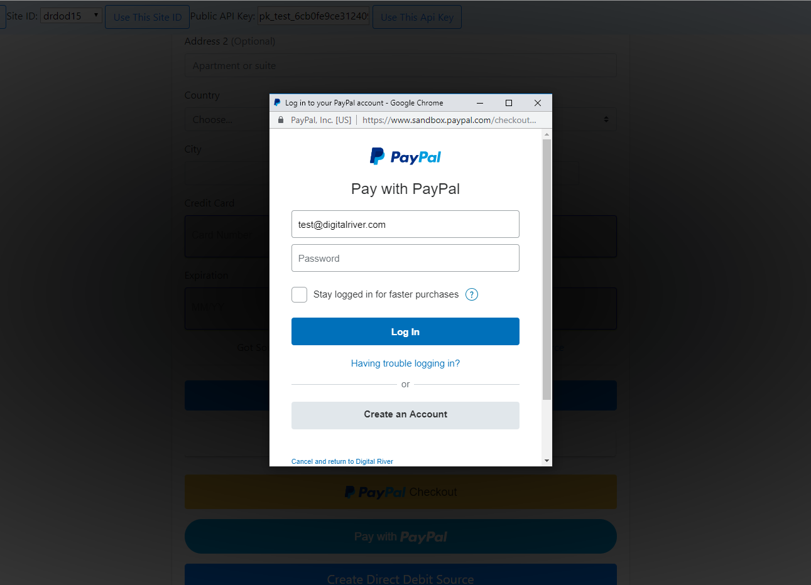

# Configuring PayPal

PayPal offers the following payment methods: [PayPal Express Checkout](paypal.md#paypal), [PayPal Billing Agreement](paypal.md#paypal-billing-agreement), [PayPal Pay in 3](paypal.md#paypal-pay-in-3), [PayPal Pay in 4](paypal.md#paypal-pay-in-4), [PayPal RatenZahlung](paypal.md#paypal-ratenzahlung), and [PayPal Credit](paypal.md#paypal-credit).

## PayPal Express Checkout (Digital Wallet)

PayPal is a payment service that facilitates payments between parties through online funds transfers. PayPal allows customers to establish an account on its website, which is connected to a user's credit card or checking account.

You can find an example of integration [here](https://drh.img.digitalriver.com/DRHM/Storefront/Site/drdod15/pb/multimedia/paypal.html).


Use the [PayPay Billing Agreement](paypal.md#paypal-billing-agreement) for subscriptions. That includes any instance where the cart contains both subscription and non-subscription products.


If you're using[ DigitalRiver.js with Elements](../), you can create an [PayPal](../../../supported-payment-methods/paypal.md) payment method for your app or website in four easy steps:

* [Step 1: Build the PayPal objects](paypal.md#step-1-build-the-paypal-objects)
* [Step 2: Create a PayPal source using DigitalRiver.js](paypal.md#step-2-create-a-paypal-source-using-digitalriver-js)
* [Step 3: Authorize a PayPay source](paypal.md#step-3-authorize-a-paypal-source)
* [Step 4: Use the authorized source](paypal.md#step-4-use-the-authorized-source)

### Step 1: Build the PayPal objects

Build the PayPal objects.&#x20;

#### PayPal source request object

A PayPal Source Request object requires the following fields.

| Field       | Value                                                                                                                  |
| ----------- | ---------------------------------------------------------------------------------------------------------------------- |
| `type`      | `payPal`                                                                                                               |
| `sessionId` | The payment session identifier.                                                                                        |
| `payPal`    | A [PayPal Source Details object](paypal.md#paypal-source-details-object) that includes the details of the transaction. |


```javascript
{
	"returnUrl": "http://mypage.com",
	"cancelUrl": "https://mypage.com/cancel",
}
```


| Field       | Required/Optional | Description                                                                                                                                       |
| ----------- | ----------------- | ------------------------------------------------------------------------------------------------------------------------------------------------- |
| `returnUrl` | Required          | If you choose to utilize the full redirect flow, this is where you will redirect your customer to after authorizing within the PayPal experience. |
| `cancelUrl` | Required          | If you choose to utilize the full redirect flow, this is where you will redirect your customer to after canceling within the PayPal experience.   |

### Step 2: Create a PayPal source using DigitalRiver.js

Use the DigitalRiver.js library to create and mount elements to the HTML container.




```javascript
var data = {
    "type": "payPal",
    "sessionId": "ea03bf6f-84ef-4993-b1e7-b7d5ecf71d1f",
    "payPal": {
        "returnUrl": "http://mypage.com",
        "cancelUrl": "https://mypage.com/cancel"
    }
}
  
digitalriver.createSource(data).then(function(result) {
    if (result.error) {
        //handle errors
    } else {
        var source = result.source;
        //send source to back end
        sendToBackend(source);
    }
});
```




#### PayPal source response example


The `address` object must contain postal code and state/province data that **** [adheres to a standardized format](../../../../cart/creating-or-updating-a-cart/providing-address-information.md) using the `state` attribute. Note that the `state` attribute listed below corresponds to the `countrySubdivision` attribute used when providing address information. The payment session manages the correct field name on the backend.





```javascript
{
    "clientId": "gc",
    "channelId": "drdod15",
    "liveMode": false,
    "id": "d6a44e5d-1373-4013-847d-10deb4ded4df",
    "sessionId": "ea03bf6f-84ef-4993-b1e7-b7d5ecf71d1f",    
    "clientSecret": "d6a44e5d-1373-4013-847d-10deb4ded4df_ddd44e5d-1373-4013-847d-10deb4ded4df",
    "type": "payPal",
    "reusable": false,
    "amount": "10.00",
    "currency": "USD",
    "state": "pending_redirect",
    "creationIp": "209.87.178.4",
    "createdTime": "2019-05-22T00:00:46.975Z",
    "updatedTime": "2019-05-22T00:00:46.975Z",
    "flow": "redirect",
    "redirect": {
        "redirectUrl": "https://api.digitalriver.com:443/payments/redirects/b8f2207b-8236-4608-b5a2-812790d42ed8?apiKey=pk_test_6cb0fe9ce3124093a9ad906f6c589e2ds",
        "returnUrl": "https://example.com?action=paymentSuccess",
        "cancelUrl": "https://example.com?action=paymentFailure"
    },
    "payPal": {
        "shipping": {
            "recipient": "John Doe",
            "phoneNumber": "555-555-1212",
            "address": {
                "line1": "54321 Fake St.",
                "line2": "Apt. 3C",
                "city": "Minnetonka",
                "state": "MN",
                "country": "US",
                "postalCode": "55341"
            }
        },
        "token": "EC-1HD67063RG318840B"
    }
}    "clientSecret": "d6a44e5d-1373-4013-847d-10deb4ded4df_ddd44e5d-1373-4013-847d-10deb4ded4df",
    "type": "payPal",
    "reusable": false,
    "amount": "10.00",
    "currency": "USD",
    "state": "pending",
    "creationIp": "209.87.178.4",
    "createdTime": "2019-05-22T00:00:46.975Z",
    "updatedTime": "2019-05-22T00:00:46.975Z",
    "flow": "redirect",
    "redirect": {
        "redirectUrl": "https://api.digitalriver.com:443/payments/redirects/b8f2207b-8236-4608-b5a2-812790d42ed8?apiKey=pk_test_6cb0fe9ce3124093a9ad906f6c589e2ds",
        "returnUrl": "https://example.com?action=paymentSuccess",
        "cancelUrl": "https://example.com?action=paymentFailure"
    },
    "payPal": {
        "shipping": {
            "recipient": "John Doe",
            "phoneNumber": "555-555-1212",
            "address": {
                "line1": "10380 Bren Road W",
              	"line2": "",
                "city": "Minnetonka",
                "state": "MN",
                "country": "US",
                "postalCode": "55343"
            }
        },
        "token": "EC-1HD67063RG318840B"
    }
}
```




### Step 3: Authorize a PayPal source

When you create a PayPal source, the customer is required to authorize the charge at PayPal. You can accomplish this by either redirecting the customer to PayPal or using the PayPal SDK to authorize the charge as part of your experience.

#### Redirecting the customer to PayPal for authorization

To redirect your customer to PayPal for authorization, use the `redirectUrl` parameter in your createSource response.


```javascript
window.location.href = sourceResponse.redirect.redirectUrl;
```


At PayPal, the customer can authorize or cancel the transaction when presented with the transaction details. If the authorization is successful, the customer will be redirected to the PayPal Return URL parameter you specified when you created the source. If the customer cancels, they will be returned to the PayPal Cancel URL parameter you specified.

#### Using the PayPal SDK to authorize payment

Use the PayPal Checkout SDK to streamline the authorizing PayPal transactions. This will allow you to control things like the appearance of the PayPal button and embed the entire experience into your workflow.

* The PayPal SDK guide is located here: [https://developer.paypal.com/docs/archive/checkout/](https://developer.paypal.com/docs/archive/checkout/)
* More details on how you can customize the PayPal button are located here: [https://developer.paypal.com/docs/archive/checkout/how-to/customize-button/#](https://developer.paypal.com/docs/archive/checkout/how-to/customize-button/)

**Example:**

1. Include the PayPal Checkout SDK on your page and specify a location where the button will appear.
2. &#x20;Use the PayPal SDK to customize and place the PayPal button on your page. The PayPal SDK returns two functions, `onAuthorize` and `onCancel`. If the payment was authorized, use the source you created earlier by [attaching it to an order or cart](../../../sources/#attaching-a-payment-method-to-an-order-or-cart).




```markup
<script src="https://www.paypalobjects.com/api/checkout.js"></script>
<div id="paypal-button"></div>
```







```javascript
var paypalSourceData = {
    "type": "payPal",
    "sessionId": "ea03bf6f-84ef-4993-b1e7-b7d5ecf71d1f",
    "payPal": {
        "returnUrl": redirectUrl,
        "cancelUrl": cancelUrl,
    }
};
 
paypal.Button.render({
    // Configure environment
    env: 'sandbox',
    // Customize button (optional)
    locale: 'en_US',
    style: {
        label: 'checkout',
        size: 'responsive',
        color: 'gold',
        shape: 'rect',
        layout: 'horizontal',
        fundingicons: 'false',
        tagline: 'false'
    },
    // Set up a payment
    payment: function(data, actions) {
        return digitalriver.createSource(paypalSourceData).then(function(result) {
            if (result.error) {
                //handle the errors that were returned
                handleErrors(result.error)
            } else {
                return result.source.payPal.token;
            }
        });
    },
    // Execute the payment
    onAuthorize: function(data, actions) {
        //the payment has been authorized, use the source and attach it to your customer's account.
        doSomething();
    },
    onCancel: function(data) {
        //the payment has been cancelled, do something to try and get the shopper back on track
        doSomethingElse();
    }
}, '#paypal-button');
```






### Step 4: Use the authorized source

Once authorized, you can use the source by [attaching it to a cart](../../../sources/#attaching-a-payment-method-to-an-order-or-cart).




```javascript
{
  "paymentMethod": {
    "sourceId": "e7ba0595-059c-460c-bad8-2812123b9313"
  }
}
```




### PayPal Billing Agreement

The PayPal Billing Agreement allows consumers to use their PayPal account to make recurring payments when they purchase a subscription product by clicking the PayPal button. Consumers have the option to choose to auto-renew or manually renew.

Currency supported: All currencies available in supported countries.

You can find an example of the integration [here](https://drh.img.digitalriver.com/DRHM/Storefront/Site/drdod15/pb/multimedia/paypalbilling.html).

Create a PayPal Billing Agreement payment method for your app or website in four easy steps:

* [Step 1: Build a PayPal Billing Agreement source request object](paypal.md#step-1-build-a-paypal-billing-agreement-source-request-object)
* [Step 2: Create a PayPal Billing Agreement source using DigitalRiver.js](paypal.md#step-2-create-a-paypal-billing-agreement-source-using-digitalriver-js)
* [Step 3: Authorize a PayPal Billing Agreement source](paypal.md#step-3-authorize-a-paypal-billing-agreement-source)
* [Step 4: Use the authorized source](paypal.md#step-4-use-the-authorized-source-1)

#### Step 1: Build a PayPal Billing Agreement source request object

Build the PayPal Billing Agreement Source Request object. A PayPal Billing Agreement Source Request object requires the following fields.

| Field           | Value                                                                                                                  |
| --------------- | ---------------------------------------------------------------------------------------------------------------------- |
| `type`          | `payPalBilling`                                                                                                        |
| `sessionId`     | The payment session identifier.                                                                                        |
| `payPalBilling` | A [PayPal Source Details object](paypal.md#paypal-source-details-object) that includes the details of the transaction. |

#### Step 2: Create a PayPal Billing Agreement source using DigitalRiver.js

Use the DigitalRiver.js library to create and mount elements to the HTML container.




```javascript
var data = {
    "type": "payPalBilling",
    "sessionId": "ea03bf6f-84ef-4993-b1e7-b7d5ecf71d1f",
    "payPal": {
        "returnUrl": "http://mypage.com",
        "cancelUrl": "https://mypage.com/cancel"
    }
}
  
digitalriver.createSource(data).then(function(result) {
    if (result.error) {
        //handle errors
    } else {
        var source = result.source;
        //send source to back end
        sendToBackend(source);
    }
});
```




#### PayPal Billing source example


The `address` object must contain postal code and state/province data that **** [adheres to a standardized format](../../../../cart/creating-or-updating-a-cart/providing-address-information.md) using the `state` attribute. Note that the `state` attribute listed below corresponds to the `countrySubdivision` attribute used when providing address information. The payment session manages the correct field name on the backend.





```javascript
{
    "clientId": "gc",
    "channelId": "drdod15",
    "liveMode": false,
    "id": "d6a44e5d-1373-4013-847d-10deb4ded4df",
    "sessionId": "ea03bf6f-84ef-4993-b1e7-b7d5ecf71d1f",    
    "clientSecret": "d6a44e5d-1373-4013-847d-10deb4ded4df_accd4e5d-1373-4013-847d-10deb4ded4df",
    "type": "payPalBilling",
    "reusable": false,
    "amount": "10.00",
    "currency": "USD",
    "state": "pending",
    "creationIp": "209.87.178.4",
    "createdTime": "2019-05-22T00:00:46.975Z",
    "updatedTime": "2019-05-22T00:00:46.975Z",
    "flow": "redirect",
    "redirect": {
        "redirectUrl": "https://api.digitalriver.com:443/payments/redirects/b8f2207b-8236-4608-b5a2-812790d42ed8?apiKey=pk_test_6cb0fe9ce3124093a9ad906f6c589e2ds",
        "returnUrl": "https://example.com?action=paymentSuccess",
        "cancelUrl": "https://example.com?action=paymentFailure"
    },
    "payPalBilling": {
        "shipping": {
            "recipient": "John Doe",
            "phoneNumber": "555-555-1212",
            "address": {
                "line1": "10380 Bren Road W",
                "line2": "",
                "city": "Minnetonka",
                "state": "MN",
                "country": "US",
                "postalCode": "55343"
            }
        },
        "token": "EC-1HD67063RG318840B"
    }
}
```




#### Step 3: Authorize a PayPal Billing Agreement source

When you create a PayPal Billing Agreement source, the customer is required to authorize the charge through PayPal. You can accomplish this by either redirecting the customer to PayPal or using the PayPal SDK to authorize the charge as part of your experience.

#### Redirecting the customer to PayPal for authorization

To redirect your customer to PayPal for authorization, use the `redirectUrl` parameter in your `createSource` response.




```markup
window.location.href = sourceResponse.redirect.redirectUrl;
```




PayPal will present the customer with the transaction details where they can authorize, or cancel the transaction. A successful authorization redirects the customer to the PayPal Return URL parameter you specified when you created the source. If the customer cancels, they will return to the PayPal Cancel URL parameter you specified when you created the source.

#### Using the PayPal SDK to authorize payment

Use the PayPal Checkout SDK to streamline the authorizing PayPal transactions. This will allow you to control things like the appearance of the PayPal button and embed the entire experience into your workflow.

* The PayPal SDK guide is located here: [https://developer.paypal.com/docs/archive/checkout/](https://developer.paypal.com/docs/archive/checkout/)
* More details on how you can customize the PayPal button are located here: [https://developer.paypal.com/docs/archive/checkout/how-to/customize-button/#](https://developer.paypal.com/docs/archive/checkout/how-to/customize-button/)

**Example:**

1. Include the PayPal Checkout SDK on your page and specify a location where the button will appear.
2. Use the PayPal SDK to customize and place the PayPal button on your page. The PayPal SDK returns two functions, `onAuthorize` and `onCancel`. If the payment was authorized, use the source you created earlier by attaching it to a shopper or customer.




```javascript
var paypalSourceData = {
    "type": "payPalBilling",
    "sessionId": "ea03bf6f-84ef-4993-b1e7-b7d5ecf71d1f",
    "payPalBilling": {
        "returnUrl": redirectUrl,
        "cancelUrl": cancelUrl,
    }
};
 
paypal.Button.render({
    // Configure environment
    env: 'sandbox',
    // Customize button (optional)
    locale: 'en_US',
    style: {
        label: 'checkout',
        size: 'responsive',
        color: 'gold',
        shape: 'rect',
        layout: 'horizontal',
        fundingicons: 'false',
        tagline: 'false'
    },
    // Set up a payment
    payment: function(data, actions) {
        return digitalriver.createSource(paypalSourceData).then(function(result) {
            if (result.error) {
                //handle the errors that were returned
                handleErrors(result.error)
            } else {
                return result.source.payPal.token;
            }
        });
    },
    // Execute the payment
    onAuthorize: function(data, actions) {
        //the payment has been authorized, use the source and attach it to your customer's account.
        doSomething();
    },
    onCancel: function(data) {
        //the payment has been cancelled, do something to try and get the shopper back on track
        doSomethingElse();
    }
}, '#paypal-button');
```





#### Step 4: Use the authorized source

Once authorized, you can use the source by [attaching it to a cart](../../../sources/#attaching-a-payment-method-to-an-order-or-cart) or [attaching it to a shopper](../../../sources/#attaching-a-payment-method-to-a-customer).

#### **Option 1. Attach the source to a cart**




```javascript
{
  "paymentMethod": {
    "sourceId": "e7ba0595-059c-460c-bad8-2812123b9313"
  }
}
```




#### **Option 2. Attach the source to a shopper**




```javascript
{
  "paymentOption": {
    "nickName": "My Token",
    "isDefault": "true",
    "sourceId": "61033d62-c0f4-4a7e-b844-07daf26ba84e"
  }
}
```




### PayPal Pay Later

#### PayPal Pay in 3


**Additional setup optional**: If you are interested in promoting Pay in 3, contact your Customer Success Representative. The Representative will provide the set-up instructions for Pay in 3 banners. Click [here ](https://developer.paypal.com/docs/business/pay-later/us/integrate/)to access the upstream promotional banners.


PayPal Pay in 3 is a short-term card installment payment option automatically provided by PayPal Express Checkout Wallet when a customer signs in to PayPal Checkout. Presents within the PayPal wallet on a category known as "Pay Later". Note that PayPal Pay in 3 does not support recurring subscriptions. No additional setup is required to present this payment method in the PayPal Express Checkout Wallet. If the shopper's purchase history along with the items in checkout qualify, PayPal Pay in 3 will be available as a payment method.

PayPal Pay in 3 allows shoppers to pay for physical good purchases as follows:

* **United Kingdom**: three interest-free monthly payments for purchases between £45 - £2,000 with the first payment due at checkout.


When a customer selects this payment method, a "soft hit" will appear in their credit report.


#### PayPal Pay in 4


**Additional setup optional**: If you are interested in promoting Pay in 4, contact your Customer Success Representative. The Representative will provide the set-up instructions for Pay in 4 banners. Click [here ](https://developer.paypal.com/docs/business/pay-later/us/integrate/)to access the upstream promotional banners.


PayPal Pay in 4 is a short-term card installment payment option automatically provided by PayPal Express Checkout Wallet. Presents within the PayPal wallet on a category known as "Pay Later". Note that PayPal Pay in 4 does not support recurring subscriptions. No additional setup is required to present this payment method in the PayPal Express Checkout Wallet. If the shopper's purchase history along with the items in checkout qualify, PayPal Pay in 3 will be available as a payment method.

PayPal Pay in 4 allows shoppers to pay for physical good purchases as follows:

* **France**: four interest-free monthly payments for purchases between €30 to €2,000 with the first payment due at checkout.
* **United States**: four interest-free biweekly payments for purchases between $30 to $600 with the first payment due at checkout.&#x20;
* **Australia**: four interest-free biweekly payments for purchases between AUD $50 to $1,500 with the first payment due at checkout.


When a customer selects this payment method, a "soft hit" will appear in their credit report.


#### PayPal RatenZahlung

PayPal RatenZahlung is a pay later option available through PayPal Express Checkout Wallet. Presents within the PayPal wallet on a category known as "Pay Later". Note that PayPal RatenZahlung does not support recurring subscriptions. No additional setup is required to present this payment method in the PayPal Express Checkout Wallet. If the shopper's purchase history along with the items in the checkout qualify, PayPal RatenZahlung will be available as a payment method. \
\
PayPal RatenZahlung allows shoppers to pay for physical good purchases as follows:

* **Germany**: shopper selects three, six, twelve, or twenty-four monthly payments with an interest rate of 9.99% for purchases between €99 to €5,000 with the first payment due at checkout

#### PayPal Credit


**Additional Setup Required**: If you are interested in using PayPal Credit, contact your Account Manager. The Account Manager will send setup instructions for PayPal Credit banners after you sign the client addendum.


PayPal Credit allows consumers to buy online and pay later for their products. This payment method is accepted in thousands of online stores and is available everywhere PayPal is accepted (as long as the PayPal Credit and PayPal accounts are linked). PayPal Credit uses the date of birth and last 4 digits of SSN to approve or deny a consumer for a line of credit, and the applicant will be notified within seconds whether they have been approved or not.

Create a PayPal payment method for your app or website in four easy steps:

* [Step 1: Build a PayPal Credit source request object](paypal.md#step-1-build-a-credit-source-request-object)
* [Step 2: Create a PayPal Credit source using DigitalRiver.js](paypal.md#step-3-authorize-a-paypal-credit-source)
* [Step 3: Authorize a PayPal Credit source](paypal.md#step-3-authorize-a-paypal-credit-source)
* [Step 4: Use the authorized source](paypal.md#step-4-use-the-authorized-source-2)

**Step 1: Build a Credit source request object**

Build a Credit Source Request object. A PayPal Billing Credit Source Request object requires the following fields.

| Field          | Value                                                                                                                   |
| -------------- | ----------------------------------------------------------------------------------------------------------------------- |
| `type`         | `payPalCredit`                                                                                                          |
| `sessionId`    | The payment session identifier.                                                                                         |
| `payPalCredit` |  A [PayPal Source Details object](paypal.md#paypal-source-details-object) that includes the details of the transaction. |

**Step 2: Create a PayPal Credit source using DigitalRiver.js**

Use the DigitalRiver.js library to create and mount elements to the HTML container.




```javascript
var data = {
    "type": "payPalCredit",
    "sessionId": "ea03bf6f-84ef-4993-b1e7-b7d5ecf71d1f",
    "payPal": {
        "returnUrl": "http://mypage.com",
        "cancelUrl": "https://mypage.com/cancel"
    }
}
  
digitalriver.createSource(data).then(function(result) {
    if (result.error) {
        //handle errors
    } else {
        var source = result.source;
        //send source to back end
        sendToBackend(source);
    }
});
```




#### PayPal Credit source response example


The `address` object must contain postal code and state/province data that **** [adheres to a standardized format](../../../../cart/creating-or-updating-a-cart/providing-address-information.md) using the `state` attribute. Note that the `state` attribute listed below corresponds to the `countrySubdivision` attribute used when providing address information. The payment session manages the correct field name on the backend.





```javascript
{
    "clientId": "gc",
    "channelId": "drdod15",
    "liveMode": false,
    "id": "d6a44e5d-1373-4013-847d-10deb4ded4df",
    "sessionId": "ea03bf6f-84ef-4993-b1e7-b7d5ecf71d1f",    
    "clientSecret": "d6a44e5d-1373-4013-847d-10deb4ded4df_ssdd4e5d-1373-4013-847d-10deb4ded4df",
    "type": "payPal",
    "reusable": false,
    "amount": "120.99",
    "currency": "USD",
    "state": "pending_redirect",
    "creationIp": "209.87.178.4",
    "createdTime": "2019-05-22T00:00:46.975Z",
    "updatedTime": "2019-05-22T00:00:46.975Z",
    "flow": "redirect",
    "redirect": {
        "redirectUrl": "https://api.digitalriver.com:443/payments/redirects/b8f2207b-8236-4608-b5a2-812790d42ed8?apiKey=pk_test_6cb0fe9ce3124093a9ad906f6c589e2ds",
        "returnUrl": "https://example.com?action=paymentSuccess",
        "cancelUrl": "https://example.com?action=paymentFailure"
    },
    "payPalCredit": {
        "shipping": {
            "recipient": "John Doe",
            "phoneNumber": "555-555-1212",
            "address": {
                "line1": "54321 Fake St.",
                "line2": "Apt. 3C",
                "city": "Minnetonka",
                "state": "MN",
                "country": "US",
                "postalCode": "55341"
            }
        },
        "token": "EC-1HD67063RG318840B"
    }
}
```




**Step 3: Authorize a PayPal Credit source**

When you create a PayPal Credit Source, the customer is required to authorize the charge at PayPal. You can accomplish this by either redirecting the customer to PayPal or use the PayPal SDK to authorize the charge as part of your experience.

#### Redirecting the customer to PayPal for authorization

To redirect your customer to PayPal for authorization, use the `redirectUrl` parameter in your `createSource` response.




```javascript
window.location.href = sourceResponse.redirect.redirectUrl;
```




PayPal will present the customer with the transaction details where they can authorize or cancel the transaction. A successful authorization redirects the customer to the PayPal Return URL parameter you specified when you created the source. If the customer cancels, they will return to the PayPal Cancel URL parameter you specified when you created the source.

#### Using the PayPal SDK to authorize payment

Use the PayPal Checkout SDK to streamline the authorizing PayPal transactions. This will allow you to control things like the appearance of the PayPal button and embed the entire experience into your workflow.

* The PayPal SDK guide is located here: [https://developer.paypal.com/docs/archive/checkout/](https://developer.paypal.com/docs/archive/checkout/)
* For more details on how you can customize the PayPal button, go to [https://developer.paypal.com/docs/archive/checkout/how-to/customize-button/#](https://developer.paypal.com/docs/archive/checkout/how-to/customize-button/)

**Example:**

1.  Include the PayPal Checkout SDK on your page and specify a location where the button will appear.

    <pre class="language-markup" data-overflow="wrap"><code class="lang-markup"><strong>&#x3C;script src="https://www.paypalobjects.com/api/checkout.js">&#x3C;/script>
    </strong>&#x3C;div id="paypal-button">&#x3C;/div></code></pre>
2.  &#x20;Use the PayPal SDK to customize and place the PayPal button on your page. The PayPal SDK returns two functions, `onAuthorize` and `onCancel`. If the payment was authorized, use the source you created earlier by [attaching it to an order or cart](broken-reference).

    
    ```javascript
    var paypalSourceData = {
        "type": "payPal",
        "sessionId": "ea03bf6f-84ef-4993-b1e7-b7d5ecf71d1f",
        "payPal": {
            "returnUrl": redirectUrl,
            "cancelUrl": cancelUrl
        }
    };
     
    paypal.Button.render({
        // Configure environment
        env: 'sandbox',
        // Customize button (optional)
        locale: 'en_US',
        style: {
            label: 'credit',
            size: 'responsive',
            color: 'blue',
            shape: 'rect',
            layout: 'horizontal',
            fundingicons: 'false',
            tagline: 'false'
        },
        // Set up a payment
        payment: function(data, actions) {
            return digitalriver.createSource(paypalSourceData).then(function(result) {
                if (result.error) {
                    //handle the errors that were returned
                    handleErrors(result.error)
                } else {
                    return result.source.payPalCredit.token;
                }
            });
        },
        // Execute the payment
        onAuthorize: function(data, actions) {
            //the payment has been authorized, use the source and attach it to your customer's account.
            doSomething();
        },
        onCancel: function(data) {
            //the payment has been cancelled, do something to try and get the shopper back on track
            doSomethingElse();
        }
    }, '#paypal-button');
    ```
    
3.  Include the PayPal Checkout SDK on your page and specify a location where the button will appear.

    
    ```markup
    <script src="https://www.paypalobjects.com/api/checkout.js"></script>
    <div id="paypal-button"></div>
    ```
    
4.  &#x20;Use the PayPal SDK to customize and place the PayPal button on your page. The PayPal SDK returns two functions, `onAuthorize` and `onCancel`. If the payment was authorized, use the source you created earlier by [attaching it to an order or cart](../../../sources/#attaching-a-payment-method-to-an-order-or-cart).

    
    ```javascript
    z   var paypalSourceData = {
           "type": "payPal",
           "amount": 10,
           "currency": "USD",
           }
       };

       paypal.Button.render({
           // Configure environment
           env: 'sandbox',
           // Customize button (optional)
           locale: 'en_US',
           style: {
               label: 'credit',
               size: 'responsive',
               color: 'blue',
               shape: 'rect',
               layout: 'horizontal',
               fundingicons: 'false',
               tagline: 'false'
           },
           // Set up a payment
           payment: function(data, actions) {
               return digitalriver.createSource(paypalSourceData).then(function(result) {
                   if (result.error) {
                       //handle the errors that were returned
                       handleErrors(result.error)
                   } else {
                       return result.source.payPalCredit.token;
                   }
               });
           },
           // Execute the payment
           onAuthorize: function(data, actions) {
               //the payment has been authorized, use the source and attach it to your customer's account.
               doSomething();
           },
           onCancel: function(data) {
               //the payment has been cancelled, do something to try and get the shopper back on track
               doSomethingElse();
           }
       }, '#paypal-button');
     
    paypal.Button.render({
        // Configure environment
        env: 'sandbox',
        // Customize button (optional)
        locale: 'en_US',
        style: {
            label: 'credit',
            size: 'responsive',
            color: 'blue',
            shape: 'rect',
            layout: 'horizontal',
            fundingicons: 'false',
            tagline: 'false'
        },
        // Set up a payment
        payment: function(data, actions) {
            return digitalriver.createSource(paypalSourceData).then(function(result) {
                if (result.error) {
                    //handle the errors that were returned
                    handleErrors(result.error)
                } else {
                    return result.source.payPalCredit.token;
                }
            });
        },
        // Execute the payment
        onAuthorize: function(data, actions) {
            //the payment has been authorized, use the source and attach it to your customer's account.
            doSomething();
        },
        onCancel: function(data) {
            //the payment has been cancelled, do something to try and get the shopper back on track
            doSomethingElse();
        }
    }, '#paypal-button');
    ```
    

**Step 4: Use the Authorized source**

Once authorized, you can use the source by [attaching it to a cart](../../../sources/#attaching-a-payment-method-to-an-order-or-cart).

#### Attach the source to a cart




```javascript
{
  "paymentMethod": {
    "sourceId": "e7ba0595-059c-460c-bad8-2812123b9313"
  }
}
```



