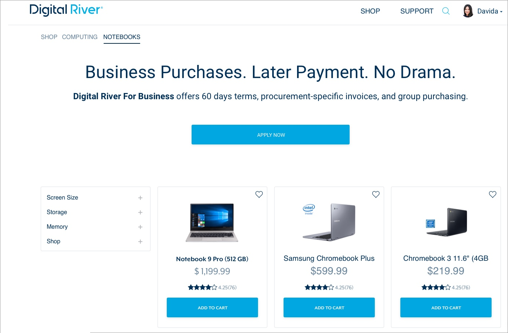
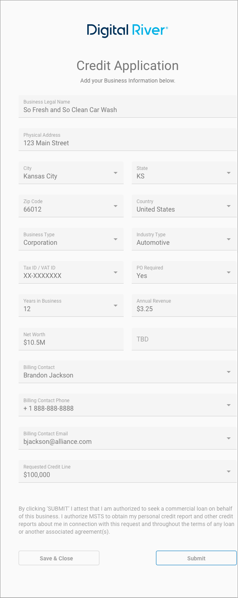
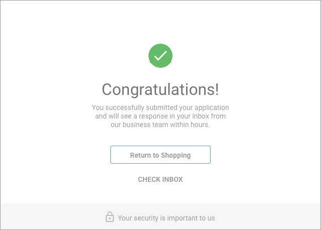
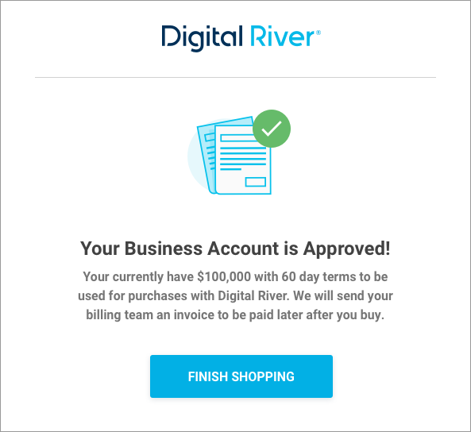

# TreviPay

Digital River offers the TreviPay payment method from Multi Service Technology Solutions, Inc.

TreviPay enables Merchants to extend a line of credit for business buyers at checkout. This is a white-labeled solution facilitating online B2B payments by offering flexible net terms, digital statement handling, collections, credit approval management, and improving the overall B2B online buying experience. Digital River supports the following features: create user, payment capabilities, dispute and chargeback, subscription, reporting, API support, fraud, Drop-in, term code service support, and tax.

TreviPay assesses creditworthiness, absorbs non-payment risk, including the localized dunning process (collections) if required, and provides online Merchant and Buyer statement management tools. TreviPay supports the following features: application processing, account administration, account self-service, thresholds, commerce experience, alerts, and dunning (collections).

TreviPay processes online ecommerce orders for the following product types: physical, digital, and recurring. TreviPay does not support phone-in orders.

## Benefits

Offering net terms online for business buyers streamlines the legacy accounts receivable and payable processes, alleviates cash flow constraints for buyers, and leads to increased buyer loyalty and higher average order values. With this payment method, Merchants remove their credit risk, offload collection responsibilities, and get paid upfront while their buyers pay over time.

## How it works

Buyers select the TreviPay option at checkout, then they either log in to the Merchant's profile to complete their purchase or apply for their line of credit. Upon approval, the buyer can complete their transaction, manage purchases, statements, and vendor forms through the buyer portal.

### Promote the TreviPay credit solution

You can set up your storefront to promote the TreviPay credit solution.



### TreviPay enrollment form

You can add a link to the enrollment form on your home page, product page, and checkout page. You can also add a link to the enrollment form from your customer relationship manager (CRM).

When a customer clicks the **Apply Now** button. The information they provide on the Enrollment Application page creates the Admin user.


The information provided on the Billing Contact page creates the Payer user.


When the customer completes the fields and clicks **Next**, the Credit Application appears.



When the client completes and submits the Credit Application, they will see a Congratulations message stating they successfully submitted their application.



### Phone call

TreviPay will call the customer up to three times to gather information such as the customer's phone number so TreviPay can set up two-factor authentication (2FA) for the customer's account.&#x20;

### Email notification

The customer will later receive two emails. The first email will state the application has been submitted. The second email will state either the application for their account has been approved or declined. The validated customer can complete the purchase using two-factor authentication (2FA).


TreviPay does not require the customer to sign in to the client portal, but they do recommend it.




### TreviPay enrollment URL

Digital River will provide the TreviPay enrollment form URL and redirect URL. You can include the enrollment form link on your homepage, product page, checkout page, or via your customer relationship management (CRM). The format for the enrollment form URL is:\
`https://<progamName>.b2b.credit/<locale>/apply?client_reference_id=<business-UUID>`

**Example:** `https://acmeUS.b2b.credit/en-US/apply?client_reference_id=Acme-123456`

| Attribute             | Description                                                                                                                                                                                                                                                                                                                                                                                                                          |
| --------------------- | ------------------------------------------------------------------------------------------------------------------------------------------------------------------------------------------------------------------------------------------------------------------------------------------------------------------------------------------------------------------------------------------------------------------------------------ |
| `<programName>`       | The name of the program. TreviPay URLs are static and mapped to the specific program.                                                                                                                                                                                                                                                                                                                                                |
| `client_reference_id` | <p>The identifier used to identify the business. This is a string without the restriction of character types and can be up to 50 characters in length. Each ecosystem (Commerce API) will be responsible for sending TreviPay a unique <code>client_reference_ID</code> for a shopper enrollment.</p><p>The value for the string is the business's universally unique identifier (UUID) (for example: <code>Acme-123456</code>).</p> |
| `<locale>`            | A designator that combines the two-letter [ISO 639-1](https://en.wikipedia.org/wiki/ISO\_639-1) language code with the [ISO 3166-1 alpha-2](https://en.wikipedia.org/wiki/ISO\_3166-1\_alpha-2) country code (for example, `en-US`).                                                                                                                                                                                                 |

#### Including the ecommerce URL in the enrollment URL

Include an `ecommerce_url` in the enrollment form URL when redirecting the customer to the TreviPay enrollment form. The format for the enrollment form with a redirect is:

`https://<white-label>.b2b.credit/<locale>/apply?client_reference_id=<business-UUID>&ecommerce_url=<www.returnURL.com>`

#### **Example**:&#x20;

`https://acmeUS.b2b.credit/<locale>/apply?client_reference_id=Acme-123456&ecommerce_url=www.acme-returnURL.com`

| Attribute       | Description                                                             |
| --------------- | ----------------------------------------------------------------------- |
| `ecommerce_url` | The redirect URL to your website (for example, www.acme-returnURL.com). |

You must include a `client_reference_id` with the return URL when redirecting to the TreviPay enrollment form.

## Configuring TreviPay for DigitalRiver.js

Create a TreviPay payment method for your app or website in four easy steps:

* [Step 1: Build the TreviPay object](trevipay.md#step-1-build-the-trevipay-object)
* [Step 2: Create a TreviPay agreement source using DigitalRiver.js](trevipay.md#step-2-create-a-trevipay-agreement-source-using-digitalriver-js)
* [Step 3: Authorize a TreviPay source](trevipay.md#step-3-authorize-a-trevipay-source)
* [Step 4: Use the authorized source](trevipay.md#step-4-use-the-authorized-source)


After you configureTreviPay for DigitalRiver.js, you must [add the organization identifier (client\_reference\_id) to the cart](../../../../cart/adding-required-information-for-specific-payment-methods.md#adding-an-organization-identifier-to-a-cart) to make the TreviPay payment method available to the shopper.


### Step 1:  Build the TreviPay object

A TreviPay source request object requires the following fields.

| Field       | Value                                                                                                                        |
| ----------- | ---------------------------------------------------------------------------------------------------------------------------- |
| `type`      | `msts`                                                                                                                       |
| `sessionId` | The payment session identifier.                                                                                              |
| `msts`      | A [TreviPay source details object](trevipay.md#trevipay-source-details-object) that includes the details of the transaction. |

#### TreviPay source details object

The TreviPay source details object requires the following fields.

```javascript
{
	"returnUrl": "https://mypage.com",
	"cancelUrl": "https://mypage.com/cancel",
}
```

| Field       | Required/Optional | Description                                                                                                                                                                                 |
| ----------- | ----------------- | ------------------------------------------------------------------------------------------------------------------------------------------------------------------------------------------- |
| `returnUrl` | Required          | If you choose to use the full redirect flow, this is where you will redirect your customer to after authorizing within the TreviPay experience. Note that the `returnUrl` must use `https`. |
| `cancelUrl` | Required          | If you choose to utilize the full redirect flow, this is where you will redirect your customer to after canceling within the TreviPay experience.                                           |

### Step 2:  Create a TreviPay agreement source using DigitalRiver.js

Use the DigitalRiver.js library to create and mount elements to the HTML container.



```javascript
var data = {
    "type": "msts",
    "sessionId": "ea03bf6f-84ef-4993-b1e7-b7d5ecf71d1f",
    "msts": {
        "returnUrl": "http://mypage.com",
        "cancelUrl": "https://mypage.com/cancel"
    }
}
  
digitalriver.createSource(data).then(function(result) {
    if (result.error) {
        //handle errors
    } else {
        var source = result.source;
        //send source to back end
        sendToBackend(source);
    }
});
```



#### TreviPay source response example



```javascript
{
    "clientId": "gc",
    "channelId": "drdod15",
    "liveMode": false,
    "id": "d6a44e5d-1373-4013-847d-10deb4ded4df",
    "sessionId": "ea03bf6f-84ef-4993-b1e7-b7d5ecf71d1f",    
    "clientSecret": "d6a44e5d-1373-4013-847d-10deb4ded4df_ddd44e5d-1373-4013-847d-10deb4ded4df",
    "type": "msts",
    "reusable": false,
    "amount": "10.00",
    "currency": "USD",
    "state": "pending_redirect",
    "creationIp": "209.87.178.4",
    "createdTime": "2019-05-22T00:00:46.975Z",
    "updatedTime": "2019-05-22T00:00:46.975Z",
    "flow": "redirect",
    "redirect": {
        "redirectUrl": "https://api.digitalriver.com:443/payments/redirects/b8f2207b-8236-4608-b5a2-812790d42ed8?apiKey=pk_test_6cb0fe9ce3124093a9ad906f6c589e2ds",
        "returnUrl": "https://example.com?action=paymentSuccess",
        "cancelUrl": "https://example.com?action=paymentFailure"
    },
    "msts": {
        "shipping": {
            "recipient": "John Doe",
            "phoneNumber": "555-555-1212",
            "address": {
                "line1": "54321 Fake St.",
                "line2": "Apt. 3C",
                "city": "Minnetonka",
                "state": "MN",
                "country": "US",
                "postalCode": "55341"
            }
        },
        "token": "EC-1HD67063RG318840B"
    }
}    
```



### Step 3: Authorize a TreviPay source

When you create a TreviPay source, the customer is required to authorize the charge at TreviPay. You can accomplish this by redirecting the customer to TreviPay to authorize the charge as part of your experience.

#### Redirecting the customer to TreviPay for authorization <a href="#redirecting-the-customer-to-paypal-for-authorization" id="redirecting-the-customer-to-paypal-for-authorization"></a>

To redirect your customer to TreviPay for authorization, use the `redirectUrl` parameter in your createSource response.

```
window.location.href = sourceResponse.redirect.redirectUrl;
```

At TreviPay, the customer can authorize or cancel the transaction when presented with the transaction details. If the authorization is successful, the customer will be redirected to the TreviPay Return URL parameter you specified when you created the source. If the customer cancels, they will be returned to the TreviPay Cancel URL parameter you specified.​

### Step 4: Use the authorized source

Once authorized, you can use the source by [attaching it to a cart](../../../sources/#attaching-a-payment-method-to-an-order-or-cart).



```javascript
{
  "paymentMethod": {
    "sourceId": "e7ba0595-059c-460c-bad8-2812123b9313"
  }
}
```



## Support matrix

| Basics                  | Customer                                                                   | Redirect              |
| ----------------------- | -------------------------------------------------------------------------- | --------------------- |
|                         | Payment Type                                                               | Buy Now Pay Later B2B |
| Requirements            | Addendum                                                                   | Yes                   |
| Supported Product Types | Physical / Digital                                                         | Both                  |
|                         | Captures Funds when Physical Product Shipped or Digital Product Downloaded | Yes                   |
|                         | Chargeback                                                                 | Yes                   |
|                         | Standard / Premium                                                         | Premium               |
|                         | Multiple / Partial                                                         | Yes                   |
|                         | Recurring Payments                                                         | Yes                   |

## Supported markets

For information on supported markets and currencies for Drop-in and DigitalRiver.js, go to:&#x20;

* **Payment Method Guide:** [digitalriver.com/payment-method-guide](https://www.digitalriver.com/payment-method-guide/)
* **Country Guide:** [digitalriver.com/country-guide/](https://www.digitalriver.com/country-guide/)
