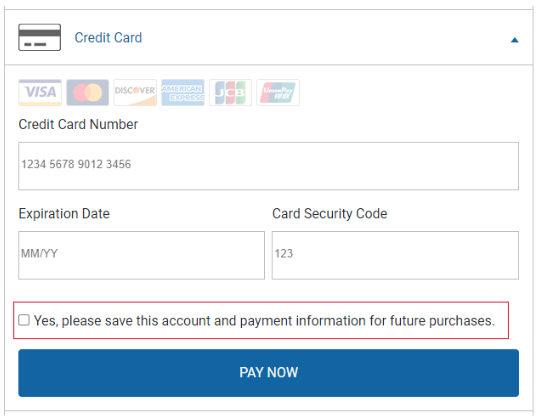
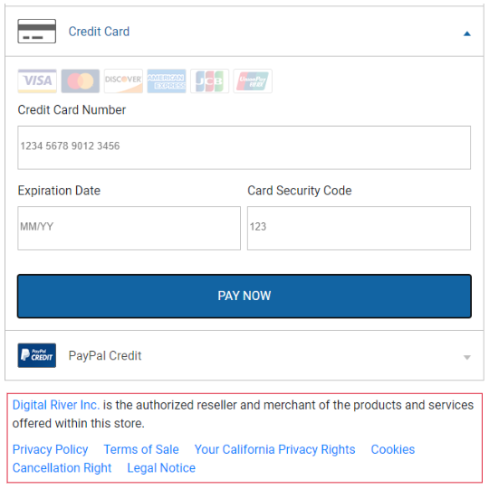
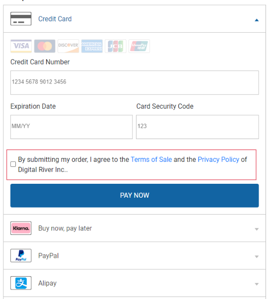
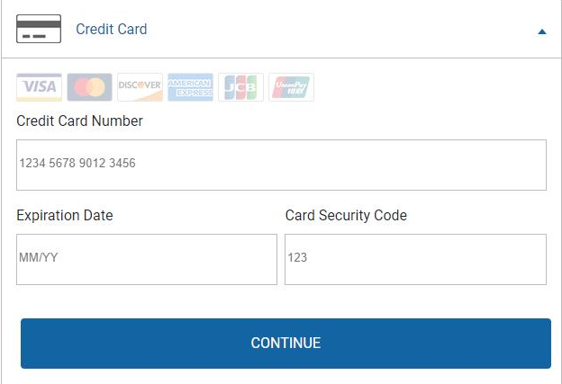
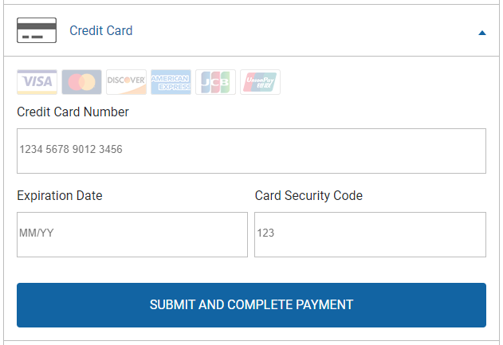
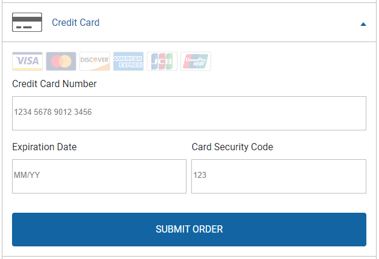
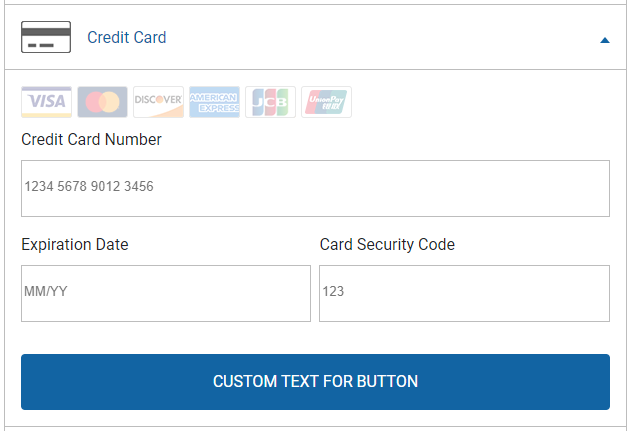

# Drop-in Payments integration guide

This page explains how to [get started](drop-in-integration-guide.md#getting-started) integrating [Drop-in payments](./) into both [cart flows](drop-in-integration-guide.md#using-drop-in-payments-within-your-cart-flow) and [account management flows](drop-in-integration-guide.md#using-drop-in-payments-to-collect-payment-details-on-a-my-account-page).&#x20;

## Getting started

You can set up Drop-in Payments in seven steps:‌

* [Step 1: Include DigitalRiver.js](drop-in-integration-guide.md#step-1-include-digitalriver-js-on-your-page)
* [Step 2: Include the base CSS file](drop-in-integration-guide.md#step-2-include-the-hydrate-css-file)
* [Step 3: Initialize DigitalRiver.js with your public key](drop-in-integration-guide.md#step-3-initialize-digitalriver-js-with-your-public-key)
* [Step 4: Create Drop-in Payments container](drop-in-integration-guide.md#step-3-initialize-digitalriver-js-with-your-public-key)
* [Step 5: Create a Drop-in Payments configuration object](drop-in-integration-guide.md#step-5-configure-hydrate)
* [Step 6: Use the Configuration object to create an instance of Drop-in Payments](drop-in-integration-guide.md#step-6-allow-the-shopper-to-interact-with-hydrate)
* [Step 7: Mount Drop-in Payments on a checkouts or account management page](drop-in-integration-guide.md#step-7-place-drop-in-payments-on-your-cart-or-shopper-page)

### Step 1: Include DigitalRiver.js <a href="#step-1-include-digitalriver-js-on-your-page" id="step-1-include-digitalriver-js-on-your-page"></a>

Include the following script on the pages where you want Drop-in payments to appear (for example, the cart or My Account page):&#x20;


```javascript
<script type="text/javascript" src="https://js.digitalriverws.com/v1/DigitalRiver.js"></script>
```


### Step 2: Include the base CSS file <a href="#step-2-include-the-hydrate-css-file" id="step-2-include-the-hydrate-css-file"></a>

On the same pages, include the following link to the Drop-in Payments CSS file. If you'd like to customize the styles, simply override the CSS file with your own.


```javascript
 <link rel="stylesheet" href="https://js.digitalriverws.com/v1/css/DigitalRiver.css" type="text/css"/>
```


### Step 3: Initialize DigitalRiver.js with your public key <a href="#step-3-initialize-digitalriver-js-with-your-public-key" id="step-3-initialize-digitalriver-js-with-your-public-key"></a>

[Initialize the DigitalRiver.js library](../../../general-resources/reference/digital-river-publishable-api-key.md) with your [public API key](../../../resources/API-structure.md#public-keys). If you provide a `locale`, Drop-in Payments is localized based on that value.


```javascript
let digitalriver = new DigitalRiver("YOUR_PUBLIC_API_KEY", {
     "locale": "en-US"
});
```


### Step 4: Create a Drop-in Payments container

Create a container element on the page where you want the Drop-in Payments to appear.


```javascript
<div id="drop-in"></div>
```


### Step 5: Create a Drop-in Payments configuration object <a href="#step-5-configure-hydrate" id="step-5-configure-hydrate"></a>

Create a `configuration` object. For details, refer to [Configuring Drop-in payments](drop-in-integration-guide.md#configuring-drop-in-payments).


```javascript
let configuration = {
    sessionId: "YOUR_SESSION_IDENTIFIER",
    billingAddress: {
        firstName: "John",
        lastName: "Doe",
        email: "test@digitalriver.com",
        organization: "Digital River",       
        phoneNumber: "000-000-0000",
        address: {
            line1: "10380 Bren Road W",
            line2: "",
            city: "Minnetonka",
            state: "MN",
            postalCode: "55343",
            country: "US"
        }
    },
    onSuccess: function (data) { },
    onCancel: function(data) { },
    onError: function (data) { },
    onReady: function(data) { }
}
```


| Field                                                     | Required                                                                                                                | Description                                                                                                                                                                                                                                                                                                                                                                                                                                                                                                                                                                                         |
| --------------------------------------------------------- | ----------------------------------------------------------------------------------------------------------------------- | --------------------------------------------------------------------------------------------------------------------------------------------------------------------------------------------------------------------------------------------------------------------------------------------------------------------------------------------------------------------------------------------------------------------------------------------------------------------------------------------------------------------------------------------------------------------------------------------------- |
| `sessionId`                                               | <p>Required for the <code>checkout</code> flow</p><p></p><p>Optional for the <code>managePaymentMethods</code> flow</p> | <p>The  <a href="../../../cart/payment-sessions.md">payment session</a> identifier returned by Digital River. <br></p><p><strong>Important</strong>: The <code>sessionId</code> is required if you are using Drop-in Payments within a <a href="drop-in-integration-guide.md#initialize-and-place-drop-in-within-your-application">cart flow</a>. If you are using Drop-in Paymentsn to capture payment details on a <a href="drop-in-integration-guide.md#using-drop-in-to-collect-payment-details-on-a-my-account-page">customer portal</a>, then the <code>sessionId</code> is not required.</p> |
| `options`                                                 | Optional                                                                                                                | [Drop-in Payments configuration options](drop-in-integration-guide.md#drop-in-payments-options).                                                                                                                                                                                                                                                                                                                                                                                                                                                                                                    |
| `billingAddress`                                          | Required                                                                                                                | The customer's billing address.                                                                                                                                                                                                                                                                                                                                                                                                                                                                                                                                                                     |
| `billingAddress.firstName`                                | Required                                                                                                                | The customer's first name.                                                                                                                                                                                                                                                                                                                                                                                                                                                                                                                                                                          |
| `billingAddress.lastName`                                 | Required                                                                                                                | The customer's last name.                                                                                                                                                                                                                                                                                                                                                                                                                                                                                                                                                                           |
| `billingAddress.email`                                    | Required                                                                                                                | The customer's email address.                                                                                                                                                                                                                                                                                                                                                                                                                                                                                                                                                                       |
| `billingAddress.organization`                             | Optional                                                                                                                | The business customer's organization.                                                                                                                                                                                                                                                                                                                                                                                                                                                                                                                                                               |
| `billingAddress.phoneNumber`                              | Required                                                                                                                | The customer's phone number.                                                                                                                                                                                                                                                                                                                                                                                                                                                                                                                                                                        |
| `billingAddress.address.line1`                            | Required                                                                                                                | The first line of the address.                                                                                                                                                                                                                                                                                                                                                                                                                                                                                                                                                                      |
| `billingAddress.address.line2`                            | Optional                                                                                                                | The second line of the address                                                                                                                                                                                                                                                                                                                                                                                                                                                                                                                                                                      |
| `billingAddress.address.city`                             | Optional                                                                                                                | City or town.                                                                                                                                                                                                                                                                                                                                                                                                                                                                                                                                                                                       |
| `billingAddress.address.state`                            | Optional                                                                                                                | The state, county, province, or region.                                                                                                                                                                                                                                                                                                                                                                                                                                                                                                                                                             |
| `billingAddress.address.postalCode`                       | Required                                                                                                                | ZIP or postal code.                                                                                                                                                                                                                                                                                                                                                                                                                                                                                                                                                                                 |
| `billingAddress.address.country`                          | Required                                                                                                                | A two-letter Alpha-2 country code as described in the [ISO 3166](https://www.iso.org/iso-3166-country-codes.html) international standard.                                                                                                                                                                                                                                                                                                                                                                                                                                                           |
| `billingAddress.address.additional AddressInfo`           | Optional                                                                                                                | Additional address information that may be useful or required for some addresses.                                                                                                                                                                                                                                                                                                                                                                                                                                                                                                                   |
| `paymentMethodConfiguration`                              | Optional                                                                                                                | Additional configuration details.                                                                                                                                                                                                                                                                                                                                                                                                                                                                                                                                                                   |
| ``[`onSuccess`](drop-in-integration-guide.md#onsuccess)`` | ​Content                                                                                                                | The function called when the shopper has authorized payment and a payment source has been successfully created. Returns a `Source` object.                                                                                                                                                                                                                                                                                                                                                                                                                                                          |
| ``[`onCancel`](drop-in-integration-guide.md#oncancel)``   | ​Content                                                                                                                | The function called when the shopper cancels the payment process before authorizing payment.                                                                                                                                                                                                                                                                                                                                                                                                                                                                                                        |
| ``[`onError`](drop-in-integration-guide.md#onerror)``     | ​Content                                                                                                                | The function called when an error has occurred.                                                                                                                                                                                                                                                                                                                                                                                                                                                                                                                                                     |
| ``[`onReady`](drop-in-integration-guide.md#onready)``     | ​Content                                                                                                                | The function called when Drop-in Payments is ready for user interaction.                                                                                                                                                                                                                                                                                                                                                                                                                                                                                                                            |

### Step 6: Use the configuration object to create an instance of Drop-in Payments <a href="#step-6-allow-the-shopper-to-interact-with-hydrate" id="step-6-allow-the-shopper-to-interact-with-hydrate"></a>

&#x20;Create an instance of Drop-in Payments by passing the [configuration object](drop-in-integration-guide.md#step-5-configure-hydrate) to `createDropin()`.


```javascript
let dropin = digitalriver.createDropin(configuration);
```


### Step 7: Mount Drop-in Payments on your cart or account management page

Add the following statement to the appropriate cart or account management page:

```javascript
dropin.mount("drop-in");
```

Once invoked, `mount()` displays Drop-in payments in the [designated container](drop-in-integration-guide.md#step-4-create-a-drop-in-payments-container).&#x20;

## Using Drop-in Payments in a cart

### Finalize your cart

Create a cart and provide the necessary information to have a final total for all amounts including taxes, shipping, duties, and fees.&#x20;

### Initialize and place Drop-in Payments within your application

From the experience page where you added the Drop-in Payments container, customers select how they want to pay. Drop-in Payments provides what is needed, including redirects to return a payment source that can be used in downstream API calls with the Commerce API.

.png>)

#### The customer provides payment details <a href="#customer-provides-payment-details" id="customer-provides-payment-details"></a>

The customer may be redirected to authorize their payment.&#x20;

#### The onSuccess event returns the source

The following source object contains the customer's payment details for a one-time charge.


```json
{
    "source": {
        "clientId": "gc",
        "channelId": "drdod15",
        "liveMode": false,
        "id": "9ddf3f08-7c56-4ce6-88b3-aee6cabe54a5",
        "clientSecret": "9ddf3f08-7c56-4ce6-88b3-aee6cabe54a5_46b96409-e4f1-457e-aed9-d273e2d0c0bd",
        "type": "creditCard",
        "reusable": false,
        "owner": {
            "firstName": "John",
            "lastName": "Doe",
            "email": "test@digitalriver.com",
            "organization": "Digital River",                 
            "phoneNumber": "555-000-0000",
            "upstreamId": "e1cd9cf0-2d19-49e2-9455-d89836a2b880",
            "address": {
                "line1": "10380 Bren Road West",
                "line2": "",               
                "city": "Minnetonka",
                "state": "MN",
                "country": "US",
                "postalCode": "55343"
            },
        },
        "state": "chargeable",
        "creationIp": "10.81.3.84",
        "createdTime": "2020-08-27T02:05:04.557Z",
        "updatedTime": "2020-08-27T02:05:04.557Z",
        "flow": "standard",
        "creditCard": {
            "brand": "MasterCard",
            "expirationMonth": 10,
            "expirationYear": 2030,
            "lastFourDigits": "5454",
            "fundingSource": "credit"
        }
    },
    "readyForStorage": false
}
```


## Optional. Allowing the customer to save their payment details

During the [cart flow](drop-in-integration-guide.md#using-drop-in-payments-within-your-cart-flow), you can also give customers the opportunity to save their payment details for use in future transactions by enabling `showSavePaymentAgreement`.&#x20;

This feature ensures that a customer's payment details are collected in a [PSD2 and SCA](../../psd2-and-sca/) compliant manner.&#x20;


```json
let configuration = {
    sessionId: "YOUR_SESSION_IDENTIFIER",
    options: {
        showSavePaymentAgreement: true
    },
    billingAddress: {
        firstName: "John",
        lastName: "Doe",
        email: "test@digitalriver.com",
        organization: "Digital River",                
        phoneNumber: "000-000-0000",
        address: {
            line1: "10380 Bren Road W",
            line2: "",
            city: "Minnetonka",
            state: "MN",
            postalCode: "55343",
            country: "US"
        }
    },
    onSuccess: function (data) { },
    onCancel: function(data) { },
    onError: function (data) { },
    onReady: function(data) { }
}
```


When you enable this feature, each displayed [reusable payment method](../../supported-payment-methods/) is accompanied by a box that customers must check if they want that payment information saved to their account.&#x20;

 (1).png>)

If the customer selects the check box and clicks the configurable button, Drop-in Payments performs any required authentication and, assuming the process is successful, the `data` object of [`onSuccess`](drop-in-integration-guide.md#onsuccess) contains a [source ](../../sources/)that is `readyForStorage`.

In this case, handle `onSuccess` by passing `source.id` to your back-end and use your secret [API key](../../../resources/API-structure.md#private-keys) to first [associate the source with the customer](../../sources/#attaching-a-payment-method-to-a-customer-or-payment-option) before you [associate the source with the cart](../../sources/#attaching-a-payment-method-to-an-order-or-cart).

## Using Drop-in Payments in an account management portal

If your integration allows customers to save payment methods outside of a [cart flow](drop-in-integration-guide.md#using-drop-in-payments-in-a-cart), you can add Drop-in payments to their account management portal.&#x20;

In this flow, the Drop-in payments' configuration object doesn't require a `sessionId`. Instead, you should set `options.flow` to  `managePaymentMethods`. This informs Digital River that you're collecting and saving payment information in an account management setting. <mark style="background-color:orange;">??? Add links. ???</mark>

Since you're not referencing a [payment session](../../../cart/payment-sessions.md), you'll need to use the configuration object's `billingAddress` to pass the billing information you collect from customers.  <mark style="background-color:orange;">??? Add link. ???</mark>

There's no need to enable `showComplianceSection`, [`showTermsOfSaleDisclosure`](drop-in-integration-guide.md#show-terms-of-sale-disclosure), and [`showSavePaymentAgreement`](drop-in-integration-guide.md#show-save-payment-agreement) since those features only need to be turned on in [cart flows](drop-in-integration-guide.md#using-drop-in-payments-in-a-cart)<mark style="color:orange;">.</mark>


```json
let configuration = {
    options: {
        flow: "managePaymentMethods"
    }
    billingAddress: {
        firstName: "John",
        lastName: "Doe",
        email: "test@digitalriver.com",
        organization: "Digital River",          
        phoneNumber: "555-000-0000",
        address: {
            line1: "10380 Bren Road W",
            line2: "",
            city: "Minnetonka",
            state: "MN",
            postalCode: "55343",
            country: "US"
        }
    },
    onSuccess: function (data) { },
    onCancel: function(data) { },
    onError: function (data) { },
    onReady: function(data) { }
}
```


### Configure and mount Drop-in payments <a href="#initialize-and-place-drop-in-within-your-application-1" id="initialize-and-place-drop-in-within-your-application-1"></a>

Once the [create](drop-in-integration-guide.md#step-6-allow-the-shopper-to-interact-with-hydrate) and [mount](drop-in-integration-guide.md#step-7-mount-drop-in-payments-on-a-checkout-or-account-management-page) methods are invoked, Drop-in payments opens on the experience page that holds the container element. For more details on this process, refer to the [Getting started](drop-in-integration-guide.md#getting-started) section.

Customers then select the payment method they want added to their account and agree to specific storage terms. They may also be required to complete [SCA](../../psd2-and-sca/), a process that Drop-in payments handles.&#x20;

### Handle `onSuccess`

If Digital River successfully creates a payment source, the `data` object of [`onSuccess`](drop-in-integration-guide.md#onsuccess) contains a [source](../../sources/) that is `readyForStorage`. Handle the event by sending `source.id` to your back-end and using your [secret API key](../../../resources/API-structure.md#private-keys) to [associate the source with the customer](../../sources/#attaching-a-payment-method-to-a-customer-or-payment-option).&#x20;

#### The Customer provides payment details <a href="#dropinviadigitalriver.js-customerprovidespaymentdetails.1" id="dropinviadigitalriver.js-customerprovidespaymentdetails.1"></a>

As part of collecting payment details for future use, the customer may be presented with Strong Customer Authentication and may also be required to agree to specific terms of storage. These details will automatically be displayed and collected to ensure compliance.

 (1).png>)

#### The onSuccess event returns the source <a href="#dropinviadigitalriver.js-sourceisreturnedviatheonsuccessevent.1" id="dropinviadigitalriver.js-sourceisreturnedviatheonsuccessevent.1"></a>

This flow presents and collects any required authentications and opt-ins. When the source collects the customer's payment details, authentication details, and opt-ins, the `onSuccess` event will return this information with a `"readyForStorage": true` parameter.


The `readyForStorage` identifier signifies the creation of the source with the intention of storage, and any necessary authentications have occurred. To reuse the source, attach it to a Shopper by calling the appropriate API with your secret key.



```json
{
    "source": {
        "clientId": "gc",
        "channelId": "drdod15",
        "liveMode": false,
        "id": "9ddf3f08-7c56-4ce6-88b3-aee6cabe54a5",
        "clientSecret": "9ddf3f08-7c56-4ce6-88b3-aee6cabe54a5_46b96409-e4f1-457e-aed9-d273e2d0c0bd",
        "type": "creditCard",
        "reusable": false,
        "owner": {
            "firstName": "John",
            "lastName": "Doe",
            "email": "test@digitalriver.com",
            "organization": "Digital River",              
            "phoneNumber": "555-000-0000",
            "upstreamId": "e1cd9cf0-2d19-49e2-9455-d89836a2b880",
            "address": {
                "line1": "10380 Bren Road West",
                "line2": "",               
                "city": "Minnetonka",
                "state": "MN",
                "country": "US",
                "postalCode": "55343"
            },
            "additionalAddressInfo": {
                "neighborhood": "Centro",
                "phoneticFirstName": "John",
                "phoneticLastName": "Doe",
                "division": "Product"
            }
        },
        "state": "chargeable",
        "creationIp": "10.81.3.84",
        "createdTime": "2020-08-27T02:05:04.557Z",
        "updatedTime": "2020-08-27T02:05:04.557Z",
        "flow": "standard",
        "creditCard": {
            "brand": "MasterCard",
            "expirationMonth": 10,
            "expirationYear": 2030,
            "lastFourDigits": "5454",
            "fundingSource": "credit"
        }
    },
    "readyForStorage": true
}
```


## Drop-in options

When creating your Drop-in Payments instance, you can specify options to trigger different features or functionality.

| Option                      | Value                                                                                                                             | Description                                                                                                                                                                                                                                                                                                                                                               | Is Default |
| --------------------------- | --------------------------------------------------------------------------------------------------------------------------------- | ------------------------------------------------------------------------------------------------------------------------------------------------------------------------------------------------------------------------------------------------------------------------------------------------------------------------------------------------------------------------- | ---------- |
| `flow`                      | `managePaymentMethods`                                                                                                            | Use this option to specify a different Drop-in Payments mode of operation. Enable this flow if you are using Drop-in Payments as part of a My Account page where your customer is managing their stored payment methods.                                                                                                                                                  | False      |
| `flow`                      | `checkout`                                                                                                                        | Use this option if you are using Drop-in Payments within a standard checkout flow.                                                                                                                                                                                                                                                                                        | True       |
| `showSavePaymentAgreement`  | `true`                                                                                                                            | <p>When enabled, presents the customer with an option to save their payment details for future use within Drop-in Payments. Enabling this feature will show the appropriate check boxes and localized disclosure statements and facilitate any necessary Strong Customer Authentication.</p><p> </p> | False      |
| `showSavePaymentAgreement`  | `false`                                                                                                                           | If disabled, Drop-in Payments will not present the customer with an option to save their payment details.                                                                                                                                                                                                                                                                 | True       |
| `showComplianceSection`     | `true`                                                                                                                            | <p>Will show a localized compliance link section as part of Drop-in Payments. This is an important piece for accessing the Digital River business model.</p><p> </p>                                                                                                            | True       |
| `showComplianceSection`     | `false`                                                                                                                           | Disables the compliance section within Drop-in Payments.                                                                                                                                                                                                                                                                                                                  |            |
| `button`                    | An object which specifies a `type` as well as a custom `buttonText` attribute.                                                    | Use this option to [customize the text of the Drop-in button](drop-in-integration-guide.md#customizing-the-text-of-the-drop-in-button).                                                                                                                                                                                                                                   |            |
| `usage`                     | <p><code>subscription</code></p><p><code>convenience</code></p><p><code>unscheduled</code></p>                                    | Use this option to [specify the future use of a source](drop-in-integration-guide.md#properly-identifying-future-usage-of-created-sources).                                                                                                                                                                                                                               |            |
| `showTermsOfSaleDisclosure` | `true`                                                                                                                            | <p>Use this option to show the required terms of sale disclosure. These localized terms automatically update if recurring products are purchased.</p><p> </p>                                                                                                                   |            |
| `showTermsOfSaleDisclosure` | `false`                                                                                                                           | Hides the terms of sale disclosure.                                                                                                                                                                                                                                                                                                                                       | True       |
| `redirect`                  | An object that specifies the options you want to use to disable the automatic redirect functionality built into Drop-in Payments. | Use this option if you would like to handle redirecting the customer yourself to the payment provider. See [Disabling redirects within Drop-in Payments](drop-in-integration-guide.md#dropinviadigitalriver.js-disablingredirectswithindropin).                                                                                                                           |            |

### Disabling redirects within Drop-in Payments <a href="#dropinviadigitalriver.js-disablingredirectswithindropin" id="dropinviadigitalriver.js-disablingredirectswithindropin"></a>

Enable the `disableAutomaticRedirects` attribute if you do not want Drop-in Payments to redirect your customer to the payment provider. Use this setting in your checkout flow if you do not want to create the order from Drop-in Payments. In this scenario, you can allow your customer to choose their payment method, review and then authorize it later by redirecting the customer to the `redirect.returnUrl` when the customer has reviewed the order totals and is ready to create their order.

| Key                         | Required/Optional                      | Description                                                                                                   |
| --------------------------- | -------------------------------------- | ------------------------------------------------------------------------------------------------------------- |
| `disableAutomaticRedirects` | Required if using the redirect object. | Set to true to disable automatic redirects within Drop-in Payments.                                           |
| `returnUrl`                 | Required if using the redirect object. | The URL where the customer should be returned after successfully authorizing payment at the payment provider. |
| `cancelUrl`                 | Required if using the redirect object. | The URL where the customer should be returned after cancelling at the payment provider.                       |




```json
"options": {
    "redirect": {
        "disableAutomaticRedirects": true,
        "returnUrl": "https://www.yourwebsite.com/return",
        "cancelUrl": "https://www.yourwebsite.com/cancel"    
    }
}
```




### Customizing the text of the Drop-in Payments button

The Drop-in Payments button is customizable. You can either display pre-configured text or you can specify a unique text. In both cases, how the text is localized is determined by the `locale` you used when [initializing DigitalRiver.js](drop-in-integration-guide.md#step-3-initialize-digitalriver-js-with-your-public-key).

| Type                  | Description                                                                                                                                                                                                                                                                                                                                                                                                                                                                              |
| --------------------- | ---------------------------------------------------------------------------------------------------------------------------------------------------------------------------------------------------------------------------------------------------------------------------------------------------------------------------------------------------------------------------------------------------------------------------------------------------------------------------------------- |
| `continue`_(default)_ | <p>Use the following configuration to create a <strong>Continue</strong> button:<br></p><p><code>"options": {</code>   <br>   <code>"button": {</code>    <br>      <code>"type":    "continue"</code> <br>   <code>}</code> <br><code>}</code></p>                                                                                                                                                                                                                                      |
| `payNow`              | <p>Use the following configuration to create a <strong>Pay Now</strong> button:<br></p><p><code>"options": {</code>   <br>   <code>"button": {</code>    <br>      <code>"type":    "payNow"</code> <br>   <code>}</code> <br><code>}</code></p><p><code></code></p><p><code></code> <code></code> </p>                                                                                         |
| `buyNow`              | <p>Use the following configuration to create a <strong>Buy Now</strong> button:</p><p><strong></strong></p><p><code>"options": {</code>   <br>   <code>"button": {</code>    <br>      <code>"type":    "buyNow"</code> <br>   <code>}</code> <br><code>}</code></p><p><code></code></p><p><code></code> <code></code> </p>                                                                                   |
| `completeOrder`       | <p>Use the following configuration to create a <strong>Submit and Complete Payment</strong> button:<br></p><p><code>"options": {</code>   <br>   <code>"button": {</code>    <br>      <code>"type":    "completeOrder"</code> <br>   <code>}</code> <br><code>}</code></p><p><code></code> <code></code> </p>                                                                              |
| `submitOrder`         | <p>Use the following configuration to create a <strong>Submit Order</strong> button:</p><p><strong></strong></p><p><code>"options": {</code>   <br>   <code>"button": {</code>    <br>      <code>"type":    "submitOrder"</code> <br>   <code>}</code> <br><code>}</code></p><p><code></code> <code></code> </p>                                                                                        |
| `custom`              | <p>In the following configuration, use <code>buttonText</code> to create a button with customized text:</p><p><strong></strong></p><p><code>"options": {</code>   <br>   <code>"button": {</code>    <br>      <code>type":    "custom".</code> <br>        <code>"buttonText": "Custom Text For Button"</code><br>   <code>}</code> <br><code>}</code></p><p><code></code> <code></code> </p> |

### Specifying a source's future use

When creating a source using Drop-in Payments, you should identify the types of transactions the source will likely be used for in the future. This increases the probability that these future transactions will be approved. The `usage` value you select should be the one that most closely corresponds to your business model. The available options are [subscription](drop-in-integration-guide.md#subscription), [convenience](drop-in-integration-guide.md#convenience), and [unscheduled](drop-in-integration-guide.md#unscheduled).

#### Subscription

Set `usage` to `subscription` when you create sources that are used primarily for recurring transactions, made at regular intervals for a product or a service.

#### **Convenience**

The `convenience` setting applies mainly to saved payment sources that are used for one-off transactions. These are sources where customers are typically present during the checkout flow and want to quickly access their payment information. Select this option if you don't offer [subscriptions](drop-in-integration-guide.md#subscription) or don't have [unscheduled](drop-in-integration-guide.md#unscheduled) merchant=initiated transactions

#### Unscheduled

Set `usage` to `unscheduled` when you create sources for unscheduled merchant-initiated transactions. These are contracts that occur on a non-fixed schedule using saved card information. Automatic top-ups are an example of one such transaction. They occur whenever a customer's balance drops below a pre-defined amount.

## Configuring payment methods within Drop-in Payments

Drop-in Payments uses DigitalRiver.js elements to capture secure payment details. Drop-in Payments come with a predefined style that should meet most use cases. In the event you would like to customize the look and feel, you should familiarize yourself with the [Styling an element container](../../../general-resources/reference/elements/#styling-an-element-container) in the [DigitalRiver.js](../digitalriver.js/) documentation.

Here is an example of customizing several payment methods:


```javascript
const apiKey = 'YOUR_PUBLIC_API_KEY';
 
digitalriver = new DigitalRiver(apiKey, {
    "locale": "en-us"
});
 
const configuration = {
    sessionId: 'd6deb2b4-347e-431e-9d56-095038e0e338',
    billingAddress: {
        firstName: "John",
        lastName: "Doe",
        email: "test@digitalriver.com",
        organization: "Digital River",          
        phoneNumber: "000-000-0000",
        address: {
            line1: "10380 Bren Road West",
            line2: "",
            city: "Minnetonka",
            state: "MN",
            postalCode: "55346",
            country: "US"
        }
    },
    paymentMethodConfiguration: {
        style: {
            base: {
                color: '#495057',
                height: '35px',
                fontSize: '1rem',
                fontFamily: 'apple-system,BlinkMacSystemFont,Segoe UI,Roboto,Helvetica Neue,Arial,sans-serif',
                ':hover': {
                    color: '#137bee',
                },
                '::placeholder': {
                    color: '#999'
                },
                ':-webkit-autofill': {
                    color: 'purple'
                },
                ':focus': {
                    color: 'blue'
                }
            },
            invalid: {
                color: '#dc3545',
                ':-webkit-autofill': {
                    color: '#dc3545'
                }
            },
            complete: {
                color: '#28a745',
                ':hover': {
                    color: '#28a745',
                },
                ':-webkit-autofill': {
                    color: '#28a745'
                }
            },
            empty: {
                color: '#000000'
            },
 
        },
        creditCard: {
            cardNumberPlaceholderText: "Credit Card Number",
            cardExpirationPlaceholderText: "MM/YY",
            cardCvvPlaceholderText: "CVV",
            style: styles,
            mask: true
        },
        onlineBanking: {
            style: styles,
            placeholderText: "Select a Bank",
        },
        googlePay: {
            style: {
                buttonType: 'plain',
                buttonColor: 'dark',
                buttonLanguage: 'en'
            }
        },
        applePay: {
            style: {
                buttonType: 'plain',
                buttonColor: 'dark',
                buttonLanguage: 'en'
            }
        },
        payPal: {
            style: {
                label: 'checkout',
                size: 'responsive',
                color: 'gold',
                shape: 'pill',
                layout: 'horizontal',
                fundingicons: 'false',
                tagline: 'false'
            },
        },
        msts: { 
            enrollmentUrl: "https://acmeUS.b2b.credit/en-US/apply?client_reference_id=Acme-123456&ecommerce_url=www.acme-returnURL.com", 
        },       
    },
    onSuccess: function(data) {
        console.log(data);
    },
    onError: function(data) {
        console.log(data);
    },
    onCancel: function(data) {
        console.log(data);
    },
    onReady: function(data) {
        console.log(data);
    },
 
};
 
digitalriver.createDropin(configuration).mount('dropin');
```


### Drop-in Payments specific configurations

Use the following fields to configure payment methods.

| creditCard    | `cardNumberPlaceholderText`     | The placeholder that appears in the card number field. If you specify a different value for `cardNumberPlaceholderText`, localization will not be applied.                                                          |
| ------------- | ------------------------------- | ------------------------------------------------------------------------------------------------------------------------------------------------------------------------------------------------------------------- |
|               | `cardExpirationPlaceholderText` | The placeholder that appears in the card expiration field. If you specify a different value for `cardExpirationPlaceholderText`, localization will not be applied.                                                  |
|               | `cardCvvPlacholderText`         | The placeholder that appears in the card expiration field. If you specify a different value for `cardCvvPlacholderText`, localization will not be applied.                                                          |
|               | `style`                         | A Style object created following the [Styling an element container](../../../general-resources/reference/elements/#styling-an-element-container) instructions.                                                      |
|               | `mask`                          | Indicates whether the card number and card security code fields will automatically mask the input details after successful validation.                                                                              |
| onlineBanking | `style`                         | A Style object created following the [Styling an element container](../../../general-resources/reference/elements/#styling-an-element-container) instructions.                                                      |
|               | `placeholderText`               | The placeholder text appears in the online banking selector.                                                                                                                                                        |
| googlePay     | `style`                         | A Style object created following the [Google Pay element styles and customization](../../../general-resources/reference/elements/google-pay-elements.md#google-pay-element-styles-and-customization) instructions.  |
| applePay      | `style`                         | A Style object created following the [Apple Pay styles and customization](../../../general-resources/reference/elements/apple-pay-elements.md#apply-pay-element-styles-and-customization) instructions.             |
| payPal        | `style`                         | A Style object created following the [PayPal element style option](../../../general-resources/reference/elements/paypal-elements.md#paypal-element-style-options) instructions.                                     |
| `msts`        | `enrollment`                    | An enrollment URL created following the [TreviPay enrollment URL](../digitalriver.js/payment-methods/trevipay.md#trevipay-enrollment-form) instructions.                                                            |

### Filtering payment methods shown in Drop-in Payments

In the Drop-in Payments configuration, you can optionally add a list of enabled payment methods, disabled payment methods, or both. If the list of enabled or disabled payment methods is not present, Drop-in Payments displays all the payment methods available for the payment session. The enabled list will not add any payment methods that are not available for the payment session.


```json
paymentMethodConfiguration:
    {
        enabledPaymentMethods: ['msts', 'creditCard'],
        disabledPaymentMethods: ['klarna']
    },
```


## Drop-in Payments events

Learn how to receive real-time updates on the state of your payment methods in Drop-in Payments.

Drop-in Payments supports the following events:

* ****[**onSuccess**](drop-in-integration-guide.md#onsuccess)–This occurs whenever a source is successfully created.
* ****[**onError**](drop-in-integration-guide.md#onerror)–This occurs whenever there is a validation error.
* ****[**onCancel**](drop-in-integration-guide.md#oncancel)–This occurs whenever a payment method is cancelled.
* ****[**onReady**](drop-in-integration-guide.md#onready)–This occurs whenever Drop-in Payments have successfully mounted.&#x20;

### onSuccess

When your customer has provided the necessary details for payment and followed any necessary redirects, you will receive an event.


```json
{
    "source": {
        "clientId": "gc",
        "channelId": "paylive",
        "liveMode": false,
        "id": "aa388280-a8a6-4fe9-9969-a85a17a89f6d",
        "sessionId": "cecf3581-e47b-4679-9b51-afbc44a15b91",
        "clientSecret": "aa388280-a8a6-4fe9-9969-a85a17a89f6d_376f54df-6025-474e-bc7d-4d74ff28de8a",
        "type": "creditCard",
        "reusable": false,
        "owner": {
            "firstName": "John",
            "lastName": "Doe",
            "customerId": "501457412489",
            "email": "test224234234324@test.com",
            "organization": "Digital River",              
            "phoneNumber": "952-253-1234",
            "address": {
                "line1": "10380 Bren Road W",
                "city": "Minnetonka",
                "state": "MN",
                "country": "US",
                "postalCode": "55343"
            }
        },
        "amount": "521.04",
        "currency": "USD",
        "state": "chargeable",
        "upstreamId": "9C981EC0-49DB-41E3-B55C-5702A4D6EBEA",
        "creationIp": "209.87.180.27",
        "createdTime": "2021-02-22T20:26:08.196Z",
        "updatedTime": "2021-02-22T20:26:08.196Z",
        "flow": "standard",
        "creditCard": {
            "brand": "Visa",
            "expirationMonth": 11,
            "expirationYear": 2030,
            "lastFourDigits": "1111"
        }
    },
    "readyForStorage": false
}
```


| Variable          | Value            | Description                                                                                                                                                                                                                                                                                                                                                                                    |
| ----------------- | ---------------- | ---------------------------------------------------------------------------------------------------------------------------------------------------------------------------------------------------------------------------------------------------------------------------------------------------------------------------------------------------------------------------------------------- |
| `source`          | A payment source | The created payment source.                                                                                                                                                                                                                                                                                                                                                                    |
| `readyForStorage` | true/false       | <p>Indicates whether the source has been enabled for future use. </p><p><strong>Important</strong>: If this value is true, it does not mean the customer can use this source multiple times. This flag identifies whether the necessary downstream actions have been triggered to prepare the source for storage. You must attach the source to your customer for it to be truly reusable.</p> |

### onError

If an error occurs, Drop-in Payments emits an event that identifies the payment method associated with the error. Instruct your customer to provide a new method of payment.


```json
{
    "paymentMethod":"googlePay"
}
```


### onCancel

When your customer chooses to pay with a specific payment method and decides to cancel during the redirect phase, Drop-in Payments emits an event that identifies the cancelled payment method.


```json
{
    "paymentMethod": "googlePay"
}
```


### onReady

When ready, Drop-in Payments will emit an event that contains a `"paymentMethodTypes"` array of available payment methods.


```json
{
     "paymentMethodTypes": [
          "applePay",
          "creditCard",
          "directDebit",
          "googlePay",
          "wireTransfer"
      ]
}
```

