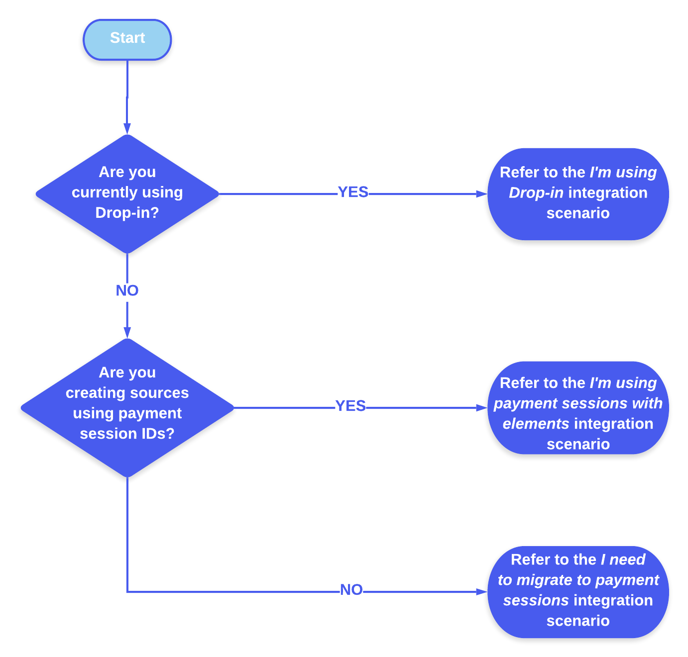

# How to ensure SCA compliance

For your integration to access our [Strong Customer Authentication (SCA)](https://info.digitalriver.com/rs/348-QUY-258/images/Digital\_River\_Guide\_to\_PSD2\_Compliance\_2020.pdf) solution, you must be using [payment sessions](../../shopper-apis/cart/payment-sessions.md). These are embedded in both [Drop-in](../payments-solutions/drop-in/) and [DigitalRiver.js with Elements](../../general-resources/reference/elements/).&#x20;

Use the following flowchart to find your appropriate SCA integration scenario:

| Integration scenario                     | Next steps                                                                                                                                                                                                                                                                                                                                                                                                                                                                                                                                                           |
| ---------------------------------------- | -------------------------------------------------------------------------------------------------------------------------------------------------------------------------------------------------------------------------------------------------------------------------------------------------------------------------------------------------------------------------------------------------------------------------------------------------------------------------------------------------------------------------------------------------------------------- |
| I'm using Drop-in Payments               | You're already using our recommended, out-of-the-box solution for [complying with SCA](https://info.digitalriver.com/rs/348-QUY-258/images/Digital\_River\_Guide\_to\_PSD2\_Compliance\_2020.pdf). To make sure you're using the tool correctly, review the [Drop-in Payments](../payments-solutions/drop-in/drop-in-integration-guide.md) documentation, and then [build your workflow](../building-your-workflows.md).                                                                                                                                             |
| I'm using payment sessions with elements | You're currently using DigitalRiver.js in a way that gives you access to SCA flow handling.  Your next steps involve [building your SCA workflow](../building-your-workflows.md).                                                                                                                                                                                                                                                                                                                                                                                    |
| I need to migrate to payment sessions    | In order to access SCA handling and compliance, you'll need to be using [payment sessions](../../shopper-apis/cart/payment-sessions.md). [Drop-in Payments](../payments-solutions/drop-in/) is the preferred method for performing this migration, but you can also migrate [directly to payment sessions](../../shopper-apis/cart/payment-sessions.md#migrating-to-payment-sessions) using [DigitalRiver.js](../payments-solutions/digitalriver.js/). Once you're done with the migration, you'll need to [build your SCA workflow](../building-your-workflows.md). |
