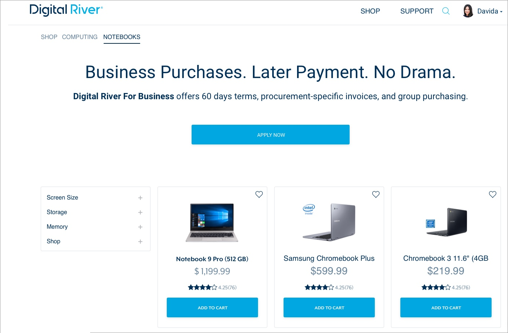
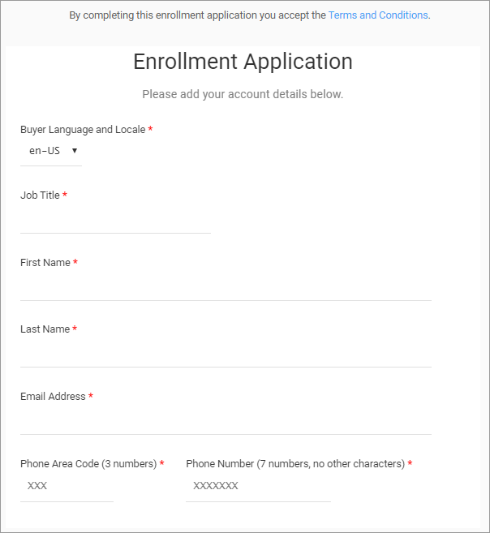
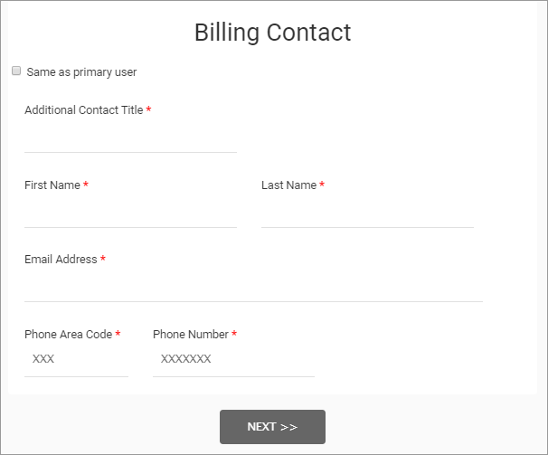
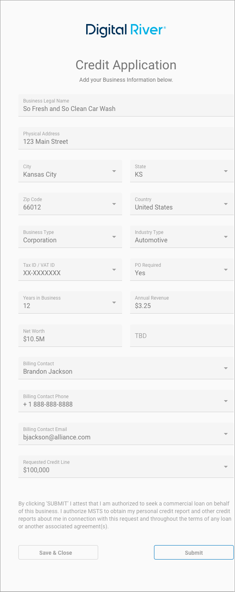
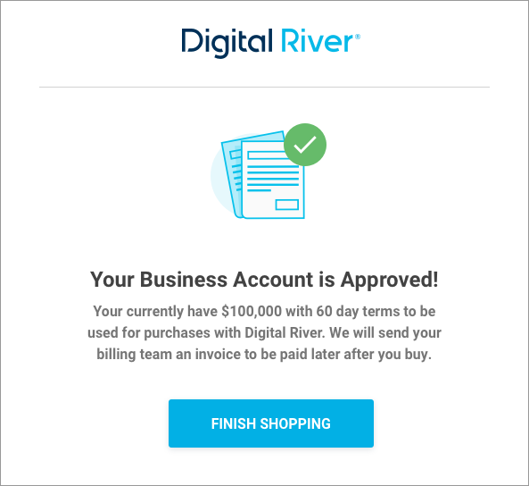

# TreviPay

Digital River offers the TreviPay payment method from Multi Service Technology Solutions, Inc.

TreviPay enables Merchants to extend a line of credit for business buyers at checkout. This white-labeled solution facilitates online B2B payments by offering flexible net terms, digital statement handling, collections, credit approval management, and improving the overall B2B online buying experience. Digital River supports the following features: create user, payment capabilities, dispute and chargeback, subscription, reporting, API support, fraud, Drop-in, term code service support, and tax.

TreviPay assesses creditworthiness, absorbs non-payment risk, including the localized dunning process (collections) if required, and provides online Merchant and Buyer statement management tools. TreviPay supports the following features: application processing, account administration, account self-service, thresholds, commerce experience, alerts, and dunning (collections).

TreviPay processes online ecommerce orders for the following product types: physical, digital, and recurring. TreviPay does not support phone-in orders.

## Benefits

Offering net terms online for business buyers streamlines the legacy accounts receivable and payable processes, alleviates buyer cash flow constraints, and leads to increased buyer loyalty and higher average order values. With this payment method, Merchants remove their credit risk, offload collection responsibilities, and get paid upfront while their buyers pay over time.&#x20;

## How to configure&#x20;

How you configure TreviPay depends on whether you're using [DigitalRiver.js with Elements](../payments-solutions/digitalriver.js/) or[ Drop-in payments](../payments-solutions/drop-in/).  &#x20;

| DigitalRiver.js with Elements                                                             | Drop-in payments                                                                                 |
| ----------------------------------------------------------------------------------------- | ------------------------------------------------------------------------------------------------ |
| [Configuring TreviPay](../payments-solutions/digitalriver.js/payment-methods/trevipay.md) | [Drop-in Payments Integration Guide](../payments-solutions/drop-in/drop-in-integration-guide.md) |

## How it works

Buyers select the TreviPay option at checkout, then they either log in to the Merchant's profile to complete their purchase or apply for their line of credit. Upon approval, the buyer can complete their transaction, and manage purchases, statements, and vendor forms through the buyer portal.

### Promote the TreviPay credit solution

You can set up your storefront to promote the TreviPay credit solution.

### TreviPay enrollment form

You can add a link to the enrollment form on your home page, product page, and checkout page. You can also add a link to the enrollment form from your customer relationship manager (CRM).

When a customer clicks the **Apply Now** button, the information they provide on the Enrollment Application page creates the Admin user.

The information provided on the Billing Contact page creates the Payer user.

The Credit Application appears when the customer completes the fields and clicks **Next**.

When the client completes and submits the Credit Application, they will see a Congratulations message stating they successfully submitted their application.

### Phone call

TreviPay will call the customer up to three times to gather information such as the customer's phone number so TreviPay can set up two-factor authentication (2FA) for the customer's account.&#x20;

### Email notification

The customer will later receive two emails. The first email will state the application has been submitted. The second email will state whether the application for their account has been approved or declined. The validated customer can complete the purchase using two-factor authentication (2FA).


TreviPay does not require the customer to sign in to the client portal, but they do recommend it.


### TreviPay enrollment URL

Digital River will provide the TreviPay enrollment form URL and redirect URL. You can include the enrollment form link on your homepage, product page, checkout page, or via your customer relationship management (CRM). The format for the enrollment form URL is:\
`https://<progamName>.b2b.credit/<locale>/apply?client_reference_id=<business-UUID>`

**Example:** `https://acmeUS.b2b.credit/en-US/apply?client_reference_id=Acme-123456`

| Attribute             | Description                                                                                                                                                                                                                                                                                                                                                                                                                                                                                                                                                                        |
| --------------------- | ---------------------------------------------------------------------------------------------------------------------------------------------------------------------------------------------------------------------------------------------------------------------------------------------------------------------------------------------------------------------------------------------------------------------------------------------------------------------------------------------------------------------------------------------------------------------------------- |
| `<programName>`       | The name of the program. TreviPay URLs are static and mapped to the specific program.                                                                                                                                                                                                                                                                                                                                                                                                                                                                                              |
| `client_reference_id` | 
The business identifier. This is a string without the restriction of character types and can be up to 50 characters in length. Each ecosystem (Commerce API) will be responsible for sending TreviPay a unique <code>client_reference_id</code> for shopper enrollment.

See <a href="trevipay.md#applying-the-value-for-client_reference_id-to-organizationid">Applying the value for <code>client_reference_id</code> to <code>organizationId</code></a> <code>for instructions on on how to use the value for the organizationId as the client_reference_id.</code>
 |
| `<locale>`            | A designator that combines the two-letter [ISO 639-1](https://en.wikipedia.org/wiki/ISO\_639-1) language code with the [ISO 3166-1 alpha-2](https://en.wikipedia.org/wiki/ISO\_3166-1\_alpha-2) country code (for example, `en-US`).                                                                                                                                                                                                                                                                                                                                               |

#### Including the ecommerce URL in the enrollment URL

Include an `ecommerce_url` in the enrollment form URL when redirecting the customer to the TreviPay enrollment form. The format for the enrollment form with a redirect is:

`https://<white-label>.b2b.credit/<locale>/apply?client_reference_id=<business-UUID>&ecommerce_url=<www.returnURL.com>`

#### **Example**:&#x20;

`https://acmeUS.b2b.credit/<locale>/apply?client_reference_id=Acme-123456&ecommerce_url=www.acme-returnURL.com`

| Attribute       | Description                                                             |
| --------------- | ----------------------------------------------------------------------- |
| `ecommerce_url` | The redirect URL to your website (for example, www.acme-returnURL.com). |

You must include a `client_reference_id` with the return URL when redirecting to the TreviPay enrollment form.

#### Applying the value for `client_reference_id` to `organizationId`&#x20;

The value for the `client_reference_id` is the business's universally unique identifier (UUID) (for example, `Acme-123456`). In this instance, Digital River uses the `organizationId` as the UUID.

There are two ways to apply the value for the `client_reference_id` to the `organizationId` . We recommend as best practice that you apply the `organizationId` as follows:

1. [Create a cart](../../shopper-apis/cart/creating-or-updating-a-cart/#creating-a-cart) and insert the `organizationId` in the payload.
2. Provide the payment session identifier (`sessionId`) when [creating the source](trevipay.md#step-2-create-a-trevipay-agreement-source-using-digitalriver.js).
3. [Apply the source to the cart](trevipay.md#step-4-use-the-authorized-source).

Alternatively, you can:&#x20;

1. [Create a source](../sources/using-the-source-identifier.md#creating-payment-sources) or a [source with payment sessions](../../shopper-apis/cart/payment-sessions.md#creating-a-source-with-payment-sessions) and provide the `client_reference_id`.
2. [Apply the source to the cart](../sources/#attaching-a-payment-method-to-an-order-or-cart).  The `client_reference_id` value now appears as the value for the [`organizationId`](https://dispatch-dashboard.digitalriverws.net/re-docs/shopper#tag/Carts/paths/\~1v1\~1shoppers\~1me\~1carts\~1active/post).&#x20;

## Support matrix

| Basics                  | Customer                                                                   | Redirect              |
| ----------------------- | -------------------------------------------------------------------------- | --------------------- |
|                         | Payment Type                                                               | Buy Now Pay Later B2B |
| Requirements            | Addendum                                                                   | Yes                   |
| Supported Product Types | Physical / Digital                                                         | Both                  |
|                         | Captures Funds when Physical Product Shipped or Digital Product Downloaded | Yes                   |
|                         | Chargeback                                                                 | Yes                   |
|                         | Standard / Premium                                                         | Premium               |
|                         | Multiple / Partial                                                         | Yes                   |
|                         | Recurring Payments                                                         | Yes                   |

## Supported markets

For information on supported markets and currencies for Drop-in and DigitalRiver.js, go to:&#x20;

* **Payment Method Guide:** [digitalriver.com/payment-method-guide](https://www.digitalriver.com/payment-method/trevipay/)
* **Country Guide:** [digitalriver.com/country-guide/](https://www.digitalriver.com/country-guide/)
