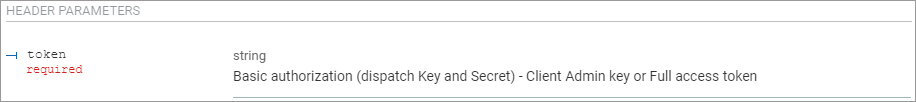
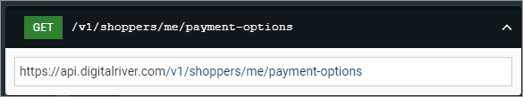

# Release notes

V1 is the base version of the Commerce API. The following dates indicate when we released updates to this version.

## 2022/6/30

We released the [Webhook service](https://help.digitalriver.com/help/gc/Administration/Webhook-Service/Webhook-service.htm) for Commerce API. The Webhook service now supports events covering the entire subscription cycle. You can choose to manage the service through the [Global Commerce](https://gc.digitalriver.com/gc/ent/login.do) interface or the [Webhooks API](https://www.digitalriver.com/docs/commerce-api-reference/#tag/Webhook-Event-Management). You can now integrate the Webhook service for Commerce API with endpoints to get an instant update on events throughout the entire [subscription cycle](../subscriptions/subscription-lifecycle.md). We also updated the list of [webhook events](../events-and-webhooks/events/event-types.md) in the Webhook service. You can now choose from more subscription events.

## 2022/6/29

* We added `precondition-failure` error codes to [409 Conflict](../error-codes.md#409-conflict) in the [Error codes](../error-codes.md) section.
* We updated the following APIs:
  * Renamed "API Trigger Offer" to "[Trigger offer by cart](https://www.digitalriver.com/docs/commerce-api-reference/#tag/API-Trigger-Offer/paths/\~1v1\~1shoppers\~1me\~1carts\~1active%20\(API%20Trigger%20Offer\)/post)".
  * Added the [Trigger offer by line item](https://www.digitalriver.com/docs/commerce-api-reference/#tag/API-Trigger-Offer/paths/\~1v1\~1shoppers\~1me\~1carts\~1active\~1line-items%20\(API%20Trigger%20Offer\)/post). Use this API to trigger a product-level offer.
  * Updated the descriptions for the [Order Lookup](https://www.digitalriver.com/docs/commerce-api-reference/#tag/Order-Lookup/paths/\~1v1\~1shoppers\~1order-lookup/post) API.

## 2022/6/16

* We added support for [applying store credit](../consumer-browsing-experience-1/common-use-cases/applying-store-credit.md) to non-recurring transactions. Store credit allows merchants to offer customers a store credit as a payment type at checkout.
* We now support [two payments in a cart](../payments/sources/using-the-source-identifier.md).
* You can now [detach a payment from a cart](../payments/sources/using-the-source-identifier.md#detaching-payment-sources-from-a-cart).
* You can now create [secondary sources](../payments/sources/using-the-source-identifier.md#creating-secondary-sources) through the [Sources API](https://www.digitalriver.com/docs/commerce-api-reference/#operation/createSources) by sending your confidential API key in a POST /sources request.

## 2022/6/1

We restructured the API tags and descriptions for the Shopper API as follows:

* Renamed Apply Payment Methods to [Apply or Detach Payment Methods](https://www.digitalriver.com/docs/commerce-api-reference/#tag/Submit-Cart/paths/\~1v1\~1shoppers\~1me\~1carts\~1active\~1submit-cart/post) and added the [Detach all applied payment methods from the cart](https://www.digitalriver.com/docs/commerce-api-reference/#tag/Apply-or-Detach-Payment-Methods/paths/\~1v1\~1shoppers\~1me\~1carts\~1active\~1payment/delete).
* Restructured the offer API tags and revised their descriptions for [Retrieve all POP offers for a cart](https://www.digitalriver.com/docs/commerce-api-reference/#tag/Cart-Offers/paths/\~1v1\~1shoppers\~1me\~1carts\~1active\~1point-of-promotions\~1{popName}\~1offers/get) and [Retrieve all offers](https://www.digitalriver.com/docs/commerce-api-reference/#tag/Offers/paths/\~1v1\~1shoppers\~1me\~1offers/get).
* Updated the sample payload for [Retrieve cart applied offers](https://www.digitalriver.com/docs/commerce-api-reference/#tag/Cart-Offers/paths/\~1v1\~1shoppers\~1me\~1carts\~1active\~1applied-offers/get).
* Added [Update shopper payment options](https://www.digitalriver.com/docs/commerce-api-reference/#tag/Payment-Options/paths/\~1v1\~1shoppers\~1me\~1payment-options\~1{paymentOptionId}/post).
* We moved the following webhook APIs under [Webhook Event Management](https://www.digitalriver.com/docs/commerce-api-reference/#tag/Webhook-Event-Management):
  * [Get all webhook subscriptions](https://www.digitalriver.com/docs/commerce-api-reference/#operation/getAllWebhooksUsingGET)
  * [Create a new webhook](https://www.digitalriver.com/docs/commerce-api-reference/#operation/createNewWebhookUsingPOST)
  * [Get a specific webhook by ID](https://www.digitalriver.com/docs/commerce-api-reference/#operation/getWebhookByIdUsingGET)
  * [Delete a webhook](https://www.digitalriver.com/docs/commerce-api-reference/#operation/deleteWebhookUsingDELETE)
  * [Update a webhook](https://www.digitalriver.com/docs/commerce-api-reference/#operation/updateWebhookUsingPATCH)
* We added [Payment Source](https://www.digitalriver.com/docs/commerce-api-reference/#tag/Source) and added the following source APIs:
  * [Get a source by source by identifier](https://www.digitalriver.com/docs/commerce-api-reference/#operation/retrieveSources)
  * [Create a secondary source](https://www.digitalriver.com/docs/commerce-api-reference/#operation/createSources)
* Added `cart-charge-failure` to the list of [409 Conflict errors](../error-codes.md#409-conflict) in [Error codes](../error-codes.md).

## 2022/5/6

* We updated the [authorization decline codes](../cart/submitting-a-cart/authorization-declines.md) for customer-initiated and merchant-initiated transactions.
* We added more [error codes](../error-codes.md), including the [credit card error codes](../error-codes.md#credit-card-error-and-declined-message) and a [DNS outage error message](../error-codes.md#500-internal-server-error).

## 2022/4/1

We upgraded Google Pay to offer the up-to-date Google Pay wallet experience. You can now [configure the dynamic Google Pay button](../payments/payments-solutions/digitalriver.js/reference/elements/google-pay-elements.md#google-pay-element-styles-and-customization) by applying your preferred button styles.

## 2022/3/28

We added support for the [iDEAL ](../payments/payments-solutions/digitalriver.js/payment-methods/ideal.md)payment method.

## 2022/3/16

We added support for the [Bancontact ](../payments/payments-solutions/digitalriver.js/payment-methods/bancontact.md)payment method.

## 2022/1/26

We added support for the [Boleto ](../payments/payments-solutions/digitalriver.js/payment-methods/boleto.md)payment method.

## 2021/12/3

* We added the ability to [update the subscription billing email address and shipping email address](https://www.digitalriver.com/docs/commerce-api-reference/#operation/emailUpdater).&#x20;
* We added the `applyEmailToSubscriptions` field to [Update current shopper](https://www.digitalriver.com/docs/commerce-api-reference/#tag/Shoppers/paths/\~1v1\~1shoppers\~1me/post).

## 2021/10/4

We added a new [legal entity](../orders-1/selling-entities.md), Digital River UK Limited.

## 2021/10/1

We added the ability to [create a refund for a delayed payment method](../returns-and-refunds-1/refunds/managing-a-refund-for-a-delayed-payment-method.md) such as [Konbini](../payments/payments-solutions/digitalriver.js/payment-methods/konbini.md), and [Wire Transfer](../payments/payments-solutions/digitalriver.js/payment-methods/wire-transfer.md).

## 2021/9/29

We added the ability to [receive payment detail update notifications](../subscriptions/managing-subscriptions/receiving-payment-details-update-notifications.md) when a shopper updates their payment details for a subscription.

## 2021/9/16

* We added the ability to [remove a tax identifier from a cart](../cart/managing-tax-identifiers.md#removing-a-tax-identifier-from-a-cart).
*   We added the `trigger` to the [`offer` ](https://drapi.io/commerce/#tag/Offers/paths/\~1v1\~1shoppers\~1me\~1offers\~1{offerId}/get)object response. The possible values are:&#x20;

    * `Always Triggered`–The offer is available to any shopper in your store. Shoppers simply have to meet the conditions you set up in the offer for the offer to be triggered and redeemed by shoppers.
    * `User Triggered`–To redeem an offer, the shopper must take additional actions such as click a link or enter a coupon code.

    You can set the trigger when you [configure the offer type](https://help.digitalriver.com/help/gc/Marketing/Offers/Configuring-the-offer-type.htm#Trigger) in Global Commerce.
* We added the ability to [add ](../cart/adding-required-information-for-specific-payment-methods.md#adding-an-organization-identifier-to-a-cart)or [remove ](../cart/adding-required-information-for-specific-payment-methods.md#removing-an-organization-identifier-from-the-cart)the organization identifier (client\_reference\_id) to a cart for the [TreviPay ](../payments/payments-solutions/digitalriver.js/payment-methods/trevipay.md)payment method.

## 2021/9/7

We added the ability to [set the renew reminders for trial subscriptions](../subscriptions/managing-subscriptions/setting-renew-reminders-for-trial-subscriptions.md).

## 2021/9/1

* We added the ability for a Customer Service Representative to [cancel an order](https://help.digitalriver.com/help/gc/Customer-Service/Cancelling-an-order.htm) in [Global Commerce.](https://gc.digitalriver.com/gc/ent/login.do)
* We added the ability to [use the Expired Card Optimizer (ECO)](../subscriptions/managing-subscriptions/using-the-expired-card-optimizer.md) for [third-party subscription engine](https://www.digitalriver.com/docs/commerce-api-reference/#tag/Third-Party-Subscription-Engine-Support) renewal orders.&#x20;
* We added support for [attaching a tax ID to a car](../cart/managing-tax-identifiers.md#attaching-a-tax-identifier-to-a-cart)t using the [tax registration](https://www.digitalriver.com/docs/commerce-api-reference/#tag/Tax-Registration) resource.&#x20;
* We expanded the pay later options that are now available in the [PayPal Wallet](../payments/payments-solutions/digitalriver.js/payment-methods/paypal.md#paypal-express-checkout-digital-wallet), including [PayPal RatenZahlung](../payments/payments-solutions/digitalriver.js/payment-methods/paypal.md#paypal-ratenzahlung) for German shoppers.

## 2021/8/12

We added instructions on how to [get the inventory for a specific product](../consumer-browsing-experience-1/global-commerce/products/inventory-status.md).

## 2021/8/6

We added `supportsStorage` to indicate whether a payment method supports storage to [Retrieving available payment methods](../payments/payments-solutions/digitalriver.js/reference/digitalriver-object.md#retrieving-available-payment-methods).

## 2021/7/29

We expanded the pay later options that are now available in the [PayPal Wallet](../payments/payments-solutions/digitalriver.js/payment-methods/paypal.md#paypal-express-checkout-digital-wallet), including [PayPal Pay in 4](../payments/payments-solutions/digitalriver.js/payment-methods/paypal.md#paypal-pay-in-4) for shoppers in Australia and France, as well as [PayPal Pay in 3](../payments/payments-solutions/digitalriver.js/payment-methods/paypal.md#paypal-pay-in-3) and [PayPal Credit](../payments/payments-solutions/digitalriver.js/payment-methods/paypal.md#paypal-credit) for UK shoppers.

## 2021/7/27

You can now use the [Delayed Payment Instructions element](../payments/payments-solutions/digitalriver.js/reference/elements/delayed-payment-instructions-element.md) to generate a template that contains the instructions that explain how to complete payment for delayed payment types such as Konbini and Wire Transfer.

## 2021/7/26

You can now customize and control your subscription email notifications through [events notifications and webhooks](../events-and-webhooks/). This feature allows you to control your communications with your consumers, including integrating the capabilities of leading notification providers.

## 2021/7/7

We added the ability to [create a trial subscription](https://help.digitalriver.com/help/gc/Products/All-Products/Configuring-the-product-settings.htm#Subscription) for a subscription product and configure trial renewal reminders in [Global Commerce](https://gc.digitalriver.com/gc/ent/login.do).

## 2021/7/2

We added support for [Pay in 3](../payments/payments-solutions/digitalriver.js/payment-methods/paypal.md#paypal-pay-in-3) to the [PayPal ](../payments/payments-solutions/digitalriver.js/payment-methods/paypal.md)payment method.

## 2021/6/3

* We made the following changes to [Subscriptions API](https://www.digitalriver.com/docs/commerce-api-reference/#tag/Manage-Subscription):
  * In the response for [`GET /v1/subscriptions/{subscriptionId}`](https://www.digitalriver.com/docs/commerce-api-reference/#operation/getSubscriptionInfo) , added `shopper` and `renewalPrice` to the subscription information attributes. We also added `renewalPrice` to the `addOn` object.
*   We made the following changes to the [Shopper API](https://www.digitalriver.com/docs/commerce-api-reference/#tag/Shoppers) to allow you to suppress an order confirmation email.

    * Added the `suppressorderconfirmationemail` parameter to [Add line items to a cart](https://www.digitalriver.com/docs/commerce-api-reference/#tag/Line-Items/paths/\~1v1\~1shoppers\~1me\~1carts\~1active\~1line-items/post) and [Update current cart](https://drapi.io/commerce/#tag/Carts/paths/\~1v1\~1shoppers\~1me\~1carts\~1active/post).
    * Added the `suppressOrderConfirmationEmail` parameter to the [Update current cart ](https://www.digitalriver.com/docs/commerce-api-reference/#tag/Carts/paths/\~1v1\~1shoppers\~1me\~1carts\~1active/post)payload.

    To use this feature, contact your Digital River representative.
* We revised the statements for subtotal and discount at the order level for the [Submit the cart and create an order](https://www.digitalriver.com/docs/commerce-api-reference/#tag/Submit-Cart/paths/\~1v1\~1shoppers\~1me\~1carts\~1active\~1submit-cart/post).&#x20;

## 2021/5/18

* We add [test and use cases](../getting-started/test-cases.md) to help you when you're developing and testing the Commerce API and your commerce connector.
* We updated the [error codes](../error-codes.md) that provide you with:
  * Additional [credit card decline reason codes](../cart/submitting-a-cart/authorization-declines.md) and metadata responses. You can then perform reporting and analytics to better understand why authorizations are declined so you can optimize your business.
  * Greater visibility into why a transaction failed, reducing the work you need to do to determine why the transaction failed.
  * Data points to determine when you should or shouldn't retry a renewal attempt. This feature categorized credit card decline reason codes into two categories: "soft" and "hard declines."

## 2021/5/14

We added [Site Management](https://www.digitalriver.com/docs/commerce-api-reference/#tag/Authorized-Countries) to the Commerce API Reference that includes the following resources:

* ``[`/authorized-shipping-countries`](https://www.digitalriver.com/docs/commerce-api-reference/#tag/Authorized-Countries/paths/\~1sites\~1{siteId}\~1authorized-shipping-countries/get)``
* ``[`/authorized-billing-countries`](https://www.digitalriver.com/docs/commerce-api-reference/#tag/Authorized-Countries/paths/\~1sites\~1{siteId}\~1authorized-billing-countries/get)``

## 2021/5/6

You can now programmatically retrieve a list of your site's [authorized billing](../sites/getting-a-sites-authorized-billing-countries.md) or [shipping countries](../sites/getting-a-sites-authorized-shipping-countries.md) using your [Global Commerce user credentials](API-structure.md#sending-api-calls-using-auth).

## 2021/4/29

We replaced Supported geographies for each [payment method](../payments/payments-solutions/digitalriver.js/payment-methods/) in [DigitalRiver.js](../payments/payments-solutions/digitalriver.js/) with Supported markets. To find information on supported markets and currencies for Drop-in and DigitalRiver.js, go to:

* **Payment Method Guide:** [digitalriver.com/payment-method-guide](https://www.digitalriver.com/payment-method-guide/)
* **Country Guide:** [digitalriver.com/country-guide/](https://www.digitalriver.com/country-guide/)

## 2021/4/27

* We made the following to the [Commerce API Reference](https://www.digitalriver.com/docs/commerce-api-reference/):
  * Removed `x-siteid` and `x-companyId` headers for [Subscription ](https://www.digitalriver.com/docs/commerce-api-reference/#tag/Manage-Subscription)APIs. You only need to [provide a token](API-structure.md#creating-session-aware-access-tokens) now.\
    &#x20; &#x20;
  * Removed `sku` and `displayName` from the `product` object in the response for [`preview`](https://www.digitalriver.com/docs/commerce-api-reference/#operation/previewSubscription), [`preview-cart`](https://www.digitalriver.com/docs/commerce-api-reference/#operation/previewCartSubscription), and [`reduce`](https://www.digitalriver.com/docs/commerce-api-reference/#operation/reduceSubscription) resources.
  * Removed `proratedUnitPrice` from the [`reduce`](https://www.digitalriver.com/docs/commerce-api-reference/#operation/reduceSubscription) resource.
  * Updated the payload for the [API trigger offer](https://www.digitalriver.com/docs/commerce-api-reference/#tag/API-Trigger-Offer/paths/\~1v1\~1shoppers\~1me\~1carts\~1active%20\(API%20Trigger%20Offer\)/post) request.
  * Updated the [order states](../orders-1/getting-orders.md#getting-an-order-by-id) for the GET and POST orders APIs by adding In `Review`, `Pending Payment`, and `Complete`.&#x20;
  * Updated the `customAttributes` for the [get shopper order](https://www.digitalriver.com/docs/commerce-api-reference/#tag/Orders/paths/\~1v1\~1shoppers\~1me\~1orders\~1{orderId}/get).
  * Added `chargeType` to [apply shopper to cart](https://www.digitalriver.com/docs/commerce-api-reference/#tag/Apply-Shopper/paths/\~1v1\~1shoppers\~1me\~1carts\~1active\~1apply-shopper/post), [apply billing address to cart](https://www.digitalriver.com/docs/commerce-api-reference/#tag/Billing-Address/paths/\~1v1\~1shoppers\~1me\~1carts\~1active\~1billing-address/put), [apply shipping address to cart](https://www.digitalriver.com/docs/commerce-api-reference/#tag/Shipping-Address/paths/\~1v1\~1shoppers\~1me\~1carts\~1active\~1apply-shipping-address/post), [apply payment method to cart](https://www.digitalriver.com/docs/commerce-api-reference/#tag/Apply-Payment-Method/paths/\~1v1\~1shoppers\~1me\~1carts\~1active\~1apply-payment-method/post), [apply shipping option to cart](https://www.digitalriver.com/docs/commerce-api-reference/#tag/Apply-Shipping-Option/paths/\~1v1\~1shoppers\~1me\~1carts\~1active\~1apply-shipping-option/post), and [get current cart](https://www.digitalriver.com/docs/commerce-api-reference/#tag/Carts/paths/\~1v1\~1shoppers\~1me\~1carts\~1active/get).
  * Corrected the API path domain in the examples. It's now `api.digitalriver.com`.&#x20;

## 2021/3/31

* We added information on how to [sell subscriptions with add-ons](../subscriptions/selling-subscriptions-with-add-ons/) and [manage subscriptions](../subscriptions/managing-subscriptions/).
* Digital River Clients now can extend a branded, fully managed line of credit program to their business buyers that is engineered to increase purchase frequency, average order values, brand loyalty, and cashflow, while mitigating risk. By offering TreviPay you cultivate a consumer-like purchase experience for buyers, so they can purchase what they need now and pay later with net terms – all online.\
  Learn how you can offer [TreviPay](../payments/payments-solutions/digitalriver.js/payment-methods/trevipay.md) to your buyers!&#x20;

## 2021/3/30

You can now use the`chargeType` in a Cart without a subscription line item to [initiate a charge](../cart/submitting-a-cart/initiating-a-charge.md).&#x20;

## 2021/3/11

We added the `continue` type to the list of button types for [Drop-in](../payments/payments-solutions/drop-in/) and made it the default type in [Customizing the text of the Drop-in button](../payments/payments-solutions/drop-in/drop-in-integration-guide.md#customizing-the-text-of-the-drop-in-button).

## 2021/3/10

* We added information on [initiating a charge](../cart/submitting-a-cart/initiating-a-charge.md).&#x20;
* We moved the Declined messages under [Submitting a cart](../cart/submitting-a-cart/) and renamed it  [Authorization declines](../cart/submitting-a-cart/authorization-declines.md).&#x20;
* You can now find the [error codes](../error-codes.md) In the [Commerce API](../) doc.

## 2021/3/9

We updated the information on [landed cost](../orders-1/landed-costs.md).

## 2021/2/1

* We improved the [error format](https://www.digitalriver.com/docs/commerce-api-reference/#section/Errors/Error-format) for transactional errors using a credit card saved in the payment source and added a declined message (`declinedMessage`) to provide more information.
* We moved the description of [API keys](API-structure.md#api-keys) from the Commerce API Reference to [Best practices](API-structure.md).

## 2021/1/15

You can now use the [`authenticateSource` method](../payments/payments-solutions/digitalriver.js/reference/digitalriver-object.md#authenticating-sources) to determine whether the saved payment source selected by a customer during the checkout process requires [Strong Customer Authentication](../payments/psd2-and-sca/) (SCA).

## 2021/1/12

* When creating a source, you can now configure the `usage` parameter. It allows you to specify the type of transaction the source will likely be used for in the future. The parameter is available in both [Drop-in](../payments/payments-solutions/drop-in/drop-in-integration-guide.md#specifying-a-sources-future-use) and [DigitalRiver.js](../payments/payments-solutions/digitalriver.js/reference/digitalriver-object.md#specifying-a-sources-future-use). We recommend you use it when building [purchase](../payments/building-your-workflows.md#credit-card-details-saved-by-customer-during-checkout) and [account management](../payments/building-your-workflows.md#saving-a-credit-card-for-future-use) workflows that allow customers to save their credit card information.&#x20;
* When [creating an instance of Drop-in](../payments/payments-solutions/drop-in/drop-in-integration-guide.md#step-6-allow-the-shopper-to-interact-with-hydrate), you can now [customize the text of the button](../payments/payments-solutions/drop-in/drop-in-integration-guide.md#customizing-the-drop-in-button-text). Additionally, we created new [Drop-in options](../payments/payments-solutions/drop-in/drop-in-integration-guide.md#drop-in-options) that allow you to set the `showTermsOfSaleDisclosure` and `disableAutomaticRedirects` parameters.

## 2021/1/8

We added information on [creating a cart with a perpetual unit price](../subscriptions/selling-subscriptions-without-add-ons/assigning-a-perpetual-unit-price.md#creating-a-cart-with-a-perpetual-unit-price) using  `POST /v1/shoppers/me/carts/active/line-items` resource.

## 2021/1/6

A note to [Apply shopper to cart](https://www.digitalriver.com/docs/commerce-api-reference/#tag/Apply-Shopper/paths/\~1v1\~1shoppers\~1me\~1carts\~1active\~1apply-shopper/post) stating this method requires an authenticated shopper token.

* Added the following to the response schema for [GET /v1/shoppers/me/payment-options](https://www.digitalriver.com/docs/commerce-api-reference/#tag/Payment-Options/paths/\~1v1\~1shoppers\~1me\~1payment-options/get):
  * `PaymentOptionsResponseLegacy`
  * `PaymentOptionsResponseLegacyExpand`
  * `PaymentOptionsResponsePaymentSource`
  * `PaymentOptionsResponsePaymentSourceExpand`
* A `sourceId` to [GET /v1/shoppers/me/payment-options](https://www.digitalriver.com/docs/commerce-api-reference/#tag/Payment-Options/paths/\~1v1\~1shoppers\~1me\~1payment-options/get).
* The following to the response schema for [POST /v1/shoppers/me/carts/active/apply-payment-method](https://www.digitalriver.com/docs/commerce-api-reference/#tag/Apply-Payment-Method/paths/\~1v1\~1shoppers\~1me\~1carts\~1active\~1apply-payment-method/post):
  * `ApplyPaymentMethodLegacy`
  * `ApplyPaymentMethodPaymentSource`
* The following to the response schema for [GET /v1/shoppers/me/orders/{orderId}/line-items](https://www.digitalriver.com/docs/commerce-api-reference/#tag/Line-Items/paths/\~1v1\~1shoppers\~1me\~1orders\~1{orderId}\~1line-items/get):
  * `DefaultOrderLineItems`
  * `ExpandedOrderLineItems`
  * `lineItemStateDetails`
* A `chargeType` to the `subscriptionInfo` section in the request and response.  See [Providing subscription information](../cart/providing-subscription-information.md) for more details.

## 2021/1/5

We added the [best practices](API-structure.md) for using the Commerce API that includes [Authentication](API-structure.md#authentication), [Creating authenticated shopper tokens](API-structure.md#creating-session-aware-access-tokens), [Caching responses](API-structure.md#caching-responses), [Capturing the customer's IP address](API-structure.md#capturing-the-customers-ip-address), and [Elements](API-structure.md#elements).&#x20;

## 2020/12/30

You can now modify a subscription during a [midterm change](../subscriptions/midterm-change.md). That includes [applying a midterm change with price override](../subscriptions/selling-subscriptions-without-add-ons/applying-a-midterm-change-with-price-override.md), [assigning a perpetual price](../subscriptions/selling-subscriptions-without-add-ons/assigning-a-perpetual-unit-price.md), or [reducing the subscription quantity](../subscriptions/selling-subscriptions-without-add-ons/reducing-the-quantity-of-a-subscription.md).

## 2020/12/28

We updated the [supported geographies](../payments/payments-solutions/digitalriver.js/payment-methods/klarna.md#supported-geographies) for [Klarna](../payments/payments-solutions/digitalriver.js/payment-methods/klarna.md) to show the minimum and maximum order amount and the payment method type.

## 2020/12/16

We updated the examples and added information on how to create a merchant-initiated transaction (MIT) in [Providing subscription information](../cart/providing-subscription-information.md).

## 2020/12/10

We added more [custom styles](../payments/payments-solutions/digitalriver.js/reference/elements/#available-custom-styles) for [styling an element container](../payments/payments-solutions/digitalriver.js/reference/elements/#styling-an-element-container) in [DigitalRiver.js](../payments/payments-solutions/digitalriver.js/).

## 2020/11/30

We added [error types](../payments/payments-solutions/digitalriver.js/reference/error-types-codes-and-objects.md#error-types) to [Error types, codes, and objects](../payments/payments-solutions/digitalriver.js/reference/error-types-codes-and-objects.md).

## 2020/11/19

We added support for [Pay in 4](../payments/payments-solutions/digitalriver.js/payment-methods/paypal.md#pay-in-4) to the [PayPal ](../payments/payments-solutions/digitalriver.js/payment-methods/paypal.md)payment method.

## 2020/11/17

* We added support for [landed costs](../orders-1/landed-costs.md).
* You can now [set a price list](../cart/configuring-taxes.md#setting-the-price-list-to-tax-inclusive-or-exclusive) or [shipping costs](../cart/configuring-taxes.md#setting-the-shipping-cost-to-tax-inclusive-or-exclusive) to tax inclusive or exclusive.

## 2020/11/10

We added a list of [error codes](../payments/payments-solutions/digitalriver.js/reference/error-types-codes-and-objects.md#error-codes) for DigitalRiver.js.

## 2020/11/6

* As part of the PSD2 Strong Customer Authentication (SCA) initiative, payment processors require extra information when processing merchant-initiated credit card transactions. To ensure that you adhere to the new mandate, you can now make use of [billing agreements](../cart/providing-subscription-information.md#billing-agreement-identifier).
* You can now update subscription information in  the `LineItem` array to the [`POST/carts`](https://www.digitalriver.com/docs/commerce-api-reference/#tag/Carts/paths/\~1v1\~1shoppers\~1me\~1carts\~1active/post), [`POST /line-items`](https://www.digitalriver.com/docs/commerce-api-reference/#tag/Line-Items/paths/\~1v1\~1shoppers\~1me\~1carts\~1active\~1line-items/post), or [`POST /line-items/{lineItemsId}`](https://www.digitalriver.com/docs/commerce-api-reference/#tag/Line-Items/paths/\~1v1\~1shoppers\~1me\~1carts\~1active\~1line-items\~1{lineItemsId}/post) requests.

## 2020/10/29

You can now [subscribe to receive](broken-reference) the latest Commerce API information.

## 2020/10/28

You can now apply a [shipping discount](../cart/providing-a-shipping-discount.md) to a customer's order

## 2020/10/14

* We added information on [configuring taxes](https://docs.digitalriver.com/commerce-api/cart/configuring-taxes).
* We added the `taxInclusive` attribute to the response for [Apply shopper to cart](https://www.digitalriver.com/docs/commerce-api-reference/#tag/Apply-Shopper/paths/\~1v1\~1shoppers\~1me\~1carts\~1active\~1apply-shopper/post), [Add or update cart billing address](https://www.digitalriver.com/docs/commerce-api-reference/#tag/Billing-Address/paths/\~1v1\~1shoppers\~1me\~1carts\~1active\~1billing-address/put),  [Apply billing address to cart](https://www.digitalriver.com/docs/commerce-api-reference/#tag/Billing-Address/paths/\~1v1\~1shoppers\~1me\~1carts\~1active\~1apply-billing-address/post), [Apply shipping address to cart](https://www.digitalriver.com/docs/commerce-api-reference/#tag/Shipping-Address/paths/\~1v1\~1shoppers\~1me\~1carts\~1active\~1apply-shipping-address/post), [Submit car and create and order](https://www.digitalriver.com/docs/commerce-api-reference/#tag/Submit-Cart/paths/\~1v1\~1shoppers\~1me\~1carts\~1active\~1submit-cart/post), [Apply payment method to cart](https://www.digitalriver.com/docs/commerce-api-reference/#tag/Apply-Payment-Method/paths/\~1v1\~1shoppers\~1me\~1carts\~1active\~1apply-payment-method/post), [Apply shipping option to cart](https://www.digitalriver.com/docs/commerce-api-reference/#tag/Apply-Shipping-Option/paths/\~1v1\~1shoppers\~1me\~1carts\~1active\~1apply-shipping-option/post),  [Get current cart](https://www.digitalriver.com/docs/commerce-api-reference/#tag/Carts/paths/\~1v1\~1shoppers\~1me\~1carts\~1active/get), [Update current cart](https://www.digitalriver.com/docs/commerce-api-reference/#tag/Carts/paths/\~1v1\~1shoppers\~1me\~1carts\~1active/post),[ API trigger offer](https://www.digitalriver.com/docs/commerce-api-reference/#tag/API-Trigger-Offer),[ Get shopper order](https://www.digitalriver.com/docs/commerce-api-reference/#tag/Orders/paths/\~1v1\~1shoppers\~1me\~1orders\~1{orderId}/get), and[ Apply shopper to cart](https://www.digitalriver.com/docs/commerce-api-reference/#tag/Apply-Shopper/paths/\~1v1\~1shoppers\~1me\~1carts\~1active\~1apply-shopper/post)

## 2020/10/12

We added information on the [tax identifier element](../payments/payments-solutions/digitalriver.js/reference/elements/tax-identifier-element.md) to [DigitalRiver.js](../payments/payments-solutions/digitalriver.js/).

## 2020/10/1

We added support for Union Pay to [Credit Cards](../payments/payments-solutions/digitalriver.js/payment-methods/credit-cards.md).

## 2020/9/30

* We added [PSD2 and SCA](../payments/psd2-and-sca/) integration support to [Payment integrations](broken-reference). &#x20;
* We added information on migrating to [payment sessions](../cart/payment-sessions.md) to [Payment integrations](broken-reference).&#x20;

## 2020/9/24

We added support for the [Korea – PayCo](../payments/payments-solutions/digitalriver.js/payment-methods/payco.md) payment methods.

## 2020/9/23

We added support for the [Klarna ](../payments/payments-solutions/digitalriver.js/payment-methods/klarna.md)payment method.

## 2020/9/18

We updated the [Drop-in](../payments/payments-solutions/drop-in/) documentation.

## 2020/9/9

* We updated the [Digital River App for Salesforce B2B Commerce](https://docs.digitalriver.com/partner-integrations/) documentation.
* We added Spark from Tryzens for the Salesforce Commerce Cloud to our [partner integrations](https://docs.digitalriver.com/partner-integrations/).

## 2020/8/11

We updated the [API error codes](https://www.digitalriver.com/docs/commerce-api-reference/#section/Errors/Error-codes).

## 2020/8/10

We now provide a [list of IP addresses](https://docs.digitalriver.com/commerce-api/webhooks/commerce-api-safelist) we use to send Webhook notifications. You'll need to open your firewall to these IP addresses.

## 2020/8/5

* You can now use [**DigitalRiver.js**](../payments/payments-solutions/digitalriver.js/) to retrieve an array of [available payment methods](https://docs.digitalriver.com/commerce-api/payment-integrations-1/digitalriver.js/reference/digitalriver-object#digitalriver-retrieveavailablepaymentmethods-filters).
* You can now use [**DigitalRiver.js**](../payments/payments-solutions/digitalriver.js/) **** to trigger a [return event](https://docs.digitalriver.com/commerce-api/payment-integrations-1/digitalriver.js/reference/elements#return) when a customer presses the Return key while the input field has focus.

## 2020/6/02

* The initial value for `termsOfSaleAcceptance` is now null if `tosAccepted` is null in the database.&#x20;
* We now provide a breakdown of the tax fee at the line-item level for [Carts](https://www.digitalriver.com/docs/commerce-api-reference/#tag/Carts), [Orders](https://www.digitalriver.com/docs/commerce-api-reference/#tag/Orders), and [Submit Cart](https://www.digitalriver.com/docs/commerce-api-reference/#tag/Submit-Cart).
* Changed the `lineItem` under DefaultCart to an array.&#x20;
* Changed`fee` to `feeTax` under `lineItem.pricing`.&#x20;
* Added the `feePricing` object under ExpandedLineItem.&#x20;
* Added the LineItemFeePricing schema for `feePricing` under ExpandedLineItem.&#x20;

## 2020/5/20

* Added [phonetic fields](../cart/providing-address-information.md#japanese-phonetics) to the billing and shipping addresses.
* Added the following schemas:
  * PostShopperAddressRequest for the request body of the shopper's address
  * `BillingAddress` for the response body of the billing address
  * `ShippingAddress` for the response body of the billing address
* Updated the response for PUT [billing ](https://www.digitalriver.com/docs/commerce-api-reference/#tag/Billing-Address/paths/\~1v1\~1shoppers\~1me\~1carts\~1active\~1billing-address/put)and [shipping address](https://www.digitalriver.com/docs/commerce-api-reference/#tag/Shipping-Address/paths/\~1v1\~1shoppers\~1me\~1carts\~1active\~1shipping-address/put) to `204 No Content`.
* Added [phonetic fields](../cart/providing-address-information.md#japanese-phonetics) to the following schemas: DefaultAddress and ExpandedAddress.

## 2020/5/7

* You can now create a [price override](https://help.digitalriver.com/internal-help/gc/Administration/Site/Configuring-site-settings.htm#PriceOverride) at the item level.
* You can now override the [unit price](https://www.digitalriver.com/docs/commerce-api-reference/#tag/Price-Override/paths/\~1v1\~1shoppers\~1me\~1carts\~1active%20\(unit%20price\)/post) and [line item price](https://www.digitalriver.com/docs/commerce-api-reference/#tag/Price-Override/paths/\~1v1\~1shoppers\~1me\~1carts\~1active%20\(line%20Item%20price\)/post) programmatically. See [Price Override](https://www.digitalriver.com/docs/commerce-api-reference/#tag/Price-Override) in the [API Reference](https://www.digitalriver.com/docs/commerce-api-reference/).
* Added these schemas: CartUnitPriceOverrideRequest and CartAggregatePriceOverrideRequest.

## 2020/05/04

* You can now capture when a customer[ accepts the Terms of Sale](../cart/terms-of-sale-acceptance.md).
* Added [phonetic fields](../cart/providing-address-information.md#japanese-phonetics) to [Orders ](https://www.digitalriver.com/docs/commerce-api-reference/#tag/Orders/paths/\~1v1\~1shoppers\~1me\~1orders\~1{orderId}/get)and [Order Lookup](https://www.digitalriver.com/docs/commerce-api-reference/#tag/Order-Lookup/paths/\~1v1\~1shoppers\~1order-lookup/post) resources.
* Added `productTax` and `shippingTax` to the [Carts](https://www.digitalriver.com/docs/commerce-api-reference/#tag/Carts), [Orders](https://www.digitalriver.com/docs/commerce-api-reference/#tag/Carts), and [Submit Cart](https://www.digitalriver.com/docs/commerce-api-reference/#tag/Submit-Cart) resources.&#x20;
