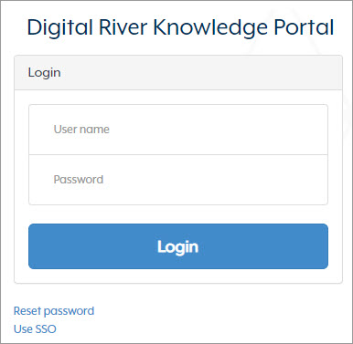
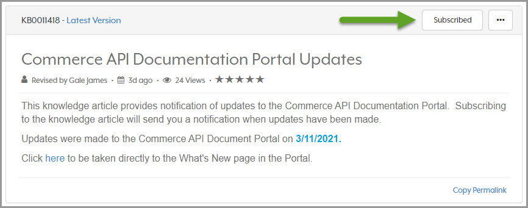

# Subscribe to updates

You can subscribe to Commerce API Documentation Portal Updates (KB0011418)  in the [Knowledge Portal](https://digitalriver.service-now.com/kb) to receive the latest information.

When you subscribe to updates, we will notify you when there are new additions and changes to the Commerce API. Subscribing to updates requires access to the Knowledge Portal. Clients and Partners have access to the Knowledge Portal. If you need help accessing the Knowledge Portal, contact your Digital River representative.

To subscribe to updates:

Once you sign in to the Knowledge Portal, click **Subscribe** to receive updates.

1. Go to: [https://digitalriver.service-now.com/kb?id=kb\_article\_view\&sysparm\_article=KB0011418](https://digitalriver.service-now.com/kb?id=kb\_article\_view\&sysparm\_article=KB0011418)
2. Provide your username and password and click **Login**. \
   **Note**: If you are a Digital River employee, click the **Use SSO** (Single Sign-on) link to access all apps on this site.\
   &#x20;&#x20;
3. Once you sign in to the Knowledge Portal, click Subscribe to receive updates.

