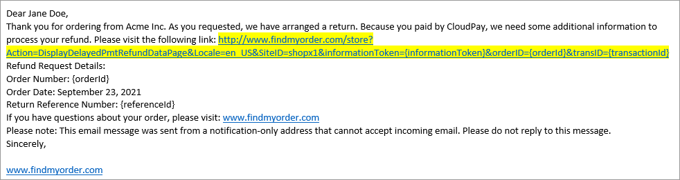
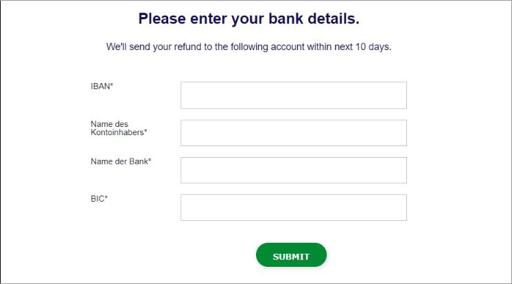

# Managing a refund for a delayed payment method

When you [create a refund](creating-a-satisfaction-refund.md#creating-a-satisfaction-refund-programmatically) for a shopper, delayed payment methods such as [Boleto](../../payments/payments-solutions/digitalriver.js/payment-methods/boleto.md), [Konbini](../../payments/payments-solutions/digitalriver.js/payment-methods/konbini.md), and [Wire Transfer](../../payments/payments-solutions/digitalriver.js/payment-methods/wire-transfer.md) require some extra steps to complete the refund.&#x20;

When a shopper using a delayed payment method requests a refund, they will receive [delayed payment instructions](../../payments/payments-solutions/digitalriver.js/reference/elements/delayed-payment-instructions-element.md).

To receive the refund, the shopper must click the link (highlighted in yellow above) in the email that directs them to the page where they can provide their account information for their chosen payment method.

When the shopper completes the fields and submits the information, the information is returned to DigitalRiver.js and the Payment service, and the system processes the refund.
