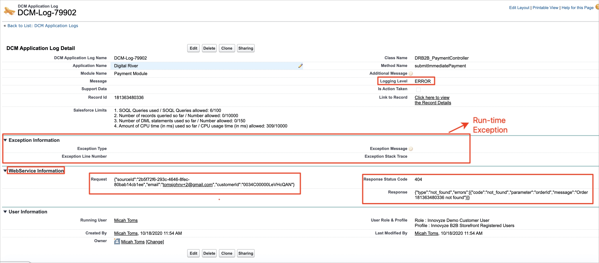
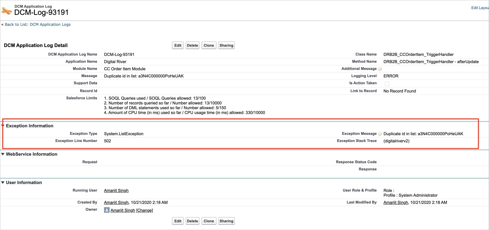
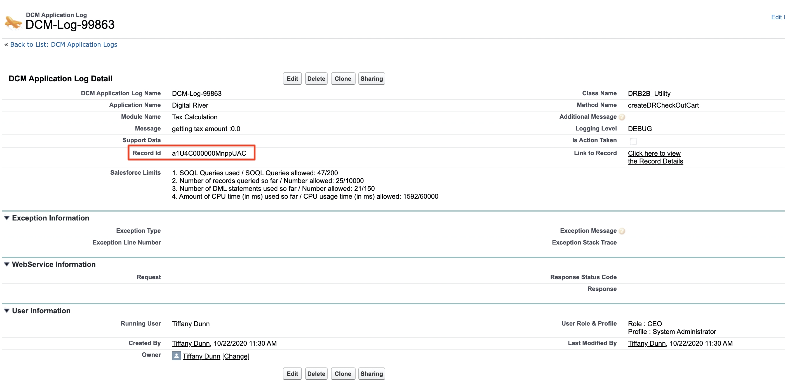

# Salesforce B2B Commerce App logs

All Salesforce B2B Commerce App application logs are logged to a custom object called DCM Application Logs “**digitalriverv2\_\_DCM\_Applications\_Log\_\_c**”. The default logging level of the app is always set to `ERROR`. That is, it only logs errors. You can modify the default logging level in [Step 13](integrating-the-digital-river-salesforce-b2b-commerce-app/step-13-configure-the-digital-river-app-logs.md).

The app displays generic user-friendly error messages on the storefront user interface (UI), and the actual Error/Exception details will be logged to the DCM application log object. The **Logging Level** field on this object indicates the severity level of the log created by the application.

As you can see in the image above, there was an error while making a callout to Digital River API (Logging Level field is set to ERROR), and the request/response information is logged for debugging purposes. There are fields in this Log object that capture run-time exception information, as shown in the following image:

The **Record Id** field has information about the Salesforce or Digital River record that generated this log. In the following example, the Salesforce Record ID, a1U4C000000MnppUAC, generated the log. Note that the **Logging Level** for this record is **DEBUG**. That is, the severity level of this log is DEBUG, and this is only for debugging purposes. You can click the link next to the **Link to Record** field to go to the Salesforce record for the ID captured in the **Record Id** field.

Similarly, we have other fields for capturing User information (User Information section), Salesforce Governor Limits, and other support data. In case of any errors/exceptions encountered in the app, DCM Application logs would be the first place to go for debugging purposes.

**​**
