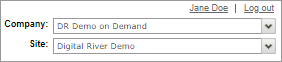

# Configuring taxes

Digital River automatically calculates taxes for you. All you have to do is tell us whether [taxes are included or not included in your price list](./#setting-the-price-list-to-tax-inclusive-or-exclusive) and [shipping cost](./#setting-the-shipping-cost-to-tax-inclusive-or-exclusive).&#x20;


How [taxes should be displayed](./#guidelines-for-displaying-tax-1) to a customer during the shopping experience depends on the country.


## Setting the price list to tax inclusive or exclusive

Use the Prices Include Value Added Tax (VAT) dropdown list in [Global Commerce](https://gc.digitalriver.com/gc/ent/login.do) to set a price list to tax inclusive (Yes) or tax exclusive (No).  If you are using the landed costs feature, you must set Prices Include value Added Tax (VAT) to No. &#x20;

You need the Pricing Manager role to perform this task.

1. Sign in to [Global Commerce](https://gc.digitalriver.com/gc/ent/login.do).
2. If your company has more than one site, select the site from the **Sites** field. If your company has only one site, Global Commerce automatically populates the **Site** field.\
   &#x20;&#x20;
3. Select **Catalog**, select **Pricing & Plans**, and click **Manage Price Lists**. The Price Lists page appears.
4. Complete the search fields under the **Search and Filters** tab and then click **Search**  to locate the specific price lists. The results appear in the Price Lists list.
5. Click the link for the price list under the **Name** column. The Price List Details page appears.
6. Scroll down to **Currencies** and click **Edit**. The Edit Price List Currency page appears.
7. Select the currency you want to modify from the **Currency** dropdown list.
8. Select **Yes** for tax inclusive or **No** for tax-exclusive from the **Prices Include value Added Tax (VAT)** dropdown list.
9. Click **Save**.

## Setting the shipping cost to tax inclusive or exclusive

Shipping taxes are automatically calculated.&#x20;

If you toggle Input Tax-Inclusive Shipping to ON in [Global Commerce](https://gc.digitalriver.com/gc/ent/login.do), will handle input shipping costs based on the tax-inclusive flag of the price list. When the toggle is ON, it will refer to the configured price list as follows:&#x20;

* If the price list is tax inclusive, then the shipping and handling fee (`shippingAndHandling`) is tax inclusive.&#x20;
* If the price list is tax exclusive, then the shipping and handling fee is tax exclusive.

When the toggle is OFF, the shipping and handling fee will always be tax exclusive.&#x20;


You need the Content Manager role to perform this task.


1. From [Global Commerce](https://gc.digitalriver.com/gc/ent/login.do), select **Administration**, select **Site**, and click **Configure Site Settings**.
2. Click the **Features** tab.
3. Scroll down to **Input Tax-Inclusive Shipping Cost**.
4. Toggle [**Input Tax-Inclusive Shipping** to **ON** or **OFF**](./#guidelines-for-displaying-tax).
5. Click **Save**.

## Guidelines for displaying tax 

The display of tax during the entire shopping experience should follow [these guidelines](https://digitalriver.service-now.com/kb?id=kb\_article\_view\&sysparm\_article=KB0010559\&sys\_kb\_id=a6423b4c1b769090f4304158dc4bcbc3\&spa=1) _(access required)_.
