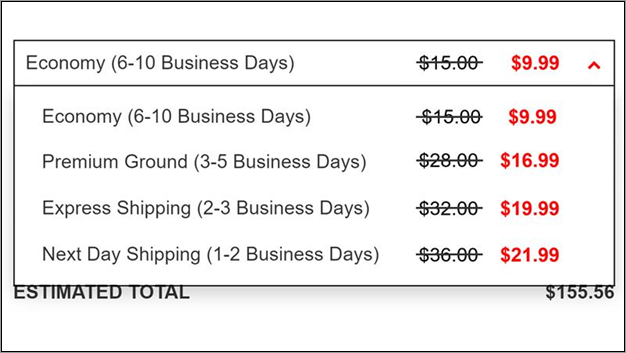

# Providing a shipping discount

You can apply a shipping discount to a customer's order. When you apply a shipping discount, it reduces the cost of the shipping rate for the customer.&#x20;

You can display the shipping discount in the cart and the order summary. The cart shows the discounted amount for the Shipping value.

.png>)

In the order summary, the original shipping rate will appear with a strikethrough next to the discounted rate following each shipping method. This allows the customer to see the shipping discount applied to the order.

## Creating a shipping discount offer

To create a shipping discount offer for an order:


You need the Merchandising Manager and Merchandising Discount Manager role in Global Commerce to perform this task.


1. Sign in to [Global Commerce](https://gc.digitalriver.com/gc/ent/login.do).
2. Select **Marketing**, select **Offers and Programs**, and then click **Create Offer**. The Type step on the Create Offer page appears.
3. Type the name of the offer in the **Name** field and provide a description of the offer in the **Description** field.
4. Type the identifier for the offer in the **External Reference Offer ID** field. You can use any combination of numbers and letters. This identifier is used to cross-reference an offer between Global Commerce and your external marketing application.
5. Under **Expiration**, select the start and end date options you want to use and enter a start and end date if required.
6. Under **Type**, [choose the type of shipping discount](https://help.digitalriver.com/help/gc/Marketing/Offers/Configuring-the-offer-type.htm#ShippingCostDiscount) from the options under **Shipping Cost Discount** and select the shipping offer type from the associated dropdown list.
7. Under **Trigger**, [choose the trigger type](https://help.digitalriver.com/help/gc/Marketing/Offers/Configuring-the-offer-type.htm#Trigger) for the shipping discount from the list.
8. Click **Next**. The Behavior step appears.
9. Under [**Offer Controls**](https://help.digitalriver.com/help/gc/Marketing/Offers/Defining-how-the-offer-behaves.htm#OfferControls):&#x20;
   * Optional. Select the **Limit Total Usage** check box if you want to restrict the total usage of the offer in your store, and specify the total number of uses per offer in your store.
   * Choose the **Allow Offer on All Locales** or the **Restrict Offer to Specific Locales** option.
10. Under [**Subscription Controls**](https://help.digitalriver.com/help/gc/Marketing/Offers/Defining-how-the-offer-behaves.htm#SubscriptionControls), select the check boxes that apply to your subscription product.
11. Under [**Offer Tracking**](https://help.digitalriver.com/help/gc/Marketing/Offers/Defining-how-the-offer-behaves.htm#OfferTracking), select one of the marketing options from the **Marketing Channel Type** dropdown list.
12. Click **Next**. The Products and Pricing step or Pricing step appears.&#x20;
13. Complete the fields in the **Products and Pricing** step or **Pricing** step. See [Associating products and pricing with the offer](https://help.digitalriver.com/help/gc/Marketing/Offers/Associating-products-and-pricing-with-the-offer.htm) for more information on the panes and fields.&#x20;
14. Click **Next**. The Display Content step appears.
15. Complete the fields in the **Display Content** step. See [Configuring the offer's content](https://help.digitalriver.com/help/gc/Marketing/Offers/Configuring-the-offers-content.htm) for more information on the panes and fields.
16. Click **Next**. The Review step appears.
17. Use the **Review** step to view the summary of the offer you just created. Based on your review, choose one of the following options:&#x20;
    * To change the offer, click **Previous** until you see the information you want to edit and apply your changes.&#x20;
    * To create a coupon code offer, click **Finish**, click **Yes** when prompted to add coupon codes, and then complete the fields to add the coupon codes.&#x20;
    * When you are satisfied with the offer setup, click **Finish** to complete the offer. A message appears asking you if you want to deploy the offer now. Click **OK** to create and deploy the offer or click **Cancel** to create the offer. You can deploy the offer when you want it to appear on your site. Shoppers will not see the offer on your site until you deploy the offer.


Once you complete the Create Offer wizard and save an offer, you cannot change the type.

