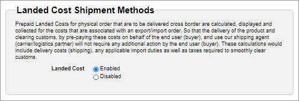

# Landed costs

Landed cost represents the total amount your customer must pay to purchase a physical product from one country and have it shipped to an address in another country. It includes international shipping, [taxes](../../configuring-taxes/), and relevant taxes and duties.

A cross-border transaction often incurs additional duties that are not displyed to the customer at the time of checkout. The customer, however, is still responsible for paying these hidden costs when the order arrives at its destination.

You can use the Digital River [landed cost feature](./#digital-rivers-landed-cost-feature) to present customers with the full cost of international orders, thereby minimizing both customs delays and unanticipated expenses at the time of delivery.&#x20;

Once [configured](./#configuring-the-landed-cost-feature), the feature is [automatically triggered](./#triggering-the-landed-cost-feature) on applicable orders. For these orders, [cross-border specific cost are calculated](./#calculating-landed-cost) and [built into the order total](./#collecting-landed-cost).&#x20;

Landed cost is represented by several attributes at both the [cart or order level](./#cart-or-order-level-attributes) and the [line-item level](./#line-item-level-attributes). These allow you to determine the total duty paid on the order as well as who remits the various taxes.&#x20;


Digital River only supports landed cost mixed cart and landed cost pretty pricing for the API solution. Digital River does not support landed cost mixed cart and landed cost pretty price for the Global Commerce-hosted flow. If you want to use this feature, contact your Customer Success Manager.


## Considerations

Shipments from one EU member state to another EU member state are not considered cross-border as EU regulations permit transportation between member states without the need for customs control and payment of duties.

## Digital River’s landed cost feature

Once [you have it correctly configured](./#configuring-the-landed-cost-feature), the Digital River landed cost feature automatically [calculates](./#calculating-landed-cost) and [collects](./#collecting-landed-cost) the total landed cost of [every applicable order](./#triggering-the-landed-cost-feature).&#x20;

The landed cost feature is available to anyone who integrates with the Commerce API. This is true whether you orchestrate your own fulfillment or delegate the responsibility to Digital River.

### Configuring the landed cost feature

To configure the [landed cost feature](./#digital-rivers-landed-cost-feature), you'll need to complete the following steps:

1. Verify your fulfiller ships packages outside their country (not all fulfillers provide this service).
2. Verify your shipper is willing and able to prepay the landed cost on behalf of the customer and then send the invoice to you.
3. Sign an addendum in your Digital River contract to enable landed cost.
4. For each product in your catalog that is eligible for cross-border shipping, specify the [Harmonized System code](https://www.trade.gov/harmonized-system-hs-codes) when [creating ](./#creating-a-product-for-landed-costs)or updating the product.
5. Define the cross-border patterns (that is, the ship-to or ship-from countries) where you want to enable the landed cost feature. These ship-to countries must be supported by Digital River and cannot include embargoed nations.
6. Provide samples of completed customs forms to Digital River's Compliance department for approval.
7. Provide your account manager with a list of the ship from and ship to countries for which you want to enable the collection of landed costs. Before you use the Landed Cost resource, Digital River must enable landed costs. If the landed cost is not enabled, the [Landed Cost Shipment Method](./#enabling-the-landed-costs-in-global-commerce) won't appear in Global Commerce.&#x20;

### Enabling the landed costs in Global Commerce


You need the Account Manager role in Global Commerce to perform this task.


To enable landed costs for your site from Global Commerce:

1. Sign in to [Global Commerce](https://gc.digitalriver.com/gc/ent/login.do).
2. If your company has more than one site, select the site from the **Sites** field. If your company has only one site, Global Commerce automatically populates the **Site** field.\
   &#x20;&#x20;
3. Select **Administration**, select **Site**, and click **Configure Site Settings**.
4. Click the **Fulfillment** tab and scroll down to **Landed Cost Shipment Methods**.\
   &#x20;&#x20;
5. Select **Enabled** and then click **Save**.

### Setting the price list to tax exclusive


You need the Pricing Manager role to perform this task.


You must set the price list to tax exclusive to use the landed costs feature. When you set the price list to tax-exclusive, the `shippingAndHandling` value is also tax exclusive.

1. From [Global Commerce](https://gc.digitalriver.com/gc/ent/login.do), select **Catalog**, select **Pricing & Plans**, and click **Manage Price Lists**. The Price Lists page appears.
2. Complete the search fields under the **Search and Filters** tab and click **Search**  to locate the specific price list. The results appear under Price Lists.
3. Click the link for the price list under the **Name** column. The Price List Details page appears.
4. Scroll down to **Currencies** and click **Edit**. The Edit Price List Currency page appears.
5. Select the currency you want to modify from the **Currency** dropdown list.
6. Select **No** from the **Prices Include value Added Tax (VAT)** dropdown list. When you select No, the price does not include VAT (tax exclusive).
7. Click **Save**.

### Creating a product for landed costs

When [creating a product](https://help.digitalriver.com/help/gc/Products/All-Products/Creating-a-product.htm#Creating) for landed costs in [Global Commerce](https://gc.digitalriver.com/gc/ent/login.do), from the [Product Settings step](https://help.digitalriver.com/help/gc/Products/All-Products/Configuring-the-product-settings.htm), you must:

1. Select the [Product Classification Type](https://help.digitalriver.com/help/gc/Products/All-Products/Configuring-the-product-settings.htm#ProductClassificationType) under [**Export Controls**](https://help.digitalriver.com/help/gc/Products/All-Products/Creating-a-product.htm#ExportControls).&#x20;
2. Select the appropriate product classification from the list.
3. Specify the [Harmonized System code](https://www.trade.gov/harmonized-system-hs-codes) in the [**Harmonized Tariff Schedule/Schedule B Number**](https://help.digitalriver.com/help/gc/Products/All-Products/Configuring-the-product-settings.htm#Harmonized) field.
4. Complete the physical settings under [**Physical**](https://help.digitalriver.com/help/gc/Products/All-Products/Configuring-the-product-settings.htm#Physical).
5. Select the [**Enable Landed Cost**](https://help.digitalriver.com/help/gc/Products/All-Products/Configuring-the-product-settings.htm#EnableLandedCosts) check box.
6. Complete the fields under [**Product Fulfillers**](https://help.digitalriver.com/help/gc/Products/All-Products/Configuring-the-product-settings.htm#ProductFulfillers).

### Triggering the landed cost feature

Once you have successfully [configured the feature](./#configuring-the-landed-cost-feature), landed cost is calculated on orders where the physical products are shipped across international borders to an approved country. The exception is the European Union, where shipments between countries are exempt from duties.

More precisely, [landed cost is automatically calculated](./#calculating-landed-cost) when you submit a `POST/carts` request, and all of the following conditions exist:

* The order contains [physical products](./#creating-a-product-for-landed-costs) and digital products as long as it follows the guidelines for mixed cart scenarios
* The ship-from country and the ship-to country are different
* The ship-from country and the ship-to country are _both_ non-EU nations&#x20;
* The ship-to country is on our approved list&#x20;
* Product and shipping choice prices are provided in the request,. and these values are inclusive of any applied discounts
* Each product in the order contains a [Harmonized System code](./#creating-a-product-for-landed-costs) that is registered in our system


The landed cost feature does not support mixed cart orders. If some items in the order are eligible for landed cost calculation but others are not, your integration must to calculate landed costs on applicable orders and submit multiple orders.&#x20;


### Calculating landed cost

To calculate landed costs on [applicable orders](./#triggering-the-landed-cost-feature), Digital River makes an API call to a third-party service. For each call to the service, we assess a fee. This fee is in addition to the other license or transaction fees that you may incur.

### Collecting landed cost

In the response, we provide you an [itemized breakdown](./#how-landed-cost-is-represented) of the duties and taxes that comprise the landed cost and build these individual costs into the order total. Since your customers ultimately pay the full landed cost, we recommend you display this cost breakdown to them on your storefront.&#x20;

Once the [cart is submitted](../../submitting-a-cart/), your fulfiller relays it to your shipper, who completes the customs paperwork, ships the package to the destination country, and pays the duties and import taxes on behalf of your customer. The shipper then invoices you the shipping costs.

### Handling calculation failures

A landed cost calculation may fail for a number of reasons. For example, a customer may attempt to ship a product to an embargoed country or you might have improperly formatted the [Harmonized System codes](./#creating-a-product-for-landed-costs) associated with the product. Additionally, in certain situations, the [third-party landed cost calculation service](./#calculating-landed-cost) may be unavailable.

### Refunding landed cost

For orders with landed costs, if you need to reverse the charges, we support full [refunds](https://docs.digitalriver.com/commerce-api/returns-and-refunds-1/refunds) of the importer tax. If you want to offer partial refunds, contact your account representative.

## How landed cost is represented

The following tables list the landed cost parameters. Note that you are responsible for remitting the duty and the importer of record tax on behalf of the customer.

### Cart or order-level attributes

| Attributes                  | Type   | Description                                                                                            |
| --------------------------- | ------ | ------------------------------------------------------------------------------------------------------ |
| `landedCostState`           |        | The [state of landed cost](./#landed-cost-state).                                                      |
| `importTaxAndDuty`          | object | The sum of import taxes and duties for all line items.                                                 |
| `formattedImportTaxAndDuty` |        | The sum of import taxes and duties in locale currency format (for example, USD 19.14).                 |
| `shippingAndHandling`       | object | The shipping and handling fee is tax exclusive and applied against the product and the shipping cost.  |

### Line-item level attributes

| Attributes            | Definition | Description                                                                                                                                                                                                                                                                                                                                                                                                                                                                                     |
| --------------------- | ---------- | ----------------------------------------------------------------------------------------------------------------------------------------------------------------------------------------------------------------------------------------------------------------------------------------------------------------------------------------------------------------------------------------------------------------------------------------------------------------------------------------------- |
| `importTax`           | Object     |  VAT or other sales tax accessed on the transaction.                                                                                                                                                                                                                                                                                                                                                                                                                                            |
| `formattedImportTax`  |            | The VAT or other sales tax accessed on the transaction in locale currency format (for example, USD 7.56)                                                                                                                                                                                                                                                                                                                                                                                        |
| `importDuty`          | Object     | 
When a customer purchases products online, one or more of the products may not originate in the country the customer resides in, and therefore are subject to a customs duty when transported across international borders.

When goods are not shipped domestically (within the customer’s country) or within a single customs union, such as the European Union, the customer is liable to pay any inbound duties which the customer’s local customs authority deems appropriate.
 |
| `formattedImportDuty` |            | The sum of duties in a locale currency format (for example, USD 5.29).                                                                                                                                                                                                                                                                                                                                                                                                                          |

## Landed cost state

A cart or an order has a `landedCostState` attribute that provides information about the status of landed cost.&#x20;


The customer must prepay the landed cost.&#x20;


Digital River automatically calculates the landed cost and includes it in the Cart or Order when the landed cost is `PREPAID`.

### Landed cost state enumerations for the Cart API

The `landedCostState` of the Cart is enumerated by the following values:

* `NOT_ELIGIBLE`–The current cart is not eligible for landed cost calculation.
* `PREPAID`–The current cart is eligible for landed cost calculation, and the landed cost will be prepaid.
* `VIEWED_NOT_ELIGIBLE`–The landed cost state was `ELIGIBLE` or `PREPAID`, then became not eligible due to a change in the order that triggered the status to change to `VIEWED_NOT_ELIGIBLE`. For example, the customer changed their shipping address, added a line item, or removed a line item.
* `ERROR`–Failed to calculate landed cost. This occurs when the integration service is unavailable.

### Landed cost state enumerations for the Order API

The `landedCostState` of the Order is enumerated by the following values:

* `NOT_ELIGIBLE`–The landed cost for the requisition is not prepaid.
* `PREPAID`–The landed cost for the requisition was prepaid.
* `VIEWED_NOT_ELIGIBLE`–The landed cost for the requisition is not prepaid.
* `ERROR`–The landed cost for the requisition is not prepaid.
