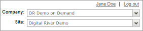

# Pretty pricing

Pretty pricing is a feature that allows you to display a price that appeals to your shoppers. This guide shows you how to enable and use landed cost with pretty pricing.

See[ Best practice flows by payment type](../../../../payments/sources/using-the-source-identifier.md#best-practice-flows-by-payment-type) for more information.

## Prerequisites


Pretty pricing is based on the [landed cost](./) feature. Customer Success must enable landed cost and pretty pricing to use this feature. Contact your Customer Success Manager for assistance.


To enable pretty pricing, you need to:

1. Work with your Customer Success Manager to enable landed cost.
2. Work with your Customer Success Manager to enable landed cost pretty price.
3. [Create a price list](pretty-pricing.md#creating-a-price-list-with-pretty-pricing) and enable Prices Include Value Added Tax (VAT).
4. [Set the shipping cost to tax exclusive](pretty-pricing.md#setting-the-shipping-cost-to-tax-exclusive).

## Creating a price list with pretty pricing

Price lists allow you to define how to convert product prices from the default currency to other currencies for different locales. Create a price list with Prices Include Value Added Tax (VAT) enabled to enable pretty pricing.

1. Sign in to [Global Commerce](https://gc.digitalriver.com/gc/ent/login.do).
2. If your company has more than one site, select the site from the **Sites** field. Global Commerce automatically populates the **Site** field if your company has only one site.\
   &#x20;&#x20;
3.  Select **Catalog**, select **Pricing & Plans**, and then choose one of the following options:

    * Click **Create Price List**.
    * Click **Manage Price Lists** and then click **Create Price List**.&#x20;

    The Create Price List page appears.&#x20;

    <figure><figcaption></figcaption></figure>
4. Complete the fields, and select the **Prices Include Value Added Tax (VAT)** checkbox to enable tax-inclusive pricing. See [Create Price List](https://help.digitalriver.com/help/gc/Products/Price-Lists/Creating-a-price-list.htm?Highlight=Price%20List#CreatePriceListAttributes) attributes for more information.
5.  Click **Save**. The Price List Details page appears.

    <figure><figcaption></figcaption></figure>
6. Complete the fields on the Price List Details page. See the [Price List Details attributes](https://help.digitalriver.com/help/gc/Catalog/Pricing-and-Plans/Managing-price-list-details.htm#PriceListDetailsAttributes) for more information.
7. Scroll down and click **Done**.

## Setting the shipping cost to tax exclusive

The Features tab on the Configure Site Settings page allows you to enable or disable features that appear in your store. For landed cost and landed cost pretty pricing, shipping costs should be tax exclusive.

1.  From [Global Commerce](https://gc.digitalriver.com/gc/ent/login.do), select **Administration**, select **Site**, then click **Configure Site Settings**. The Configure Site Settings page appears.

    <figure><figcaption></figcaption></figure>
2.  To set the shipping cost to tax exclusive, click the **Features** tab, scroll down to **Input Tax-Inclusive Shipping Cost**, and set the toggle for **Input Tax-Inclusive Shipping** to **OFF**. Digital River will send the tax-exclusive shipping costs to the shipping carrier for the landed cost calculation. This ensures the shopper is not double-taxed by the shipping carrier.\
    \
    **Note**: If you need to support shipping a product to another locale within a country (non-cross border), and the locale supports the landed cost solution, contact your Customer Success Manager.

    <figure><figcaption></figcaption></figure>
3. Click **Apply**.

## Landed cost without pretty pricing

When pretty pricing is disabled, the landed cost solution can only accept the Tax Exclusive Product Price. You need to manually calculate a tax-exclusive price, and then add the tax-exclusive price to the price list. If the tax-inclusive price is $1599, you can back-calculate the product price to $1279.2 without taxes. If a locale does not accept decimals, Digital River rounds the price to $1279.

Product pricing setup:

* Physical product price (tax exclusive): $1279
* Shipping cost (tax exclusive): $0 (free shipping)
* Estimated tax rate configured by Digital River: 25%

In the following table, you can see the final price (`orderTotal`) is $1598.75. While its not a pretty price, it's close to the expected $1599.

|                    | Cart without address input                                                                                                                                                                                                                                                      | Cart with address / submit cart                                                                                                                                                                                                                                               |
| ------------------ | ------------------------------------------------------------------------------------------------------------------------------------------------------------------------------------------------------------------------------------------------------------------------------- | ----------------------------------------------------------------------------------------------------------------------------------------------------------------------------------------------------------------------------------------------------------------------------- |
| Physical line item | 
<code>listPrice: 1279</code>

<code>salePrice: 1279</code>

<code>productTax: 319.75</code> 

<code>shippingTax: 0</code>

<code>feeTax: 0</code>

<code>taxRate: 0.25</code> 

<code>importTax: 0</code>

<code>importDuty: 0</code>
 | 
<code>listPrice: 1279</code>

<code>salePrice: 1279</code>

<code>productTax: 0</code>

<code>shippingTax: 0</code>  

<code>feeTax: 0</code>

<code>taxRate: 0</code>

<code>importTax: 319.75</code> 

<code>importDuty: 0</code>
 |
| Order level        | 
<code>subtotal: 1598.75</code>

<code>discount: 0</code>

<code>shippingAndHandling: 0</code>

<code>importTaxAndDuty: 0</code>

<code>tax: 319.75</code> 

<code>orderTotal: 1598.75</code> 
                                                   | 
<code>subtotal: 1598.75</code>

<code>discount: 0</code>

<code>shippingAndHandling: 119</code>

<code>importTaxAndDuty: 319.75</code>

<code>tax: 0</code> 

<code>orderTotal: 1598.75</code> 
                                               |
| Tax inclusive flag | `taxinclusive: false`                                                                                                                                                                                                                                                           | `taxInclusive: false`                                                                                                                                                                                                                                                         |

## Landed cost with pretty pricing

Product pricing setup:

* Physical product price (tax inclusive): $1599
* Shipping cost (tax exclusive): $0 (free shipping)
* Estimated tax rate configured by Digital River: 25%

In the following table, you can see the pretty pricing in the final price where the `orderTotal` is $1599.&#x20;

|                    | Cart without address input                                                                                                                                                                                                                                                    | Cart with address / submit cart                                                                                                                                                                                                                                             |
| ------------------ | ----------------------------------------------------------------------------------------------------------------------------------------------------------------------------------------------------------------------------------------------------------------------------- | --------------------------------------------------------------------------------------------------------------------------------------------------------------------------------------------------------------------------------------------------------------------------- |
| Physical line item | 
<code>listPrice: 1599</code>

<code>salePrice: 1599</code>

<code>productTax: 319.8</code> 

<code>shippingTax: 0</code>

<code>feeTax: 0</code>

<code>taxRate: 0.25</code>

<code>importTax: 0</code>

<code>importDuty: 0</code>
 | 
<code>listPrice: 1599</code>

<code>salePrice: 1599</code>

<code>productTax: 0</code>

<code>shippingTax: 0</code>  

<code>feeTax: 0</code>

<code>taxRate: 0</code>

<code>importTax: 319.8</code>

<code>importDuty: 0</code>
 |
| Order level        | 
<code>subtotal: 1599</code>

<code>discount: 0</code>

<code>shippingAndHandling: 0</code>

<code>importTaxAndDuty: 0</code>

<code>tax: 319.8</code> 

<code>orderTotal: 1599</code> 
                                                        | 
<code>subtotal: 1599</code>

<code>discount: 0</code>

<code>shippingAndHandling: 119</code>

<code>importTaxAndDuty: 319.8</code> 

<code>tax: 0</code> 

<code>orderTotal: 1599</code>
                                                    |
| Tax inclusive flag | `taxInclusive: true`                                                                                                                                                                                                                                                          | `taxInclusive: true`                                                                                                                                                                                                                                                        |

See [Pricing fields](../../../../general-resources/shopper-apis-reference/carts/#pricing-fields) for more information.

## Pretty pricing in the shopper's checkout flow

### Cart&#x20;

The callouts in the following list show the API response payloads that correspond with the pretty pricing values that appear on the Cart page.

<figure><figcaption></figcaption></figure>

1. The total calculated price for the line item with quantity ([`listPriceWithQuantity`](../../../../general-resources/shopper-apis-reference/carts/pricing.md#list-price-with-quantity)). You can find it here in the response:\
   \
   `"lineItems": {`\
   `...`\
   &#x20; `"lineItem": {`\
   &#x20;     `"pricing": {` \
   `...` \
   &#x20;      `"listPriceWithQuantity": {` \
   &#x20;        `"currency": "USD",` \
   &#x20;        `"value": 3016.00` \
   `...`\
   &#x20;      `},` \
   `...`\
   &#x20;   `}`\
   `...`\
   &#x20; `}`\
   `...`\
   `}`
2. The  total calculated price for the line item with quantity ([`salePriceWithQuantity`](../../../../general-resources/shopper-apis-reference/carts/pricing.md#sale-price-with-quantity)). You can find it here in the response:\
   \
   `"lineItems": {`\
   `...`\
   &#x20; `"lineItem": {`\
   &#x20;     `"pricing": {` \
   `...` \
   &#x20;      `"salePriceWithQuantity": {` \
   &#x20;        `"currency": "USD",` \
   &#x20;        `"value": 2413.00`\
   `...`\
   &#x20;      `},` \
   `...`\
   &#x20;   `}`\
   `...`\
   &#x20; `}`\
   `...`\
   `}`
3. The shipping and handling fee of the order ([`shippindAndHandling`](../../../../general-resources/shopper-apis-reference/carts/pricing.md#shipping-and-handling)). You can find it here in the response:\
   \
   `"pricing": {` \
   `...` \
   &#x20;  `"shippingAndHandling": {` \
   &#x20;    `"currency": "USD",` \
   &#x20;    `"value": 171.00` \
   &#x20;  `},` \
   `...`\
   `}`
4. The final price of the order ([`orderTotal`](../../../../general-resources/shopper-apis-reference/carts/pricing.md#order-total)). You can find it here in the response:\
   \
   `"pricing": {` \
   `...` \
   &#x20;  `"orderTotal": {` \
   &#x20;    `"currency": "USD",` \
   &#x20;    `"value": 2513.00` \
   &#x20;  `},` \
   `...`\
   `}`

See [Pricing fields](../../../../general-resources/shopper-apis-reference/carts/#pricing-fields) for more information.

### Order review

The callouts in the following list show the API response payloads that correspond with the pretty pricing values that appear on the Order Review page.

<figure><figcaption></figcaption></figure>

1. The final price of the order ([`orderTotal`](../../../../general-resources/shopper-apis-reference/carts/pricing.md#order-total)). You can find it here in the response:\
   \
   `pricing` > `orderTotal`\
   `"pricing": {` \
   `...` \
   &#x20;  `"orderTotal": {` \
   &#x20;    `"currency": "USD",` \
   &#x20;    `"value": 2684.00`\
   &#x20;  `},` \
   `...`\
   `}`
2. The import taxes and duties of the order, which is the sum of import taxes and duties for all the line items ([`importTaxAndDuty`](../../../../general-resources/shopper-apis-reference/carts/pricing.md#import-tax-and-duty)). Make sure the value for [`landedCostState`](../../../../general-resources/shopper-apis-reference/carts/pricing.md#landed-cost-state) is `PREPAID`. You can find it here in the response:\
   \
   `pricing` > `orderTotal`\
   `"pricing": {` \
   `...` \
   &#x20;  `"importTaxAndDuty": {` \
   &#x20;    `"currency": "USD",` \
   &#x20;    `"value": 152.00`\
   &#x20;  `},` \
   `...`\
   `}`

See [Pricing fields](../../../../general-resources/shopper-apis-reference/carts/#pricing-fields) for more information.

### Thank you

The callouts in the following list show the API response payloads that correspond with the pretty pricing values that appear on the Thank You page.

<figure><figcaption></figcaption></figure>

1. The final price of the order ([`orderTotal`](../../../../general-resources/shopper-apis-reference/carts/pricing.md#order-total)). You can find it here in the response:\
   \
   `"pricing": {` \
   `...` \
   &#x20;  `"orderTotal": {` \
   &#x20;    `"currency": "USD",` \
   &#x20;    `"value": 2684.00`\
   &#x20;  `},` \
   `...`\
   `}`&#x20;

See [Pricing fields](../../../../general-resources/shopper-apis-reference/carts/#pricing-fields) for more information.

### Invoice

The callouts in the following list show the API response payloads that correspond with the pretty pricing values that appear on the Invoice.

<figure><figcaption></figcaption></figure>

1. The  total calculated price for the line item with quantity ([`salePriceWithQuantity`](../../../../general-resources/shopper-apis-reference/carts/pricing.md#sale-price-with-quantity)). You can find it here in the response:\
   \
   `"lineItems": {`\
   `...`\
   &#x20; `"lineItem": {`\
   &#x20;     `"pricing": {` \
   `...` \
   &#x20;      `"salePriceWithQuantity": {` \
   &#x20;        `"currency": "USD",` \
   &#x20;        `"value": 2413.00`\
   `...`\
   &#x20;      `},` \
   `...`\
   &#x20;   `}`\
   `...`\
   &#x20; `}`\
   `...`\
   `}`
2. The shipping and handling fee ([`shippindAndHandling`](../../../../general-resources/shopper-apis-reference/carts/pricing.md#shipping-and-handling)). You can find it here in the response:\
   \
   `"pricing": {` \
   `...` \
   &#x20;  `"shippingAndHandling": {` \
   &#x20;    `"currency": "USD",` \
   &#x20;    `"value": 171.00` \
   &#x20;  `},` \
   `...`\
   `}`
3. The final price of the order ([`orderTotal`](../../../../general-resources/shopper-apis-reference/carts/pricing.md#order-total)). You can find it here in the response:\
   \
   `"pricing": {` \
   `...` \
   &#x20;  `"orderTotal": {` \
   &#x20;    `"currency": "USD",` \
   &#x20;    `"value": 2513.00` \
   &#x20;  `},` \
   `...`\
   `}`
4.  The order-level import taxes and duty ([`importTaxAndDuty`](../../../../general-resources/shopper-apis-reference/carts/pricing.md#import-tax-and-duty)) is the sum of **all** line items' import taxes ([`importTax`](../../../../general-resources/shopper-apis-reference/carts/pricing.md#import-duty)) and import duties ([`importDuty`](../../../../general-resources/shopper-apis-reference/carts/pricing.md#import-duty)). For example:

    * `importDutyTax`: 75
    * `lineItem`: A
      * `importTax`: 15
      * `importDuty`: 10
    * `lineItem`: B
      * `importTax`: 30
      * `importDuty`: 20

    Make sure the value for [`landedCostState`](../../../../general-resources/shopper-apis-reference/carts/pricing.md#landed-cost-state) is `PREPAID`. You can find it here in the response:\
    \
    `"pricing": {` \
    `...` \
    &#x20;  `"importTaxAndDuty": {` \
    &#x20;    `"currency": "USD",` \
    &#x20;    `"value": 75.00`\
    &#x20;  `},` \
    `...` \
    &#x20;  `"importTax": {` \
    &#x20;    `"currency": "USD",` \
    &#x20;    `"value": 15.00`\
    &#x20;  `},` \
    `...   "importDuty": {` \
    &#x20;    `"currency": "USD",` \
    &#x20;    `"value": 10.00`\
    &#x20;  `},` \
    `...`\
    &#x20;  `"importTax": {` \
    &#x20;    `"currency": "USD",` \
    &#x20;    `"value": 30.00`\
    &#x20;  `},` \
    `...   "importDuty": {` \
    &#x20;    `"currency": "USD",` \
    &#x20;    `"value": 20.00`\
    &#x20;  `},` \
    `...`\
    `}`

See [Pricing fields](../../../../general-resources/shopper-apis-reference/carts/#pricing-fields) for more information.

### Additional pricing information

The callouts in the following list show the API response payloads that correspond with the pretty pricing values that appear on the Invoice as additional pricing information.

<figure><figcaption></figcaption></figure>

1. The  total calculated price for the line item with quantity ([`salePriceWithQuantity`](../../../../general-resources/shopper-apis-reference/carts/pricing.md#sale-price-with-quantity)). You can find it here in the response:\
   \
   `"lineItems": {`\
   `...`\
   &#x20; `"lineItem": {`\
   &#x20;     `"pricing": {` \
   `...` \
   &#x20;      `"salePriceWithQuantity": {` \
   &#x20;        `"currency": "USD",` \
   &#x20;        `"value": 2261.00`\
   `...`\
   &#x20;      `},` \
   `...`\
   &#x20;   `}`\
   `...`\
   &#x20; `}`\
   `...`\
   `}`
2. The tax amount for the product ([`productTax`](../../../../general-resources/shopper-apis-reference/carts/pricing.md#product-tax)) at the line-item level with quantity. You can find it here in the response:\
   \
   `"lineItems": {`\
   `...`\
   &#x20; `"lineItem": {`\
   `...`\
   &#x20;  `"id="488822300023",`\
   `...`\
   &#x20;     `"pricing": {` \
   `...` \
   &#x20;      `"productTax": {` \
   &#x20;        `"currency": "USD",` \
   &#x20;        `"value": 0.00`\
   `...`\
   &#x20;      `},` \
   `...`\
   &#x20;   `}`\
   `...`\
   &#x20; `}`\
   &#x20; `"lineItem": {`\
   `...`\
   &#x20;  `"id="488822300024",`\
   `...`\
   &#x20;     `"pricing": {` \
   `...` \
   &#x20;      `"productTax": {` \
   &#x20;        `"currency": "USD",` \
   &#x20;        `"value": 5.00`\
   `...`\
   &#x20;      `},` \
   `...`\
   &#x20;   `}`\
   `...`\
   &#x20; `}`\
   `...`\
   `}`
3. The sum of the import tax ([`importTax`](../../../../general-resources/shopper-apis-reference/carts/pricing.md#import-duty)) and import duty ([`importDuty`](../../../../general-resources/shopper-apis-reference/carts/pricing.md#import-duty)). (Make sure the value for [`landedCostState`](../../../../general-resources/shopper-apis-reference/carts/pricing.md#landed-cost-state) is `PREPAID`.) You can find it here in the response:\
   \
   `"lineItems": {`\
   `...`\
   &#x20; `"lineItem": {`\
   `...`\
   &#x20;  `"id="488822300023",`\
   `...`\
   &#x20;     `"pricing": {` \
   `...` \
   &#x20;    `"importTax": {` \
   &#x20;      `"currency": "USD",` \
   &#x20;      `"value": 103.00`\
   &#x20;    `},` \
   `...`\
   &#x20;    `"importDuty": {` \
   &#x20;      `"currency": "USD",` \
   &#x20;      `"value": 49.00`\
   &#x20;    `},` \
   `...`\
   &#x20; `}`\
   &#x20; `"lineItem": {`\
   `...`\
   &#x20;  `"id="488822300024",`\
   `...`\
   &#x20;     `"pricing": {` \
   `...` \
   &#x20;    `"importTax": {` \
   &#x20;      `"currency": "USD",` \
   &#x20;      `"value": 0.00`\
   &#x20;    `},` \
   `...`\
   &#x20;    `"importDuty": {` \
   &#x20;      `"currency": "USD",` \
   &#x20;      `"value": 0.00`\
   &#x20;    `},` \
   `...`\
   &#x20; `}`\
   `...`\
   `}`
4. The sale price with quantity ([`salePriceWithQuantity`](../../../../general-resources/shopper-apis-reference/carts/pricing.md#sale-price-with-quantity)) excluding the import tax ([`importTax`](../../../../general-resources/shopper-apis-reference/carts/pricing.md#import-tax)) and import duty ([`importDuty`](../../../../general-resources/shopper-apis-reference/carts/pricing.md#import-duty)).\
   \
   `"lineItems": {`\
   `...`\
   &#x20; `"lineItem": {`\
   `...`\
   &#x20;  `"id="488822300023",`\
   `...`\
   &#x20;     `"pricing": {` \
   `...` \
   &#x20;    `"salePriceWithQuantity": {` \
   &#x20;      `"currency": "USD",` \
   &#x20;      `"value": 2413.00`\
   &#x20;    `},` \
   `...`\
   &#x20; `}`\
   &#x20; `"lineItem": {`\
   `...`\
   &#x20;  `"id="488822300024",`\
   `...`\
   &#x20;     `"pricing": {` \
   `...` \
   &#x20;    `"salePriceWithQuantity": {` \
   &#x20;      `"currency": "USD",` \
   &#x20;      `"value": 100.00`\
   &#x20;    `},` \
   `...`\
   &#x20; `}`\
   `...`\
   `}`\

5. The shipping and handling fee ([`shippindAndHandling`](../../../../general-resources/shopper-apis-reference/carts/pricing.md#shipping-and-handling)). You can find it here in the response:\
   \
   `"pricing": {` \
   `...` \
   &#x20;  `"shippingAndHandling": {` \
   &#x20;    `"currency": "USD",` \
   &#x20;    `"value": 171.00` \
   &#x20;  `},` \
   `...`\
   `}`
6. The sum of import taxes and duties for all the line items ([`importTaxAndDuty`](../../../../general-resources/shopper-apis-reference/carts/pricing.md#import-tax-and-duty)). Make sure the value for [`landedCostState`](../../../../general-resources/shopper-apis-reference/carts/pricing.md#landed-cost-state) is `PREPAID`. You can find it here in the response:\
   \
   `"pricing": {` \
   `...` \
   &#x20;  `"importTaxAndDuty": {` \
   &#x20;    `"currency": "USD",` \
   &#x20;    `"value": 152.00`\
   &#x20;  `},` \
   `...`\
   `}`
7. The sum of all taxes ([`tax`](../../../../general-resources/shopper-apis-reference/carts/pricing.md#tax)) for the order. You can find it here in the response:\
   \
   `"pricing": {` \
   `...` \
   &#x20;  `"tax": {` \
   &#x20;    `"currency": "USD",` \
   &#x20;    `"value": 5.00`\
   &#x20;  `},` \
   `...`\
   `}`
8. The final price of the order ([`orderTotal`](../../../../general-resources/shopper-apis-reference/carts/pricing.md#order-total)). You can find it here in the response:\
   \
   `"pricing": {` \
   `...` \
   &#x20;  `"orderTotal": {` \
   &#x20;    `"currency": "USD",` \
   &#x20;    `"value": 2684.00` \
   &#x20;  `},` \
   `...`\
   `}`

See [Pricing fields](../../../../general-resources/shopper-apis-reference/carts/#pricing-fields) for more information.
