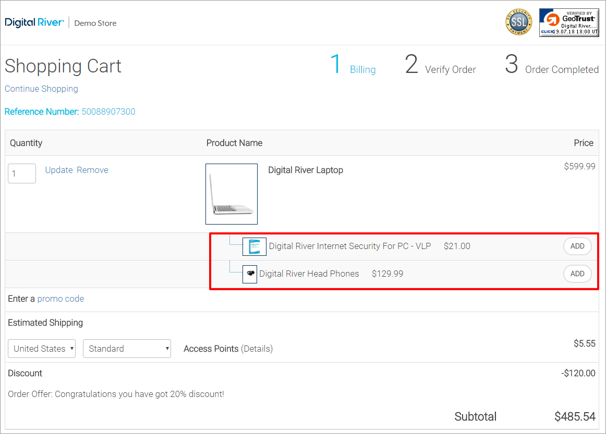

# How to use point of promotions (POPs)

Offers use a POP to display the offer. A POP determines where an offer appears in an online store. A POP can be an interstitial page, banner or homepage image, pop-up window, etc. You can configure the offer's POP when you configure the offer in Global Commerce. Offers retrieved for a cart using the [Offers ](https://www.digitalriver.com/docs/commerce-shopper-api/#tag/Offers)resource must be POP-driven. Providing a POP when getting offers for a shopper or products is now optional. The system automatically applies the following offers to a cart:

* Certain offers without POPs, such as shipping offers
* Discounts
* Bundles.
* Buy M, Get N

<div align="left">



</div>




```http
curl --location --request GET 'https://api.digitalriver.com/v1/shoppers/me/point-of-promotions/Home_topSeller/offers' \
--header 'authorization: bearer ***\
...
```





```json
{
	"offers": {
		"offer": [
			{
				"name": "Home_topSeller_1",
				"productOffers": {
					"_uri": "https://api.digitalriver.com/v1/shoppers/me/point-of-promotions/Home_topSeller/offers/offer_ID/product-offers"
				},
				"_uri": "https://api.digitalriver.com/v1/shoppers/me/point-of-promotions/Home_topSeller/offers/offer_ID"
			},
			{
				"name": "Home_topSeller_2",
				"productOffers": {
					"_uri": "https://api.digitalriver.com/v1/shoppers/me/point-of-promotions/Home_topSeller/offers/offer_ID/product-offers"
				},
				"_uri": "https://api.digitalriver.com/v1/shoppers/me/point-of-promotions/Home_topSeller/offers/offer_ID"
			},
			{
				"name": "Home_topSeller_3",
				"productOffers": {
					"_uri": "https://api.digitalriver.com/v1/shoppers/me/point-of-promotions/Home_topSeller/offers/offer_ID/product-offers"
				},
				"_uri": "https://api.digitalriver.com/v1/shoppers/me/point-of-promotions/Home_topSeller/offers/offer_ID"
			},
			{
				"name": "Home_topSeller_4",
				"productOffers": {
					"_uri": "https://api.digitalriver.com/v1/shoppers/me/point-of-promotions/Home_topSeller/offers/offer_ID/product-offers"
				},
				"_uri": "https://api.digitalriver.com/v1/shoppers/me/point-of-promotions/Home_topSeller/offers/offer_ID"
			}
		],
		"_uri": "https://api.digitalriver.com/v1/shoppers/me/point-of-promotions/Home_topSeller/offers"
	}
}
```




You do not need to send additional API calls to get these offers when a shopper adds products to a cart.

You cannot use the [Offers ](https://www.digitalriver.com/docs/commerce-api-reference/#tag/Offers)resource to retrieve coupon-related offers. However, you can apply a coupon or promo coupon to a cart using the `POST shoppers/me/carts/active` resource method in the Carts API. When you update your cart, the coupon discount will be applied automatically. If you want to know what coupon offer the shopper applied to the cart, you can easily find out.

The [Offers ](https://www.digitalriver.com/docs/commerce-shopper-api/#tag/Offers)resource returns the configured attributes for an offer. The product offer contains offer-specific information on the product, including the offer-specific price of the product. You can apply the Offers and [Product Offers](https://www.digitalriver.com/docs/commerce-shopper-api/#tag/Product-Offers) resources to a product, cart, or shopper. Feature product offers, such as banners, are specific to a shopper. Shipping and candy rack offers are particular to a cart, and bundled parent-child product offers are specific to a product.

To retrieve all available offers for a shopper, product, or cart resource respectively, use the following resources:

* `GET v1/shoppers/me/point-of-promotions/{popName}/offers`
* `GET v1/shoppers/me/products/{productId}/point-of-promotions/{popName}/offers`
* `GET v1/shoppers/me/carts/active/point-of-promotions/{popName}/offers`
* `GET v1/shoppers/me/carts/active/applied-offers`

The `popName` and ID originates in Digital River.

The system applies offers to a cart—it does not apply offers to a shopper. The API applies offers to the line items within a cart. Coupon code limits may apply to a shopper if you configure a coupon code offer in Digital River to limit the code to one per shopper.

When you configure multiple offers for a product, the offer that provides the greatest discount (the lowest price) for an order takes precedence. Also, you can apply an order discount to a product discount for a line item. For more information on configuring offers and offer precedence, refer to the online help in Global Commerce.

Global Commerce applies shipping offers automatically to products added to a cart when they meet the offer criteria and do not require API calls. Global Commerce also automatically applies discounts, bundles, and "buy M, get N" offers.

See [POP offers](../../../../general-resources/shopper-apis-reference/carts/offers/pop-offers.md) for more information.
