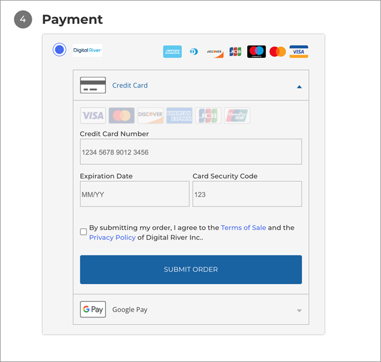

# Shopper experience

The shopper experience using Digital River's Drop-In on BigCommerce is designed to be seamless and user-friendly. When a shopper proceeds to checkout, they will encounter a straightforward payment interface that integrates seamlessly with the BigCommerce store, ensuring a smooth and efficient purchasing process. This guide will walk you through the steps a shopper experiences when using [Drop-In payments](https://app.gitbook.com/s/-LqH4RJfLVLuHPXuJyTZ/payments/payment-integrations-1/drop-in) during checkout.

