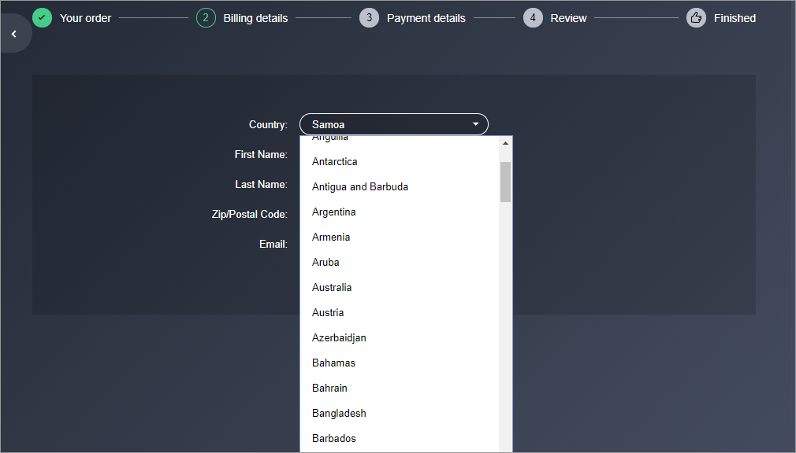

# Authorized shipping and billing countries

You can [configure the authorized shipping and billing countries](configuring-authorized-shipping-and-billing-countries.md). The following information describes the attributes under the Security tab on the Configure Site Settings page in [Global Commerce](https://gc.digitalriver.com/gc/ent/login.do).&#x20;

Once you configure the authorized shipping and billing countries, you can programmatically get a list of the [authorized billing countries](getting-a-sites-authorized-billing-countries.md) or [shipping countries.](getting-a-sites-authorized-shipping-countries.md)

## Authorized browsing restrictions

Use the Authorized Browsing Locales setting to indicate which supported locales a shopper (in a specific country) can see when they visit your site.

**Example**: If your European site has four locales, you can specify whether a shopper from one of those locales can browse your store in the other three locales. (Note that your automatic geo-location settings can determine the locales a shopper can visit.) Authorized browsing locales essentially limit a shopper's ability to see your store in one of the other locales supported in your store.

You can set up authorized browsing locales to limit the locales (and therefore the products and pricing) a shopper can see based on the shopper's location. This ensures that a shopper can only purchase products from their designated locale.

## Authorized shopping countries

You can define the list of authorized shopping countries for your site. The list of authorized countries defines which shoppers can purchase products from your store based on the billing or shipping address they enter during checkout. Use this feature when you want to:

* Deny shoppers, who live in a specific location, from purchasing products from your store.
* Deny shoppers, who want to ship products to a certain location (even if they do not reside at that location), from shipping products to that location from your store.

### Billing countries

You can use the **Allow Billing From** attribute to choose the option you want to use to define purchase restrictions based on the shopper's billing address. Your options are as follows:

* **Any Country**—Allows shoppers with a billing address from any country to purchase from your store. This option has no shopping restrictions based on the billing address.
* **Any Country Except Specifically Denied Countries**—Allows you to specify the countries that shoppers cannot select when they enter their billing information. This option prevents shoppers who provide billing information tied to an unauthorized country, from purchasing products from your store.
* **Only Specifically Allowed Countries**—Allows you to specify the countries that shoppers can select when they enter their billing information. This ensures only shoppers in a specific country, or who provide billing information tied to a specific country, can purchase products from your store.

You can use the [`GET /sites/{siteId}/authorized-billing-countries`](getting-a-sites-authorized-billing-countries.md) resource to get the list of allowed billing countries and use that information to display allowed billing countries in the Country dropdown list when a shopper provides their billing details.



### Shipping countries

You can use the **Allow Shipping To** attribute to choose the option you want to use to define purchase restrictions based on the shopper's shipping address.&#x20;

* **Any Country**—Allows shoppers with a Shipping address from any country to purchase from your store. This option has no shopping restrictions based on the shipping address.&#x20;
* **Any Authorized Billing Country**—Allows shoppers who enter a shipping address in any authorized billing country to place an order in your store.
* **Any Country Except Specifically Denied Countries**—Allows you to specify the countries that shoppers cannot select when they enter their shipping information. This option prevents shoppers who provide shipping information tied to an unauthorized country, from purchasing products from your store.&#x20;
* **Only Specifically Allowed Countries**—Allows you to specify the countries that shoppers can select when they enter their shipping information. This ensures only shoppers in a specific country, or who provide shipping information tied to a specific country, can purchase products from your store.

You can use the [`GET /sites/{siteId}/authorized-shipping-countries`](getting-a-sites-authorized-shipping-countries.md) resource to get the list of authorized shipping countries.

### Locales

Supported locales (all other locales besides the default locale) will inherit the settings from the default locale by default. If you want to configure a supported locale differently from the default, click that locale tab, select the **Customize for This Locale** option, and then add the countries that you want to allow or deny for that locale.

### Allowed countries

Lists the countries that a shopper can use when entering their billing or shipping countries.

### Denied countries

Lists the countries that a shopper cannot use when entering their billing or shipping information. Some countries appear in the Denied Countries list by default. You cannot do business with these countries based on export control restrictions.

If a shopper from an unauthorized country tries to purchase a product, they will trigger the following error:

```javascript
{ 
   "errors":{ 
      "error":[ 
         { 
             "relation":"https://developers.digitalriver.com/shoppers/CartsResource", 
             "code":"restricted-bill-to-country", 
             "description":"Billing Address country is restricted for request" 
         } 
       ] 
    } 
}    
```

### Search

To search for countries you want to deny or allow by locale, click the **Search** button, select the countries you want to allow or deny, and click **Apply**. The Selected countries appear in the list.

### Comments

Explain why you defined the restrictions in the **Comments** field. Provide enough detail to ensure someone else can determine why you denied or allowed billing or shipping to a specific country for a specific locale.

## Automatic geo-location

The automatic geo-location setting allows you to send shoppers to a specific site and locale based on their language and geographic location. The feature also allows you to restrict shoppers from certain locations from viewing or shopping in your store. See [How Automatic Geo-Location works](authorized-shipping-and-billing-countries.md#how-automatic-geo-location-works) for more information.

### How automatic geolocation works

When you enable Automatic Geo-Location, and a shopper visits your store (either by entering a URL in the address bar or clicking a link), the system redirects them to the site that corresponds with the redirect settings you defined.

You define geolocation redirect rules primarily at the site level. The system compiles and stores the redirect rules at the company level.

The geolocation system compares the origin country and browser language of each incoming shopper to the compiled list of redirect rules for all sites within the company hierarchy. The system identifies the correct redirect rule based on shopper country and language and directs the shopper to the corresponding site and locale.

There are two types of site-level redirect rules:

1. The first rule type redirects all incoming shoppers whose origin country the system either cannot identify or cannot match with the second rule type. You can only specify one redirect rule of this type.
2. The second rule type redirects shoppers coming from a specific country/locale. You can specify many redirect rules of this type.

You can also set redirect rules at the company level. Use these rules when you want to redirect shoppers who try to access a site not hosted by Digital River.

If Digital River hosts all of the EMEA sites for a specific company but none of the APAC sites, you can create a company-level rule that redirects all incoming APAC shoppers to the appropriate non-Digital River site.

### Unrecognized country

If the country code is not recognized or configured in the Country/Language list, the system redirects the shopper according to your specified settings. Use the **Unrecognized Country** attribute to choose one of the following options:

*   **Stay on this site**—Shoppers visiting your store from an unrecognized country will stay on the site they are trying to view.

    **Example**: If a shopper from an unrecognized country tries to access the en\_GB locale of your store and you do not have a rule set up to specifically redirect shoppers in unrecognized countries, they will see the en\_GB locale of your store.
* **Go to specific site**—The system redirects shoppers visiting your store from an unrecognized country to a specific site and locale you select from the Site and Locale lists that appear when you select this option. If you select **Go to specific site**, the following attributes appear:
  * **Site**—Choose the site you want to redirect shoppers to from this list. This field appears when you select the Go to specific site option.
  * **Locale**—Choose the locale you want to use from this list. This field appears when you select the Go to specific site option.

### Redirect settings

Choose whether you want to redirect shoppers visiting your store from an unrecognized country to a specific site or locale based on their location and browser language setting.&#x20;

* **Always Redirect**—Automatically redirect shoppers in a specific country with a specific locale setting in their browser to a specified site and locale when they visit your store.&#x20;
* **Do Not Redirect**—Allows shoppers to go directly to your store based on the IP location and locale setting in their browser.

### Add or remove destinations

To add or remove destinations, click the **Add** or **Remove** button, select the country, browser language, and destination. Then click **Save**.

## Cross-site forgery prevention

When enabled, this feature protects shoppers against attacks that force them to unwittingly perform actions against their permission. To enable or disable **Cross-Site Request Forger Prevention**, choose one of the following options:

* **ON**—Enables protection against attacks that force shoppers to unwittingly perform actions against their permission. When you select ON, the Enable Cross-Site Request Forgery **(**CSRF) for Anonymous Users toggle appears.
* **OFF**—Disables protection against attacks that force shoppers to unwittingly perform actions against their permission.

To enable or disable CSRF for Anonymous Users, choose one of the following options:

* **ON**—Enables protection against attacks that force anonymous shoppers to unwittingly perform actions against their permission.
* **OFF**—Disables protection against attacks that force anonymous shoppers to unwittingly perform actions against their permission.

## Password strength

The password strength feature is disabled when SSO is enabled. When SSO is disabled, you can define the user's password strength.

* **Minimum Password Length**—Define the minimum number of characters that a shopper must use for a password. The minimum number of characters is 8. The maximum number of characters is 32.
*   **Enhanced Password Strength**—Enhanced password strength requires a secure shopper's password. In addition to meeting the minimum password length, the password will need to include three of the following characteristics:

    * Upper case letter
    * lower case letter
    * Numbers
    * Special characters: ! @ # $ % ^ \* \~ : ; & > < \[ ] { } | - \_ + = ?

    Choose one of the following options:

    *   **ON**—Enables the Enhanced Password Strength feature.

        **Note**: If you enable the Enhanced Password Strength feature, existing shoppers with weak passwords must change their password when they sign in.
    * **OFF**—Disables the Enhanced Password Strength feature.

## Secure session cookie

The secure session feature allows you to use a secure session cookie to prevent someone from hijacking a Global Commerce session. Choose one of the following **Secure Session Cookie** options:

* **Enabled**—Enables the Secure Session Cookie feature. The Lenient Mode appears when you select the Enabled option for Secure Session Cookie.
* **Disabled**—Disables the Secure Session Cookie feature.

If the secure cookie sent by the client does not match with the information originally sent to the client, the system will log out the session automatically (including the innocent client) when you disable Lenient Mode. Choose one of the following **Lenient Mode** options:

* **Enabled**—Enables the Lenient Mode feature.
* **Disabled**—Disables the Lenient Mode feature.

## Shopper account security

The shopper account security feature allows you to define how shoppers can regain access to their account if they forgot their password. Some settings may require assistance from your Store Operations Manager.

* **Forgot password email**—Choose how you want to respond when a shopper requests a new password because they forgot their password:
  * **Send Shopper Their Password**—The system sends an email with a new password to the shopper.
  * **Send Shopper a Link to Reset Their Password**—The system sends an email with a link to the shopper that they can use to create a new password.
* **Expire link to reset password**—Enter the number of hours before the link expires. The value must be greater than zero (0). This field appears when you select the **Send Shopper a Link to Reset Their Password** option.

## Shopper brute force protection

Whether the following fields are enabled depends ho how you configured your authentication settings. When these fields are enabled, you can define your policy for protecting shopper accounts from an automated hacking attack.

* **Account Protection**—Choose one of the following options:
  * Require user to enter a CAPTCHA after multiple failed logins
  * Lock shopper account after multiple failed logins
* **Number of Attempts**—Enter the number of failed login attempts that trigger account protection. The number must be greater than 0 and less than 16.

## Shopper current password check settings

When this feature is enabled, shoppers must enter their current password when they change their password Choose one of the following options:

* **ON**—Shopper must enter their current password when they change their password.
* **OFF**—Shopper does not need to enter their current password when they change their password.
