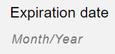

# Managing a subscription

If you're using [Digital River's subscription service](../using-our-services/subscriptions.md), then you'll need to manage the subscription after the acquisition checkout process is complete. On this page, you'll find information on how to:

* [Activate the subscription](managing-a-subscription.md#activating-a-subscription)
* [Fulfill the goods](managing-a-subscription.md#fulfilling-the-acquisition)
* [Notify customers of a successful acquisition](managing-a-subscription.md#notifying-customers-of-a-subscription-acquisition)
* [Renew subscriptions](managing-a-subscription.md#renewing-subscriptions)
* [Manage trial subscriptions](managing-a-subscription.md#trial-subscription-management)
* [Modify a subscription's payment source](managing-a-subscription.md#modifying-subscription-payments)

## Activating a subscription

After the [order's](https://www.digitalriver.com/docs/digital-river-api-reference/#tag/Orders) [`state`](../order-management/orders/the-order-lifecycle.md) moves to `accepted`, you can activate a [subscription](../developer-resources/digital-river-api-reference/subscriptions.md). To do this, retrieve each `items[].subscriptionInfo.subscriptionId` from the [`data.object`](../order-management/events-and-webhooks-1/events-1/#event-data) of the [event](https://www.digitalriver.com/docs/digital-river-api-reference/#tag/Events) with a [`type`](../order-management/events-and-webhooks-1/events-1/#event-types) of [`order.accepted`](../order-management/events-and-webhooks-1/events-1/event-types.md#order.accepted) and send it as a path parameter in a [`POST  /subscriptions/{subscriptionId}`](https://www.digitalriver.com/docs/digital-river-api-reference/#operation/updateSubscriptions).&#x20;


If you're using the [Direct Integrations](../integration-options/checkouts/) checkout solution, you could also get each `items[].subscriptionInfo.subscriptionId` from the body of the [`POST/ orders`](https://www.digitalriver.com/docs/digital-river-api-reference/#tag/Orders/operation/createOrders) response.&#x20;


&#x20;In the body of the request, set `state` to `active`.

```
curl --location --request POST 'https://api.digitalriver.com/subscriptions/DR_3ce5dc58-6bba-4ee2-b8d1-e1b974a4fe93' \
...
--data-raw '{
    "state": "active"
}'
```

No other values can be sent in the body of this request. If you attempt to do so, then the following error is returned:



```javascript
{
    "type": "conflict",
    "errors": [
        {
            "code": "restricted_update",
            "parameter": "metadata",
            "message": "Additional data cannot be updated when updating state to active."
        }
    ]
}
```



You can activate a subscription any time after an [order's](https://www.digitalriver.com/docs/digital-river-api-reference/#tag/Orders) `state` moves to `accepted`. For example, if you're selling a digital service subscription that requires no provisioning, you might build your integration so that the activation request is immediately submitted. In other scenarios, such as when a customer must install and initialize a device, you may decide to build a delay into the activation process.

When you activate the subscription, we search the acquisition [order](https://www.digitalriver.com/docs/digital-river-api-reference/#tag/Orders) for the [primary payment source](../payments/payment-sources/using-the-source-identifier.md#primary-payment-sources), retrieve its identifier, and assign that value to `sourceId` in the [subscription object](../developer-resources/digital-river-api-reference/subscriptions.md). On the [next invoice date](../developer-resources/digital-river-api-reference/subscriptions.md#date-of-next-invoice), we then both [create a charge](../order-management/orders/payment-charges/#how-a-charge-is-created) and attempt to [capture payment](../order-management/orders/payment-charges/#captures) using this reusable source.

After activation, the following [key subscription attributes](../developer-resources/digital-river-api-reference/subscriptions.md) are populated: `contractBindingUntil`, `nextReminderDate`, `currentPeriodEndDate`, `nextInvoiceDate`, and `activated`.

Every subscription contains a `billingAgreementId` that references a [billing agreement](../integration-options/checkouts/subscriptions/subscription-information-1.md#billing-agreements). For [PSD2 and SCA](../payments/psd2-and-sca/) compliance purposes, we continue to associate this billing agreement with the subscription throughout the [subscription's lifecycle](../developer-resources/digital-river-api-reference/subscriptions.md#lifecycle-of-a-subscription).



```javascript
{
    "id": "47ce1ba0-a548-40a2-a601-a43c41fbe68f",
    "contractBindingUntil": "2023-02-09T17:40:56Z",
    "createdTime": "2022-02-09T17:40:21Z",
    "updatedTime": "2022-02-09T17:40:56Z",
    "stateTransitions": {
        "activated": "2022-02-09T17:40:56Z"
    },
    "billingAgreementId": "8f1ef7b9-e5c5-46d1-ac14-1c9d566f0f57",
    "customerId": "562799360336",
    "sourceId": "1fc4353a-e1ab-476b-8ebd-db181c1a21a7",
    "taxInclusive": false,
    "currency": "USD",
    "planId": "82cbf763-fa27-401a-aa69-5e6640539ce7",
    "state": "active",
    "items": [
        {
            "price": 100.0,
            "skuId": "865a15d2-4e00-4c09-8813-7b82a078491b",
            "quantity": 1
        }
    ],
    "currentPeriodEndDate": "2022-03-09T17:40:56Z",
    "nextInvoiceDate": "2022-03-04T17:40:56Z",
    "nextReminderDate": "2022-02-27T17:40:56Z",
    "liveMode": false
}
```



## Fulfilling the acquisition

Once the [order's](https://www.digitalriver.com/docs/digital-river-api-reference/#tag/Orders) `state` is [`accepted`](../order-management/creating-and-updating-an-order.md#handling-accepted-orders), you should fulfill the goods and then [submit the payment capture request](../order-management/informing-digital-river-of-a-fulfillment.md).&#x20;

## Notifying customers of a subscription acquisition

Once a subscription is successfully acquired, you can use the [event](https://www.digitalriver.com/docs/digital-river-api-reference/#tag/Events) with a [`type`](../order-management/events-and-webhooks-1/events-1/#event-types) of [`order.accepted`](../order-management/events-and-webhooks-1/events-1/event-types.md#order.accepted) to trigger an [acquisition confirmation notification](../order-management/customer-notifications.md#acquisition-confirmation).

## Renewing subscriptions

On a [subscription's](https://www.digitalriver.com/docs/digital-river-api-reference/#tag/Subscriptions) [`nextReminderDate`](../developer-resources/digital-river-api-reference/subscriptions.md#date-of-next-reminder), make sure you [send a renewal reminder to customers](managing-a-subscription.md#sending-a-reminder). Your integration should also be able to handle both [successful](managing-a-subscription.md#handling-successful-renewals) and [failed](managing-a-subscription.md#handling-failed-renewals) billing attempts.

### Sending a reminder

Before attempting to collect a recurring payment, our subscription service determines whether the necessary pre-conditions are met. If they are, the service opens a [`draft` invoice](../integration-options/checkouts/subscriptions/invoices.md#the-invoice-lifecycle) and, on the subscription's [`nextRemiderDate`](../developer-resources/digital-river-api-reference/subscriptions.md#date-of-next-reminder), creates an [event](../order-management/events-and-webhooks-1/events-1/) with a [`type`](../order-management/events-and-webhooks-1/events-1/#event-types) of [`subscription.reminder`](../order-management/events-and-webhooks-1/events-1/event-types.md#subscription.reminder).


You can configure when you receive this event by setting the plan's [`reminderOffsetDays`](../developer-resources/digital-river-api-reference/plans.md#renewal-reminders).


The event's [`data.object`](../order-management/events-and-webhooks-1/events-1/#event-data) contains the [`subscription`](https://www.digitalriver.com/docs/digital-river-api-reference/#tag/Subscriptions) along with an [`invoice`](https://www.digitalriver.com/docs/digital-river-api-reference/#tag/Invoices) .

Use the event's data to obtain the customer's contact information and to populate your [renewal reminder notification](../order-management/customer-notifications.md#renewal-reminder). This notification (typically an email) should include the subscription's name and a description of its goods, the amount the customer is to be charged, and the upcoming billing date.


In the [Subscription Notifications](https://digitalriver.service-now.com/kb?id=kb\_article\_view\&sys\_kb\_id=785fc80adbd8341046e8d6aa48961907) article (refer to [Learning tools](../general-resources/standards-and-certifications/compliance-requirements.md#accessing-the-learning-tools) for access information), you'll find a complete list of renewal reminder requirements.


In `invoice.items[].productDetails` you can access the subscription's product data (such as `name`, `description`, `image`, and `url`) and pass this information to customers in the notification, thereby making them aware of what they're being billed for.


For details, refer to [How Digital River returns product data](../integration-options/checkouts/creating-checkouts/describing-the-items/#how-digital-river-returns-product-data).&#x20;


There are numerous ways to build your notification. We do, however, suggest that you convert any [date-time values](../developer-resources/api-structure.md#dates-and-times) into a more human-readable form. The following are some (partial) examples of what you might add:

_This is a reminder that your_ `invoice.description` _subscription is set to renew on or after_ `nextInvoiceDate`_. To ensure that your subscription continues without interruption, your_ `creditCard.brand` _credit card ending in_ `creditCard.lastFourDigits` _will be charged_ `invoice.totalAmount` _in_ `invoice.currency` _._

For digital services (such as SaaS), you might also want to include the date and time that customers activated their subscription:

_You activated your subscription via our online store on_ `stateTransitions.activated`_._

Additionally, we suggest you use the reminder event to determine whether the subscription's designated credit card is set to expire before the [`nextInvoiceDate`](../developer-resources/digital-river-api-reference/subscriptions.md#date-of-next-invoice). If this is the case, remind customers to update their payment information and provide a link to the appropriate page on your site. For example:

_We noticed that your credit card ending in_ `lastFourDigits` _is set to expire_ `expirationMonth` _,_ `expirationYear`_. This expiration date is prior to your next recurring payment on_ `nextInvoiceDate`_. To avoid disruptions to your subscription, please visit your_ [_account management page_](https://www.company.com) _and update your payment information._

### Handling successful renewals

To be notified of a successful billing attempt, [configure a webhook](../administration/dashboard/developers/webhooks/creating-a-webhook.md) to listen for the [event](../order-management/events-and-webhooks-1/events-1/) with a [`type`](../order-management/events-and-webhooks-1/events-1/#event-types) of [`subscription.extended`](../order-management/events-and-webhooks-1/events-1/event-types.md#subscription.extended).

The event's [`data.object`](../order-management/events-and-webhooks-1/events-1/#event-data) contains the [`subscription`](https://www.digitalriver.com/docs/digital-river-api-reference/#tag/Subscriptions) along with the [`invoice`](https://www.digitalriver.com/docs/digital-river-api-reference/#tag/Invoices) used to [capture payment](../order-management/orders/payment-charges/#captures). Since settlement has successfully occurred, the invoice's [`state`](../integration-options/checkouts/subscriptions/invoices.md#invoice-states) is `paid`.&#x20;

You could handle `subscription.extended` by calling a function that moves the subscription in your system into a ready to fulfill state and then initiates the fulfillment process.

The event should also trigger a [renewal confirmation message](../order-management/customer-notifications.md#renewal-confirmation) that gets sent to the customer. The following is a partial list of the data you might retrieve from the event and pass in this notification:

* `orderId`: Gives customers access to the identifier of the transaction's [order](https://www.digitalriver.com/docs/digital-river-api-reference/#tag/Orders).
* `nextInvoiceDate`: Provides customers the date of the [next billing attempt](../developer-resources/digital-river-api-reference/subscriptions.md#date-of-next-invoice).
* `name` and `image` in `items[].productDetails`: Reminds customers what products and/or services are included in the subscription.
* `payment.sources[]`: Contains [source](../payments/payment-sources/) data that you can share with customers so they have basic information on what payment method is funding the subscription.
* `totalAmount` and `totalTax`: Informs customers how much they were charged and taxed. The event also contains similar amounts at the `items[]`-level.&#x20;


In the [Subscription Notifications](https://digitalriver.service-now.com/kb?id=kb\_article\_view\&sys\_kb\_id=785fc80adbd8341046e8d6aa48961907) article (refer to [Learning tools](../general-resources/standards-and-certifications/compliance-requirements.md#accessing-the-learning-tools) for access information), you can find a comprehensive list of the information you're required to include in the renewal notification.


### Handling failed renewals

To be notified of renewal problems, you can [configure a webhook(s)](../administration/dashboard/developers/webhooks/creating-a-webhook.md) to listen for:

* [Invalid sources and lapsed subscriptions](managing-a-subscription.md#invalid-sources-and-lapsed-subscriptions)
* [Payment failures](managing-a-subscription.md#subscription.payment\_failed)
* [Subscription failures](managing-a-subscription.md#subscription.failed)

#### Invalid sources and lapsed subscriptions

If Digital River can't create a billing [invoice](https://www.digitalriver.com/docs/digital-river-api-reference/#tag/Invoices) because there's a problem with the [subscription's](../developer-resources/digital-river-api-reference/subscriptions.md) saved [source](../payments/payment-sources/) (in the case of credit cards, this is often an invalid expiration date), then we create an [event](../order-management/events-and-webhooks-1/events-1/) with a [`type`](../order-management/events-and-webhooks-1/events-1/#event-types) of [`subscription.invalid_source`](../order-management/events-and-webhooks-1/events-1/event-types.md#subscription.source\_invalid).&#x20;

We recommend handling it by informing shoppers that their subscription is at risk of cancellation, requesting a different payment method from them and then, assuming they provide this information, [updating the subscription's source](managing-a-subscription.md#modifying-subscription-payments).

If you don't send this update request during the grace period (i.e., the [`collectionPeriodDays`](../developer-resources/digital-river-api-reference/plans.md#collection-period-days) of the subscription’s [plan](../developer-resources/digital-river-api-reference/plans.md)), then Digital River moves the subscription’s [`state`](../developer-resources/digital-river-api-reference/subscriptions.md#state) to `lapsed` and creates [`subscription.lapse`](../order-management/events-and-webhooks-1/events-1/event-types.md#subscription.lapsed), to which you should respond by [cancelling the subscription](managing-a-subscription.md#cancelling-a-subscription) and then notifying the customer. In that same notification, you might also provide instructions on how the customer can reactivate their cancelled subscription products.

#### Payment failures <a href="#subscription.payment_failed" id="subscription.payment_failed"></a>

An [event](../order-management/events-and-webhooks-1/events-1/) with a [`type`](../order-management/events-and-webhooks-1/events-1/#event-types) of [`subscription.payment_failed`](../order-management/events-and-webhooks-1/events-1/event-types.md#subscription.payment\_failed) indicates that Digital River's [autorenewal service](../integration-options/checkouts/subscriptions/invoices.md#invoice-billing) made an unsuccessful attempt to [capture payment](../order-management/orders/payment-charges/#captures).&#x20;

The event's [`data.object`](../order-management/events-and-webhooks-1/events-1/#event-data) contains both the `subscription` and the `invoice`.

The [event](../order-management/events-and-webhooks-1/events-1/) most likely stems from changes to the subscription's [payment source](../payments/payment-sources/). For example, if a subscription is funded with a [credit card](../payments/supported-payment-methods/credit-cards.md), its billing address could have changed, the customer might have cancelled it, or it might have reached its credit limit.

However, since the [`state`](../developer-resources/digital-river-api-reference/subscriptions.md#state) of the [subscription](https://www.digitalriver.com/docs/digital-river-api-reference/#tag/Subscriptions) remains `activePendingInvoice`, you might still be able to collect payment.

Whatever the structure of your [dunning process](https://en.wikipedia.org/wiki/Dunning\_\(process\)), we recommend you handle [`subscription.payment_failed`](../order-management/events-and-webhooks-1/events-1/event-types.md#subscription.payment\_failed) by using the event's `data.object` to construct a [billing failed notification](../order-management/customer-notifications.md#billing-failed-notification) that:

* Informs customers of the failed payment capture attempt. For example:\
  \
  _We were unable to charge your_ `creditCard.brand` _ending in_ `creditCard.lastFourDigits`_._\

* Provides a link to a page on your site where customer's can resolve the issue. For example:\
  \
  _To avoid disruptions to your subscription, please visit your_ [_account management page_](https://www.company.com)_._\

* Provides your contact information. For example:\
  \
  _If you have any questions, visit our support site at \<web address>, contact us at \<email address>, or call \<phone number>._

If customers click the link, redirect them to a page where they can provide a new payment method.&#x20;


For details, refer to [Account management flows](../integration-options/checkouts/building-you-workflows/#account-management-flows) on the [Building payment workflows](../integration-options/checkouts/building-you-workflows/) page.


Once you create a new [source](https://www.digitalriver.com/docs/digital-river-api-reference/#tag/Sources) or [authenticate an existing source](../payments/payment-integrations-1/digitalriver.js/reference/digitalriver-object.md#authenticating-sources), make sure you [associate it with the customer](../payments/payment-sources/using-the-source-identifier.md#attaching-sources-to-customers).&#x20;

You'll also need to pass the source's identifier in the body of an [update subscription request](https://www.digitalriver.com/docs/digital-river-api-reference/#tag/Subscriptions).

```
curl --location --request POST 'https://api.digitalriver.com/subscriptions/9a1f34b3-a5f5-4c5d-ab04-9a021b97a26d' \
...
--header 'Authorization: Bearer <Your secret API key>' \
...
--data-raw '{
	"sourceId": "19f15727-0712-473a-8b78-cc627efc0dfc"
}'
```

Prior to the next billing attempt, Digital River voids the invoice that we weren't able to collect and creates a new invoice using the subscription's updated source.

#### Subscription failures <a href="#subscription.failed" id="subscription.failed"></a>

An [event](../order-management/events-and-webhooks-1/events-1/) with a [`type`](../order-management/events-and-webhooks-1/events-1/#event-types) of [`subscription.failed`](../order-management/events-and-webhooks-1/events-1/event-types.md#subscription.failed) indicates that our autorenewal service was unable to [capture payment](../order-management/orders/payment-charges/#captures) during the [designated collection period](../developer-resources/digital-river-api-reference/plans.md#collection-period-days). As a result, the [invoice](https://www.digitalriver.com/docs/digital-river-api-reference/#tag/Invoices) has become [`uncollectible`](../integration-options/checkouts/subscriptions/invoices.md#the-invoice-lifecycle) and the [subscription](../developer-resources/digital-river-api-reference/subscriptions.md) has moved into a terminally [`failed`](../developer-resources/digital-river-api-reference/subscriptions.md#lifecycle-of-a-subscription) state.

We recommend you handle [`subscription.failed`](../order-management/events-and-webhooks-1/events-1/event-types.md#subscription.failed) by setting the status of the subscription in your own system to failed as well.&#x20;

You should also [send customers a failure notification](../order-management/customer-notifications.md#subscription-failed-notification) that provides them the ability to reactivate their subscription. If customers select this option, you'll need to take them through the acquisition process again.

For example, the notification might:

* Inform customers of the failed renewal. \
  \
  _Despite repeated attempts, we were unable to charge your designated payment method and, as a result, your subscription has been deactivated._ \

* Provide a link to the page on your site where customer's can resolve the issue. \
  \
  _To reactivate your subscription, please visit your_ [_account management page_](https://www.company.com)_._ \

* Provide your contact information. \
  \
  _If you have any questions, visit our support site at \<web address>, contact us at \<email address>, or call \<phone number>._

## Trial subscription management

In this section, you'll find information on:

* [Activating trial subscriptions](managing-a-subscription.md#activating-trial-subscriptions)
* [Handling trial conversions](managing-a-subscription.md#handling-trial-conversions)
* [Ending trial subscriptions](managing-a-subscription.md#ending-trial-subscriptions)
* [Extending free trial periods](managing-a-subscription.md#extending-free-trial-periods)
* [Reverting to a free subscription](managing-a-subscription.md#reverting-to-a-free-subscription)

### Activating trial subscriptions

You can use the same process to activate both trial and non-trial subscriptions. For details, refer to [Activating a subscription](managing-a-subscription.md#activating-a-subscription).

```javascript
curl --location --request POST 'https://api.digitalriver.com/subscriptions/124eeee4-6cf4-40e9-94a6-cba64798fc42' \
...
--data-raw '{
	"state": "active"
}'
```

Once activated, a free trial subscription's [`state`](../developer-resources/digital-river-api-reference/subscriptions.md#state) transitions from `draft` to `activeFree` and the `activatedFree` timestamp is populated.


```javascript
{
    "id": "124eeee4-6cf4-40e9-94a6-cba64798fc42",
    "contractBindingUntil": "2022-02-18T15:03:12Z",
    "createdTime": "2022-02-11T15:01:31Z",
    "updatedTime": "2022-02-11T15:03:12Z",
    "stateTransitions": {
        "activatedFree": "2022-02-11T15:03:12Z"
    },
    "billingAgreementId": "6e4d986e-c054-43e0-a233-d6c1e9f60765",
    "customerId": "563089630336",
    "sourceId": "8687447b-a04d-4838-af6c-0de0810f23a7",
    "taxInclusive": false,
    "currency": "USD",
    "planId": "186cf07e-a1ea-4ec0-9d9a-8aa93b3af43a",
    "locale": "en_US",
    "state": "activeFree",
    "items": [
        {
            "price": 0.0,
            "skuId": "sku_3e5ab173-d52e-4d9e-8888-2a00f6bb188e",
            "quantity": 2
        }
    ],
    "currentPeriodEndDate": "2022-02-18T15:03:12Z",
    "nextInvoiceDate": "2022-02-18T15:03:12Z",
    "nextReminderDate": "2022-02-15T15:03:12Z",
    "liveMode": false
}
```


#### Updating the subscription's price and plan

Immediately following a successful [activation request](managing-a-subscription.md#activating-trial-subscriptions), we recommend that your integration use a `POST /subscriptions/{id}` to (1) update the subscription's `planId` so that it references a [paid period plan](../using-our-services/subscriptions.md#paid-period-plans) and, (2) for each `items[]`, set the `price` or `aggregatePrice` equal to the post-trial period amount that customers agreed to pay during the subscription acquisition process.


```javascript
curl --location --request POST 'https://api.digitalriver.com/subscriptions/124eeee4-6cf4-40e9-94a6-cba64798fc42' \
...
--data-raw '{
    "planId": "f55d07a2-a78f-406a-b6c6-ad8e1cc1531b",
    "items": [
        {
            "price": 29.95,
            "skuId": "sku_3e5ab173-d52e-4d9e-8888-2a00f6bb188e",
            "quantity": 2
        }
    ]
}'
```


After you submit this request, the [subscription's](../developer-resources/digital-river-api-reference/subscriptions.md) `planId` references the [paid period plan](../using-our-services/subscriptions.md#paid-period-plans). However, until [`currentPeriodEndDate`](../developer-resources/digital-river-api-reference/subscriptions.md#current-period-end-date) elapses, the subscription's behavior is controlled by the [trial period plan](../using-our-services/subscriptions.md#trial-period-plans).


```javascript
{
    "id": "124eeee4-6cf4-40e9-94a6-cba64798fc42",
    "contractBindingUntil": "2022-02-18T15:03:12Z",
    "createdTime": "2022-02-11T15:01:31Z",
    "updatedTime": "2022-02-11T15:05:08Z",
    "stateTransitions": {
        "activatedFree": "2022-02-11T15:03:12Z"
    },
    "billingAgreementId": "6e4d986e-c054-43e0-a233-d6c1e9f60765",
    "customerId": "563089630336",
    "sourceId": "8687447b-a04d-4838-af6c-0de0810f23a7",
    "taxInclusive": false,
    "currency": "USD",
    "planId": "f55d07a2-a78f-406a-b6c6-ad8e1cc1531b",
    "locale": "en_US",
    "state": "activeFree",
    "items": [
        {
            "price": 29.95,
            "skuId": "sku_3e5ab173-d52e-4d9e-8888-2a00f6bb188e",
            "quantity": 2
        }
    ],
    "currentPeriodEndDate": "2022-02-18T15:03:12Z",
    "nextInvoiceDate": "2022-02-18T15:03:12Z",
    "nextReminderDate": "2022-02-15T15:03:12Z",
    "liveMode": false
}
```


On the [`nextReminderDate`](../developer-resources/digital-river-api-reference/subscriptions.md#date-of-next-reminder), Digital River creates an [event](https://www.digitalriver.com/docs/digital-river-api-reference/#tag/Events) whose [`type`](../order-management/events-and-webhooks-1/events-1/#event-types) is [`subscription.reminder`](../order-management/events-and-webhooks-1/events-1/event-types.md#subscription.reminder) and whose [`data.object`](../order-management/events-and-webhooks-1/events-1/#event-data) contains an [invoice](https://www.digitalriver.com/docs/digital-river-api-reference/#tag/Invoices) in a [`draft`](../integration-options/checkouts/subscriptions/invoices.md#invoice-states) state.

Assuming you updated the [subscription's](https://www.digitalriver.com/docs/digital-river-api-reference/#tag/Subscriptions) `items[].price` or `items[].aggregatePrice`, the invoice's `totalAmount` will be greater than zero and equal to the aggregated price of all the subscription's `items[]`, plus taxes and fees calculated by Digital River.

This `totalAmount` is how much customers will be charged on the subscription's [`nextInvoiceDate`](../developer-resources/digital-river-api-reference/subscriptions.md#date-of-next-invoice), which (if you configured your [trial period plan](../using-our-services/subscriptions.md#trial-period-plans) correctly) should be the same as the [`currentPeriodEndDate`](../developer-resources/digital-river-api-reference/subscriptions.md#current-period-end-date). In other words, customers won't be charged until the free trial period is over.

### Handling trial conversions

Before a trial converts to a paid subscription, you should [send customers an expiration reminder](managing-a-subscription.md#sending-a-free-trial-expiration-reminder). After a successful conversion occurs, make sure you also [send a conversion notification](managing-a-subscription.md#sending-a-trial-conversion-notification).

#### Sending a free trial expiration reminder

We recommend that you use [`subscription.reminder`](../order-management/events-and-webhooks-1/events-1/event-types.md#subscription.reminder) to trigger an email (or some other type of notification) to the customer. In the event's payload, `currentPeriodEndDate`, `nextInvoiceDate`, and `totalAmount` provide the data you need to inform customers (1) on what date their free trial is scheduled to expire, (2) when their first payment is scheduled, and (3) in what amount.

#### Sending a trial conversion notification

On the [`nextInvoiceDate`](../developer-resources/digital-river-api-reference/subscriptions.md#date-of-next-invoice), Digital River moves the [invoice](https://www.digitalriver.com/docs/digital-river-api-reference/#tag/Invoices) to [`open`](../integration-options/checkouts/subscriptions/invoices.md#invoice-states) and the [subscription](https://www.digitalriver.com/docs/digital-river-api-reference/#tag/Subscriptions) to [`activePendingInvoice`](../developer-resources/digital-river-api-reference/subscriptions.md#lifecycle-of-a-subscription) and then attempts to collect payment for the number of days specified by the [trial period plan's](../using-our-services/subscriptions.md#trial-period-plans) `collectionPeriodDays`.

If any of these collection attempts are successful, Digital River marks the invoice as [`paid`](../integration-options/checkouts/subscriptions/invoices.md#invoice-states) and the [subscription](https://www.digitalriver.com/docs/digital-river-api-reference/#tag/Subscriptions) as [`active`](../developer-resources/digital-river-api-reference/subscriptions.md#lifecycle-of-a-subscription), populates the [subscription's](https://www.digitalriver.com/docs/digital-river-api-reference/#tag/Subscriptions) `activated` timestamp and creates an [event](https://www.digitalriver.com/docs/digital-river-api-reference/#tag/Events) whose [`type`](../order-management/events-and-webhooks-1/events-1/#event-types) is [`subscription.extended`](../order-management/events-and-webhooks-1/events-1/event-types.md#subscription.extended).

You should use `subscription.extended` as a trigger to [notify customers that the trial has been converted into a paid subscription](../order-management/customer-notifications.md#trial-conversion-notification).&#x20;


If payment capture fails, then the [invoice](https://www.digitalriver.com/docs/digital-river-api-reference/#tag/Invoices) becomes [`uncollectible`](../integration-options/checkouts/subscriptions/invoices.md#invoice-states) and the [subscription](https://www.digitalriver.com/docs/digital-river-api-reference/#tag/Subscriptions) moves into a [`failed`](../developer-resources/digital-river-api-reference/subscriptions.md#lifecycle-of-a-subscription) state. To learn more, refer to [Handling failed renewals](managing-a-subscription.md#handling-failed-renewals).


### Ending trial subscriptions

To avoid getting charged, customers may opt to cancel their [subscription](https://www.digitalriver.com/docs/digital-river-api-reference/#tag/Subscriptions) during its trial period. In these cases, you have two options:

* If the subscription's [`state`](../developer-resources/digital-river-api-reference/subscriptions.md#state) is  `draft` (i.e, you haven't activated it yet), you should [delete the subscription](managing-a-subscription.md#deleting-a-subscription).
* If you [activated the subscription](managing-a-subscription.md#activating-trial-subscriptions) (i.e., its `state` is `activeFree`) then [cancel the subscription](managing-a-subscription.md#cancelling-a-subscription).

### Extending free trial periods

Sometimes you might want to extend a customer's free trial period or keep customers at a no-charge level indefinitely. To do this, after you [activate the subscription](managing-a-subscription.md#activating-trial-subscriptions), do _not_ update its price. By not performing this operation, a [subscription's](https://www.digitalriver.com/docs/digital-river-api-reference/#tag/Subscriptions) `items[]` will have a `price` or `aggregatePrice` of `0.0`on the `nextInvoiceDate`, and, as a result, Digital River doesn't make any invoice collection attempts and the subscription's `state` remains `activeFree`.

### **Reverting to a free subscription**

You can also push an [`active`](../developer-resources/digital-river-api-reference/subscriptions.md#lifecycle-of-a-subscription) subscription back into an [`activeFree`](../developer-resources/digital-river-api-reference/subscriptions.md#lifecycle-of-a-subscription) state. This is useful if you offer various subscription pricing tiers and customers request that their access be downgraded to the basic, free level.

To do this, send a [`POST /subscriptions/{id}`](https://www.digitalriver.com/docs/digital-river-api-reference/#operation/updateSubscriptions\\) request that updates the `price` or `aggregatePrice` of each of the subscription's `items[]` to `0.0` and the `planId` to an appropriate [plan](../developer-resources/digital-river-api-reference/plans.md#the-plans-resource). On the [`nextInvoiceDate`](../developer-resources/digital-river-api-reference/subscriptions.md#date-of-next-invoice), the subscription's [`state`](../developer-resources/digital-river-api-reference/subscriptions.md#state) reverts to `activeFree`.

## Modifying subscription payments


For more details on how subscriptions can be modified, refer to [Updating subscriptions](managing-a-subscription.md#updating-subscriptions).


When customers want to manage their subscriptions, you can [retrieve a list of subscriptions](https://www.digitalriver.com/docs/digital-river-api-reference/#operation/listSubscriptions) associated with their record:



```javascript
curl --location --request GET 'https://api.digitalriver.com/subscriptions?customerId=f9acfc5b-42de-4807-8248-eb1cb8069a04' \
--header 'Authorization: Bearer <Secret API key>' \
...
```



```javascript
{
    "hasMore": false,
    "data": [
        {
            "id": "eabd010b-26f5-44e7-a91d-1b3e23198310",
            "contractBindingUntil": "2022-03-02T16:15:15Z",
            "createdTime": "2022-01-31T16:14:10Z",
            "updatedTime": "2022-01-31T16:15:15Z",
            "stateTransitions": {
                "activatedFree": "2022-01-31T16:15:15Z"
            },
            "billingAgreementId": "fbeabcdd-52d4-48a9-9437-5b4ccf6f8df1",
            "customerId": "f9acfc5b-42de-4807-8248-eb1cb8069a04",
            "sourceId": "596245ab-8479-4df4-ae1c-853ed0e11073",
            "taxInclusive": false,
            "currency": "USD",
            "planId": "2919a6a2-c3ab-4a5b-8a6a-8f8a72a177a5",
            "locale": "en_US",
            "state": "activeFree",
            "items": [
                {
                    "price": 0.0,
                    "skuId": "7eee0e8c-b08e-4b9b-b241-8ba4e2a5876a",
                    "quantity": 1
                }
            ],
            "currentPeriodEndDate": "2022-04-28T16:15:15Z",
            "nextInvoiceDate": "2022-04-28T16:15:15Z",
            "nextReminderDate": "2022-04-27T16:15:15Z",
            "liveMode": false
        }
    ]
```



For each [subscription](https://www.digitalriver.com/docs/digital-river-api-reference/#tag/Subscriptions), access its payment [source](https://www.digitalriver.com/docs/digital-river-api-reference/#tag/Sources) by passing `sourceId` in a [`GET /sources/{sourceId}`](https://www.digitalriver.com/docs/digital-river-api-reference/#operation/retrieveSources) request.

To modify a [subscription's](../developer-resources/digital-river-api-reference/subscriptions.md) payment [source](https://www.digitalriver.com/docs/digital-river-api-reference/#tag/Sources), its [`state`](../developer-resources/digital-river-api-reference/subscriptions.md#state) must be `active`, `activeFree`, or `activePendingInvoice`. If this precondition is met, you can:

* [Update basic credit card information](managing-a-subscription.md#update-credit-card-information)
* [Replace the existing source with a new source](managing-a-subscription.md#replace-an-existing-source-with-a-new-source)
* [Replace the existing source with a saved source](managing-a-subscription.md#replace-an-existing-source-with-a-saved-source)

### Update credit card information

If a [subscription's](https://www.digitalriver.com/docs/digital-river-api-reference/#tag/Subscriptions) `sourceId` references a [source](https://www.digitalriver.com/docs/digital-river-api-reference/#tag/Sources) with a `type` of `creditCard`, then you can provide customers the ability to update that card's billing information or expiration date.



```javascript
{
    "id": "f9f73fd2-b56d-40d2-92fe-de4987671c34",
    ...
    "sourceId": "26ab35a7-64f7-4cf5-82e6-18cc444cd993",
    ...
    "state": "activeFree",
    ...
}
```



```javascript
{
    "id": "26ab35a7-64f7-4cf5-82e6-18cc444cd993",
    "createdTime": "2022-02-11T15:44:33Z",
    "type": "creditCard",
    "currency": "USD",
    "amount": 7.0,
    "reusable": true,
    "state": "chargeable",
    "customerId": "563089660336",
    "owner": {
        "firstName": "Digital",
        "lastName": "Development",
        "email": "testdummy@digitalriver.com",
        "address": {
            "line1": "10380 Bren Road West",
            "city": "Minnetonka",
            "postalCode": "55343",
            "state": "MN",
            "country": "US"
        },
        "organization": "DR",
        "additionalAddressInfo": {
            "neighborhood": "Centro"
        }
    },
    "clientSecret": "26ab35a7-64f7-4cf5-82e6-18cc444cd993_4a4be490-2c12-4978-af07-3b2b6b184ba5",
    "creditCard": {
        "brand": "Visa",
        "expirationMonth": 3,
        "expirationYear": 2030,
        "lastFourDigits": "1111"
    },
    "liveMode": false
}
```



If you want to display the card's current billing information and card information to customers, you can retrieve that data from the [source's](https://www.digitalriver.com/docs/digital-river-api-reference/#tag/Sources) `owner` and `creditCard` blocks.

#### Billing address information

If customers opt to edit their billing information, present them with a form to enter the full name, email, and address (line 1, line 2, city, state, country, postal code) associated with the credit card.

.png>)

#### Card expiration date

If customers opt to edit their credit card's expiration date, use a [`cardexpiration` element](../payments/payment-integrations-1/digitalriver.js/reference/digitalriver-object.md#digitalriver-createelement) to provide them with an input field.

<div align="left">



</div>

#### Configuring the update source method

Once customers enter and save their changes, pass the submitted data to [`updateSource()`](../payments/payment-integrations-1/digitalriver.js/reference/digitalriver-object.md#updating-sources). Make sure you configure the appropriate version of the method, depending on whether customers submit updated (a) billing address information, (b) card expiration information or (c) both. In both versions, you need to add the [source's](https://www.digitalriver.com/docs/digital-river-api-reference/#tag/Sources) `id` and `clientSecret` to the method's configuration object.

### Replace an existing source with a new source

When customers want to change how they pay for a subscription, you can allow them to supply a new payment method.

How you replace a [subscription's](https://www.digitalriver.com/docs/digital-river-api-reference/#tag/Subscriptions) current [source](https://www.digitalriver.com/docs/digital-river-api-reference/#tag/Sources) with a new source depends on whether you're using [Drop-in payments](../payments/payment-integrations-1/drop-in/) or [DigitalRiver.js with Elements](../payments/payment-integrations-1/digitalriver.js/quick-start.md).

In both cases, first collect and store the customer's billing information.&#x20;



Build the `createDropin()` method's [configuration object](../payments/payment-integrations-1/drop-in/drop-in-integration-guide.md#configuring-drop-in-payments):

* In [`options`](../payments/payment-integrations-1/drop-in/drop-in-integration-guide.md#drop-in-options-1), set:
  * &#x20;[`flow`](../payments/payment-integrations-1/drop-in/drop-in-integration-guide.md#flow) to `managePaymentMethods`&#x20;
  * &#x20;[`usage`](../payments/payment-integrations-1/drop-in/drop-in-integration-guide.md#specifying-a-sources-future-use) to `subscription`
  * [`showTermsOfSaleDisclosure`](../payments/payment-integrations-1/drop-in/drop-in-integration-guide.md#show-terms-of-sale-disclosure) to `true`
  * [`showComplianceSection`](../payments/payment-integrations-1/drop-in/drop-in-integration-guide.md#show-compliance-section) to `true`
* Since this is an [account management flow](../integration-options/checkouts/building-you-workflows/#account-management-flows), you can't use the checkout's [payment session identifier](../integration-options/checkouts/creating-checkouts/#payment-session-identifier) to set `sessionId`. As a result, you must pass the billing information you collect from customers in [`billingAddress`](../payments/payment-integrations-1/drop-in/drop-in-integration-guide.md#billing-address).

```javascript
let digitalriverpayments = new DigitalRiver("pk_hc_a209389e4588433bb6e00b32466b82c3", {
    "locale": "en_GB"
});
                        
let configuration = {
    "options": {
        "flow": "managePaymentMethods",
        "showComplianceSection": true,
        "showTermsOfSaleDisclosure": true,
        "usage": "subscription"
    },
    "billingAddress": {
        "firstName": "John",
        "lastName": "Doe",
        "email": "test@test.com",
        "phoneNumber": "952-253-1234",
        "address": {
            "line1": "16 Byward St",
            "city": "London",
            "state": "England",
            "postalCode": "EC3R 5BA",
            "country": "GB"
        }
    },
    ...
}
                                    
let dropin = digitalriverpayments.createDropin(configuration);
dropin.mount("drop-in-container");
```

Pass the configuration object to [`createDropin()`](../payments/payment-integrations-1/drop-in/drop-in-integration-guide.md#step-6-allow-the-shopper-to-interact-with-hydrate). If the request is successful, the [`onReady`](../payments/payment-integrations-1/drop-in/drop-in-integration-guide.md#onready) event contains the transaction's eligible payment methods:

```javascript
{
    "paymentMethodTypes": [
        "creditCard",
        "payPalBilling"
    ]
}
```

Each payment method and its disclosures are displayed in the window. If customers click the button without accepting these agreements and terms, Drop-in blocks the transaction from proceeding.

<figure><figcaption></figcaption></figure>

If customers accept the terms, submit their information and the resulting create source request is successful, the [`onSuccess`](../payments/payment-integrations-1/drop-in/drop-in-integration-guide.md#onsuccess) event contains a [source](https://www.digitalriver.com/docs/digital-river-api-reference/#tag/Sources) that is [`readyForStorage`](../payments/payment-integrations-1/drop-in/drop-in-integration-guide.md#onsuccess) and [`chargeable`](../payments/payment-sources/#source-state).

For more details, refer to the [Drop-in payments integration guide](../payments/payment-integrations-1/drop-in/drop-in-integration-guide.md) and the [Drop-in payments builder tool](https://drapi.io/drop-in-builder/).



Configure [`retrieveAvailablePaymentMethods()`](../payments/payment-integrations-1/digitalriver.js/reference/digitalriver-object.md#digitalriverjs-retrieveavailablepaymentmethodsresponsewithusingfilters) using the following filters:

* Set `currency` to the same value as the [subscription's](https://www.digitalriver.com/docs/digital-river-api-reference/#tag/Subscriptions) `currency`
* Use the billing address country you collect from customers to set `country`&#x20;
* Both `supportsStorage` and `supportsRecurring` should be `true`

```javascript
...
digitalriver.retrieveAvailablePaymentMethods({
    "currency": "EUR",
    "country": "FR",
    "supportsStorage": true,
    "supportsRecurring": true
}).then(function(result) {
    //do something with the result, this could include showing or hiding specific payment methods that are applicable to the display
});
...
```

If the request is successful, the response contains the transaction's eligible payment methods:

```javascript
[
    {
        "type": "creditCard",
        "flow": "standard",
        "supportsRecurring": true,
        "supportsFreeTrial": true,
        "images": {
            "iconImage": "https://ui1.img.digitalrivercontent.net/Storefront/images/paymentMethodLogos/creditcard.png"
        },
        "supportsStorage": true,
        "defaultMandate": {
            "terms": "Yes, please save this account and payment information for future purchases."
        },
        "displayName": "Credit Card",
        "localizedDisplayName": "Credit Card"
    },
    {
        "type": "payPalBilling",
        "flow": "redirect",
        "supportsRecurring": true,
        "supportsFreeTrial": true,
        "images": {
            "iconImage": "https://ui1.img.digitalrivercontent.net/Storefront/images/paymentMethodLogos/paypalBilling.png"
        },
        "supportsStorage": true,
        "defaultMandate": {
            "terms": "Yes, please save this account and payment information for future purchases."
        }
        "displayName": "PayPal Billing",
        "localizedDisplayName": "PayPal"
    },
    {
        "type": "googlePay",
        "flow": "standard",
        "supportsRecurring": true,
        "supportsFreeTrial": true,
        "images": {
            "iconImage": "https://ui1.img.digitalrivercontent.net/Storefront/images/paymentMethodLogos/googlepay.png"
        },
        "supportsStorage": true,
        "defaultMandate": {
            "terms": "Yes, please save this account and payment information for future purchases."
        },
        "displayName": "Google Pay",
        "localizedDisplayName": "Google Pay"
    }
]
```

For each available payment method:

* [Create the appropriate elements](../payments/payment-integrations-1/digitalriver.js/reference/digitalriver-object.md#creating-elements) to collect the customer's sensitive payment information.
* Retrieve `defaultMandate.terms` and display that text with some sort of acceptance control. Your code should be written so that customers must accept these terms before the transaction can proceed.

When customers submit their information, configure and call the [`createSource()`](../payments/payment-integrations-1/digitalriver.js/reference/digitalriver-object.md#creating-sources) method:

* Set `type` to the payment method selected by the customer
* Set [`usage`](../payments/payment-integrations-1/digitalriver.js/reference/digitalriver-object.md#specifying-a-sources-future-use) to `subscription` and `futureUse` to `true`
* Use that payment method's `defaultMandate.terms` to set `mandate.terms`
* Since this is an [account management flow](../integration-options/checkouts/building-you-workflows/#account-management-flows), you can't provide a checkout's [payment session identifier](../integration-options/checkouts/creating-checkouts/#payment-session-identifier). As a result, you must pass the billing information you collect from customers in `billingAddress`.

```javascript
var payload = {
    "type": "creditCard",
    "futureUse": true,
    "usage": "subscription",
    "billingAddress": {
        "firstName": "John",
        "lastName": "Doe",
        "email": "test@test.com",
        "phoneNumber": "952-253-1234",
        "address": {
            "line1": "16 Byward St",
            "city": "London",
            "state": "England",
            "postalCode": "EC3R 5BA",
            "country": "GB"
        }
    },
    ...
    "mandate": {
        "terms": "Yes, please save this account and payment information for future purchases."
    }
}

digitalriver.createSource(payload).then(function(result) {
    if (result.error) {
        //handle errors
    } else {
        var source = result.source;
        //send source to back end
        sendToBackend(source);
    }
});
```

If the create source request is successful, the response contains a [source](https://www.digitalriver.com/docs/digital-river-api-reference/#tag/Sources) that is [`readyForStorage`](../payments/payment-integrations-1/drop-in/drop-in-integration-guide.md#onsuccess) and [`chargeable`](../payments/payment-sources/#source-state).

For more details refer to the [DigitalRiver.js Quick start guide](../payments/payment-integrations-1/digitalriver.js/quick-start.md).



Send the [source](https://www.digitalriver.com/docs/digital-river-api-reference/#tag/Sources), [customer](https://www.digitalriver.com/docs/digital-river-api-reference/#tag/Customers), and [subscription](https://www.digitalriver.com/docs/digital-river-api-reference/#tag/Subscriptions) identifiers to your back-end.

Use a [`POST /customers/{customerId}/sources/{sourceId}`](https://www.digitalriver.com/docs/digital-river-api-reference/#operation/createCustomerSource) to attach the source to the customer. This flips the source's [`reusable`](../payments/payment-sources/#reusable-or-single-use) attribute to `true`.

To update the subscription, send its identifier as a path parameter in a [`POST /subscriptions/{subscriptionId}`](https://www.digitalriver.com/docs/digital-river-api-reference/#operation/updateSubscriptions). In the body of the request, specify the new `sourceId`.

```java
curl --location --request POST 'https://api.digitalriver.com/subscriptions/b8dc06d6-941e-483c-89a1-263874bff3b4' \
...
--data-raw '{
	"sourceId": "e4adbcac-1551-4743-9a3e-48dc3883241b"
} 
```

If you receive a `200 OK`, notify customers that their subscription's designated payment method has been successfully updated.

### Replace an existing source with a saved source

When customers want to change how they pay for a subscription, you can give them the option of selecting one of their saved payment [sources](https://www.digitalriver.com/docs/digital-river-api-reference/#tag/Sources).

To access these sources, send the [customer's](https://www.digitalriver.com/docs/digital-river-api-reference/#tag/Customers) identifier in a [`GET /customers/{customerId}`](https://www.digitalriver.com/docs/digital-river-api-reference/#operation/retrieveCustomers) request. From the response, you can retrieve any of the `sources[]`, since, by default, they're all [`chargeable`](../payments/payment-sources/#source-state) and [`reusable`](../payments/payment-sources/#reusable-or-single-use).



```javascript
{
    "id": "533319260336",
    "createdTime": "2021-05-06T21:51:08Z",
    "email": "jackdoe@digitalriver.com",
    "shipping": {
        "address": {
            "line1": "123 Boulevard",
            "city": "Saint Paul",
            "postalCode": "55155",
            "state": "MN",
            "country": "US"
        },
        "name": "John Doe",
        "phone": "555-555-5555"
    },
    "defaultSourceId": "5e359d60-1d23-4234-84ee-e1c9b3ed7edc",
    "sources": [
        {
            "id": "19f47eba-418f-41b3-882c-462e335770e7",
            "createdTime": "2022-03-30T21:14:05Z",
            "type": "payPalBilling",
            "currency": "USD",
            "amount": 27.01,
            "reusable": true,
            "state": "chargeable",
            "owner": {
                "firstName": "Maya",
                "lastName": "Brown",
                "email": "null@digitalriver.com",
                "address": {
                    "line1": "10381 Bren Rd W",
                    "city": "Minnetonka",
                    "postalCode": "55343",
                    "state": "MN",
                    "country": "US"
                }
            },
            "paymentSessionId": "46206596-6559-4f86-9f27-2ccb4d0cc677",
            "clientSecret": "19f47eba-418f-41b3-882c-462e335770e7_cc871d23-474d-4a3f-9803-4e98fa39f2ee",
            "payPalBilling": {
                "token": "12345",
                "payerId": "payerId",
                "payerStatus": "verified",
                "redirectUrl": "https://api.digitalriver.com:443/payments/redirects/b9cd5136-8da3-4e00-97af-8b5fe4b70fdf?apiKey=pk_test_da4311e7b7384b7caf5384fb79808192",
                "returnUrl": "http://mypage.com",
                "offline": false
            }
        },
        {
            "id": "1e80940d-33d2-43d8-89c1-09c8076b2654",
            "createdTime": "2021-05-19T19:35:47Z",
            "type": "creditCard",
            "reusable": true,
            "state": "chargeable",
            "owner": {
                "firstName": "William",
                "lastName": "Brown",
                "email": "null@digitalriver.com",
                "address": {
                    "line1": "10381 Bren Rd W",
                    "city": "Minnetonka",
                    "postalCode": "55343",
                    "state": "MN",
                    "country": "US"
                }
            },
            "clientSecret": "1e80940d-33d2-43d8-89c1-09c8076b2654_3ada8e16-3938-4495-af72-5f793ff649c8",
            "creditCard": {
                "brand": "Visa",
                "expirationMonth": 7,
                "expirationYear": 2027,
                "lastFourDigits": "1111"
            }
        },
        ...
}
```



Use a selection control to display these saved sources to customers. With credit cards, you can retrieve `brand`, `expirationMonth`, `expirationYear`, and `lastFourDigits` and display this information to customers so they are able to identify the card. If the customer opts to use a saved [source](https://www.digitalriver.com/docs/digital-river-api-reference/#tag/Sources), retrieve its unique identifier.

To [update the subscription](managing-a-subscription.md#updating-subscriptions), send its identifier as a path parameter in a [`POST/ subscriptions/{subscriptionId}`](https://www.digitalriver.com/docs/digital-river-api-reference/#operation/updateSubscriptions) and, in the request body, specify the selected `sourceId`.

```javascript
curl --location --request POST 'https://api.digitalriver.com/subscriptions/b8dc06d6-941e-483c-89a1-263874bff3b4' \
...
--data-raw '{
	"sourceId": "e4adbcac-1551-4743-9a3e-48dc3883241b"
} 
```

If you receive a `200 OK`, notify customers that their subscription's designated payment method has been successfully updated.

## Cancelling subscriptions <a href="#cancelling-a-subscription" id="cancelling-a-subscription"></a>

When you either (1) receive a request from the customer to cancel a subscription, and the request adheres to the terms of the agreement (or you grant the customer a waiver), or (2) you decide to cancel the subscription, send a[`POST /subscriptions/{subscriptionId}`](https://www.digitalriver.com/docs/digital-river-api-reference/#operation/updateSubscriptions) with `state` set to `cancelled` in the request's payload.

```
curl --location --request POST 'https://api.digitalriver.com/subscriptions/895554f1-0568-4387-8405-551ddb533ff8' \
...
--data-raw '{
        "state": "cancelled"
}'
```

No other values can be passed in the body of a cancellation request. If you attempt to do so, the following error is returned:



```javascript
{
    "type": "conflict",
    "errors": [
        {
            "code": "restricted_update",
            "parameter": "metadata",
            "message": "Additional data cannot be updated when updating state to cancelled."
        }
    ]
}
```



Only `active` , `activeFree`, and `activePendingInvoice` subscriptions can be cancelled. When you cancel an [`activePendingInvoice`](../developer-resources/digital-river-api-reference/subscriptions.md#lifecycle-of-a-subscription) subscription, the underlying [`open`](../integration-options/checkouts/subscriptions/invoices.md#the-invoice-lifecycle) invoice is moved into a [`void`](../integration-options/checkouts/subscriptions/invoices.md#invoice-states) state.

A successful cancellation request returns a `200 OK`, moves the subscription into a [`cancelled`](../developer-resources/digital-river-api-reference/subscriptions.md#lifecycle-of-a-subscription) state and prevents billing from occurring on the [`nextInvoiceDate`](../developer-resources/digital-river-api-reference/subscriptions.md#date-of-next-invoice).

On your site's subscription management page, include a cancellation button that, when clicked, sends this cancellation request to Digital River. When you receive a successful response, send a [subscription cancellation confirmation email](../order-management/customer-notifications.md#subscription-cancelled-notification) to customers and indicate that no future billing will occur.

## Deleting subscriptions <a href="#deleting-a-subscription" id="deleting-a-subscription"></a>

To delete a [`draft`](../developer-resources/digital-river-api-reference/subscriptions.md#state) subscription, retrieve its unique identifier and pass it as a path parameter in a [`DELETE /subscriptions/{id}`](https://www.digitalriver.com/docs/digital-river-api-reference/#operation/deleteSubscriptions) request.&#x20;

A successful request results in the creation of an [event](../order-management/events-and-webhooks-1/events-1/) with a [`type`](../order-management/events-and-webhooks-1/events-1/#event-types) of [`subscription.deleted`](../order-management/events-and-webhooks-1/events-1/event-types.md#subscription.deleted).&#x20;

Only [subscriptions](https://www.digitalriver.com/docs/digital-river-api-reference/#tag/Subscriptions) whose [`state`](../developer-resources/digital-river-api-reference/subscriptions.md#state) is `draft` can be deleted. If you attempt to delete a non-`draft` subscription, then the following error is thrown:


```javascript
{
    "type": "conflict",
    "errors": [
        {
            "code": "invalid_state",
            "parameter": "state",
            "message": "Subscription c090749a-8f8f-43a5-8e9c-9b434a710b1c is active, so it cannot be deleted."
        }
    ]
}Java
```


If you want to stop recurring payments on an [activated subscription](managing-a-subscription.md#activating-a-subscription), you can either [cancel the subscription](managing-a-subscription.md#cancelling-a-subscription) or [deactivate its plan](../using-our-services/subscriptions.md#discontinuing-and-deactivating-plans).


Deactivating a plan terminates all subscriptions that belong to that plan.


## Updating plans

[Updating a plan](https://www.digitalriver.com/docs/digital-river-api-reference/#tag/Plans/operation/updatePlans) changes the behavior of all the [subscriptions](../developer-resources/digital-river-api-reference/subscriptions.md) it controls. As a result, we generally recommend only using the [`POST /plans/{planId}`](https://www.digitalriver.com/docs/digital-river-api-reference/#tag/Plans/operation/updatePlans) operation to optimize or phase it out.

For details on how changing a [plan's](../developer-resources/digital-river-api-reference/plans.md) `state` affects a [subscription](../developer-resources/digital-river-api-reference/subscriptions.md), refer to [Lifecycle of a plan](../developer-resources/digital-river-api-reference/plans.md#lifecycle-of-a-plan).&#x20;

### Ending subscription reminders

To stop renewal reminders from getting generated on a [subscription](../developer-resources/digital-river-api-reference/subscriptions.md), you need to [update its plan](https://www.digitalriver.com/docs/digital-river-api-reference/#tag/Plans/operation/updatePlans) by assigning a negative integer to [`reminderOffSetDays`](../developer-resources/digital-river-api-reference/plans.md#renewal-reminders).&#x20;



```
curl --location 'https://api.digitalriver.com/plans/490bf585-26e0-4413-9263-ed68af3a6cc3' \
--header 'Content-Type: application/json' \
--header 'Authorization: Bearer <Secret API key>' \
...
--data '{
  "reminderOffsetDays": -1
}'
```



```json
{
    "id": "818c1ab7-5970-4dba-a49e-6e0a394c321a",
    "createdTime": "2024-01-22T16:27:25Z",
    "updatedTime": "2024-01-24T19:36:48Z",
    "terms": "Terms of the plan",
    "contractBindingDays": 365,
    "interval": "week",
    "intervalCount": 1,
    "name": "A plan to manage subs that bill once per week",
    "billingOptimization": true,
    "billingOffsetDays": 1,
    "collectionPeriodDays": 1,
    "state": "active",
    "stateTransitions": {
        "activated": "2024-01-22T16:27:25Z"
    },
    "metadata": {
        "key1": "value1",
        "key2": "value2"
    },
    "liveMode": false
}
```



When a [subscription](../developer-resources/digital-river-api-reference/subscriptions.md) on that [plan](../developer-resources/digital-river-api-reference/plans.md) moves into its next billing period, Digital River deletes its [`nextReminderDate`](../developer-resources/digital-river-api-reference/subscriptions.md#date-of-next-reminder). As a result, the [event](https://www.digitalriver.com/docs/digital-river-api-reference/#tag/Events) with a [`type`](../order-management/events-and-webhooks-1/events-1/#event-types) of [`subscription.reminder`](../order-management/events-and-webhooks-1/events-1/event-types.md#subscription.reminder) does not get created.

If you make this update to a [plan's](https://www.digitalriver.com/docs/digital-river-api-reference/#tag/Plans) `reminderOffSetDays`, then the billing behavior of all of its [subscriptions](https://www.digitalriver.com/docs/digital-river-api-reference/#tag/Subscriptions) remains unchanged.

## Updating subscriptions

A [`POST /subscriptions/{subscriptionId}`](https://www.digitalriver.com/docs/digital-river-api-reference/#operation/updateSubscriptions) request allows you to both [activate a subscription](managing-a-subscription.md#activating-a-subscription) and [cancel a subscription](managing-a-subscription.md#cancelling-a-subscription) as well as make updates to any of its following attributes:

* [Associated plan](managing-a-subscription.md#associated-plan)
* [Payment source](managing-a-subscription.md#associated-payment-source)
* [SKUs and product details](managing-a-subscription.md#skus-and-product-details)
* [Product price](managing-a-subscription.md#price)
* [Product quantity](managing-a-subscription.md#quantity)

A successful request results in the creation of an [event](../order-management/events-and-webhooks-1/events-1/) with a [`type`](../order-management/events-and-webhooks-1/events-1/#event-types) of [`subscription.updated`](../order-management/events-and-webhooks-1/events-1/event-types.md#subscription.updated).&#x20;


For details on how to handle subscription updates in free trials, refer to [updating the subscription's price and plan](managing-a-subscription.md#updating-the-subscriptions-price-and-plan) in the [Trial management](managing-a-subscription.md#trial-subscription-management) section.


To successfully update a [subscription](https://www.digitalriver.com/docs/digital-river-api-reference/#tag/Subscriptions), its [`state`](../developer-resources/digital-river-api-reference/subscriptions.md#state) must be `draft`, `active`, `activeFree`, or `activePendingInvoice`.

When Digital River opens an invoice on [`nextInvoiceDate`](../developer-resources/digital-river-api-reference/subscriptions.md#date-of-next-invoice), we move the subscription's `state` to `activePendingInvoice` and implement a blackout period. As a result, any updates you make to the subscription during this period won't take effect until the next billing cycle.

Therefore, performing a [`GET /subscriptions`](https://www.digitalriver.com/docs/digital-river-api-reference/#tag/Subscriptions/operation/listSubscriptions) or [`GET /subscriptions/{id}`](https://www.digitalriver.com/docs/digital-river-api-reference/#operation/retrieveSubscriptions) can't be used to identify a subscription's current state. Instead, these requests return the scheduled settings for the next renewal.

In most cases, if you make a subscription update, we recommend that you notify customers (typically by email) of the change. In the email, include a link to the customer's subscription management page and, on that same page, make sure you install a cancellation button that, when clicked, sends a [subscription cancellation request](managing-a-subscription.md#cancelling-a-subscription) to Digital River.

#### Associated plan

If you want to modify the timing of a subscription's [renewal reminder event](managing-a-subscription.md#sending-a-reminder), when billing is initiated, or the length of the payment collection period, you must associate the subscription with a different `planId`. If you move an `active` subscription to a different [plan](../developer-resources/digital-river-api-reference/plans.md), the new settings are applied to future billing periods.

Always acquire the customer's consent before changing a subscription's billing frequency. In most cases, we recommend you create a new subscription. Since billing frequency is defined by a plan's [`interval` and `intervalCount`](../developer-resources/digital-river-api-reference/plans.md#contract-length-and-interval), and these attributes can't be modified in a [`POST /plans/{planId}`](https://www.digitalriver.com/docs/digital-river-api-reference/#operation/updatePlans), you'd need to associate the subscription with a different plan, which can potentially cause issues.

For example, you might have a subscription that's on an annually renewing plan. If you use a [`POST /subscriptions/{subscriptionId}`](https://www.digitalriver.com/docs/digital-river-api-reference/#operation/updateSubscriptions) to associate the subscription with a different, monthly-billing plan, then the subscription will remain on its current, annual plan until the end of the [contract binding period](../developer-resources/digital-river-api-reference/subscriptions.md#binding-period). Not until that point will the subscription switch to the monthly plan.

#### Associated payment source

For details, refer to the [Modifying subscription payments](managing-a-subscription.md#modifying-subscription-payments) section.

#### SKUs and product details

In an update subscription request, you can either pass `items[].skuId` or `items[].productDetails`.


For details, refer to [Managing SKUs](../product-management/creating-and-updating-skus.md) or [Using product details](../product-management/using-product-details.md).


A common use case for this operation is when you need to upgrade or downgrade a customer's subscription service. For example, customers might want to migrate from your basic offering to your professional offering.

#### Price

Digital River's standardized autorenewal terms allow you to make `price` or `aggregatePrice` changes to any of a subscription's line items. You must, however, provide customers advance notification (typically by email) of the change, along with instructions on how to cancel the subscription if they don't agree to the price increase.

#### Quantity

For each of a subscription's `items[]` , the default `quantity` is `1`. So, unless you specify `quantity` when updating a line item in a subscription, its value is automatically set to `1` .

Any updates to `quantity` typically require the customer's consent.

## Handling chargebacks

When any of your [webhook endpoints](../order-management/events-and-webhooks-1/webhooks/) receive an [event](https://www.digitalriver.com/docs/digital-river-api-reference/#tag/Events) whose [`type`](../order-management/events-and-webhooks-1/events-1/#event-types) is  [`order.chargeback`](../order-management/returns-and-refunds-1/disputes-and-chargebacks.md), parse its payload to determine whether the [order](https://www.digitalriver.com/docs/digital-river-api-reference/#tag/Orders) contains a `subscriptionId`. If it does, you should [cancel the subscription](managing-a-subscription.md#cancelling-a-subscription) to avoid further chargebacks and fees.
