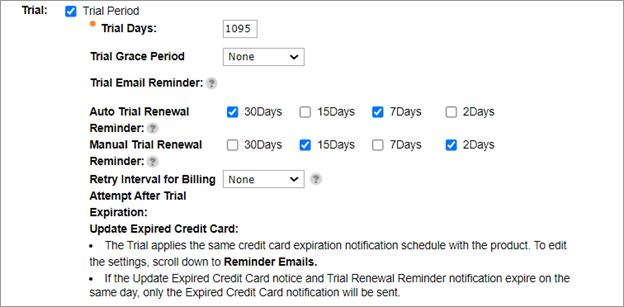

# Setting renew reminders for trial subscriptions

In 2021, Commerce Subscription implemented an enhancement on the renewal notification schedule that allowed independent notification schedules for both manual and automatic trial subscriptions.

Commerce API users are now able to set up new schedules dedicated to trial subscriptions through Global Commerce by checking the Trial Period. We are introducing reminder schedules specialized for trial use cases: 30, 15, 7, and 2 days.


Setting the trial renewal reminder via Global Commerce
------------------------------------------------------

1. Sign in to [Global Commerce](https://gc.digitalriver.com/gc/ent/login.do) and select a site.
2. [Find the subscription product](https://help.digitalriver.com/help/gc/Products/All-Products/Editing-a-product.htm#HowToSearchForProduct) you want to update. Click the internal product name for the subscription product under the **Internal Product Name** column. The Edit Product page appears.
3. Click the **Details** tab.
4. Scroll down to **Subscriptions** and click **Edit**. \
   &#x20;
5. Select the **Trial Period** check box to enable the **Trial Period**.
6. Enter the number of trial days between (a value between 1 to 1095) in **Trial Days**.
7. Once you set the number of trial days, the applicable trial reminder options will be available.&#x20;
   * &#x20;**Auto Trial Renewal Reminder** – The reminder will be sent to the trial subscriber the number of defined days before the conversion. If the subscriber takes no action to cancel the subscription by the last day, the subscription will be automatically converted to a paid subscription.
   * **Manual Trial Renewal Reminder** – The reminder will be sent to the trial subscriber the number of defined days before the conversion If the subscriber takes no action to convert, the subscription will be cancelled.
   * Trial renewal reminder will share the **Credit Card Expiry notification** with the existing schedule. Likewise, when the reminder day coincides with the Credit Card Expiry date, the system will only send out the Credit Card Expiry notification and bypass the trial renewal reminder notification.

## Setting the trial renewal reminder via Bulk Product Upload (BPU)

1. Sign in to [Global Commerce](https://gc.digitalriver.com/gc/ent/login.do) and select a site.
2. Select **Catalog**, select **Products**, and then click Import and **Export Products**. \
   &#x20;
3. Click **Configure Product Import & Export Spreadsheet**, and then click the **Global Family Attributes** tab. \
   &#x20;
4. Scroll down to the **Subscription** section and select the following check boxes:
   * **Time Interval For Manual Trial Reminder Notifications**–to enable the Manual Trial Renewal Reminder.
   * **Time Interval For Trial Reminder Notifications**–to enable the Auto Trial Renewal Reminder. \
     &#x20;
5. Click **Save**. You will be redirected to the Products Import and Export page.
6. Scroll down to **Export Product**, complete the fields, and click **Export** to download the BPU spreadsheet.
7. In the spreadsheet, you can find the previously chosen fields under the section **Subscription** and **Subscription Association**. Note that **Trial Days** must be a positive integer and **Is Trial Period** must be true to configure the new trial reminder schedule.  \
   &#x20;
8. To import the spreadsheet, complete the fields under **Import Products**, and click **Import**.


**Note**:

*
  We recommend that you configure the BPU fields in Global Commerce and download the spreadsheet to ensure your spreadsheet contains the latest fields and trial renewal schedule. If you modify an old spreadsheet and upload it, the old spreadsheet will not contain values for the latest fields.
*
  There is no maximum number of days restriction for trial days if you configure it through BPU.
* &#x20;To set up multiple reminder schedules per renewal type (**Time Interval for Trial Reminder Notification** and **Time Interval for Manual Trial Reminder Notification**), use a semicolon to separate the number of days in one cell (for example, 30;15;7;2). You can specify a maximum of four reminder schedules. The valid options for interval days are 30, 15, 7, and 2. Other numbers are not acceptable.


## Backward compatibility

If no changes are applied to the product settings, then all the notifications will be sent out according to the existing schedule.&#x20;

When editing a trial-enabled product, the system will clone the existing schedule to the new trial reminder schedule  automatically.\
\
Under circumstances where the **90 days** reminder schedule is the existing schedule, the system will not clone the setting to the new renewal schedule.

## Accessing the schedule information programmatically

You can find and use the new schedule information by using `v1/shopper/me/subscriptions` API to get subscription information, as well as the User Management call for getting subscription information.

This new reminder schedule information is also revealed under the `customAttribute` through `GET /product`: (`timeIntervalForTrialReminderNotifications`, `timeIntervalForTrialManualReminderNotifications`).

