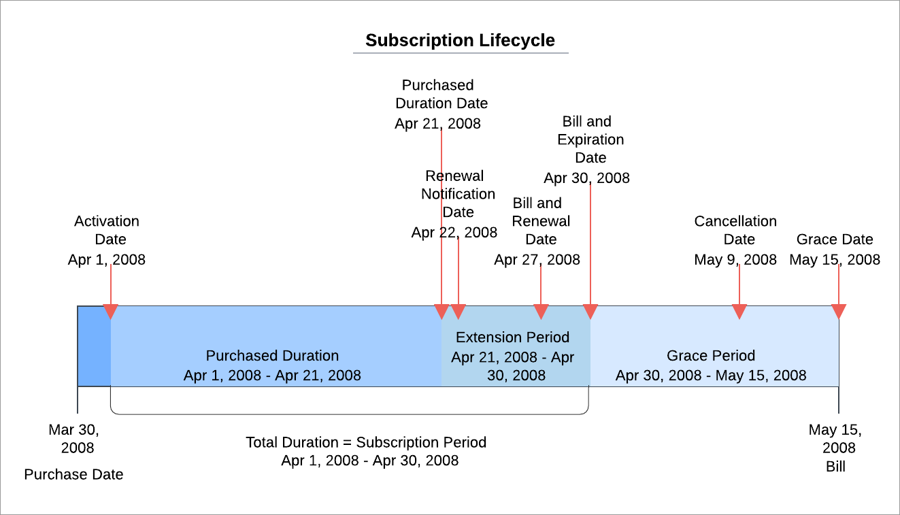

# Subscription lifecycle

Subscriptions allow customers to make recurring payments to access a product such as a video game or streaming service.&#x20;

The following image shows the lifecycle of a subscription from beginning to end where a customer purchases a new subscription to a product. You receive the notification when the customer creates a new subscription. After the trial period expires, the system bills the customer and you receive a trial to active conversion notification. As the customer continues to use the product, you receive renewal notifications at the start of every new subscription period. Finally, when the customer no longer needs the product and their subscription lapses, you receive a cancellation notice.

The following table defines the terms used in the subscription lifecycle.

| Term                      | Description                                                                                                                                                                                  |
| ------------------------- | -------------------------------------------------------------------------------------------------------------------------------------------------------------------------------------------- |
| Purchase Date             | The date the subscription was purchased                                                                                                                                                      |
| Activation Date           | The date the subscription was activated. If the subscription was not activated, the date appears as `01/01/9000 00:00:00`.                                                                   |
| Purchased Duration        | The selected recurrence from the product setup GUI. The amount (in days) of service purchased excluding any extensions or trials.                                                            |
| Purchased Duration Date   | 
The date when the subscription ends based on the amount of service purchased.

<strong>Note</strong>: This is not the expiration date.
                                           |
| Renewal Notification Date | The date when you send the customer a renewal notification.                                                                                                                                  |
| Extension Period          | Additional length of service given beyond the purchased duration.                                                                                                                            |
| Bill                      | The date you bill the customer. You could send a bill to remind the customer to renew their subscription on milestone dates, such as the Renewal Date, Expiration Date, and the Grace Date.  |
| Renewal Date              | The date when the customer should renew their subscription.                                                                                                                                  |
| Expiration Date           | The date when the subscription completes. This includes the amount of service purchased plus any extensions.                                                                                 |
| Total Duration            | Also known as the Subscription Period. The length of time that the subscription provides services. This includes the purchased amount of service plus any extensions.                        |
| Grace Period              | The length of time a subscription continues to provide the service after the expiration date.                                                                                                |
| Grace Date                | The date when the grace period ends. No service is provided after this date.                                                                                                                 |
| Cancellation Date         | The date when the subscription was cancelled. If the subscription is not cancelled, the date appears as `01/01/9999 00:00:00`.                                                               |

### Invariants

Digital River uses these invariants to define the subscription lifecycle.

* Activation Date < Purchased Duration Date <= Expiration date <= Grace Date
* Activation Date < Renewal Date <= Expiration Date <= Grace Date
* Activation Date < Renewal Notification Date < Renewal Date
* Renewal Notification Date must be 1 or more days before the Renewal date
* Purchase Duration = Purchase Duration Date − Activation Date
* Purchase Duration Date  = Activation Date Purchase Duration
* Extension Period = Activation Date + Purchased Duration + Extension Period
* Expiration Date = Activation Date + Purchased Duration + Extension Period
* Grace Period = Grace Date − Expiration Date
* Grace Date = Expiration Date + Grace Period
* Subscription can't be activated if it has been cancelled.
* Activation Date = `01/01/9999 00:00:00` if not activated
