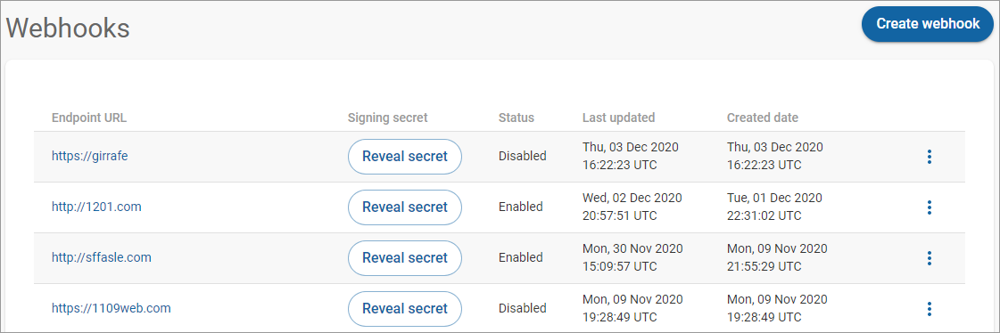

# Test the app

After all the steps are executed and the server is started, the BigCommerce app should seamlessly call Digital River APIs in checkout pages.

The following steps show the stages where you can test the installed BigCommerce app.

1. When you successfully install the BigCommerce App, **Digital River** will appear in the left navigation under **Apps**. \
   
2. When you [successfully register the keys](install-the-digital-river-app.md#registering-your-api-keys), you will see the "Successfully Registered" message. \
   \

3. When you successfully [configure the API keys for the currency selection](configure-the-bigcommerce-settings/step-2-configure-payments.md):
   1. Big Commerce will show the updated settings under **Notifications** on the **Digital River Settings** tab on refresh.\
      &#x20;
   2. The [Webhooks ](https://docs.digitalriver.com/digital-river-api/administration/dashboard/developers/webhooks)page on the [Digital River Dashboard ](https://dashboard.digitalriver.com/)will confirm the endpoint (notification URL), username, and password.\
      &#x20;
   3. BigCommerce will run a [create SKU request](https://www.digitalriver.com/docs/digital-river-api-reference/#operation/createSkus) to confirm the provided API keys are valid. You can verify the creation of this SKU from the SKUs page on the [Dashboard](https://dashboard.digitalriver.com/), where the **SKU ID** is **9898989899**, and the **Name** is **Test Product**.\
      &#x20;&#x20;
