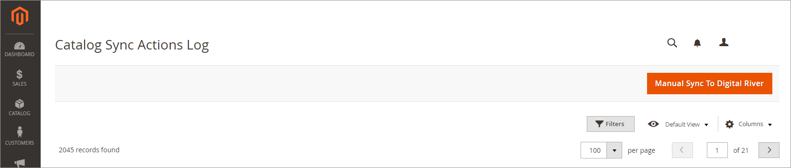
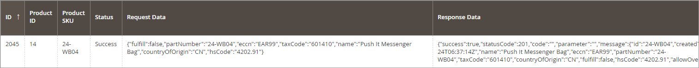
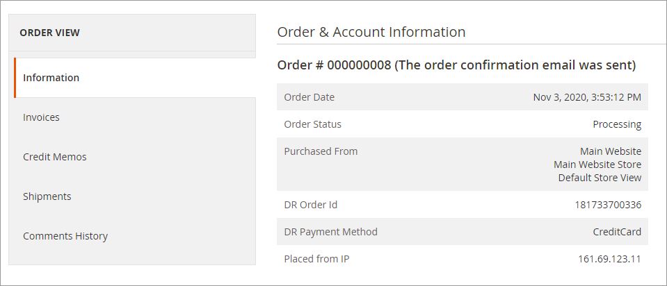

# Test the Digital River Extension

Digital River allows you to self-service your own test account, which you can use to fully test the Digital River Extension for Adobe Commerce in a staging environment.&#x20;

1. Follow the instructions in the [Dashboard Quickstart Guide](https://docs.digitalriver.com/digital-river-api/administration/dashboard/quick-start-guide) for the creation of a test account.
2. Configure your Magento store with your test account’s public and secret keys.

## Run the manual catalog sync

1. In your **Catalog**, fill out the Digital River fields on a product and save it.
2. In the **Catalog Sync Grid**, click **Manual Sync To Digital River**.\
   &#x20; &#x20;
3. When the sync completes, verify that the status is `Success`.

## Placing an order

1. Place an order in your storefront for one of the products you synced to Digital River. See [Testing scenarios](https://docs.digitalriver.com/digital-river-api/developer-resources/testing-scenarios) for more information.
2. After placing the order, view that order in the Magento admin screens.
3. In the **Order & Account Information** section, verify that you see a (DR) Digital River Order ID.&#x20;

