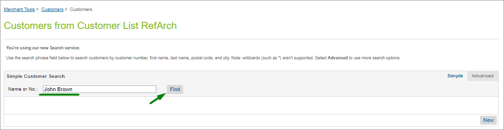
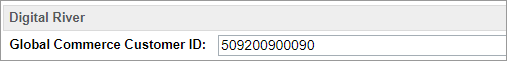
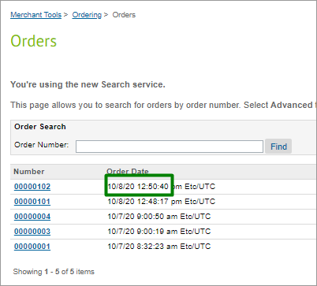
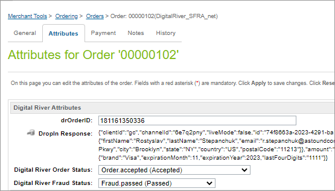

# Test the Salesforce B2C LINK Cartridge

## Testing prerequisites

* Digital River cartridges have been successfully installed and configured.
* At least one product has been configured with the required Digital River [product attributes](user-guide.md#product-management). Only products that have been configured with the Digital River attributes should be used for storefront testing.
* Products have been [synced](user-guide.md#product-sync-jobs)_._&#x20;
* (Optional) Schedule all jobs described in the [user guide](user-guide.md#product-sync-jobs).

## Customer account creation

Create an account in the Storefront. Open **Business Manager**.

Select **Merchant Tools**, select **Customers**, and click **Customers**. Find the customer by number or name.

Scroll down to the **Digital River** section with the **Global Commerce Customer ID** attribute. It should not be empty.

## Placing an order

Place an order on the storefront with any account or as a guest. Once you place an order, open **Business Manager** and select **Merchant Tools**, select **Ordering**, and then click **Orders**. You can find your order by number or click **Find** with an empty order number field and select the last-placed order from the list.

On the **Attributes** tab, you’ll see the **Digital River Attributes** section with attributes. **Attributes** should not be blank.

## Test scenarios or test cases 

Test cases for checking cartridge performance are described in the Digital River test cases document in the same repository location as the cartridges_._
