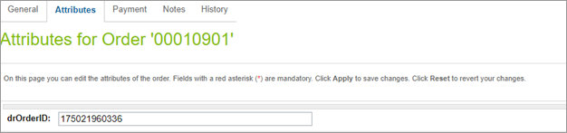

# Testing

## Create Customer service

Use the Create Customer service to create an account in the storefront. Find the account in Business Manager and then look for the Digital River Attribute Grouping. You should see the returned value from Digital River now assigned to that profile.

## Placing an order

Once a customer places an order in the storefront, it will have received an external order ID from Digital River. Digital River identifies the order by this ID.

The following test cases were verified by Digital River in testing:​

| Test Scenarios                                                                                                                                                                                                                                                                                                                                                                                                                                                                                                                                                                                                                 |                                                                                                                                                                                                                                                                                                                                                                                                                                                                                                                                                                                              |
| ------------------------------------------------------------------------------------------------------------------------------------------------------------------------------------------------------------------------------------------------------------------------------------------------------------------------------------------------------------------------------------------------------------------------------------------------------------------------------------------------------------------------------------------------------------------------------------------------------------------------------ | -------------------------------------------------------------------------------------------------------------------------------------------------------------------------------------------------------------------------------------------------------------------------------------------------------------------------------------------------------------------------------------------------------------------------------------------------------------------------------------------------------------------------------------------------------------------------------------------- |
| <ul><li>Complete Order for Mixed Product with Multiple quantity</li><li>Complete Order using PayPal Payment Method</li><li>Complete Order using Credit Card Payment Method</li><li>Create an Account for Customer</li><li>Order status update thru webhooks</li><li>Order Notification</li><li>Order Search and Verify Order Summary</li><li>Return using webhook</li><li>Verify the payment functionality on entering the wrong credit card source</li><li>Verify for Invalid Credit Card</li><li>Verify the Tax code is mapped to the right tax type or the admin site is up to date with the tax code for the SKU</li></ul> | <ul><li>Complete Order creation for Physical Product </li><li>Complete Physical Order with different Shipping and Billing Address</li><li>Verify the customer is created on registering a new user</li><li>Submit an Order—Guest Checkout</li><li>Order Fulfillment—post order action using webhooks</li><li>Verify the Admin site for DR Order number and Order status.</li><li>Verify the SKU creation</li><li>Verify the SKU creation for different prod with diff tax code.</li><li>Verify the mandatory, optional field and values in the API request from Service Integrator</li></ul> |

## Example Tests

### Account creation test

1. Navigate to the storefront.
2. Click **Login**, then **Create account**.
3. Enter account information and click **Create account**. You will be sent to the account Dashboard.
4. Return to the Business Manager and navigate to Merchant Tools > Customers > Customers.
5. Click on your newly created account.
6. Scroll down and make sure that the Digital River customer ID is present.

### SKU creation test

1. In Business Manager, navigate to Administration > Operations > Jobs.
2. Click the createSKUs job.
3. Click **Run Now.**
4. After the job concludes, verify with your Digital River representative that the products have been uploaded to Digital River's servers.

### Credit card purchase test

1. Navigate to the storefront and add a product to your cart.
2. Navigate to the cart page. Verify that the tax value is not present on the cart page, as it has not yet been provided by Digital River.
3. Proceed to checkout as guest and enter some Shipping information that would generate tax.
4. Verify that the tax value is not present, then proceed to Payment.
5. Validate that the tax value is now present on the page.
6. Make sure that the Digital River credit card and PayPal tabs are present.
7. Enter card information and proceed with checkout.
8. Make sure that Digital River terms and conditions are present at the bottom of the page under the Place Order button. Check the links to make sure they are functional.
9. Click **Place Order** and proceed to the order success page.
10. Return to the Business Manager.
11. Navigate to Merchant Tools > Ordering > Orders. Find and access your order, either by filtering or by searching via your order ID created at checkout.
12. In the order screen, click on the **Attributes** tab.
13. Make sure that a Digital River-provided order ID is present.
